# 網路參考模型

上次編輯時間: 2025年12月7日 下午5:53
建立時間: 2025年8月3日 下午5:53

### 🧱 OSI 七層模型（Open Systems Interconnection）

> 📘 OSI 模型是 ISO 提出的「開放式系統互連參考模型」，標準化網路通訊的架構，共分為 七層，自上而下依序如下：
> 

---

🔢 七層名稱與主要功能（由上到下）

| 層次 | 功能重點 | 關鍵詞 | 對應設備 |
| --- | --- | --- | --- |
| 第1層 物理層 | 比特傳輸、機械/電氣/規程特性 | 透明傳輸、電氣特性、比特錯誤 | 集線器（Hub） |
| 第2層 數據鏈路層 | 成幀、差錯檢測（FCS）、流量控制 | MAC地址、幀頭幀尾 | 交換機（Switch） |
| 第3層 網路層 | 路由選擇、分組轉發 | IP地址、邏輯尋址、路由 | 路由器（Router） |
| 第4層 傳輸層 | 端到端通信、可靠傳輸、流量控制、分段重組 | TCP/UDP、端口號 | —— |
| 第5層 會話層 | 對話管理、檢查點(同步點)、恢復通信 | 斷點續傳、session | —— |
| 第6層 表示層 | 數據格式轉換、加密、壓縮 | 編碼、解碼、格式轉換 | —— |
| 第7層 應用層 | 為用戶提供網絡服務介面 | 文件傳輸、電子郵件、Web | —— |

---

🧠 小技巧：記憶口訣

**自下而上（1→7）**：


---

### 🌐 TCP/IP 模型介紹（Internet Protocol Suite）

---

✅ 什麼是 TCP/IP 模型？

- 是 **網際網路的標準網路架構**
- **由美國國防部（DoD）** 提出，實用性強，廣泛應用於現代網際網路
- 相較於 OSI 七層模型，**TCP/IP 分為 4 層（或實作上5層）**

---

✅ TCP/IP 模型特點

- **精簡實用**，為現代網際網路實際採用架構
- 協定之間的**依賴性低**，可獨立更新
- 強調「端到端連接」的理念（end-to-end principle）
- 使用最多的是：**HTTP over TCP/IP**

---

✅ TCP/IP 模型層級對照表

| TCP/IP層級 | 功能說明 | 常見協定 / 對應 OSI |
| --- | --- | --- |
| **應用層** | 提供應用服務 | HTTP、FTP、DNS（對應 OSI 7~5層） |
| **傳輸層** | 端到端通訊、錯誤檢測與流量控制 | TCP、UDP（對應 OSI 4層） |
| **網路層（互聯層）** | 路由選擇、IP 位址、封包轉發 | IP、ICMP、ARP（對應 OSI 3層） |
| **網路接取層（資料鏈路+物理）** | 資料在實體媒介中傳送 | Ethernet、Wi-Fi（對應 OSI 1~2層） |

---

# 1️⃣物理層

---

## **一、 通信基本概念簡介**

🟧 一、信源與信宿

- **信源**：數據的**發送方**
- **信宿**：數據的**接收方**

---

🟧 二、信號是什麼？

> 信號是數據的載體，有兩種形式：
> 
- **數字信號**：值是**離散的**（如 0、1）
- **模擬信號**：值是**連續的**（如聲音波形）

---

🟧 三、信道

- 信號傳輸的「通路」就是**信道**
    - 可分為：**數字信道**、**模擬信道**

---

🟧 四、碼元（Symbol）

- 每個信號週期內出現一個**碼元**
- 若每週期可出現 K種不同信號 → **K 進制碼元**
- 一個碼元可攜帶資訊量：
    
    $\text{1碼元} = \log_2 K \text{ bit}$
    

---

🟧 五、波特率（Baud）與比特率（bit/s）

- **波特率**：每秒傳送的「碼元」數量，單位：波特（Baud）
- **比特率**：每秒傳送的「位元」數量，單位：bit/s

📌 公式：

$\text{比特率} = \text{波特率} \times \log_2 K$

---

## 二、信道極限容量（Channel Capacity）

---

🎯 1. 基本概念

- **帶寬 W**：信道允許通過的頻率範圍，單位：Hz
- **雜訊**：會干擾信號，影響數據傳輸速率與正確性

---

🧪 2. 奈奎斯特定理（無雜訊情況）

💡 結論一：極限波特率

$\boxed{速率 = 2W} \quad \text{(單位：波特，Baud)}$

💡 結論二：極限**比特率**

$\boxed{速率 = 2W \log_2 K} \quad \text{(單位：bit/s)}$

其中 K：一個碼元可表示的狀態數（例如 2 進制時 K=2）

---

🔊 3. 信噪比 S/N

- **信噪比（S/N）**：$(信號功率 / 雜訊功率)$
- **分貝計算（dB）**：
    
    $\boxed{10 \log_{10}(S/N)}$
    

---

🧠 4. 香農定理（有雜訊情況）

💡 香農公式（極限比特率）：

$\boxed{速率 = W \log_2 (1 + S/N)} \quad \text{(單位：bit/s)}$

---

✅ 小總結：

| 名稱 | 公式 | 適用情境 |
| --- | --- | --- |
| 奈奎斯特公式 | $2W\log_2 K$ | 無雜訊情況 |
| 香農公式 | $W\log_2 (1 + S/N)$ | 有雜訊情況 |
| 信噪比（dB） | $10 \log_{10}(S/N$) | 換算為分貝使用 |

---

## 三、數位編碼方式與調適

---

**功能**

- 編碼是將「0」與「1」轉換成電壓訊號的方式，常用於**數位訊號在傳輸線上傳遞**前的處理。
- 調製是將數位訊號（0與1）轉換成**載波訊號**（波形）來進行**無線/有線傳輸**，用於更長距離、跨媒介的傳送。

編碼方式

---

| \編碼方式 | 編碼規則說明 | 特性 | 浪費帶寬 | 抗干擾能力 |
| --- | --- | --- | --- | --- |
| ***看高低*** |  |  |  |  |
| 不歸零編碼（NRZ） | 高1、低0，中不變 | 容易同步困難 | ✅ 不浪費 | 😢 弱 |
| 歸零編碼（RZ） | 高1、低0，中歸零 | 多變化，頻寬需求高 | ❌ 浪費 | 😢 弱 |
| ***看變動*** | #只有曼徹斯特編碼是看上下 |  |  |  |
| 反向非歸零編碼（NRZI） | 跳變0；不變1，中不變 | 避免長時間不變電位，較利於時鐘同步 | 😐 略浪費 | 😢 弱 |
| 曼徹斯特編碼（Manchester） | 上跳0 , 下跳1，中必變 | 易於同步，但需雙倍頻寬 | ❌ 浪費（頻寬×2） | ✅ 強 |
| 差分曼徹斯特編碼 | 跳變0，不變1，中必變 | 更穩定抗干擾，但邏輯複雜 | ❌ 浪費（頻寬×2） | ✅ 強 |


---

**調製技術**

| 調製方式 | 簡稱 | 原理說明 |
| --- | --- | --- |
| **調幅** | AM（Amplitude Modulation） | 改變載波的**振幅**來傳送訊號。 |
| **調頻** | FM（Frequency Modulation） | 改變載波的**頻率**來傳送訊號。 |
| **調相** | PM（Phase Modulation） | 改變載波的**相位**來傳送訊號。 |
| **正交振幅調製** | QAM（Quadrature Amplitude Modulation） | 同時改變振幅與相位，是數位通訊常見技術，能提升資料傳輸率。 |


---

## 四、傳輸介質

傳輸介質是**資料在傳輸過程中所經過的實體通道**，它決定了訊號如何從發送端傳遞到接收端。

---

🔀 傳輸介質分類

1️⃣ **導引型傳輸介質（有線、有形）**

訊號沿著**實體媒介**傳播。

| 介質類型 | 特色 | 傳輸距離 | 傳輸速率 | 常見應用 |
| --- | --- | --- | --- | --- |
| **雙絞線 (Twisted Pair)** | 成本低、易安裝、抗干擾性普通 | 短~中距離 | 中速（最高可達10 Gbps） | 電話線、網路線（如CAT5/6） |
| **同軸電纜 (Coaxial Cable)** | 抗干擾好、頻寬較高 | 中距離 | 中~高速 | 有線電視、早期乙太網 |
| **光纖 (Optical Fiber)** | 傳輸速率高、抗干擾強、價格較高 | 長距離（可達數十公里） | 高速（10Gbps以上） | 骨幹網、電信骨幹、資料中心 |

<aside>
💡

**以太網（Ethernet）有線傳輸介質的命名規則**

✅ 命名格式：

**「速度 + Base + 介質資訊」**

| 名稱 | 傳輸速率 | 傳輸方式 | 傳輸介質 | 傳輸距離 |
| --- | --- | --- | --- | --- |
| **10Base5** | 10 Mbps | Baseband | 粗同軸電纜 | 最遠 500 公尺 |
| **10Base2** | 10 Mbps | Baseband | 細同軸電纜 | 約 185 公尺 |
| **10BaseF** | 10 Mbps | Baseband | 光纖（Fiber） | 視型號不同而定（如 FL、FB、FP） |
| **10Base-T** | 10 Mbps | Baseband | 雙絞線（Twisted Pair） | 最遠 100 公尺 |
</aside>

---

2️⃣ **非導引型傳輸介質（無線、無形）**

訊號透過空氣或真空以**電磁波形式傳播**。

| 介質類型 | 特色 | 傳輸距離 | 傳輸速率 | 常見應用 |
| --- | --- | --- | --- | --- |
| **無線電波 (Radio)** | 穿透力強、覆蓋範圍廣 | 遠距離 | 中~高速 | 廣播、行動通訊、Wi-Fi |
| **微波(Microwave)** | 需視距、集中傳送 | 中~遠距離 | 高速 | 衛星通信、基地台間連線 |
| **紅外線 (Infrared)** | 需直線傳輸，易受阻擋 | 短距離 | 中速 | 遙控器、紅外資料傳輸 |
| **雷射 (Laser)** | 需精準對準、點對點 | 中~遠距離 | 極高速 | 光學通訊、保密傳輸 |

---

**📘 物理解口特性（Physical Interface Characteristics）**

| 類別 | 說明 |
| --- | --- |
| 📏**機械特性** | 指實體插頭的形狀與尺寸，例如：RJ45（雙絞線）、SC/ST/LC（光纖）等接頭的形狀與插槽結構。 |
| ⚡**電氣特性** | 指電壓範圍、阻抗、電流大小、信號的高低電平等，例如：TTL 電壓 0V/5V 或 RS-232 標準 ±12V。 |
| 🧭**功能特性** | 說明哪一條線路負責哪種功能，例如：TX 傳送、RX 接收、GND 接地等。 |
| ⏱️**規定時序** | 指數據傳輸的時序協定，例如傳送資料時應先發送同步信號或時脈訊號等，用於確保接收端能準確解析數據。 |

---

🧩 舉例：RJ45 網路孔的物理解口特性

- 機械特性：8 根金屬接點，配合 RJ45 水晶頭
- 電氣特性：使用 +3.3V 或 +5V 等標準以太網電壓
- 功能特性：Pin 1 和 2 傳送（TX），Pin 3 和 6 接收（RX）
- 時序特性：使用 IEEE 802.3 定義的媒體存取控制（MAC）時序

---

## 五、物理層設備介紹

**中繼器（Repeater）**

用來**延長訊號傳輸距離**一進一出，接收到訊號後會**放大再生後傳出**，但不理解資料內容

---

 **集線器（Hub）**

讓多台設備連接在一起，當其中一台傳送資料時，**集線器會廣播資料給所有設備**，容易產生碰撞**（collision）**，效率較低，會共享帶寬。

---

🔍 中繼器 vs 集線器（比較）

- 中繼器是為了**延長訊號距離**，一進一出，處理單一路徑。
- 集線器是為了**連接多台設備**，類似把訊號「複製發送」給大家。
- 兩者都屬於**OSI 第一層（物理層）**，但都**不具備資料判斷與處理能力**。

---

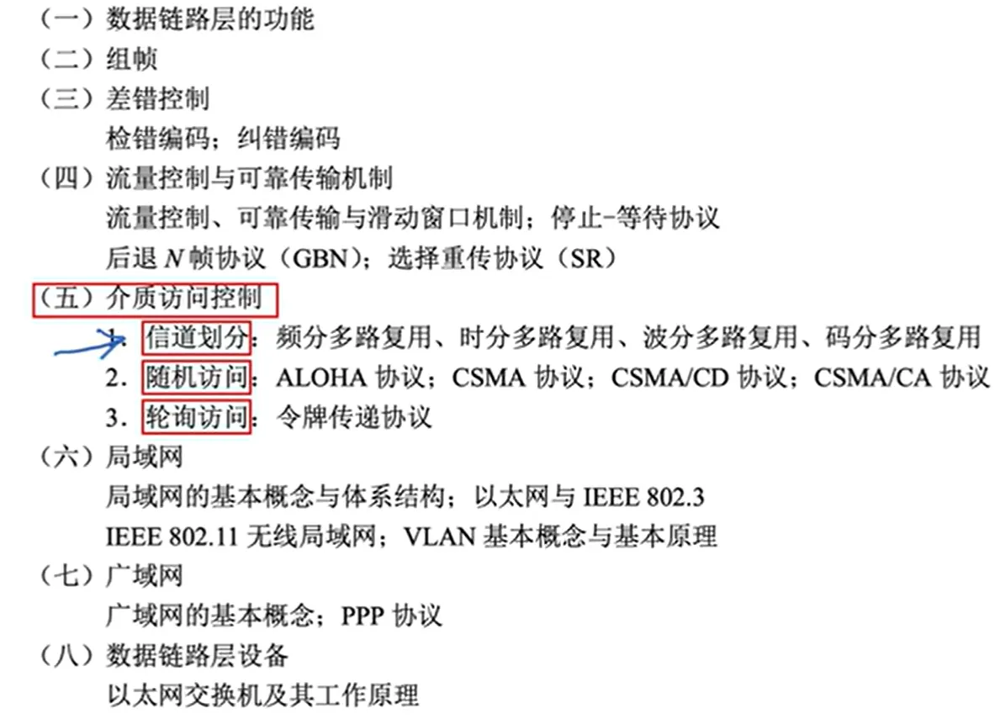

# 2️⃣**資料鏈結層**

## **一、功能**

- 它的核心任務只有一個：**確保資料能在同一條纜線或同一個無線區域內的兩個直接相連的設備之間，可靠且有效率地傳輸**

為了達成這個目標，它主要做了幾件關鍵事情：

1. **封裝成幀（Framing）**：將來自網路層的（Packet），打包成（Frame），並加上標籤（幀頭／幀尾）。
2. **差錯控制（Error Control）**：檢查貨箱在運送過程中有沒有破損（位元錯誤），有問題就要求重送。
    - **幀丟失(Frame Loss)**：發送 `1,2,3,4` → 接收端只收到 `1,2,4`。
    - **幀重複(Frame Duplication)**：發送 `1,2,3,4` → 接收端收到 `1,2,3,3,4`。
    - **幀失序(Frame Disorder)**：發送 `1,2,3,4` → 接收端收到 `1,3,2,4`。
3. **可靠傳輸(Reliable Transmission):**
4. **流量控制（Flow Control）**：確保發送方不會送得太快，導致接收方的倉庫（緩衝區）爆滿而來不及處理。
5. **媒體存取控制（[MAC](網路參考模型.md)）**：如果這條路（傳輸介質）是多個快遞員共用的（例如無線網路），它要負責協調誰可以用、誰該等待，避免大家撞成一團。(仲裁)

---

## **二、封裝成幀**

**一、組幀（封裝成幀）的兩大問題**

- **幀定界 (Frame Delimiting)**：讓接收端能準確地確定一個幀的開始與結束。
- **透明傳輸 (Transparency)**：為了定界而「額外添加的控制資訊」，在傳輸完成後必須能被順利移除，還原成最原始的資料，讓上層（網路層）完全感受不到這些加工處理的存在。

---

**二、常見定界／透明傳輸方法**

**1.字元計數法 (Character Counting)**

直接寫在頭部(包含自己)


- **作法**：在幀的頭部設置一個「長度」欄位，明確指出整個幀（包含長度欄位本身）的總長度。
- **致命缺點**：長度欄位一旦在傳輸中發生錯誤，會導致接收端對後續所有幀的邊界判斷完全錯誤，引發連鎖性的同步災難。

---

**2.字元/位元組填充 (Byte Stuffing)**

用特定字符作分界(若衝突就在前加入ESC)


- **作法**：使用特殊的控制字元來標記幀的邊界， `SOH` (Start of Header) 作為幀頭，`EOT` (End of Transmission) 作為幀尾。
- **透明傳輸**：若原始資料中恰好出現了 `SOH`、`EOT` 或轉義字元 `ESC`，發送端會在這些字元前**插入一個 `ESC` 進行轉義**。接收端則執行相反操作，**刪除插入的 `ESC`**，從而還原原始資料。
- **關鍵**：必須有「插入」與「刪除」的逆向處理，才能達成透明傳輸。

---

**3.零位元填充 (Bit Stuffing)**

用特定字符做定界，遇到連續5個1就加0


- **作法**：使用一個特定的位元模式 `01111110` 作為幀的開始與結束旗標。
- **發送端規則**：掃描原始資料，只要遇到**連續 5 個 `1`**，就**強制插入 1 個 `0`**。
- **接收端規則**：掃描收到的位元流，只要看到**連續 5 個 `1` 後面跟著一個 `0`**，就**自動刪除那個 `0`**。
- **應用**：**HDLC** 和 **PPP** 協定採用此法。優點是效率高且不受特定字元集限制。

**4.違規編碼法 (Code Violation)**


- **作法**：利用實體層的編碼規則，故意使用一些「無效」或「違規」的電壓訊號來標記幀的邊界。例如，在曼徹斯特編碼中，高-高或低-低電平轉換就是違規訊號。
- **優點**：不需在資料中插入任何內容，實現了定界與資料的完全分離。
- **限制**：需要實體層的硬體支援。

---

## 三、糾錯與校驗

---

**1) 奇偶校驗（Parity）**

- **目的**：只做**錯誤偵測**（不能更正）。
- **做法**：在資料後加 1 位校驗位，使整段資料中「1 的個數」為**偶數（Even）或奇數（Odd）**。
- **能力**：能偵測**任意奇數**個位元翻轉；**無法偵測偶數**個位元同時出錯。
- **成本**：只多 1 bit；計算極快。

> 小例：資料 101100（1 的數量=3）
> 
> - **偶同位（Even parity）**：為了讓總數變偶數，**p = 1** → 傳送 `1011001`
> - **奇同位（Odd parity）**：維持總數為奇數，**p = 0** → 傳送 `1011000`

---

**2) CRC（Cyclic Redundancy Check，循環冗餘檢查）**

XOR 除減

- **目的**：強大的**錯誤偵測**（仍不更正）；廣用於乙太網路、儲存裝置、通訊鏈路。
- **核心觀念**：把位元串視為二進位多項式 M(x)，選擇一個**生成多項式** G(x) r（最高次方）。
    
    步驟：
    
    1. 把訊息 M(x) 後面**補 r**（最高次方） **個 0**
    2. 以 **模二除法**（XOR 無進位）除以 G(x)，得餘數 R(x)（長度 r）
    3. 傳送  $M(x)\cdot x^r + R(x)\;$（尾端 r 位即 CRC）


- **能力（常見性質）**：
    - 若 G(x) 含至少兩個項，**可偵測所有單一位元錯誤**。
    - 想用 CRC **單錯更正**：檢查
        
        ${2^R-1 \ge K+R \quad\text{且}\quad \text{階 }L\ge n}$
        
        最穩妥是選 **primitive G(x)G** 且 $n≤2R−1。$
        
- **常見多項式**：如 CRC-16、CRC-32（實作時以多項式係數對應常見十六進位常數）。

---

**3)海明校驗（Hamming Code）**

**1) 為什麼要這麼多校驗位？**

- 資訊位 n＋校驗位k 共 n+k 位，每一位都可能出錯，另外還有**無錯**這一種情況
    
    ⇒ 需要至少n+k+1 種「狀態編號」。
    
- k 個校驗位能形成 $2^k$ 種**綜合症**（Syndrome）
    
    $\boxed{2^k \ge n + k + 1}$
    
    滿足上式即可做到**單位元更正（SEC）**。
    

---

**2) 位置配置與覆蓋規則**

- 以**1 起算（1-based）**編號，**校驗位放在 1、2、4、8…（2 的冪次）**位置；其他位置放資料位。
- 校驗位 $p_{2^i}$ 覆蓋「**位置編號的二進位**在第 i 位為 1」的所有位置（**含自己**），做**偶同位**或**奇同位**檢查（以下以偶同位為例）。

> 例：Hamming(7,4) 位置：
> 
> 
> 1(p1), 2(p2), 3(d1), 4(p4), 5(d2), 6(d3), 7(d4)
> 
> 覆蓋集合：
> 
> - $p_1 覆蓋 {1,3,5,7}（二進位 ** *1）$
> - $p_2 覆蓋 {2,3,6,7}（二進位 1）$
> - $p_4 覆蓋 {4,5,6,7}（二進位 *1 * *）$

---

**3) 編碼（發送端）**

1. 按上面規則把資料位放到非 $2^i$ 位置。
2. 依覆蓋集合計算每個 $p_{2^i}$ 的**偶同位**（XOR）。
3. 得到碼字（Hamming SEC）。若要 **SECDED**，再加一個**整體同位位 $p_0$**（對所有位取偶同位）。

---

**4) 解碼與更正（接收端）**

1. 重新計算各檢查，得到**綜合症位**$s_1,s_2,s_4,\dots$。
2. $\text{Syndrome }$ S 由 (s1(s_1 為最低位)) 組成的二進位數。
    - **SEC（無整體同位）**：
        - S=0S=0 → 無錯；
        - $S\neq 0$ → 錯在**第 SS 位**，翻轉即可單錯更正（雙錯可能被誤更正）。
    - **SECDED（有整體同位 p0p_0**）：再計算**總同位檢查** pp（所有位 XOR）
        - $S=0,\, p=0：無錯$
        - $S\neq 0,\, p=1：單錯在第 S 位 → 翻轉更正$
        - $S=0,\, p=1：錯在整體同位位 p_0 → 翻轉 p_0$
        - $S\neq 0,\, p=0：雙錯 → 能偵測，不可更正$

> 距離觀念：標準海明碼最小距離 d$_{\min}=3$ ⇒ 更正 1、偵測至多 2；
> 
> 
> 加整體同位（擴展海明碼）距離變 4 ⇒ **SECDED**。
> 

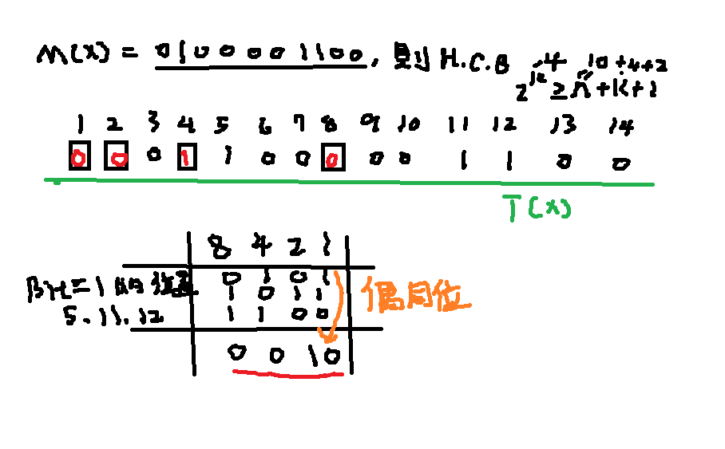

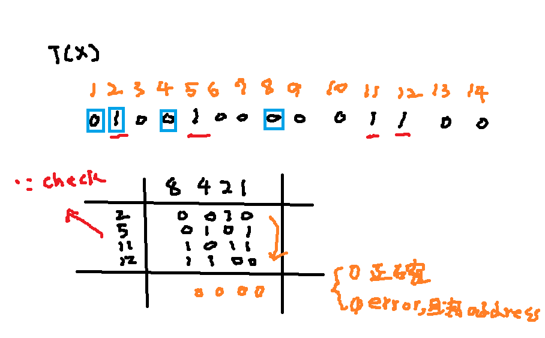

---

## **四、流量控制**與**可靠傳輸**

---

**目的**

用**序號 + ACK/NAK + 計時器 + 視窗**，同時達成**可靠傳輸**與**流量控制**；視窗內可發/可收、ACK 推進視窗。

---

**1) 名詞與記號**

- n：序號位數，序號空間 $M=2^n$（環狀遞增）。
- **$W_T$**：發送端視窗大小（同時允許未確認的幀數）。
- **$W_R$**：接收端視窗大小（允許接受/暫存的連續序號範圍）。
- **ACK**：確認；**累積 ACK**（GBN）、**選擇性 ACK/SACK**（SR）。**超時重傳**（Timeout）與**請求重傳**（收到 NAK/SACK 即指名重傳）。

---

### 4.1 SW & GBN & SR

**一、SW (Stop & wait)**

傳送方 發送給你 單位時間沒回應重傳  接收方收到要回復，如需要得判斷是否重複幀

- **視窗大小**：發送視窗 `$W_T=1$`，接收視窗 `$W_R=1$`。
- **序號**：僅需 **1 bit**（0/1 交替），ACK 亦對應 `ACK0/ACK1`。
- **確認**：接收方收到需要回復逐幀確認；常見為 **ACK + 超時重傳**（可選 NAK）。
- **重傳**：傳送端送出封包後便開始計時，時間之內如果沒有收到回應，即認定封包沒有送達，傳送端會再次重送封包，(**單一計時器)**。
    
    Q.收方有收到但因為 ACK 丟失或剛好到達計時器時間，會收到連續的資料
    
    - **接收端**：只接受**期望序號**；遇到重複幀（多半因 ACK 遺失）**丟棄但回覆對應 ACK**，避免上層重複交付。
- **正確性條件**：`$W_T + W_R ≤ 2^n$` ⇒ `$2 ≤ 2^n$`，**取 n=1 即可**。

### 時序（ACK 遺失示例）

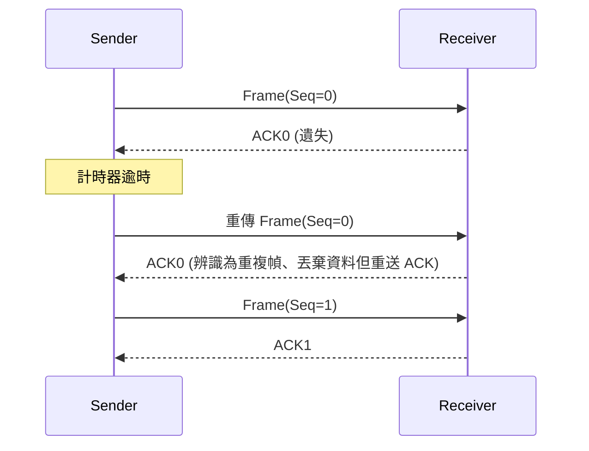
```mermaid
sequenceDiagram
  participant S as Sender
  participant R as Receiver
  S->>R: Frame(Seq=0)
  R-->>S: ACK0  (遺失)
  Note over S: 計時器逾時
  S->>R: 重傳 Frame(Seq=0)
  R-->>S: ACK0  (辨識為重複幀、丟棄資料但重送 ACK)
  S->>R: Frame(Seq=1)
  R-->>S: ACK1

```

---

**二、GBN（Go-Back-N，回退 N）**

累積確認，失敗回朔

**規則**

- 視窗：`$W_T > 1$`，**`$W_R = 1$`**（只接收**到達序**的下一幀）。
- **確認**：**累積確認**（$ACK_i$ 表示「已收妥 ≤ i 的所有幀」）。
- **重傳**
    - **超時重傳**：若編號 `i` 超時仍未得 $ACK_i$，**重傳 i 及其後的所有已發未確幀**。
    - 收到**重複 ACK**或**非法幀**時，接收端回覆「目前最後正確的 $ACK_i$」以提醒發送端回退。
- **接收端行為**：只交付連續到達的幀；**丟棄失序幀**（不暫存）。
- **計時器**：**1 個**（針對最老未確認幀）。
- **優缺點**
    - 優：實作簡單、接收端緩衝需求小。
    - 缺：錯誤率高或丟包時，**回退重傳浪費大**，吞吐受影響。

**時序（丟失 3 號幀）**

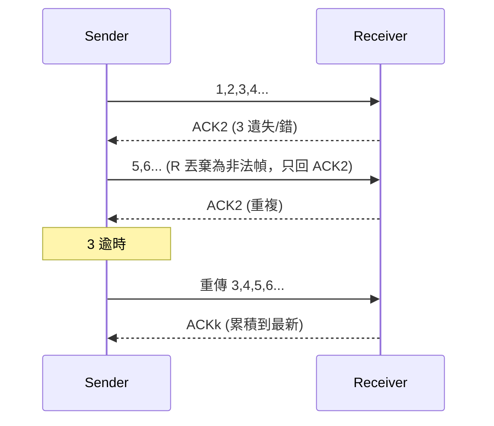
```mermaid
sequenceDiagram
  participant S as Sender
  participant R as Receiver
  S->>R: 1,2,3,4...
  R-->>S: ACK2  (3 遺失/錯)
  S->>R: 5,6... (R 丟棄為非法幀，只回 ACK2)
  R-->>S: ACK2 (重複)
  Note over S: 3 逾時
  S->>R: 重傳 3,4,5,6...
  R-->>S: ACKk (累積到最新)

```

---

**三、SR（Selective Repeat，選擇重傳）**

**規則**

- 視窗：`$W_T > 1$`，允許**失序接收與暫存**。常見約束：
    - **`$W_T + W_R ≤ 2^n$`** 且常取 **`$W_T = W_R ≤ 2^ {n-1}$`**（避免舊包與新包序號重疊）；
    - 題目亦常給 **`$W_R ≤ W_T$`** 的限制。
- **確認**：**逐幀確認**（$ACK_i$ 僅確認**第 i 幀**）；可用 **$NAK_i$** 主動請求重傳。
- **重傳**
    - **超時重傳**：只重傳逾時的那一幀 `i`。
    - **請求重傳**：收到 **$NAK_i$** 立即重傳 `i`。
- **接收端行為**：視窗內**正確幀先收下並暫存**，待缺失幀補齊後**按序上交**。
- **計時器**：**多個**（每個已發未確幀各一個）。
- **優缺點**
    - 優：**只重傳出錯幀**，高時延 × 大帶寬或中等錯誤率環境下吞吐佳。
    - 缺：實作較複雜，需要**接收端緩衝**與逐幀計時器。

**時序（丟失 3 號幀）**

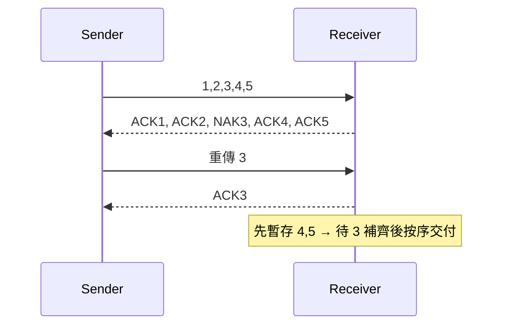
```mermaid
sequenceDiagram
  participant S as Sender
  participant R as Receiver
  S->>R: 1,2,3,4,5
  R-->>S: ACK1, ACK2, NAK3, ACK4, ACK5
  S->>R: 重傳 3
  R-->>S: ACK3
  Note over R: 先暫存 4,5 → 待 3 補齊後按序交付

```

---

**四、重點對照**

| 面向 | SW | GBN | SR |
| --- | --- | --- | --- |
| 接收視窗 | **1** | **1** | **>1**（可暫存失序） |
| 確認策略 | **逐幀 ACK**（交替位 0/1，可 **NAK**） | **累積 ACK**（$ACK_i$ 代表 ≤ i 全收） | **逐幀 ACK**；可 **NAK** |
| 重傳粒度 | **只重傳當前在途那 1 幀**（逾時/NAK 觸發） | **從缺失幀起全部回退** | **只重傳出錯/遺失幀** |
| 計時器 | **1 個**（唯一在途幀） | **1 個**（最老未確） | **多個**（逐幀） |
| 非法幀處理 | **非期望序號即丟棄**，但**回對應 ACK**（避免重複交付） | 丟棄後回**最後正確 ACK** 提醒回退 | 視窗內正確幀先**暫存**；錯誤幀可送 **NAK** |
| 視窗/序號條件 | `$W_T=W_R=1；n≥1（交替位常取 1 bit），滿足 W_T+W_R≤2^n$` | `$W_T + W_R ≤ 2^n，W_R=1$` | `$W_T + W_R ≤ 2^n，常取 W_T = W_R ≤ 2^{n-1}、且 W_R ≤ W_T$` |
| 典型適用 | **低延遲/低速**、實作最簡 | 錯誤率低、簡單實作 | 高 **BDP**、錯誤率中等、追求效率 |

---

### SW 、GBN、 SR  信道利用率分析

---

**1) 符號與單位（務必一致）**

- $R：資料傳輸率（bps；例：1 kbps = 10^3 bps）$
- $L_D, L_A：資料幀/ACK 幀長度（bit）$
- $L_D/R、TA=LA/RT_A=L_A/R：發送時延（s）$
- $T_p：單向傳播時延（s），RTT=2T_p$
- $N：發送視窗大小（= W_T）$
- $U：信道利用率（0～1），題目有時稱吞吐佔比$

> 計算時，所有「位元/秒/秒數」要統一單位；考題常忽略 $T_A$（會明講或暗示）。
> 

---


信道利用率 數據偵到下個數據偵傳送時的時間的利用率  


**2) 常見陷阱**

- **單位不一致**（kb/KB、秒/毫秒）→ 先統一再代入。
- $題目若寫「忽略 ACK 」，就令 T_A=0。$
- **$U 不會>1：記得取\min(1,\cdot)。$**
- **別把吞吐量和利用率混用**：
    - $吞吐量（bps）≈ U \times R。$
    - 利用率 U 是**無單位比例**。

---

## 五、介質訪問控制(MAC)

---

### **分類**

- 信道劃分
- 隨機訪問
- 輪詢訪問

---

### 1.信道劃分

**1) 核心概念**

- **目的**：讓多個使用者/資料流**共用同一條實體介質**（仲裁）。
- **考點**：**時分（TDM / STDM）**、**頻分（FDM）**、**波分（WDM）**。它們多屬**實體層**技術；和「誰先發」的 **CSMA/TDMA** 等**介質訪問控制**可搭配使用。

---

**2) TDM & FDM  & CDM**

**A. TDM：時分復用（Synchronous TDM）**

- **做法**：把時間切成**固定長度的 frame**，每個 frame 有 **N 個時隙（slot）**，每個來源固定佔 1 個 slot（空也保留）。
- **等效速率**：若連結速率 R，N 個來源平均各得
    
    $R_{\text{user}}=\frac{R}{N}$
    
- **時延**：等待下一個自己的 slot，最壞 **≤ 1 frame time**。
    
    若每 slot LL bits，frame time $Tf= \frac{N\cdot L}{R}。$
    
- **優缺點**：實作簡、同步要求高；低負載時**效率差**（空槽被浪費）。
- **例**：E1/T1、SONET/SDH 時隙。


**B. STDM：統計時分復用（Statistical TDM）**

- **做法**：**動態分配**時隙，**只給有資料的來源**；每個資料單元**帶有位址/識別**，會用到**緩衝**。
- **本質**：就是**封包交換**上的「多路復用」；平均吞吐高，但有**排隊/丟棄**風險。
- **優缺點**：**效率高**（無空槽），但需標頭開銷、緩衝與排程，延遲變動大。
- **例**：多個終端共享一條上行鏈路的匯聚交換。

**C. FDM：頻分復用**

- **做法**：把總頻寬切成多個**子頻帶**，各子頻帶同時傳輸；子頻帶間放**保護頻帶（guard band）**避免串音。
- **帶寬效率**：
    
    $\eta=\frac{\sum B_i}{B_{\text{total}}}\quad(\text{含 guard})$
    
- **優缺點**：**同時傳**、延遲穩定；需要濾波、**guard band 浪費**頻寬。
- **例**：廣播電臺、有線電視、ADSL 的上/下行分頻。


**D. WDM：波分復用（光學 FDM）**

- **做法**：在**同一光纖**用不同**波長 λ\lambda** 同傳；以光學 MUX/DEMUX（稜鏡、光柵）實現。
    
    變體：**DWDM**（間隔更密）、**CWDM**（較寬間隔）。
    
- **優點**：容量極大、彼此不干擾；常用於**骨幹光纖**疊加多條 10G/100G 波道。
- **注意**：名稱叫「波分」，本質仍是**頻分**，只是以**光波長**描述。

---

**E.碼分復用（CDM／CDMA）**

**1) 核心觀念**

- **想法**：每個使用者用一條**專屬「碼片序列」**（chips，元素常取 **+1/−1**），把位元 **擴頻** 後同時在同一頻道上發送。
- **條件**：碼片序列彼此**正交或低相關** → 可在接收端用**內積（相關）**把自己的訊號「解出來」。
- **層級**：多屬**實體層的通道劃分技術**（與 TDM/FDM 並列）。

---

**2) 基本數學**

- $使用者 u 的長度為 m 的碼片向量 {c}_u=[c_{u,1},\dots,c_{u,m}]\in\{+1,-1\}^m，\|規範化 {c}_u\|^2=m。$
- **$正交：\mathbf{c}_u\cdot\mathbf{c}_v=\sum_{i=1}^{m} c_{u,i}c_{v,i}=0（u\neq v）。$**
- bit 對應：
    - **$比特 1 → 發送  \mathbf{s}_u=+\,\mathbf{c}_u$**
    - **$比特 0 → 發送 \mathbf{s}_u=-\,\mathbf{c}_u（或取 +1/-1 表示）$**
- $多人同時傳，空中訊號疊加： \mathbf{y}=\sum_u \mathbf{s}_u + \mathbf{n}$
- **接收端解擴**（內積／相關）：
    
    $z_u=\frac{1}{m}\,\mathbf{y}\cdot\mathbf{c}_u
    =\frac{1}{m}\Big(\mathbf{s}_u\cdot\mathbf{c}_u+\sum_{v\ne u}\mathbf{s}_v\cdot\mathbf{c}_u\Big)$
    
    - $若碼正交：第二項為 0，z_u=\pm 1 → 判決 (z_u\ge 0 \Rightarrow 1)。$

> 一眼判斷：把「疊加信號與自己的碼」做規格化內積，得到 +1（判 1）或 −1（判 0）。
> 

---

<aside>
💡

簡單理解

1.各節點有專屬的碼片序列 (像是ID)

規定:任意相互正交為0 EX:$\mathbf{a}\cdot\mathbf {b}=0$

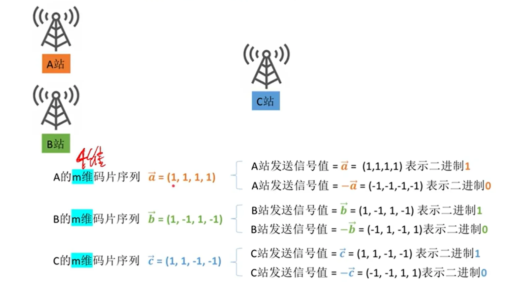

2.接收方如何判斷發送方是誰?

若多用戶同時發→訊號**向量會相加 ex a(1,1,1,1)，-b(1,-1,1,-1)同時發送 → 收到(0,2,0,2)**

“規格化內積”分離出a,b


**同時發送多個訊號**

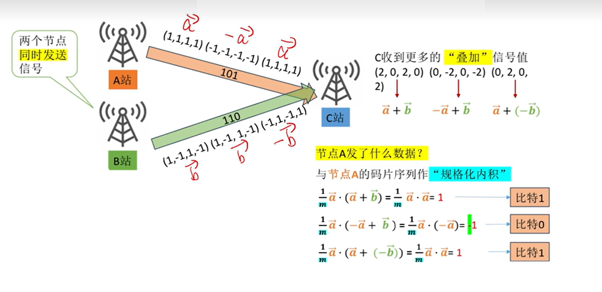

</aside>

---

### 2.隨機訪問

**場景與符號（統一單位）**

- **共享媒體**：多節點同一信道，誰先發、如何避免／處理碰撞。
- **R**：鏈路速率（bps） **L**：幀長（bit） **T=L/R**：發送時延（s）
- **τ**：單向傳播時延（s） **a=τ/T**：**規模參數**（越小效率越高）

---

**1) ALOHA 家族**

---

**純 ALOHA**

- **規則**：有資料就發；若收不到 ACK 視為碰撞，隨機重發。
- **吞吐（負載 G）**：$S=G e^{-2G}\;$，最大 $S_{\max}=1/(2e)\approx 0.184$（於 G=0.5）。
- **碰撞窗口**：2T（任何部分重疊都算碰撞）。
- **優/缺**：極簡、效率低、延遲大。

**時隙（Slotted）ALOHA**

- **規則**：時間對齊到**時隙**（slot = T）。只在槽邊界發送，封包有錯誤的話，接收端會向傳輸端發送NACK。
- **吞吐**： $S=Ge^{-G}\;$，最大  $S_{\max}=1/e\approx 0.368$（於 G=1）。
- **優/缺**：同步成本換來吞吐×2；仍易碰撞。

---

**+++**

**2) CSMA（Carrier Sense Multiple Access）**

---

✅ 會監聽

- **1-堅持（1-persistent）**：忙就**持續聽**，一空立即發；**碰撞概率高**（多者同時搶發）。
- **非堅持（non-persistent）**：忙就**退避一段隨機時間**再聽；**碰撞較少**，但平均延遲↑。
- **p-堅持（p-persistent，時隙化）**：空閒時以機率 p 發送，1-p 等下一槽再判；常用於匯流排時隙系統。

> 先「聽」後「說」；效果受 a=τ/T 影響：$a\to 0$ 時效率趨近 1。
> 

---

**3) CSMA/CD（Collision Detection）—以太網同軸/集線器時代**

> 先聽後發，邊聽邊發，衝突停發，隨機重發
> 

---

- **為何能「檢測」**：有線半雙工、發送同時能監聽信道能量／回波。
- **爭用期（contention period）**：一個節點最多需要的確認可以占用的時間$2\tau$（**兩端最遠節點**的往返**最大單向傳播時延**之和）
- **關鍵結論：最小幀長**
    
    為了在**發送完前**能檢出遠端碰撞，最小幀長  $\boxed{L_{\min} \ge 2\tau \cdot R}$
    
    | 符號 | 意義 | 單位 | 說明 |
    | --- | --- | --- | --- |
    | $( L_{\min} )$ | **最小幀長（Minimum Frame Length）** | bits（位元） | 為了能在最壞情況下偵測到碰撞，幀長必須至少這麼長。若幀太短，可能發送完了才知道撞車。 |
    | $( \tau )$ | **單向傳播時延（Propagation Delay）** | seconds（秒） | 指訊號從最遠的兩站之間單程傳播所需的時間。 |
    | $( R )$ | **傳輸速率（Data Rate）** | bits/second（bps） | 節點在媒介上傳送資料的速率。 |
    
    <aside>
    💡
    
    **為什麼要有「最小幀長」？（CSMA/CD 半雙工乙太網）**
    
    怕來不及檢測到收方發來的碰撞
    
    在 CSMA/CD 中，主機「邊發邊聽」。
    
    最壞情況：兩端最遠的兩個節點幾乎同時發送。A 先發，B 在 A 的訊號尚未到達前也開始發，碰撞發生在 B 端附近；碰撞訊號（或雜訊、Jam）要再**傳回 A**。
    
    > A 能偵測到碰撞的必要條件：A 在碰撞回傳的整個往返傳播延遲內仍在發送。
    > 
    > 
    > 因此幀的發送時間必須 ≥ 最壞情況的**往返傳播延遲** $2\tau$。
    > 
    
    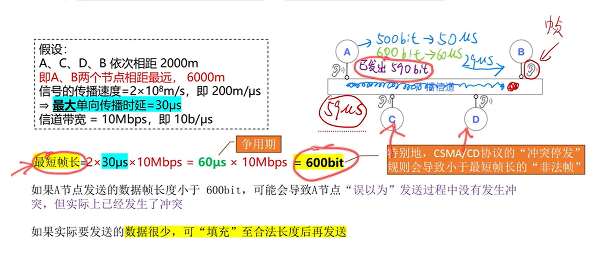
    
    此例子:
    
    單向傳播時延=30 (A→B 送達需要30)
    
    （以 τ=30 μs\tau=30\,\mu sτ=30μs 為例）：
    
    - **t = 0 μs**：A 開始發。
    - **t = 29 μs**：B 仍聽不到 A，開始發。
    - **t = 30 μs**：A 的第一個 bit 抵達 B → **在 B 處發生碰撞**。
        
        此時 B 的確已經發了 **1 μs**，立刻偵測到碰撞並停止（通常還會送 ~32 bit 的 Jam）。
        
    - **t = 60 μs**：碰撞擾動回傳到 A，**A 才偵測到碰撞**。
    
    因此，A 必須在整個 **往返傳播延遲 $2\tau$**  內仍在發送，才能保證能偵測到碰撞；最小幀長需滿足
    
    </aside>
    
    - 以太網規範固定 **slot time = $2\tau$ = 512 bit-times** → **最小幀 64B**（不含前導 8B）。
    - 最長幀長 **1518 B**
- **流程**：監聽→發送→若碰撞→**發 Jam 信號(約32bits)**→**二進位指數退避**：第 k 次碰撞在區間 $[0,2^m-1]$ 隨機選 $m=\min(k,10)$ 個時隙（每隙 512 bit-times），**第 16 次**仍碰撞 ⇒ **放棄**本幀、上報上層（網路層/主機）。
    
    <aside>
    💡
    
    ex
    
    
    
    答案：B. 15.36 μs
    
    理由：以太網 CSMA/CD 的二進位指數退避中，時隙為 512 bit-times。
    
    在 100 Mb/s 下，1 bit = 10 ns ⇒ 512 bit-times = 5.12 μs。
    
    「第二次重傳」代表已發生 2 次碰撞，k=2，退避範圍為 [0, 2²−1] = [0,3] 個時隙；最大退避＝3×5.12 μs＝**15.36 μs**。
    
    </aside>
    
- **現況**：**交換式全雙工**以太網已無共享媒體 → **CSMA/CD 不再使用**，但考題會問其原理與 $L_{\min}$。

---

- **4) CSMA/CA（Collision Avoidance）—IEEE 802.11（Wi-Fi）**
    
    ### 核心动机（为何不用 CSMA/CD）
    
    噪音很大
    
    
    
    - **无线无法“边发边听”**：发射功率远大于接收功率，自己的强信号淹没别人微弱信号。
    - **隐藏站**：A 听不到 C，但两者在 AP 处会相撞。
        
        
        
        → 因此 Wi-Fi 选 **冲突避免**（CA），而不是冲突检测（CD）。
        
    
    # 基本工作流（不启用预约时）
    
    1. **先听后发**：监听信道空闲 **DIFS** 时间。
    2. **忙则退避**：从区间 [0,CW][0, CW] 随机选一个**退避计数**（以 slot 为单位）。
        - 只在**信道空闲**时递减；一忙就**冻结**，空闲并持续 DIFS 后**继续递减**。
    3. **计数到 0 立即发送 DATA**（不做碰撞检测）。
    4. **接收方等待 SIFS 后回 ACK**（停止等待式保证可靠性）。
    5. **超时未收 ACK → 重传**，并按二进制指数退避**扩大 CW**；成功后 CW 复位到最小值。
    
    > 牢记：冻结不重抽（冻结期间不重新抽随机数，只是暂停计时）。
    > 
    
    
    
    # IFS（帧间隔）优先级
    
    - **SIFS < PIFS < DIFS**（记大小关系即可）。
    - SIFS：ACK/CTS/后续分片等“紧跟着就发”的控制帧，**最高优先级**。
    - DIFS：普通站竞争前的等待。
        
        （为何 DIFS 要更长？保证 SIFS + 传播时延内的 ACK/CTS 能先被全网“看见”，避免别人误判空闲。）
        
    
    # 预约机制：**RTS/CTS（可选，长帧常用）**
    
    - 流程：**RTS → CTS → DATA → ACK**（四次握手）。
    - CTS 含“**持续时间**”，所有站据此设置 **NAV**（虚拟载波监听）→ 在该时段**自觉禁言**。
    - 作用：显著降低**隐藏站**引发的碰撞；即使碰撞也多发生在很短的 RTS/CTS 上，代价小。
        
        
        
    
    
    
    # 与 CSMA/CD（以太网半双工）比對
    
    - 介质：有线 vs 无线
    - 冲突处理：**检测并立刻停止(jam)** vs **避免+ACK重传**
    - 关键机制：最小帧长/碰撞窗 vs IFS、退避冻结、RTS/CTS、ACK
    - 监听方式：边发边听 vs 发前监听、发时不听
    
    # 高频考点 / 速记
    
    - **SIFS 最短，DIFS 最长**；ACK/CTS 走 **SIFS**。
    - **退避计数只在空闲时递减，忙则冻结**；超时未收 ACK → 随机退避重传。
    - **解决隐藏站**：**RTS/CTS + NAV（虚拟载波监听）**。
    - 发送时序口令：**“先听 DIFS，忙则退；空闲递减到零发；收方 SIFS 回 ACK；长帧先订座 RTS/CTS，旁站看 CTS 先闭嘴。”**
    
    **暴露節點問題:**某節點因**聽到鄰近正在傳送**而**誤以為自己也會干擾**
    
- **暴露節點問題**：CSMA/CA 仍可能過於保守，RTS/CTS 可改善但不消除。
    
    
    

**5) 一頁對照**

| 比較面向 | **CSMA/CD（有線乙太網，半雙工）** | **CSMA/CA（Wi-Fi / 802.11）** |
| --- | --- | --- |
| 介質 / 場景 | 同軸/集線器匯流排，單一共享媒介 | 無線共享信道、訊號強弱差大、有遮蔽 |
| 先聽？ | 會（CSMA） | 會（CSMA） |
| **邊發邊聽？** | **會**：傳送同時偵測電壓/信號形狀判斷**碰撞** | **不會**：無線端發射功率遠大於接收功率，邊發邊聽不可行 |
| 碰撞處理 | **檢測**到就立刻**停止**、送 **Jam**、記一次碰撞 | **避免**為主：靠 **DIFS + 隨機退避**、無檢測；是否成功由 **ACK** 判定（或 RTS/CTS 降低碰撞） |
| slot / 時隙 | **slot = 2τ**（往返傳播延遲）；退避以此為單位 | 以 PHY **slot time** 為單位倒數（空閒才遞減、忙就**凍結**） |
| 退避演算法 | **二進位指數退避**（連續碰撞擴大視窗），重傳時重新抽號 | **CW（競爭窗）指數擴大**；倒數**凍結/恢復**不重抽；超時(沒 ACK/CTS)才擴窗 |
| 幀間間隔 | IFG = 96 bit-times | **SIFS < PIFS < DIFS**（ACK/CTS/分片後續用 SIFS，資料競爭前等 DIFS） |
| **最小幀長** | **必須有**：$RL_{\min}\ge 2\tau$ R（典型 64B，不含 8B 前導）確保傳送期間能偵測到遠端碰撞 | **無此需求**（不做碰撞檢測）；是否啟用 **RTS/CTS** 視**長幀**門檻而定 |
| 隱藏/暴露站 | 幾乎不存在（有線同一條匯流排） | **存在**；用 **RTS/CTS + NAV**（虛擬載波）抑制 |
| 吞吐/效率 | 取決於 $a=\tau/T_{\text{frame}}$：**a→0 時效率→1**；實作成熟、開銷小 | 受 **IFS、ACK、退避、RTS/CTS** 開銷影響；負載高時碰撞少、但控制開銷使效率低於理想 CD |
| 典型應用 | 早期共享式乙太網（HUB、同軸）；現代交換式全雙工已**不再使用** | **Wi-Fi（802.11）** 所有變種 |

---

### 3.輪詢訪問

**(Token Passing／Token Ring／IEEE 802.5）**

---

**核心概念**

- **媒體存取方式**：環上**只有拿到令牌（Token）者可發**；其餘節點僅轉發。
- **無碰撞、可預期**：存取秩序由令牌決定，**公平且延遲可估**，特別**適合高負載**情境。
- **邏輯拓撲**：**單向環**（實體常見星狀，以 **MAU** 集線器實作為邏輯環）。

---

**優缺點** 

- **優點**：**無碰撞**、**延遲可預期**、**高負載效率高**、公平。
- **缺點**：**令牌維護開銷**、環長帶來**延遲**、新增/移除節點較繁、單點故障需旁路處理。

---

**幀型態與關鍵欄位**

- **令牌幀（Token）**：極短控制幀；表示「信道可用」。
- **資料幀（Data Frame）**：含 **源地址、目的地址** 與 **狀態位**（例如目的站標記**已接收/已複製**）。
- **空閒令牌 ↔ 佔用令牌**：節點取到令牌並送資料時，令牌被「佔用」為資料幀；資料幀回到源站後被移除並**釋放空閒令牌**。
    
    
    

---

**傳輸流程（考題版）**

1. **等待令牌**：節點監聽環路，見到**空閒令牌**才可發。
2. **有資料要送**：
    - 抓取令牌 → **轉成資料幀**（填入源/目的地址）。
    - 資料幀沿環**單向**傳遞；**目的站複製數據並設狀態位為「已接收」**。
3. **資料幀回到源站**：
    - 檢查狀態位：**正常**→刪除資料幀、**釋放令牌**；**異常**→可**重發**（再等到令牌）。
4. **無資料可送**：立刻**把令牌傳給下一節點**。

> 常見規範：取得令牌一次只允許發送一幀（或受「令牌持有時間 THT」限制），確保公平。
> 

---

**其他補充與故障處理**

- **令牌丟失／重生**：由監督站（Monitor）或協定機制**檢出超時**並**重建令牌**，維持環運作。
- **單向轉發**：不論令牌或資料幀，皆沿**固定方向**逐站轉發。
- **集中控制**：多用 **MAU** 管理連接與旁路（某站故障可繞過）。
    
    
    

---

**時序示意（Mermaid）**

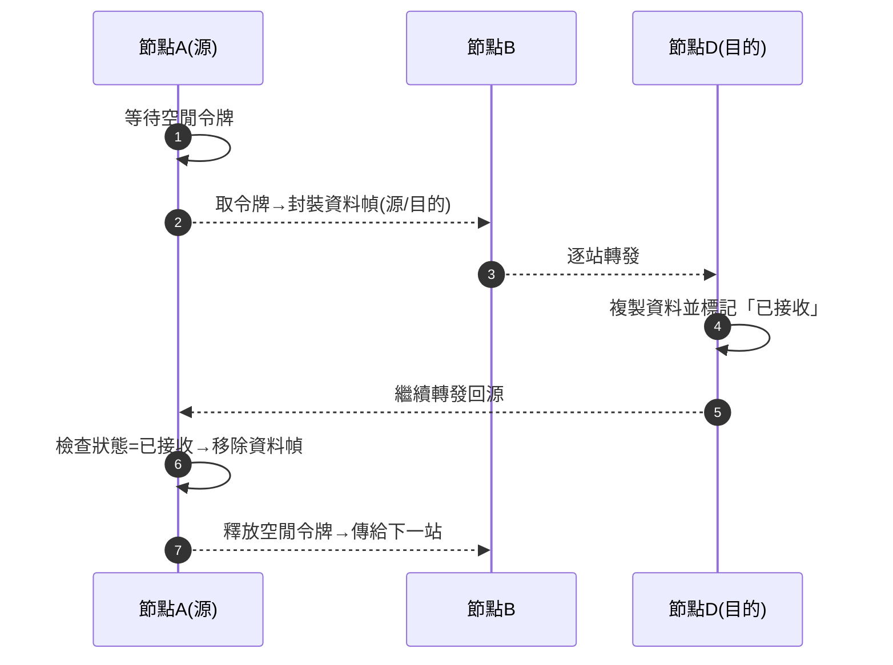
```mermaid
sequenceDiagram
autonumber
participant A as 節點A(源)
participant B as 節點B
participant D as 節點D(目的)
A->>A: 等待空閒令牌
A-->>B: 取令牌→封裝資料幀(源/目的)
B-->>D: 逐站轉發
D->>D: 複製資料並標記「已接收」
D-->>A: 繼續轉發回源
A->>A: 檢查狀態=已接收→移除資料幀
A-->>B: 釋放空閒令牌→傳給下一站

```

> 考試常問：為何不會碰撞？—因為環上任一時刻只有持令牌者能發；其他節點僅作中繼轉發。
> 

---

## 六、區域網

---

### 為什麼需要 LAN？

- **資源共享**：把同一辦公室/校園內的主機、印表機、檔案伺服器、軟體授權集中共享，降低成本、提升利用率。
- **高吞吐與低延遲**：同一網段內的交換式乙太網可提供 Gbps～Tbps 級帶寬、毫秒級以下延遲，遠優於跨網際網路的時延/抖動。
- **本地協作與管控**：內部廣播/多播（ARP、mDNS、DHCP）、集中認證、封包監管（ACL、QoS、Port-Security）在 LAN 中容易實施。
- **安全與合規邊界**：把內部系統與外網隔離（NAT/防火牆），細分 VLAN 與網段建立最小權限與零信任分區。
- **可管理的故障域**：把問題限制在單一接取層/廣播域，快速定位（例如 STP 迴圈、雙工不匹配、IP 衝突）。
- **成本與可擴充性**：銅纜/光纖與交換器成本低、建置彈性大（疊堆、聚合、VLAN 子網切分），比建私有 WAN 便宜許多。
    
    
    
    層級位子
    

### 區域網基本概念與結構

**1) LAN 介紹特點**

- **LAN**：在**有限地理範圍**內（校園、企業）以**高頻寬、低時延**連結節點的網路。
- 分類：IEEE **802**（資料鏈結層/實體層）。
    - **802.3 乙太網**（有線）、令牌環網(Token Ring)
    - **802.11 WLAN**（無線）、**802.1**（橋接/交換、STP、VLAN…）。
- **各節點以幀為單位傳輸。**
- **支持 單/多/廣 播。**

---

令牌環網（Token Ring, 802.5, 1984–2000）

- **邏輯環**（實體常做成**星狀 MAU**）；**令牌傳遞**，無碰撞。
- 介質：**同軸電纜／雙絞線**。已退場，但原理常考（令牌丟失/重生、一次持令牌只發一幀或受 THT 限制）。

---

以太網（802.3，有線，1980→now）

- **編碼**：10Mb/s 用**曼徹斯特**；更高速改用 **4B5B+MLT-3、8b/10b、PAM-5** 等（別把「曼徹斯特=所有乙太網」）。
- **總線同軸 / Hub**：邏輯**總線**、**半雙工 CSMA/CD**（要最小幀 64B、slot=512 bit-times）。
- **Switch**：**實體星、邏輯星**；**每埠一個碰撞域**。常見**全雙工** ⇒ **不使用 CSMA/CD**。
- **光纖**：多為**點對點、全雙工**（接 switch/路由器）；同樣**不需 CSMA/CD**。

---

無線區域網（802.11 WLAN）

- **星狀**（STA–AP）；**CSMA/CA**（DIFS/SIFS+退避），可選 **RTS/CTS**。
- 特性：**無法邊發邊聽**，有**隱藏/暴露節點**；以 **ACK** 確認成功。

---

- **LAN 硬體架構**
    
    
    
    ---
    
    A) 主機到乙太網（有線 802.3）
    
    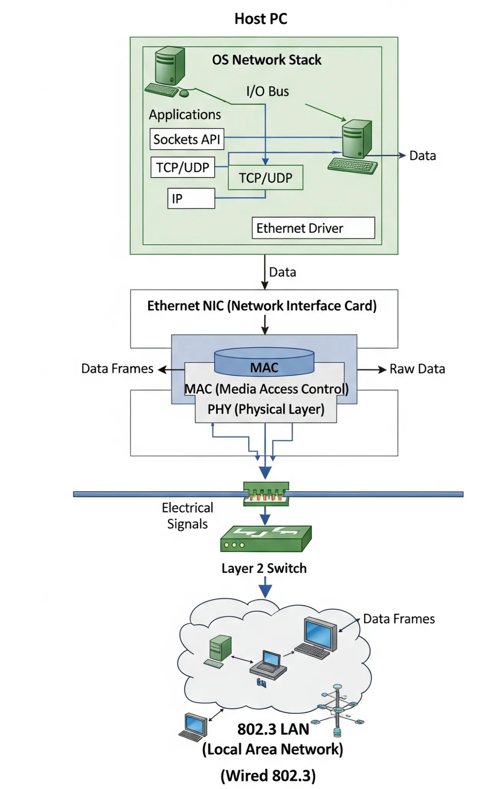
    
    ```mermaid
    flowchart LR
    subgraph Host["主機 / PC"]
      Stack["作業系統網路棧\n(IP/TCP/UDP)"]
      Bus["PCIe / USB 等 I/O 總線"]
      Stack -- 封包 --> Bus
    end
    
    subgraph ENIC["以太網網卡 (MAC + PHY)"]
      ROM["ROM/EEPROM\n(永久 MAC、設定)"]
      BUF["NIC RAM / FIFO\n(收發緩衝)"]
      MAC["MAC 控制器\nDMA/CRC/隊列/Flow Control"]
      PHY["PHY/SerDes\n編碼/解碼(MII/GMII/XGMII)"]
      RJ["RJ-45/磁性模組 或 SFP/光模組"]
      ROM --> MAC
      MAC <--> BUF
      MAC <--> PHY
      PHY --> RJ
    end
    
    Bus <-- DMA / 中斷 --> MAC
    RJ --> Media["雙絞線/光纖"] --> SW["L2 交換器"]
    SW --> LAN["802.3 區域網"]
    
    ```
    
    ---
    
    B) 主機到無線 LAN（802.11 / Wi-Fi）
    
    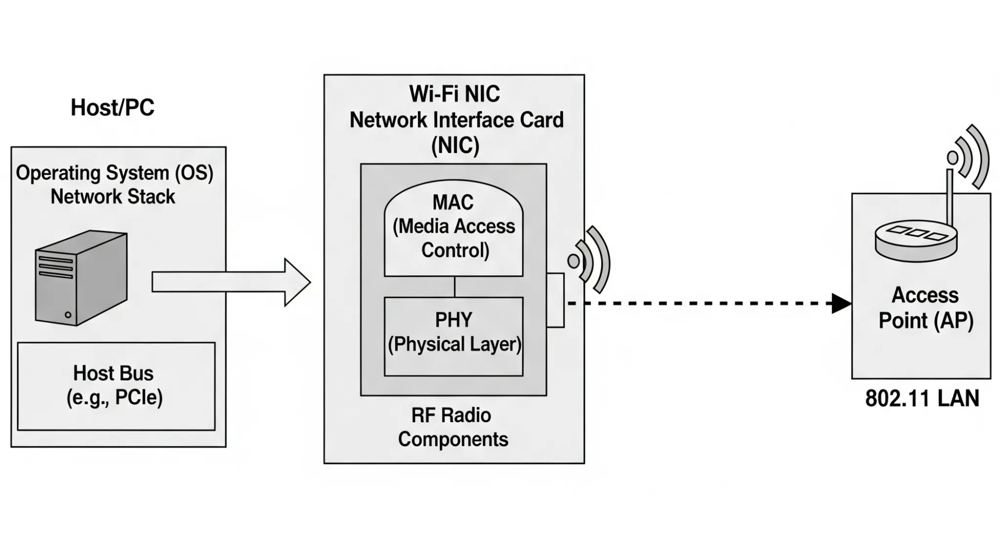
    
    ```mermaid
    flowchart LR
    subgraph Host["主機 / PC"]
      Stack["作業系統網路棧"]
      Bus["PCIe / USB"]
      Stack --> Bus
    end
    
    subgraph WNIC["Wi-Fi 網卡 (MAC + PHY + RF)"]
      ROM2["ROM/EEPROM\n(永久 MAC、射頻校準)"]
      BUF2["NIC RAM / FIFO"]
      MAC2["MAC 控制器\nCSMA/CA、重傳、加密"]
      BB["Baseband\n(OFDM/CCK, IFFT/FFT)"]
      RF["RF 收發器\nPA/LNA/濾波/鎖相環"]
      ANT["天線"]
      ROM2 --> MAC2
      MAC2 <--> BUF2
      MAC2 <--> BB
      BB <--> RF
      RF --> ANT
    end
    
    Bus <-- DMA / 中斷 --> MAC2
    ANT ~~~ AP["無線基地台(AP)"]
    AP --> SW2["交換器"] --> LAN2["802.11 區域網"]
    
    ```
    
    ---
    
    C) 典型 LAN 設備拓撲（三層設計）
    
    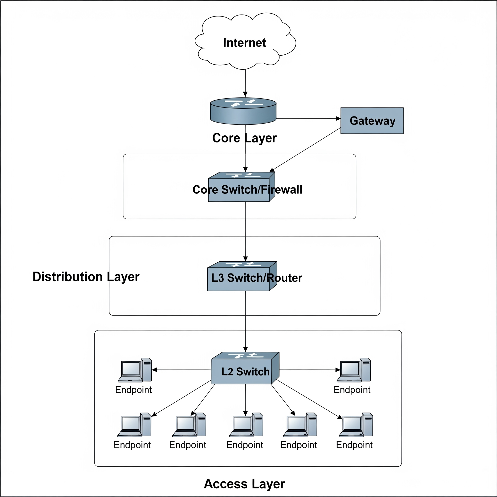
    
    ```mermaid
    flowchart LR
    subgraph Access["Access 層"]
      PC1[終端] --- SWA[L2 交換器]
      PC2[終端] --- SWA
      AP1[AP] -.PoE.-> SWA
    end
    SWA == Trunk(802.1Q) ==> DSW["三層交換器/路由器(Distribution)"]
    DSW --> Core["核心交換/防火牆(Core)"] --> GW["閘道器/對外路由"] --> Internet[(Internet)]
    
    ```
    
    > 小提示：網卡以 DMA 與 中斷和作業系統互動；乙太網全雙工時不使用 CSMA/CD，Wi-Fi 使用 CSMA/CA 並由 AP 匯接到交換器。
    > 

### IEEE 802.3   662N4

### 1) 核心概念摘要

**以太網**在**物理層**與**MAC 子層**之標準：介質（同軸/雙絞線/光纖）與**雙工模式**如何決定是否使用 **CSMA/CD**；**DIX Ethernet II（V2）** 與 **IEEE 802.3** 幀格式之差異；**曼徹斯特編碼**與**前導碼/SFD**的同步與定界；以及**單播/廣播**於 **Hub/Switch/Router** 間的傳播與**碰撞域/廣播域**判定。掌握「幀長、口訣、裝置隔離」三大考點即可應對多數題目。

**2) 重點整理**

**A. 物理層標準與命名規則++**

- **命名**：`速率 + BASE + 介質`
    
    例：**10BASE-5/2/T/F**（10 Mbps；粗/細同軸、雙絞線、光纖）。
    
- **高速以太網**：速率 > 100 Mbps（如 100BASE-TX、1000BASE-T、10GBASE-T…）。
- **介質 × 雙工 × CSMA/CD（考點）**
    
    
    | 介質/速率 | 雙工能力 | 是否用 CSMA/CD | 備註 |
    | --- | --- | --- | --- |
    | **同軸** | 只**半雙工** | **需要** | 匯流排/共享媒體，必有競爭 |
    | **雙絞線 < 2.5 Gbps** | **半/全雙工皆可**（連線**自動協商**） | 半雙工才需要 | 端點是 **Hub→半雙工**、**Switch→常全雙工** |
    | **雙絞線 ≥ 2.5 Gbps** | **只全雙工** | **不需要** | 例：10GBASE-T |
    | **光纖** | **只全雙工** | **不需要** | 802.3 系列一致 |
- **小結**：**只有「半雙工」才使用 CSMA/CD**；連線中若任一端是 **Hub**，即退回半雙工。

**B. MAC 子層與幀格式**


- **兩大標準**
    - **DIX Ethernet II（V2，實務最常用）**：以太網幀攜帶 **Type** 指示上層協定。
    - **IEEE 802.3**：兩位元組欄位改為 **Length**（上層協定交由 LLC 指定，考研多以概念理解為主）。
- **口訣：`6-6-2-N-4`（收發「協/長」數驗）**
    
    
    | 欄位 | 長度(Byte) | V2 含義 | 802.3 含義 |
    | --- | --- | --- | --- |
    | 目的 MAC | 6 | 指定接收者（全 1 = 廣播） | 同左 |
    | 源 MAC | 6 | 指定發送者 | 同左 |
    | 第三欄 | 2 | **Type**（上層協定，如 IPv4/IPv6） | **Length**（資料區長度） |
    | 資料區 N | 46~1500 | IP 分組/片段（不足 **46B** 需**填充**） | 同左 |
    | FCS/CRC | 4 | 差錯檢測 | 同左 |
    - **整幀長度**：**64 ~ 1518 B**（= 18 + N；不含前導碼/IFG）。
    - **MTU**：資料區 **N ≤ 1500 B**，IP 大於此值需**分片**。
- **廣播與單播**
    - **廣播 MAC**：`FF:FF:FF:FF:FF:FF`（48 個 1）。
    - **單播**：目的地址為特定主機 MAC。

### D. 裝置行為、碰撞域與廣播域（大題常考）

- **裝置特性**
    
    
    | 裝置 | 所屬層/行為 | 碰撞域 | 廣播域 |
    | --- | --- | --- | --- |
    | **Hub（集線器）** | 物理層，**無腦轉送**比特到所有埠 | **不隔離** | **不隔離** |
    | **Switch（交換器）** | 資料鏈路層，依**目的 MAC**僅轉特定埠 | **隔離** | **不隔離** |
    | **Router（路由器）** | 網路層，按 IP 轉送 | **隔離** | **隔離** |
- **單播/廣播傳播示意**

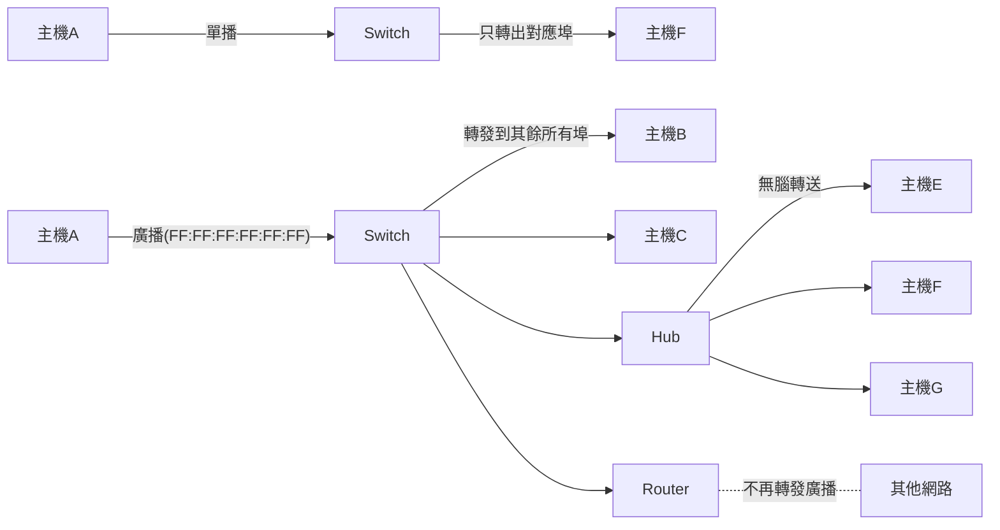
```mermaid
flowchart LR
  A[主機A] -- 單播 --> S[Switch]
  S -- 只轉出對應埠 --> F[主機F]

  A2[主機A] -- 廣播(FF:FF:FF:FF:FF:FF) --> S2[Switch]
  S2 -- 轉發到其餘所有埠 --> B[主機B]
  S2 --> C[主機C]
  S2 --> H[Hub]
  H -- 無腦轉送 --> E[主機E]
  H --> F2[主機F]
  H --> G[主機G]
  S2 --> R[Router]
  R -. 不再轉發廣播 .- X[其他網路]

```

- **考題定則**
    - **Switch 會隔離碰撞域**（每個**Switch 埠**為獨立碰撞域），**但不隔離廣播域**。
    - **Router 兩者皆隔離**；**Hub 皆不隔離**。
    - 含 **Hub** 的段落 → 半雙工 → 可能碰撞 → 需 **CSMA/CD**。

---

**3) 速記口訣與易錯點**

- **幀長口訣**：`6-6-2-N-4` → **收發協/長數驗**；`N∈[46,1500]` → 全幀 **64~1518B**。
- **前導碼口訣**：**「七同步一定界」**（7B 1010… + 1B 10101011）。
- **CSMA/CD**：**只有半雙工才用**；**同軸=半雙工、光纖=全雙工**；**雙絞線 <2.5G 可協商 半/全**，**≥2.5G 只全雙工**。
- **廣播**：**Switch 會泛洪**，**Router 不轉發**。
- **不足 46B 必填充**；**超過 1500B 需 IP 分片**（配合 MTU）。

---

### IEEE 802.11 無線區域網  30N4

## 1) 基本分類

- **有固定基礎設施**（Infrastructure）：日常 Wi-Fi，透過 **AP**（無線接入點）集中轉發。——重點
- **無固定基礎設施**（Ad hoc/移動自組織）：點對點臨時網（如隔空投送/華為分享）。——了解即可

## 2) 家用路由器模型

- 一台家用路由器 ≈ **路由器 + 以太網交換機 + 無線 AP**
- **AP ≈ 無線交換機**；終端↔AP 用 **802.11 幀**；AP↔AP/路由器/交換機 常用**有線**、傳 **以太網幀(802.3)**
- **Portal（門戶/網橋）**：負責把 802.11 與 802.3 幀做協定/幀格式轉換

## 3) 802.11 名詞速記


- **AP**：無線接入點（基站）
- **STA**：移動站（手機/筆電）
- **BSS**：基本服務集＝**1 個 AP + 其連線終端**
- **SSID**：Wi-Fi 名稱，**≤ 32 字節**
- **BSA**：基本服務區，能搜到該 Wi-Fi 的覆蓋範圍
- **ESS**：擴展服務集＝多個 BSS + 分配系統（全屋 Wi-Fi/子母路由）；**同一 SSID，可漫遊**
- **漫遊**：在 ESS 內不同 AP 之間**不中斷**切換

## 4) 介質訪問控制（MAC）

- 使用 **CSMA/CA**；可用 **RTS/CTS** 先行預約信道，**ACK** 確認
- **控制幀**：Type=01；子型舉例 RTS=1011、CTS=1100、ACK=1101（了解即可）
- **持續期 Duration（μs）**：聲明從本幀結束後仍需占用信道的時間；**RTS 最長**，CTS/後續逐步遞減

## 5) 802.11 幀——分類與重點

- **三類**：數據幀10 / 控制幀01 / 管理幀00（如 Probe Request/Response 用於發現 Wi-Fi）


- **考點：數據幀格式**
    - 口訣：**「30-N-4 首數驗；首部 3+1 地址」**
        - 首部 **30 B**、資料 **N（0~2312 B）**、FCS **4 B**
        - 首部有 **3+1 個 MAC 位址**（考試重點看**前 3 個**）
    - **幀控制（Frame Control）**：
        - 前 2 bit 協定版本；接著 **Type(2bit)**、**Subtype(4bit)**
        - **第 9、10 bit** 表「方向」：**去往 AP / 來自 AP**（= To DS / From DS）
    - **必經 AP 中轉**：兩個 STA **不得直接**互發數據幀

### 方向位與地址對應（背口訣解題）

> 口訣一：「90 比特表去來，幀的中轉靠 AP」（第9、10比特）
> 
> 
> 口訣二：**去往 AP：中—起—止** → Addr1=中轉(AP)、Addr2=起點(STA 源)、Addr3=終點(目的)
> 
> **來自 AP：止—中—起** → Addr1=終點(STA 目的)、Addr2=中轉(AP)、Addr3=起點(源)
> 

| 狀況 | 意義 | To DS | From DS | 傳輸方向 | 判斷方法 |
| --- | --- | --- | --- | --- | --- |
| **STA → AP** | 往 DS 傳資料 | 1 | 0 | 「去 AP」 | 主機（Host）把資料傳給 AP → 進入分配系統 |
| **AP → STA** | 從 DS 傳資料 | 0 | 1 | 「來 AP」 | AP 從有線網送出資料 → 給主機（Host） |
| **AP ↔ AP** | DS 間橋接 | 1 | 1 | 無線分配系統（WDS） | AP 間的無線骨幹（少考） |
| **Ad-hoc 模式** | 無 DS | 0 | 0 | STA ↔ STA 直連 | 沒有 AP 參與（點對點） |


## 6) 常見易錯

- **SSID ≤ 32 字節**；**ESS 多 AP 用同一 SSID**，支援無感漫遊
- 看見 **To DS/From DS（去/來自 AP）**，立刻套「**中起止 / 止中起**」
- **AP–STA** 用 802.11 幀；**AP–AP/路由器/交換機** 多為有線以太網幀（802.3）

---

### VLAN／IEEE 802.1Q

### 1. 核心概念摘要 (Executive Summary)

- *VLAN（Virtual LAN）= 在二層以太網上以邏輯方式切分廣播域。**它把一個大 LAN 分成多個小的、彼此隔離的廣播域以降低廣播負載、提升安全性與可管理性。實作上靠 802.1Q 標籤在**交換機之間的幹線（Trunk）**傳遞「此幀屬於哪個 VLAN（VID）」；**主機—交換機**仍用標準以太網幀。與計組相關的是物理層編碼與幀定界，與 OS 相關的是 MTU/幀長、封包分類與驅動對 VLAN 的處理。

---

### 1) VLAN 的動機與效果

- **問題**：大型 LAN 共享一個**廣播域** ⇒ 廣播多、負載高、易觸發**廣播風暴**；敏感伺服器對所有終端**可見且易受攻擊**。
- **解法**：以 **VLAN** 將節點**邏輯分組**，每個 VLAN **形成獨立廣播域**。不同 VLAN 彼此不可直接二層互通（除非經三層轉送）。

### 2) VLAN 成員劃分方式（考點）

| 劃分依據 | 管理操作 | 優點 | 缺點/注意 |
| --- | --- | --- | --- |
| **介面（Port-based）** | 綁定「埠 → VID」 | 實作簡單、最常用 | 端口一換，VLAN 也跟著變（靈活度較低） |
| **MAC 位址** | 綁定「MAC → VID」 | 移動到其他埠仍屬原 VLAN | 管理 MAC 清單較繁瑣 |
| **IP 位址** | 綁定「IP → VID」 | 可做跨交換機/跨網段的邏輯分群 | 涉及**網路層**能力，設備更複雜；教材層級可理解為「依 IP 規則劃分」 |

> 規則：每個 VLAN = 一個廣播域。交換機不隔離廣播域，但 VLAN 彼此天然隔離；經 Router/L3 Switch 才能跨 VLAN 通信（術語：Inter-VLAN Routing）。
> 

### 3) 802.1Q 幀（Trunk 上的幀格式）

- **主機 ↔ 交換機（Access 埠）**：仍用**標準以太網幀** `6-6-2-N-4`（目的 MAC / 源 MAC / Type(或Length) / 資料 / FCS）。
- **交換機 ↔ 交換機（Trunk 埠）**：使用 **802.1Q 幀**，在**源 MAC 後**插入 **4B VLAN 標籤**：


**口訣：`6-6-4-2-N-4` →「收(6)發(6)VLAN 標籤(4)協(2)Type/Length 數(N) 驗(4)FCS」**

**標籤 4B（教學版拆解）**


- **前 16 bit**：固定值，指明「此幀為 802.1Q」。
- **後 16 bit**：前 **4 bit（教材可視為保留/控制）**，**末 12 bit = VID**。
- **VID（VLAN ID）**：標示此幀屬於哪個 VLAN（例：10、20…），交換機據此只在**相同 VLAN**內轉發。

> 備註（標準更精細的說法，僅作參考）：後 16 bit 又稱 TCI，含 PCP(3, 優先級)、DEI/CFI(1)、VID(12)。
> 
- **轉發機制**
    1. SW1 收到 A(屬 VLAN10) 的幀 → 在 Trunk 上**插入 VID=10** 後送出。
    2. SW2 Trunk 埠收進 → 讀出 VID=10 → **只轉發**到屬 VLAN10 的 Access 埠。
    3. 終端收幀時**看不到標籤**（由交換機剝除）。

### 4) 廣播在 VLAN 中的傳播

- 來源屬 **VLAN X** 的**廣播幀**只在 **VLAN X** 內被泛洪；**不會**被二層轉到其他 VLAN。
- **跨 VLAN 廣播**需要 L3／特別機制，**一般不會自動發生**。

### 5) 易考判題規則

- **廣播域個數 = VLAN 個數（若無 Router/L3 隔離以外的特殊機制）**。
- **Trunk** 不會把不同 VLAN 混在一起；它是**承載多個 VLAN 的鏈路**。
- **含 Hub 的段**：仍為**半雙工**、可能碰撞、（若共享媒介）需 **CSMA/CD**；但 VLAN 判斷仍看 VID。

---

## 速記 & 考場口訣

- **VLAN 目標**：切分**廣播域**、提升**安全與管理性**。
- **幀格式**：**標準** `6-6-2-N-4`；**802.1Q** `6-6-4-2-N-4`。
- **標籤重點**：**末 12 bit = VID**；幹線必帶標籤，終端不見標籤。
- **判題**：**廣播域 = VLAN 數**；跨 VLAN 必經 **L3（Router/L3 Switch）**。
- **劃分方式**：Port / MAC / IP（三選一或混合策略，取捨在管理便利 vs 精細控制）。

## 七、廣域網

## **八、資料連結層設備**

# 以太網交換機 / Switch

## 1) 基本定位

- **層級**：資料鏈路層（Layer 2）。
- **交換機 vs. 網橋**：交換機本質上是**多埠網橋**；2022 年後考綱多以「交換機」為主。
- **埠/介面**：插網線的孔位；與「介面」不嚴格區分。
- **全雙工/半雙工**：連終端或交換機多為**全雙工**；若連**集線器（Hub）則只能半雙工**。

## 2) MAC 幀回顧（便於後文理解）

- 以太網 MAC 幀結構：**6-6-2-N-4**（收-發-型/長-資料-FCS）

## 3) 交換機的「自學習」與轉發（考點）

**核心資料結構：交換表（MAC address table）**，記錄 **MAC ⇄ 埠號**，初始為空。

**處理流程（收到每一幀時）**

1. **學習（Learn）**：讀取**來源 MAC**與進入埠 **p**，把 `(Source MAC → p)` 寫入/更新表項。
    
    
    
2. **查表（Lookup）並轉發**：
    - **目的 MAC 未知**或**廣播/多播**：**泛洪（Flood）**到除入口外的所有埠。
    - **目的 MAC 已知且對應埠 = d ≠ 入口**：**僅單播**轉發到埠 **d**。
    - **目的 MAC 對應埠 = 入口埠**：**不轉發（丟棄）**（例如同一埠後掛著 Hub，K→J 的例子）。
3. **老化（Aging）**：每個表項有**有效期**；逾期自動失效，解決裝置**拔線/換埠**導致表項過期的問題。
4. **即插即用**：靠「學習 + 老化」，拓撲變更後可自動收斂。

> 小結：學來源、查目的、未知就泛洪、同埠不回送、表項會老化。
> 

<aside>
💡

---

## 🧩 一、交換機的核心功能

乙太網交換機主要做三件事：

| 功能 | 說明 |
| --- | --- |
| **學習（Learning）** | 建立 MAC 位址表，知道哪個 MAC 在哪個埠口 |
| **轉發/過濾（Forwarding/Filtering）** | 根據 MAC 表判斷封包要轉到哪個埠 |
| **泛洪（Flooding）** | 若不認識目的 MAC，廣播封包給所有埠（除來源埠） |

---

## 🧠 二、學習（Learning）原理解析

### ✳️ 機制說明

當交換機（Switch）**第一次收到一個資料幀**時，它會：

1. **讀取來源 MAC 位址（Source MAC）**。
2. **記錄這個 MAC 與進入埠號（Port）之間的對應關係**。
    - 存在「**MAC 位址表（CAM Table）**」中。
3. **若目的 MAC 未知**，就先「廣播」出去（Flooding）。

🔹 下次再收到這個目的 MAC 的封包，就能「直接轉發」到正確的埠。

---

### ✳️ 範例（超經典考點）

| 時間 | 接收埠 | 來源 MAC | 目的 MAC | 行為 | MAC 位址表變化 |
| --- | --- | --- | --- | --- | --- |
| ① | Port1 | A | B | 未知目的 → Flood | 學到 A→Port1 |
| ② | Port2 | B | A | 查表得 A→Port1 → 單播轉發 | 學到 B→Port2 |
| ③ | Port3 | C | A | 查表得 A→Port1 → 單播轉發 | 學到 C→Port3 |

---

## ⚙️ 三、MAC 位址表（CAM Table）

| 欄位 | 意義 |
| --- | --- |
| **MAC Address** | 主機的硬體位址 |
| **Port Number** | 該主機連接到哪個交換機埠 |
| **VLAN ID** | 若為 VLAN 環境，還需記錄屬於哪個 VLAN |
| **Aging Time** | 老化時間（通常 300 秒），過期未通訊會刪除 |

---

## 🔄 四、老化（Aging）機制

- 若某 MAC **超過一定時間沒有出現**（預設約 300 秒），
    
    交換機會自動將其從 MAC 表中刪除。
    
- 這樣可避免因主機移動或拔線而造成表項錯誤。

---

## 🧾 五、與 Hub 的差異

| 功能 | Hub（集線器） | Switch（交換機） |
| --- | --- | --- |
| 資料傳送 | 廣播給所有埠 | 根據 MAC 表單播轉發 |
| 傳輸模式 | 半雙工 | 全雙工（多數） |
| 碰撞域 | 整體共用一個 | 每埠一個獨立碰撞域 |
| 是否具學習功能 | ❌ 無 | ✅ 有 |

---

## 📘 六、常見考題關鍵字

| 題型 | 關鍵句 | 正確判斷 |
| --- | --- | --- |
| 「交換機如何知道主機接在哪個埠？」 | 透過來源 MAC 學習 | ✅ |
| 「交換機如何處理未知目的 MAC 封包？」 | Flood 廣播 | ✅ |
| 「交換機學到的 MAC 表會永久存在嗎？」 | 不會，會老化刪除 | ✅ |
| 「交換機工作在 OSI 哪一層？」 | 第 2 層（資料連結層） | ✅ |

---

## 🪄 小口訣（幫助記憶）

> 學來源、查目的、不認識就廣播；久沒見，刪表項。
> 

---

</aside>

## 4) 兩種交換方式


### A. **直通式（Cut-through）**

- **做法**：僅讀**目的 MAC 的前 6B**就決定出口，**邊收邊轉**。
- **優點**：**延遲低**。
- **限制**：
    - 幾乎**不能做差錯檢測**（未收完整幀/FCS）。
    - **不支援速率匹配**（入口 100Mb/s、出口 10Mb/s 會噴流）。
    - **不支援協定/幀格式轉換**（如標準 MAC 幀 ↔ 802.1Q VLAN 幀）。

### B. **存儲轉發式（Store-and-forward）**

- **做法**：**整幀收滿進快取**→ 查目的 →（可）**做 FCS 差錯檢測、VLAN 標記/轉換、速率匹配** → 再發。
- **優點**：
    - **可做錯誤檢測（CRC/FCS）與丟棄壞幀**。
    - **可速率匹配**（100→10 Mb/s）。
    - **可協定/幀格式轉換**（如接收標準 MAC，發出 802.1Q）。
- **代價**：**延遲較高**（需收完整幀）。

> 比較一句話：直通＝極低延遲；存轉＝功能完整（檢錯/配速/轉格式）。
> 

## 5) 考題


## 6) 易錯與速記口訣

- **學來源／查目的／未知泛洪／同埠不轉／表項會老化**。
- **直通看 6B，存轉看整幀**；**要檢錯/配速/轉 VLAN 就用存轉**。
- 遇到「同一埠後掛 Hub 的兩台主機互發」→ **交換機不再轉發**。


# 3️⃣網路層


## 一、網路層的功能

---

## 0) 定位與資料單位

- 五層模型第 **3 層**；提供**主機到主機**傳輸。
- PDU：**IP 資料包（分組）**＝`IP首部(含源/目的IP) + 負載(傳輸層段)`；交給鏈路層再封成**幀**做**相鄰節點**傳送。

---

## 1) 異構網路互聯（Heterogeneous Internetworking）

- **目的**：用**統一的 IP 編址與轉發規則**，**屏蔽不同物理/鏈路實作**（Ethernet、802.11、令牌環…）。
- **關鍵設備**：**路由器 Router**（TCP/IP 文獻常稱 **Gateway**）。
- **要點**：每個網路是**一個 L2 節域**；跨網需靠 **L3（IP）+ 路由器** 轉遞，與底層媒體無關。

---

## 2) 路由與轉發（必考易混）

| 名稱 | 作用 | 協作範圍 | 產出與查找 |
| --- | --- | --- | --- |
| **路由 Routing** | 計算到各**目的網路**的最佳路徑 | **多台路由器**跑協定（RIP/OSPF…） | 形成**路由表** |
| **轉發 Forwarding** | 對**每個到來的分組**決定**下一跳/輸出埠** | **單台路由器本地**行為 | 查**轉發表**（路由表的**精簡/加速**版；**最長前綴匹配**） |
- **靜態路由**（人工配置）vs **動態路由**（協定生成）。
- **Default Route**：查無更長前綴時的**兜底**項。
- 一句話：**「路由算路；轉發走路」**。

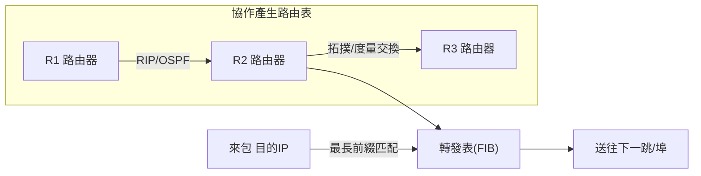
```mermaid
flowchart LR
  subgraph 協作產生路由表
    R1["R1 路由器"] -- "RIP/OSPF" --> R2["R2 路由器"]
    R2 -- "拓撲/度量交換" --> R3["R3 路由器"]
  end

  R2 --> FIB["轉發表(FIB)"]
  Pkt["來包 目的IP"] -- "最長前綴匹配" --> FIB --> NextHop["送往下一跳/埠"]

```

---

## 3) 擁塞與控制（概念題）

- **擁塞**：分組負荷超過網路可承受，**吞吐下降、時延/丟包上升**。
- **開環（靜態）**：部署時預先設計避免策略，運行時不改（例：容量規劃、准入控制、流量工程）。
- **閉環（動態）**：**監測→回饋→調整**（例：回報壅塞→改路由/節流/排程；教材常以 **ICMP 訊息**示意；實務多見 **RED/ECN** 等機制）。

---

## 4) 快速記憶點

- **Router ≡ Gateway**（在 TCP/IP 文獻中）。
- **網路層：主機到主機；鏈路層：相鄰到相鄰**。
- **轉發表＝精簡版路由表**，查找用**最長前綴匹配**。
- 重點：**IPv4（首部、分片、子網/CIDR）＋ 路由演算法/協定（RIP/OSPF）＋ 路由器工作流程**。

---

## 5) 資料報 vs. 虛擬電路（Datagram vs. Virtual Circuit, VC）

- **資料報 (IP 典型)**
    - **連線前不需建立狀態**；每個分組獨立轉送（best-effort）。
    - 路由器**無 per-flow 狀態**；彈性高、容錯佳，但**QoS 保證弱**。
- **虛擬電路 (VC)**（概念常見於 ATM/Frame Relay；現代對應 **MPLS**）
    - **連線建立階段**分配**識別碼/標籤**（VC ID/Label），之後分組沿**同一路徑**走。
    - 路由器（交換器）維護**per-VC/Label 狀態** → **可做資源預留/QoS**；但**拓撲變動需重建**。
- **MPLS（多協定標籤交換）＝「VC 思維 + IP 背板」**
    - 邊緣：**LER** 把封包分類為 **FEC** → 推入 **Label**。
    - 核心：**LSR** 只看 Label（TCAM/固定長匹配）**快轉發**。
    - **LSP**（label-switched path）可配合 **TE/FRR** 做流量工程與快速保護。
- **速背**：
    - 「**資料報彈性強；虛電路 QoS 強**」
    - 「**MPLS＝用 Label 在 L3 做 L2 式快轉**」

---

## 6) 「樹」相關：廣播、生成樹、多播

### (A) L2 生成樹（STP/RSTP/MSTP）

- 解決**二層迴圈**：選 **Root Bridge**，封鎖部分連結 → **生成樹**無環拓撲。
- **RSTP** 加速收斂，**MSTP** 分多棵樹對應多個 VLAN。

### (B) L3 廣播/多播的樹

- **廣播（Broadcast）**
    - 在 L3 幾乎不用（IPv4 classful 廣播已過時），常以 **多播 + 特定群組**或**多次 Unicast**替代。
- **多播（Multicast）—考點常出**
    - 位址：**224.0.0.0/4（IPv4）**；成員管理：**IGMP/MLD**。
    - **樹型轉送**：
        - **親源樹 SPT (Shortest-Path Tree)**：每個來源一棵最短路徑樹（記法 `(S,G)`）。
        - **共享樹 RP-based**：以 **RP** 為核心形成**共享樹**（記法 `(*,G)`），再視流量切回 SPT。
    - **PIM** 家族：
        - **PIM-DM（Dense）**：預設淹沒再修剪，適合群組密集。
        - **PIM-SM（Sparse）**：RP/Join 驅動，適合群組稀疏（主流）。
    - 核心機制：**RPF（Reverse Path Forwarding）反向路徑檢查**避免迴圈。
- **速背**：
    - 「**多播靠樹，稀疏走 SM，共享樹可切 SPT**」
    - 「**RPF 是多播防迴圈的靈魂**」

---

## 7) SDN（Software-Defined Networking）

---

## 📘 一、SDN 基本概念

| 項目 | 說明 |
| --- | --- |
| **提出者** | 2009 年，斯坦福大學 Nicira／Mulán 教授團隊提出 |
| **代表案例** | Google 2010–2012 年建成的資料中心網路 **B4** |
| **定位** | 一種新型網路體系結構（Network Architecture） |
| **核心思想** | ✨ **控制平面（Control Plane）與資料平面（Data Plane）分離** |
| **目標** | 將網路控制集中化、可程式化、自動化 |


---

## 📗 二、傳統網路 vs SDN

| 對比項 | 傳統網路 | SDN |
| --- | --- | --- |
| **控制層面** | 分散在各路由器（跑 OSPF/BGP 等） | 集中於 SDN 控制器 |
| **資料層面** | 路由器各自轉發分組 | 交換機依控制器下發的「流表（Flow Table）」轉發 |
| **轉發速度** | 控制軟體慢（秒級）、硬體轉發快（納秒級） | 控制統一決策、資料層快速執行 |
| **路由資訊來源** | 各節點互換路由資訊 | 控制器具有**全域視圖 (Global View)** |
| **管理方式** | 人工配置 | 程式化控制（API） |
| **策略一致性** | 難統一 | 全網統一策略、全域最佳化 |

---

## 📙 三、SDN 結構與 OpenFlow 協定

### 1️⃣ 三層結構

| 層級 | 內容 | 接口 |
| --- | --- | --- |
| **應用層（Application Layer）** | 網路應用（防火牆、QoS、負載均衡） | 北向 API（Northbound） |
| **控制層（Control Layer）** | SDN 控制器（如 OpenDaylight、ONOS） | 北向與南向 API |
| **資料層（Data Layer）** | OpenFlow 交換機（OpenFlow Switch） | 南向 API（Southbound） |

### 2️⃣ OpenFlow 協定

- 是 **控制層 ↔ 資料層** 的通訊標準介面。
- 控制器可直接操控交換機的流表（flow table）。
- 由 **ONF（Open Networking Foundation）** 制定。
- 常考版本：OpenFlow 1.0 / 1.3。

---

## 📕 四、OpenFlow 流表結構

| 欄位 | 功能 |
| --- | --- |
| **匹配欄位（Header Fields）** | 指定需比對的封包首部欄位（L2/L3/L4 各層） |
| **計數器（Counters）** | 記錄匹配次數與上次更新時間 |
| **動作（Actions）** | 指定匹配後執行的動作（轉發、丟棄、修改首部、複製等） |

📌 若封包無匹配項，交換機會將封包上傳給控制器處理。

---

## 📒 五、SDN 廣義轉發 (Generalized Forwarding)

| 步驟 | 說明 |
| --- | --- |
| **1. 匹配 (Match)** | 可對資料鏈路層、網際層、傳輸層欄位進行匹配 |
| **2. 執行動作 (Action)** | 可轉發、負載均衡、修改封包、阻擋或丟棄 |

➡ 傳統僅依目的 IP 做「最長前綴匹配」；SDN 則可依多層條件進行控制。

---

## 📘 六、常見應用範例

| 應用 | 說明 |
| --- | --- |
| **簡單轉發** | 控制器下發流表，指定封包轉發端口 |
| **負載均衡** | 控制器根據流量分佈設計多條轉發路徑 |
| **防火牆** | 控制器設規則阻擋特定來源或協定的流 |
| **流量工程（Traffic Engineering）** | 動態調整路徑、實現 QoS、降低擁塞 |

---

## 📙 七、SDN 四大特徵（考試速記）

| 編號 | 特徵 | 解釋 |
| --- | --- | --- |
| (1) | **基於流的轉發 (Flow-based Forwarding)** | 按流表中規則匹配封包首部進行動作 |
| (2) | **控制層與資料層分離 (Decoupling)** | 控制器統一決策、交換機執行 |
| (3) | **集中控制 (Centralized Control)** | 控制器集中掌握網路狀態 |
| (4) | **可編程性 (Programmability)** | 網路行為可透過軟體自動化配置 |

---

## 📓 八、SDN 控制器內部結構（常見出題點）

| 層次 | 功能 |
| --- | --- |
| **通訊層** | 與交換機溝通（透過南向 API） |
| **狀態管理層** | 維護全網資訊（拓撲、設備、連線狀態） |
| **應用層 / 控制應用程式層** | 控制應用（路由、負載均衡、防火牆等） |
| **代表控制器** | OpenDaylight、ONOS（開源） |

---

## 🧩 九、408 常考題型範例

| 題型 | 範例 |
| --- | --- |
| **單選題** | SDN 的核心思想是什麼？（答案：控制層與資料層分離） |
| **填空題** | 控制層與資料層之間的標準化通訊介面是 ______。→ *OpenFlow* |
| **判斷題** | SDN 交換機的流表由本地演算法動態生成。→ *錯（由控制器下發）* |
| **簡答題** | 說明 SDN 的四個特徵並舉例。 |
| **綜合題** | 分析控制器、交換機、北/南向 API 的互動流程。 |

---

## ✅ 結論整理（背誦用）

> SDN：中樞算路，邊緣照做；北向提需求，南向下指令。
> 
> 
> 控制集中、資料分離、全網最佳化、網路可程式化。
> 

---

是否要我幫你整理成一份「📄 SDN 考點精華講義（A4 橫式／可列印 PDF）」版本？

可以包含簡圖（控制層＋資料層＋北/南向 API）和一頁速背表。

---

## 8) 路由器工作流補強（考點串接）

1. **控制平面**：RIP/OSPF/BGP 或 SDN 控制器 → 得到 **RIB**（路由表）。
2. **資料平面**：將 RIB 編譯為 **FIB（最長前綴匹配）**，搭配 **ACL/NAT/多播/RPF** → **排程/佇列（RED/ECN/WFQ）** → 出口。
3. **多播例外**：依 `(S,G)`/`(*,G)` 狀態建**轉送樹條目**，RPF 檢查通過才轉發。

---

## 9) 一頁速記（可抄重點）

- **L3 目的**：跨異質 L2，**主機到主機**。PDU：**IP 分組**。
- **路由 vs 轉發**：**路由算路**產 RIB；**轉發走路**查 FIB（**最長前綴**）。
- **擁塞**：開環（容量/准入/TE）；閉環（RED/ECN、回饋調整）。
- **VC vs Datagram**：**VC/QoS 強**但需狀態；**Datagram 彈性強**。
- **MPLS**：**Label 快轉 + TE/保護**；LSP 對應 VC 思維。
- **多播**：**IGMP/MLD + PIM（SM 主流）+ RPF**；**共享樹↔SPT**。
- **SDN**：**控制/資料分離**，**控制器**全域下發流表；注意 **TCAM/容錯/擴展**。

---

## 二、路由算法

## 核心两句

- **路由算法目标**：找到**转发 IP 分组的最短路径**。
- **路由协议作用**：**实现某种路由算法**，并规定**路由器如何互相通信与交换信息**，以获得算法所需的拓扑/代价数据，最终形成**路由表**。

---

## 路由算法分类

### 1) 静态路由

- **人工配置**；实现简单、**开销小**，**不自适应**；适合**小型网络**/边界固定转发。

### 2) 动态路由

- 路由器随**拓扑/负载变化**自动调整；实现复杂、**开销大**，**自适应**；适合**大型网络**。
- 典型三类（图中两类为必会）：
    - **距离向量 DV**（RIP 基于此）
    - **链路状态 LS**（OSPF 基于此）
    - **路径向量**（BGP；大纲了解即可）

---

## 距离向量（DV）——RIP 的算法基础

- **思想**：不用全网拓扑；只看**到各邻居的代价** + **邻居到目的的最短距离**。
- **Bellman–Ford 公式**：
    
    `$D_x(d) = min_{v∈N(x)} { c(x,v) + D_v(d) }$`
    
    其中 `c(x,v)` 为链路代价（RIP 常用跳数，最大 15）。
    
- **交换内容**：邻居**周期性**互发“**距离向量**”（到所有目的网的距离表）。
- **优缺点**：实现/开销小；**收敛慢**、可能**数到无穷/环路**（RIP 用水平分割、毒性逆转等缓解）。
- **做题法**（如 2021-37）：把**邻居向量逐项 + 本链路代价**，对每一目的**取最小**得新距离与**下一跳**。

---

## 链路状态（LS）——OSPF 的算法基础

- **思想**：需要**完整拓扑** + 边权；本地跑 [**Dijkstra](https://www.notion.so/244c1f61b25b80b29b8af6a48488eb71?pvs=21)（SPF）** 求最短路树。
- **典型流程**：链路度量 → **LSA 泛洪**形成**LSDB**（全网一致）→ 本地 **SPF** 计算路由。
- **优缺点**：**收敛快、可精细度量（带宽/成本）**；但**状态同步与计算开销**较大。

---

## DV vs LS（高频对比）

| 维度 | 距离向量（RIP） | 链路状态（OSPF） |
| --- | --- | --- |
| 视图 | 仅邻居信息 | 全网拓扑 |
| 核心算法 | Bellman–Ford | Dijkstra（SPF） |
| 交换 | 距离向量表 | LSA（链路状态通告） |
| 收敛 | 较慢，可能环路 | 快，稳定 |
| 度量 | 跳数为主 | 可配置成本 |
| 适用 | 小/中小网络 | 中大规模网络 |

---

## 一句话记忆

- **DV**：看邻居表，**代价相加取最小**，定**下一跳**。
- **LS**：先拿全图（LSA/LSDB），再跑 **Dijkstra** 算全局最短路。

> 补充：BGP=路径向量，面向 AS 之间的策略路由（了解）。
> 

## 三、IPV4

---

# 1) 角色與基本概念

- **IP＝網路層核心協定**；**V4/V6＝版本**。IPv4 分組可承載 **TCP/UDP/ICMP/IGMP** 等上層資料，並交由**資料鏈結層**（如 802.3/802.11）承載傳送。
- **PDU 對照**：應用=報文 → 傳輸=段 → **網路=IP 分組** → 鏈路=幀。

---

# 2) IPv4 首部（Header）結構與欄位


- **首部＝固定 20B +（可選項 0–40B）**；20~60B。
- 第一行：
    - **Version(4b)**：4。
    - **IHL/首部長度(4b)**：**以 4B 為單位**；範圍 0–15 → 首部最大 60B。
    - **DS/ECN(8b)**：區分服務，通常不考。
    - **Total Length/總長度(16b)**：**以 1B 為單位**，含首部與資料，最大 65535。
- 第二行（**分片三件組**）：


- **Identification(16b)**：發送端為**同一原始分組**的全部分片賦同一值。
- **Flags(3b)**：**DF**（Don’t Fragment，不許分片）、**MF**（More Fragments，後續仍有分片）。
- **Fragment Offset(13b)**：**以 8B 為單位**，指出本分片資料在原分組中的偏移。
- 第三行：
    - **TTL(8b)**：每過一台路由器 **–1**；到 0 即丟棄並回 [**ICMP**](網路參考模型.md) 通知。
    - **Protocol(8b)**：上層協定號（TCP=6，UDP=17，ICMP=1…）。
    - **Header Checksum(16b)**：僅覆蓋首部，**每跳重算**。
        
        **糾錯**：UDP 校驗和在 IPv4 中可為 0 表示不計算；**IPv4 首部校驗和不可關閉**。
        
- 後兩行：**Source IP(32b)、Destination IP(32b)**。

**速記口訣：** **「4–1–8：首–總–偏」**

→ **首部長度以 4B**、**總長度以 1B**、**片偏移以 8B** 為單位。

---

# 3) MTU（Maximum Transmission Unit） 與分片

- **MTU**：鏈路層一個「幀」最多能載的位元組數（以太網多為 **1500B**）。
- **何時分片？**
    - 若下一跳 **MTU < IP分組長度** 且 **DF=0** → **路由器會分片**。
    - 若 **DF=1** → **丟棄**並回 ICMP「需分片但 DF 設定」（便於源主機調整大小）。
- **分片重點規則**
    
    
    
    1. **每片都有各自的 IP 首部 20B**（TTL 各自遞減、識別碼 `Identification` 相同）。
    2. **除了最後一片**，其餘各片的**資料長度必須是 8B 的倍數**（因偏移單位=8B）。
    3. **MF旗標**：非最後一片 **MF=1**，最後一片 **MF=0**。
- **通用解題流程**（無 options，首部 20B）：
    1. `payload = 原總長度 - 20`
    2. `per_payload = floor((MTU - 20)/8) * 8`（每片可裝的資料量）
    3. `片數 = ceil(payload / per_payload)`
    4. 逐片：
        - `片i資料長度 = min(per_payload, 剩餘)`
        - `片i總長度 = 20 + 片i資料長度`
        - `片i偏移 = 已送資料量/8`
        - `片i MF = (是否還有剩餘資料)`
        - `DF = 與原分組相同`、`Identification 相同`
    
    
    
- **例題速算**（與課上例一致）
    
    原分組 **4000B**（首部 20B，資料 3980B），經 MTU=1500：
    
    - `per_payload = floor((1500-20)/8)*8 = 1480`
    - 片 1：`總=1500`，`偏移=0`，`MF=1`
    - 片 2：`總=1500`，`偏移=1480/8=185`，`MF=1`
    - 片 3：`資料=3980-2*1480=1020` → `總=1040`，`偏移=(1480+1480)/8=370`，`MF=0`

---

# 4) 其它常考點

- **路由 vs 轉發**：路由協定產生**路由表**；路由器以**最長前綴匹配**查**轉發表(FIB)**轉送。
- **實際長度限制**：IP 總長度還會受**下一跳 MTU**與下層幀長（如乙太網 46–1500B 負載）約束。
- **重組**：**僅目的主機**重組分片；中間路由器**不重組**（除非為特殊功能盒）。

---

# 5) 速背清單

- **首部 20B 常態；可選項 ≤40B（總首部 ≤60B）**。
- **TTL 每跳–1，至 0 丟棄並 ICMP 通知**。
- **DF=1 不許分片；MF=1 表示後續仍有分片**。
- **以太網 MTU=1500B ⇒ 未分片時資料部分 ≤1480B（首部 20B）**。
- **418 口訣**與**除最後一片外 8B 對齊**——最易失分點。

### **1.IPv4 位址**

---

## 1) 為什麼「分類式」？

- IPv4 位址長 **32 bit**（≈ 4.29×10⁹），早期僅面向科研/軍政機構，被認為「夠用」。
- 最初採 **類別式（Classful）**：A/B/C 為**單播**、D 為**多播**、E 保留。後續因不足 → **子網劃分** → **CIDR** → **NAT**（時間線概念）。

---

## 2) A/B/C/D/E 類與範圍（點分十進制首段）

| 類別 | 前綴位型 | 首段範圍 | 網路號/主機號(bit) | 預設遮罩 | 每網路主機數* |
| --- | --- | --- | --- | --- | --- |
| **A** | `0` | **1–126** | 8 / 24 | 255.0.0.0 | 2²⁴−2 |
| **B** | `10` | **128–191** | 16 / 16 | 255.255.0.0 | 2¹⁶−2 |
| **C** | `110` | **192–223** | 24 / 8 | 255.255.255.0 | 2⁸−2 |
| **D** | `1110` | **224–239** | 多播 | – | – |
| **E** | `1111` | **240–255** | 保留 | – | – |
- 考研常規：**主機號全 0、全 1 不可分配**，故減 2。

---

## 3) 轉發與默認閘道（Default Gateway）

- **主機發包規則**
    1. 先判斷**目的位址是否在本網路**（按網路號）
    2. **同網**：用 **ARP** 查目的主機 MAC，**直接發**。
    3. **異網**：**交給默認閘道（本網路的路由器 介面 IP）**，由路由器轉發。
- **逐跳轉發**：每跳都會**重封裝 L2 幀（MAC 變）**，但 **IP 源/目的地址不變**。

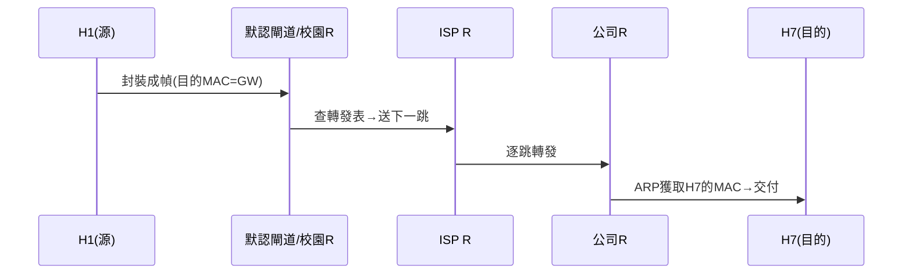
```mermaid
sequenceDiagram
participant H1 as H1(源)
participant GW as 默認閘道/校園R
participant ISP as ISP R
participant CR as 公司R
participant H7 as H7(目的)
H1->>GW: 封裝成幀(目的MAC=GW)
GW->>ISP: 查轉發表→送下一跳
ISP->>CR: 逐跳轉發
CR->>H7: ARP獲取H7的MAC→交付

```

---

## 4) 路由器的轉發表（簡式）

- 表項：**目的網路號 → 輸出介面/下一跳**；查表比對（現代為**最長前綴匹配**；早期按類別網號）。
- **Default/其他**：未匹配的流量走**預設路由**對外轉發。

---

## 5) 特殊用途 IPv4 位址（考點表）

| 形式 | 用途 | 可作來源? | 可作目的? | 例子/備註 |
| --- | --- | --- | --- | --- |
| `網路號 + 主機號全0` | **網路地址** | 否 | 否 | 只用於路由/轉發表表示一個網路，如 `166.1.0.0` |
| `網路號 + 主機號全1` | **定向廣播**到該網路 | 否 | 是 | 例如對 `200.1.1.0/24` 的廣播：`200.1.1.255` |
| `255.255.255.255` | **受限廣播**（本網域） | 否 | 是 | DHCP 發現常用 |
| `0.0.0.0` 或 `0.0.0.0/8` | **未知來源/本機**、**預設路由**表示法 | 是 | 否 | 新入網主機發 DHCP 請求時作來源 |
| `127.0.0.0/8` | **環回（Loopback）** | 是 | 是 | 常用 `127.0.0.1`，僅在本機迴送 |
| *（延伸）* | 私網位址、CIDR、NAT | — | — | 後續章節重點，與本節時間線銜接 |

---

## 6) 例題提示（小題常態）

1. **判斷類別/網路號**：看首段數值或前綴位型。
2. **主機容量**：`2^H − 2`。
3. **同網/異網判斷**：比對網路號（或遮罩後結果）。
4. **默認閘道作用**：僅在**異網**情況由主機把分組送到**本網路的路由器介面 IP**。

---

## 7) 一句話總結

> 類別式地址是 IPv4 的「第一版編址」：A/B/C 決定網路/主機位數；同網直達、異網走閘道；特殊位址要能辨識。
> 
> 
> 後續因地址與彈性不足，才演進到 **子網劃分 → CIDR → NAT**。
> 

### **2.子網劃分與子網掩碼**

---


# 1) 為何要子網劃分？

- **背景**：類別式位址（A/B/C）只有**網路號+主機號**兩級，常造成主機號浪費。
- **子網劃分**：從「主機號」前面**借出 k bit 當子網號**，形成**網路號 / 子網號 / 主機號**三級，提升地址利用率，支援多校區/多部門拓撲。

---

# 2) 子網掩碼（Subnet Mask）與 /前綴記法

- **定義**：32bit 位元遮罩；**1**表示「網路前綴（= 網路號+子網號）」，**0**表示主機號。
- **用途**：`IP AND Mask → 網路前綴`；主機用它判斷**同網/異網**，路由器用它做**匹配**。
- **寫法**：
    - 點分十進制：如 `255.255.128.0`。
    - **/前綴**：如 `/17`（表示前 17 位為 1）。
- **預設掩碼（未劃分子網時）**：A=/8、B=/16、C=/24。

---

# 3) 主機發包決策（同網/異網）

1. 取 `dstIP AND Mask` 與 `myIP AND Mask` 比較。
2. **相同** → **同網直達**：用 **ARP** 得到對方 MAC，直接發幀。
3. **不同** → **異網**：發給 預設閘道（Default Gateway）的 MAC，由路由器轉發。

---

# 4) 路由器的轉發表（支援子網）

- 表項含：**目的網路**、**掩碼**、**輸出介面/下一跳**；查表步驟：
    1. 對每個表項做 `dstIP AND mask`；
    2. 與表項的「目的網路」比對；
    3. 多條命中時，用**最長前綴匹配**（前綴越長越優先）。
- **預設路由**：`0.0.0.0/0`（兜底）。

---

# 5) 子網數與主機數（公式＋口訣）

- 由原始主機位 **N** 借出 **k** 位當子網號：
    - **子網數**：`$2^k$`（*現代允許全0/全1子網；若題目特別聲明不可用，則用* `$2^k − 2$`）。
    - **每子網主機數**：`$2^{N − k} − 2$`（主機號**全0=網路地址**，**全1=定向廣播**不可分配）。
- **口訣**：**「借幾當幾分幾網；剩幾算主機減二」**。

---

# 6) 常見速查

---

# 7) 小練習（含答案）

**例 1｜給定位址求網路/廣播/首末主機**

`IP = 166.1.2.130/17`

- 掩碼 `/17` → `255.255.128.0`。
- **網路地址**：`166.1.(2 AND 128)=128` → `166.1.128.0`。
- **廣播地址**：`166.1.255.255`（/17 的主機位全 1）。
- **首主機**：`166.1.128.1`；**末主機**：`166.1.255.254`；**主機數**：`2^(32−17)−2 = 32766`。

**例 2｜最少子網數設計**

企業擁有 `172.16.0.0/16`（B 類），需**≥6 個子網**，每子網主機越多越好。

- 需 `k = ceil(log2 6) = 3`，前綴變 `/19`（=16+3）。
- **每子網主機數**：`2^(16−3)−2 = 8190`。
- **第一子網**：`172.16.0.0/19`（0–8191）；**第二**：`172.16.32.0/19`；…（步長=`2^(32−/19)=8192`）。

**例 3｜同網/異網判斷（主機端）**

`myIP=200.1.1.5/24`，`dst=200.1.2.8` → `200.1.1.5 AND /24 = 200.1.1.0`，`200.1.2.8 AND /24 = 200.1.2.0`，不同 → **發給預設閘道**。

---

# 8) 易錯警示

- **AND 單位**：掩碼與 IP 要以**二進位逐位相與**，非十進制相乘。
- **主機號對齊**：只在**分片**題要求 8B 對齊；**子網計算無需 8B 對齊**。
- **定向廣播 vs 受限廣播**：`網路+全1` 為**定向廣播**；`255.255.255.255` 為**受限廣播**（同網域）。
- **最長前綴匹配**：當 `/24` 與 `/17` 同時命中，**/24 優先**。
- **題目若明示「不可使用全0/全1子網」**，子網數用 `2^k−2`；否則按現代慣例 `2^k`。

---

| 類別 | 預設掩碼 | 可見前綴 |
| --- | --- | --- |
| A | 255.0.0.0 | /8 |
| B | 255.255.0.0 | /16 |
| C | 255.255.255.0 | /24 |

### **3.CIDR 無分類編址**

---

CIDR 的用途：用**可变长前缀**替代 A/B/C 类，支持**灵活划分与聚合**地址块，从而**提高地址利用率并显著缩小路由表**。

# 1) 核心觀念速記


- **CIDR（1993）取消 A/B/C 類，地址 = 網路前綴/主機號，前綴可變長 → 更精細分配、可聚合（超網）**、配合**最長前綴匹配**減少路由表項。
- 劃分子網有兩種：[**定長(FLSM)**](網路參考模型.md) 與 **變長(VLSM)**；VLSM 依需求大小切割，考點高頻。

---

# 2) 公式與口訣

- 可用主機數（單一子網）：$2^{(32-P)}$-2\;（P=前綴長度；主機號全0/全1不可分配）。
- **步長（block size）**：每子網地址數 = $2^{(32-P)}$；在關鍵位元組的增量即為步長。
- **口訣**：
    - 「**借幾當幾分幾網；剩幾算主機減二**」
    - 「**/24→256, /25→128, /26→64, /27→32, /28→16, /29→8, /30→4**（每網總位址）」
- **最長前綴匹配**：多條命中時，**前綴越長越優先**（先/29，再/28，再/24…）。

---

# 3) 定長子網劃分（FLSM）


**作法**：在主機號中固定**借出 k 位**做子網號 → 產生 $2^k$ 個**等大**子網。

### **操作步驟**

1. 確認原始網路的 **網路位數**（例如 `/16`）。
2. 決定要切多少子網 → 算出 `k`（子網位數）。
3. 新的子網遮罩 = `原遮罩 + k`。
4. 每個子網的可用主機數 = `$2^{(32 - (原遮罩 + k))} - 2$`。

### **例子**

- 已知：`172.16.0.0/16`
- 需求：128 個子網 → `$2^7 = 128$` → `k = 7`
- 新遮罩：`/23 (= 16 + 7)`
- 每子網可用主機數：
    
    `$2^{(32-23)} - 2 = 2^9 - 2 = 510$`
    

### **缺點**

- **浪費位址**：即使子網只需少量主機，也必須分配完整的一個子網，導致位址利用率低。
- **缺乏彈性**：不同子網需求差異大時（如一個需要 1000 主機、另一個只需 10 主機），無法靈活分配。
- **不利於大型網路**：當子網數量或主機需求差異化明顯時，管理與位址利用率都不佳 → 因此後來才有 **VLSM（可變長子網劃分）**。

---

# 4) 變長子網劃分（VLSM)


**步驟**（解題通用）

1. **需求排序（由大到小）**：先滿足最大主機需求。
2. 對每個需求選**最小可容納前綴**（含 −2 規則）。
3. 以**二分法**從根地址塊往下切（左=0、右=1），**對齊邊界**；已分配塊不得重疊。
4. 產生的前綴彼此**不為前綴-前綴關係**（前綴碼互不為他者的前綴），便於最長前綴匹配。
- **示例（對應課內情境，化簡版）**
    
    根：`10.0.0.0/27`（**32** 位址，可用 **30**）
    
    需求：**12 主機**、**6 主機**、**2 主機(點對點)**
    
    - 12 主機 → 需 **/28**（16 總，14 可用） → `10.0.0.0/28`（可用 `10.0.0.1–14`，廣播 `.15`）
    - 6 主機 → 需 **/29**（8 總，6 可用） → `10.0.0.16/29`（可用 `.17–22`，廣播 `.23`）
    - 2 主機 → 需 **/30**（4 總，2 可用，考題常用；*實務亦可 /31*） → `10.0.0.24/30`（可用 `.25–26`，廣播 `.27`）
    - 剩餘：`10.0.0.28/30` 未用
    
    ```mermaid
    graph LR
      R["/27 (32)"] --> A["/28 (16) → 12主機"]
      R --> B["/28 (16)"]
      B --> C["/29 (8) → 6主機"]
      B --> D["/29 (8)"]
      D --> E["/30 (4) → 2主機"]
      D --> F["/30 (4) → 剩餘"]
    
    ```
    

**哈夫曼樹編碼**


為給定字元/事件的出現頻率 $p_i$ 構造**最短平均碼長**的**前綴碼（prefix-free code）**。


---

### **4.路由聚合（supernetting）**

---

# 1) 什麼是路由聚合


- **定義**：把多條**前綴相鄰、且下一跳一致**的路由，**匯總**成一條**更短前綴**的路由（超網），例如把三條 `/28`（同下一跳）合成一條 `/27`。
- **目的**：縮小路由表（記憶體更省）、查表更快（時延更低）、路由更新更簡（收斂更快）。
- **必要條件（考點）**：
    1. **同下一跳/同介面**（行為必須一致，否則不可聚合）；
    2. **位址連續**；
    3. **邊界對齊**（能被新步長整除）。

---

# 2) 怎麼做匯總（手算法）

1. 把要聚合的網段寫成**二進位**；
2. 取它們的**最長共同前綴**長度 = `L`；
3. 匯總路由 = `共同前綴/L`（尾端補 0）；
4. **檢查**是否真的只涵蓋這些子網、且**下一跳一致**。
- **對齊規則直觀版**：要把兩個 `/k` 合成 `/k-1`，則它們的網路位址必須是「**前 k-1 位相同、且第 k 位一個 0 一個 1**」，同時兩段**剛好相鄰**。

---

# 3) 可能的副作用

- **多涵蓋了一些「尚未使用」的位址**：上游按匯總路由轉來，下游找不到更具體的表項時會落到**預設路由**；若**出入口相同**則直接丟棄（避免迴圈），一般不影響正確性，只是多一次轉發/丟棄。
- **多重匹配**：同一目的同時命中「匯總」與「更具體」路由時，依**最長前綴匹配**（Longest Prefix Match, LPM）選**前綴最長**者。

---

# 4) 最長前綴匹配（LPM）

- **規則**：多條表項都匹配時，**前綴越長越優先**（/32 > /31 > … > /0）。
- **常見組合**：`/28`（直連快速）、`/27`（上游聚合）、`/0`（預設兜底）。
    
    例：目的 `32.131.x.x` 同時命中 `/27` 與更具體的 `/28`，→ **選 `/28`** 走直連（更快）。
    

---

# 5) 與前面情境的對應（簡化復盤）

- 縣裡路由器原有三條到「鐵柱/旺財/狗剩」子網的路由（同下一跳 `G1`），可**聚合**成一條 `/27 → G1`。
- 之後為了讓到鐵柱更快，又加一條**更具體**的 `/28 → G3`（直連）。
- 對 `32.131`：同時命中 `/27` 和 `/28`，**按 LPM 走 `/28 → G3`**。
- 對 `32.153`（狗剩 `/30`）：命中 `/27` 但**不**命中 `/28`，→ 走 `/27 → G1 → 閒魚電信 → F3` 到狗剩。

---

# 6) 預設路由

- **`0.0.0.0/0`**：萬用兜底；任何目的都能匹配，但**優先度最低**（前綴最短）。
- 若封包查不到更具體路由，只命中預設，且**出入口介面相同** → 為防回送，**直接丟棄**。

---

# 7) 主機與路由器行為不變（提要）

- **主機送包**：先用 `IP AND 掩碼` 判斷**同網/異網** → 同網用 **ARP** 找對方 MAC 直送；異網送 **預設閘道**（默认网关）。
- **路由器轉發**：驗首部校驗和 → 取**目的 IP** → **LPM 查表** → 重新封裝（MAC）→ 送出介面。

---

# 8) 口訣 & 易錯點

- **口訣**：「**聚合要三要：同下一跳、連續、對齊**；**匹配看誰長**（前綴越長越先）。」
- **易錯**：
    - 不同下一跳硬聚合（❌）；
    - 子網**未對齊**就嘗試匯總（❌）；
    - 忘了 LPM，誤走匯總而非更具體路由（❌）。

---

# 9) 快速小練習（附答）

1. 把 `10.0.0.0/25` 與 `10.0.0.128/25` 匯總 → **`10.0.0.0/24`**（同下一跳才可合併）。
2. 目的同時命中 `203.0.113.0/25` 與 `203.0.113.64/26` → **走 `/26`**。
3. 想把 `192.168.1.0/26` 與 `192.168.1.64/27` 匯總？→ **不行**（大小不同且第二條未對齊到 `/26` 邊界）。

---

### 5.**NAT（ Network Address Translation-网络地址转换)**

---

# 为什么要有 NAT

- IPv4 只有 $2^{32}$（约 42 亿）地址；每台主机都占一个公网 IP 不现实 → **NAT 让一个局域网共享少量公网 IP**。
    
    ---
    
    ## 🌐 NAT 轉換原理整理
    
    ### 🔹 基本功能：**SNAT（Source NAT，源位址轉換）**
    
    **方向：內網 → 外網（出站，Outbound）**
    
    - ✅ **自動發生**
    - ✅ **目的：**讓多台內網設備共用同一個「外部 IP」對外上網
    - ✅ **常見場景：**家用路由器讓所有手機、筆電共用一個公網 IP 上網
    - ✅ **別名：**「IP 分享」、「多對一 NAT」
    - 🧠 **運作機制：**
        - 將封包的 **來源 IP（Source IP）** 改成路由器的外部 IP
        - 同時在 NAT 表記錄來源內部位址，以便回覆時能找到原主機
    
    📘 範例
    
    > 192.168.0.10 → (NAT) → 公網 IP 203.66.1.5
    > 
    > 
    > 外部網站回封包 → 路由器查表 → 還原給 192.168.0.10
    > 
    
    ---
    
    ### 🔹 擴充功能：**DNAT（Destination NAT）／Port Mapping（通訊埠轉發）**
    
    **方向：外網 → 內網（入站，Inbound）**
    
    - ⚙️ **需手動設定**
    - ✅ **目的：**讓外部使用者能透過指定埠號，訪問內網特定主機服務
    - ✅ **常見場景：**從外部 SSH / RDP / HTTP 連入家中或公司伺服器
    - ✅ **別名：**「Port Forwarding」、「一對一 NAT」
    - 🧠 **運作機制：**
        - 路由器根據埠號規則，將**目的 IP / Port** 改成內部伺服器的 IP / Port
    
    📘 範例
    
    > 外部 ssh 連線到 203.66.1.5:22
    > 
    > 
    > → 路由器轉發到內部 192.168.0.10:22
    > 
    
    ---
    
    ## 🔸 對比總表
    
    | 功能 | 類型 | 流向 | 是否自動 | 使用目的 | 關鍵轉換欄位 |
    | --- | --- | --- | --- | --- | --- |
    | **SNAT** | 出站 NAT | 內網 → 外網 | ✅ 自動 | 內網共享外部 IP | 改「來源 IP」 |
    | **DNAT / Port Mapping** | 入站 NAT | 外網 → 內網 | ⚙️ 手動(Port Forwarding) | 外部訪問內部伺服器 | 改「目的 IP」 |
    
    ---
    
    🧩 **口訣**
    
    > 「內出外靠 SNAT，自外進靠 DNAT；出站自動、入站手動。」
    > 

<aside>
💡

# 核心术语

- **公网 IP（外网 IP）**：ISP 分配，全球唯一，用于对外通信。
- **###私有 IP（内网 IP）**（RFC1918，只能在局域网用，可复用）
    - `10.0.0.0/8`
    - `172.16.0.0/12`
    - `192.168.0.0/16`
- **端口（Port）**：传输层标识进程。IP 只定主机，**IP+端口**才定位到具体进程。
    
    
    
</aside>

# NAT 的几种形态（知道名词就够）

- **静态 NAT（1:1）**：固定映射；常配合“端口转发/DMZ”做**外到内**访问。
- **动态 NAT（多对多池）**：从公网地址池临时分配。
- **NAPT / PAT（多对一）**：最常见的“家庭路由器 NAT”，**用不同端口复用同一个公网 IP**。

# NAT 表到底记什么

- 典型条目（含协议）：
    
    `proto, 公网IP:公网端口  ⇄  私网IP:私网端口`
    
- **出站**（内→外，SNAT/PAT）：改**源 IP/源端口**；建立/更新映射。
- **入站回包**（外→内，DNAT）：按表改**目的 IP/目的端口**，转给内网主机。

# 报文哪些字段会变

- **IP 首部**：源/目的地址（取决于方向）；TTL 正常减 1；**需要重算 IP 头部校验和**。
- **TCP/UDP 首部**：端口可能被改；因伪首部含 IP，**也要重算传输层校验和**。

# 与“普通路由器”的区别

- 普通路由器只看 **L3**（IP）转发；
- **NAT 路由器会“看到并可能修改 L4（端口）”**，因此必须重算相关校验和。

# NAT 带来的影响（常考＋易错）

- **破坏端到端**：内网主机**不能被动接收**外部新连接，除非
    - 端口映射（静态 DNAT/Port Forwarding），或
    - 使用中继/打洞（实际工程里的 STUN/TURN/UPnP 等）。
- 某些嵌入 IP/端口的协议需 **ALG** 帮改（如 FTP 主动模式、SIP 等）。
- 不同局域网可**重复**使用同一私有地址，不冲突；出网后靠**公网IP:端口**区分会话。

# 一眼看懂的最小示例


- 内网手机 A：`192.168.3.48:9855` → 互联网手机 B 暴露的**公网**：`66.211.88.55:4096`
- 出站时（A→外）：
    
    `Src 192.168.3.48:9855 → NAT → Src 49.153.X.Y:7788`（公网 IP 与端口）
    
- 回包时（外→A）：
    
    目的 `49.153.X.Y:7788` 命中 NAT 表 → 还原为 `192.168.3.48:9855` → 送达 A 的微信进程。
    

> 手機 A 在家用 Wi-Fi（私網）要傳訊息給遠端手機 B。
> 

> 由於家裡 NAT 路由器只有一個公網 IP，它幫每個內部設備分配不同的「**外部端口**」當作臨時身分證。
> 

> 出站時（A→外）NAT 把私網 IP 換成公網 IP+Port；
> 

> 回包時（外→A）NAT 根據記錄表，幫封包找到原來的內部住址。
> 

> **就像快遞公司幫你轉寄信：你是 A 家（192.168），NAT 是倉庫（59.175），外面世界只看到倉庫編號，但信件一到，NAT 知道要送回你家。**
> 

# 快速判断题（自测）

1. 家里两台设备都搜到公网 IP 为 `49.153.*.*`，说明？
    
    → **它们共享同一公网 IP，经由 NAT 上网**。
    
2. 能否从外网直接访问 `192.168.1.100:22`
    
    → **不行**，需在 NAT 上做 **端口映射**（如 `公网IP:2222 → 192.168.1.100:22`）。
    
3. NAT 是否会更改 TTL？
    
    → **作为转发设备会减 1**（和普通路由器一样）；若改了 IP/端口，还要**重算校验和**。
    
4. 内网同一时刻两台主机都连接 `example.com:443` 会冲突吗？
    
    → **不会**，PAT 用不同的**公网端口**区分映射。
    

---

### 6.ARP（地址解析协议）

> 规范名称是 ARP (Address Resolution Protocol)。
> 

## 是什么 & 干嘛用

- **作用**：在**同一链路/广播域**内，用 **IP → MAC** 的映射把“下一跳”找出来。
- **场景**
    - 同网段主机互发：发包前先用 ARP 找到**对方主机的 MAC**。
    - 出网到其他网段：发包前先 ARP **默认网关的 MAC**，帧交给网关。

## 和以太网帧的关系

- **以太网帧类型 (EtherType)**：
    - IPv4：`0x0800`
    - **ARP：`0x0806`**
- **广播/单播**
    - **ARP 请求** → 封装成**广播帧** `FF:FF:FF:FF:FF:FF`。
    - **ARP 响应** → **单播帧** 发回请求者的 MAC。
- **长度细节**：ARP 报文典型 **28 字节**；以太网**最小有效载荷 46 字节**，所以经常**需要填充**到 ≥46。

## ARP 缓存（ARP 表）

- 每台主机/路由器都有 ARP 表：记录 **IP ↔ MAC**（含接口/类型/时间戳）。
- **动态项会老化**（超时后删除）；收到请求时**可顺手学习**请求者的 IP–MAC 对，更新表项。
- **路由器每个接口各有一个 MAC**；ARP 仅在**本接口所属的广播域**内有效，**不会被路由器转发**。

## 报文关键字段（知道就够）

- 硬件类型 HTYPE=1（以太网）
- 协议类型 PTYPE=`0x0800`（IPv4）
- HLEN=6（MAC 长度），PLEN=4（IPv4 长度）
- **OPER**：`1`=请求，`2`=应答
- 接着是：发送方 MAC、发送方 IP、目标方 MAC、目标方 IP

## 典型流程（秒记）

- **内→外（找网关）**：
    
    先查 ARP 表；无 → 发送 **ARP 请求(广播)** 询问“谁是 `GW_IP`”；
    
    网关 **ARP 响应(单播)** 回 MAC；主机缓存后把 **帧目的 MAC=网关** 发出。
    
- **外→内（回主机）**：
    
    路由器决定从某接口转发给 `Dst_IP`；若无对应表项 → 对 `Dst_IP` **ARP 请求**；
    
    目标主机单播应答 → 路由器缓存后以该 **MAC 单播**投递。
    

## 高频易错 & 送分点

- **请求广播、响应单播**（但通过集线器时，物理层仍会“泛洪”复制；交换机按 MAC 表精准转发）。
- **ARP 只在本链路有效**；跨网段绝不靠 ARP 找远端主机，只找**下一跳（通常是网关）**。
- **IP 头部不带子网掩码**；是否同网段由主机本地掩码判断，和 ARP 无关。
- **转发时 L3 地址不变**，变的是 **L2 目的/源 MAC**（每一跳都换下一跳的 MAC）。
- 路由器**按接口**有多个 MAC；别把“路由器只有一个 MAC”写错。
- 以太网**最小载荷 46B** → ARP 报文常需**填充**，考试爱考。

## 3 个小练习


1. **H3 要上网**：已知网关 IP，未知网关 MAC。
    
    → H3 发 **ARP 请求(广播)** 询问网关 IP；网关 **单播**回 MAC；H3 缓存后发帧给网关。
    
2. **Internet 回 H3**：路由器需把包交给 H3。
    
    → 查 ARP 表；若无则对 `H3_IP` 发请求并学习其 MAC；得 MAC 后单播投递。
    
3. **H3 → H6 同网段通信**：
    
    → H3 对 `H6_IP` 发 **ARP 请求(广播)**；**只有 H6** 回 **单播响应**；H3 缓存后直接单播给 H6。
    
    *细节*：若中间是**集线器**，会把 H6 的单播帧“无脑转发”到各端口，交换机则不会。
    

---

**秒背口诀**

- **“请广应单，找近不找远；改二层 MAC，不改三层 IP。”**
- **“先看表，无则问；学到手，单播送。”**

### 7.DHCP

# DHCP 核心概念

- **作用**：新主机一上线，**自动获取** IP、子网掩码、默认网关（常见还有 DNS）、**租约时间**。
- **层次**：应用层协议（但常放在网络层那章讲）；**基于 UDP(傳輸層)**。
- **端口**：客户端 **68/UDP**，服务器 **67/UDP**（C→S: 68→67；S→C: 67→68）。
- **模型**：C/S。家用路由器常常自带 DHCP 服务器。

# DORA 四步（必背）

**`D**iscover` → **`O**ffer` → **`R**equest` → **`A**ck`

- Discover：客户端“有人在吗？给我地址。”
- Offer：服务器“这儿有个地址、掩码、网关、租期给你。”
- Request：客户端“我选了这份 Offer（告诉所有服务器）。”
- Ack：服务器“确认：这些配置归你。”

# 封装细节对照表（重难点）

| 步骤 | UDP (src→dst) | IP 源→目的 | 二层 MAC 源→目的 | 说明 |
| --- | --- | --- | --- | --- |
| Discover | 68 → 67 | **0.0.0.0** → **255.255.255.255** | 客户端MAC → **FF:FF:FF:FF:FF:FF** | 客户端还没 IP，只能全网广播找服务器 |
| Offer | 67 → 68 | 服务器IP → **255.255.255.255** | 服务器MAC → **客户端MAC** | **IP 层广播**，但**二层单播**（已知客户端 MAC） |
| Request | 68 → 67 | **0.0.0.0** → **255.255.255.255** | 客户端MAC → **FF:FF:FF:FF:FF:FF** | 告诉**所有**DHCP 服务器“我选了谁”，因此还用广播 |
| Ack | 67 → 68 | 服务器IP → **255.255.255.255** | 服务器MAC → **客户端MAC** | **确认**配置；拿到 Ack 后客户端才真正拥有该 IP |

> 记忆法：IP 层只有客户端没 IP 的两步（D、R）源地址是 0.0.0.0；
> 
> 
> 四步里 **L2 仅 D、R 是广播**，Offer/Ack 因为知道对方 MAC，用单播更高效。
> 

# 服务器在 Offer/Ack 里会给什么

- 分配的 **IP 地址**
- **子网掩码**
- **默认网关**
- **租约时间**（到期可续租；考试常只考“有租约”这个点）
- （常见还会有 DNS 服务器）

# 为什么 Request 要广播？

同一网段可能有**多台** DHCP 服务器同时 Offer。客户端用广播的 Request **广而告之**“我选了哪一份”，未被选中的服务器就把那份地址**收回**（避免冲突）。


# 易错点速查

- ❌ 以为四步都是广播：**只有 Discover、Request 在二层是广播**。
- ❌ Offer/Ack 是点对点 IP：按本课讲法，**IP 层仍用 255.255.255.255**，但二层单播到客户端 MAC。
- ❌ 源端口/目的端口弄反：**68→67（去服务器）**，**67→68（回客户端）**。
- ❌ 客户端在 Request 时用“自己新拿到的 IP 做源 IP”：不行，**仍是 0.0.0.0**，直到 Ack 才真正生效。
    
    因为在拿到服务器的 **DHCP ACK** 之前该地址尚未被正式租用、可能冲突(多台DHCP)，客户端仍属“无地址”状态，只能用 **0.0.0.0** 作源 IP。
    
- ❌ 把 DHCP 和 ARP 混：DHCP **发配置**，ARP **解 IP→MAC**；拿到网关 IP 后，走 ARP 找网关的 MAC 才能发帧。

# 快速自测（3 题）

1. 客户端第一步报文的 **IP 源/目的** 应该写什么？
    
    → **0.0.0.0 → 255.255.255.255**。
    
2. 服务器的 Offer 到底是广播还是单播？
    
    → **IP 广播，二层单播到客户端 MAC**。
    
3. 为什么需要租约？
    
    → 为了**回收地址**、提高**地址利用率**，并允许**续租**。
    

### **8.ICMP（网际控制报文协议)**

- **位置/封装**：网络层；ICMP 报文**封装在 IP 数据报**中传输（用于给“IP层的问题”回信）。
    
    
    
- **作用**：
    1. **差错报告**：把转发/接收 IP 数据报时遇到的问题回告给源主机。
    2. **询问/探测**：连通性与时间查询（ping、对时等）。

## 报文大类与常见类型

**差错报告类**

- **目的不可达**（Destination Unreachable）：如 *主机不存在*、*端口无进程*（端口不可达）等。
- **时间超过**（Time Exceeded）：
    - 路由器转发时 **TTL 递减到 0**；
    - 目的主机 **IP 分片重组超时**（分片迟迟凑不齐）。
- **参数问题**（Parameter Problem）：IP 首部错误/非法。
- **重定向**（Redirect）：路由器告知主机“下一跳走这条更好”。
- **源端抑制**（Source Quench）：**历史遗留，已淘汰**；拥塞控制交给上层（如 TCP）。

**询问类**

- **回送请求/回答**（Echo Request/Reply）：ping 的基础，测连通、测 RTT。
- **时间戳请求/回答**（Timestamp）：询问/校准时间。

## 典型应用

- **ping**：发送 Echo Request，收到 Echo Reply 判连通；可估 **RTT**；跳数≈“初始TTL（常见64/128/255）−收到TTL”。
- **traceroute**：依次发 TTL=1,2,3… 的包，逐跳收到 **时间超过** 的 ICMP，收集沿途路由器地址；到终点常见以“端口不可达”收尾（实现相关）。

## “四不报”（不发送 ICMP 差错的情形）

1. **对 ICMP 差错报文本身**再出错：不再反馈。
2. **同一 IP 数据报的分片**：最多报一次。
3. **目的为多播/广播地址** 的 IP 数据报。
4. **源地址为特殊地址**（如 0.0.0.0、127.0.0.1 等）。

## 易错点/记忆钉

- ICMP 属**网络层**（无端口号），报文首部含 **Type/Code/Checksum**，靠 **Type** 区分种类。
- “重定向”由**直连路由器**发给主机，指导其改用更优下一跳。
- “源端抑制”已废弃，别再用它解释拥塞。

## 迷你判断题（自测）

- 到达目的主机，但 **目的端口无进程** → **目的不可达（端口不可达）**。
- 中途 **TTL 变 0** 被路由器丢弃 → **时间超过**。
- 目的主机 **分片长期凑不齐** → **时间超过**。
- 路由器建议更优路径 → **重定向**。

## 四、IPV6

## 1) 为什么有 IPv6

- IPv4 仅 **32 位（≈42 亿）**，互联网与万物互联爆发 → 地址紧缺。
- NAT 只能**缓解**，不治本；IPv6 直接把地址扩到 **128 位**（数量巨大）。

## 2) IPv6 地址写法与压缩

- **冒号十六进制**：128 位=8 组，每组 **16 位**（4 个十六进制数），组间用 `:`。
    
    例：`2001:0db8:0000:0000:0000:0000:0370:7334`
    
- **压缩规则**（两条一定要记）
    1. 组内**前导 0 可省略**：`0db8→db8`, `0370→370`。
    2. 一段或多段**连续的全 0 组**可用 **`::`** 代替，**整串中只能出现一次**。
- **还原办法**：整串总共必须凑 **8 组**；看现有组数，缺多少就在 `::` 处补多少组 `0000`。
- **合法/不合法速判**
    - ✅ `2001:db8::370:7334`（去前导 0 + 单个 `::`）
    - ❌ `2001::1::7334`（两个 `::`，不合法）
    - ✅ `::1`（环回）; ✅ `::`（未指明）

## 3) 地址分配与子网

- 与 IPv4 一样支持 **CIDR**、层次化分配。
- 地址=**前缀（网络） + 接口标识符（主机）**，常见 **/64** 前缀。
- 

## IPv6：`2001:b030:10e:10::/60` 可以再切多少 subnet？

### 1. 觀念整理

- IPv6 全球單播位址常見配置：
    - **前 64 bits：網路部分（prefix + subnet ID）**
    - **後 64 bits：Interface ID（主機/介面部分）**
- 題目給的是 `/60`：
    - 代表「**前 60 個 bit 固定**」是這個 prefix。
    - 到 /64 為止，還有 **4 個 bit 可以拿來做 subnet 編號**。
- **即插即用（SLAAC）**：主机向本网关**询问前缀**，自己生成后 64 位接口 ID（常基于 **MAC/EUI-64**，也可随机化隐私地址）。
    - 口诀：**“出门在外，身份自给（SLAAC）；也可别人给（DHCPv6）。”**

## 4) 常见地址类型（必背）

- **未指明地址**：`::/128`（全 0），类似 IPv4 的 `0.0.0.0`。
- **环回地址**：`::1/128`，类似 `127.0.0.1`。
- **多播地址**：`ff00::/8`（前 8 位全 1），用于一对多。
- **链路本地单播（Link-Local）**：`fe80::/10`，**只在本链路内有效**（不经路由）。
- **全球单播（Global Unicast）**：除以上特殊前缀以外的单播地址，全球可路由。
- **任播（Anycast）**：一个地址对应**一组**主机，**交付其中最近的一个**（常见于 DNS 集群）。

> IPv6 目的地址可为：单播 / 多播 / 任播（三选一）。
> 

## 5) 高频易错点

- `::` **只能出现一次**。
- 压缩时**只能去前导 0**，尾部的 0 不能随便去。
- 还原时一定凑满 **8 组**。
- Link-Local（`fe80::/10`）**不会被路由转发**。
- IPv6 可不用 DHCP（SLAAC 即可），但**支持 DHCPv6**。

---

## 6) 迷你练习（3 题）

1. 展开：`2001:db8::370:7334` → `2001:0db8:0000:0000:0000:0000:0370:7334`
2. 压缩到最简：`2001:0db8:0000:0000:0000:0000:0000:0001` → `2001:db8::1`
3. 判合法：
    - `fe80::1` ✅（链路本地）
    - `::ffff::1` ❌（两个 `::`）
    - `::` ✅（未指明）

> 一句话总结：IPv6 = 128 位冒号十六进制；组内去前导 0，整串最多一个 ::；/64 常配合 SLAAC；地址类型背熟：::、::1、ff00::/8、fe80::/10、其余多为全球单播，任播交付最近者。
> 

## 五、路由協議

### 1.分层次路由协议

## 为什么要分层

- **RIP（距离向量）**：全网网络数以亿计 → 距离向量维度巨大，交换量爆炸。
- **OSPF（链路状态）**：需掌握**完整拓扑** → 若放到全球，LSA/计算开销不可承受。
    
    ⇒ 不能“一个协议管全球”，必须**分层**。
    

## 两层模型与名词

- **AS（自治系统）**：同一技术/管理机构控制的一组网络与路由器；**平级关系，不嵌套**。
    - **ASN**：自治系统号，全球唯一（向注册机构申请）。
    - **ASBR/边界路由器**：AS 与外部相连的路由器，性能高、价格贵。
- **域内路由（Intra-domain）**：AS 内部，用 **IGP**：
    - **RIP**（DV/Bellman–Ford，跳数度量，收敛慢，适小网）
    - **OSPF**（LS/Dijkstra，代价度量，收敛快，适中大网）
- **域间路由（Inter-domain）**：AS 之间，用 **EGP**：
    - **BGP-4**（**路径向量**，按**策略**选路，携带 AS_PATH 等属性）


## 对外聚合（CIDR）

- AS 内部可细分许多子网；对外只**公布聚合前缀**（一个或多个 CIDR 块）。
- 外部路由器**无需关心**其内部如何再划分，只按聚合前缀把包丢给该 AS 的**边界路由器**。

## IGP vs EGP（高频对比）

| 维度 | IGP（RIP/OSPF） | EGP（BGP） |
| --- | --- | --- |
| 作用域 | AS 内 | AS 之间 |
| 算法 | DV / LS | 路径向量 |
| 目标 | **最短/最快** | **可控的策略路由**（商业/策略优先） |
| 交换内容 | 距离向量 / LSA | 前缀 + 属性（AS_PATH、NEXT_HOP、LOCAL_PREF、MED…） |
| 收敛 | 快（OSPF）/较慢（RIP） | 相对慢但稳定，避免环路靠 AS_PATH |

## 一句话记忆

- **方言/普通话类比**：AS 内说“**方言**”（IGP），AS 之间讲“**普通话**”（BGP）。
- **对外只讲门牌号**：AS 对外**CIDR 聚合**，内部怎么住人外面不关心。

## 可能的考点小题

1. **为何不能只用 OSPF/RIP 覆盖全球？**——扩展性与开销（向量维度/拓扑规模/同步与计算）。
2. **域内/域间的协议各举例？**——IGP：RIP/OSPF；EGP：BGP。
3. **AS 是否可嵌套？**——**不能**，AS 间为**平级**。
4. **边界路由器职责？**——连接外部 AS、运行 BGP，内外路由重分发。
5. **CIDR 与分层的关系？**——对外**前缀聚合**，减少全网路由条目。

### 2.RIP 路由协议

## 1）定位 & 端口

- **层级**：应用层协议
- **传输层**：**UDP/520**
- **报文类型**：`Request`（请求）与 `Response`（响应）

## 2）度量与“最优”

- **距离度量**：**跳数（hop count）**
    - 过 1 台路由器 +1；到**直连网络**的距离=**1**
- **最优路由**：**跳数最少**者为优
- **上限**：**15** 为最大可达距离；**16 = 不可达**
    
    → 只适用于**小型 AS/小网络**（链路多了就越界）
    

## 3）路由表基本格式（最少三列）

| 目的网络 | 距离（跳数） | 下一跳 |
| --- | --- | --- |
| NetX | 1/2/…/15 | 邻居路由器（实际实现用其**IP 地址**） |
- 若距离记录为 **16**：视为**不可达**，收到相应目的的数据报会**丢弃**。

## 4）与距离向量算法的关系

- 每台路由器维护“**到所有目的网络的距离向量**”。
- 邻居间互告各自的向量，按 **Bellman–Ford** 思想更新出本机“最短路径/下一跳”。

## 5）路由信息怎么“互换”（Who / What / When）

- **Who（和谁换）**：**仅与直接邻居**路由器交换。
- **What（换什么）**：**完整路由表**（即本机距离向量）。
    - 一个 `Response` 报文最多携带 **25 条**表项，超出需分片发送。
- **When（何时换）**：
    - **周期性**：**每 30 s** 发一次完整表给所有邻居。
    - **触发更新（可选）**：表项变化时**立即**向邻居通告，加快收敛。

## 6）典型考点/陷阱

- **16 不是“很远”，而是“不可达”**。
- **直连网距离=1**，不是 0。
- RIP 在“**域内**”使用；“域间”走 **BGP**（分层思想）。
- 路由表里的 “下一跳” 概念=**把报文先丢给谁**，通常用**下一跳的 IP** 表示。
- RIP 重点在“**最短跳数**”，不考虑带宽/时延等更复杂代价。

### RIP 工作过程

- **场景**：AS 内 4 台路由器 R1–R4；4 个内部网 net1–net4；R1 还是边界路由器，连到外网 **net0(0.0.0.0/0)**。内部协议用 **RIP(UDP/520)**，**每 30s** 向所有邻居广播**完整路由表**（每包≤25 项）；可选“**触发更新**”用于加速。
- **RIP 度量与路由表**
    - **度量（metric）= 跳数**；直连网 metric=1；**>15 视为不可达**。
    - 路由表基本三列：`目的网络 | 距离 | 下一跳`（直连写“直接交付”，外网可写外部路由的 IP）。
- **启动时（t=0，初始化）**
    - 每台路由器**只知道直连网**并建初始表：
        
        R1：{net0(1, 外部), net1(1, 直接)}；
        
        R2：{net2(1, 直接)}；R3：{net3(1, 直接)}；R4：{net4(1, 直接)}。
        
- **核心更新规则（收到邻居 X 的表时）**
    1. 对**每一项**先做两步标准化：`metric += 1`，`next_hop = X`。
    2. **若本地无该目的** → 直接**加入**。
        
        **若已有**且 `新metric < 旧metric` → **替换为更优**（等长可保留原项或任选其一）。
        
    3. 这就是**距离向量算法**在 RIP 里的落地。
- **收敛时间线（本例）**
    - **第 1 轮（t=0 交换）**
        
        R1 新学到：net2、net3；
        
        R2 新学到：net0、net1；
        
        R3 新学到：net0、net1、net4；
        
        R4 新学到：net3。
        
    - **第 2 轮（t=30s）**
        
        R1 再学到：**net4**（经 R3）；
        
        R2 再学到：**net3**（经 R1）；
        
        R3、R4 本轮无新增。
        
    - **第 3 轮（t=60s）**
        
        R2 再学到：**net4**（经 R1→R3→R4 路径度量传播）；
        
        R4 再学到：**net2**（经 R3→R2）；
        
        **至此四台都拥有 net0–net4 的最优项，RIP 收敛**。
        
    - **之后（t=90s 起）** 周期性交换不再改变任何表项（稳定）。
    
    
    
- **考点速背**
    - 启动只知直连；**距离=1**。
    - **更新三步**：加 1 → 设下一跳为发送邻居 → 新增或更优替换。
    - **周期 30s**、每响应包**≤25 项**；可有**触发更新**。
    - **收敛**＝所有路由表稳定；网络直径约为 H 跳时，理想情况下要 ~H 轮周期才能把可达信息“传到边界”。
    - **RIP 适用于小型网络**（**最大 15 跳**限制）。

### RIP 拓扑变化后的收敛

- **变化**：t=100 新增链路 **R1–R4**（成邻居）。RIP仍按**每 30s**周期交换表（本例无触发更新），所以首次反映在 **t=120**。
- **传播与收敛**
    - **t=120**
        - R1 从 R4 学到 **net4 距离=2**（原经 R3 为 3）→ **替换为更优下一跳 R4**。
        - R4 从 R1 学到 **net0/1/2 距离=2/2/3**（原经 R3 为 3/3/4）→ **改走 R1**。
    - **t=150**
        - R2 从 R1 学到 **net4 距离=3**（原为 4，下一跳仍是 R1）→ **仅更新距离**。
    - 至此再次**收敛**；之后周期交换不再改变表项，直至下一次拓扑变更。
    
    
    
- **接收一条 RIP 项目的标准处理（先标准化，再决策）**
    1. **标准化**：`metric += 1`；`next_hop = 发送邻居`。
    2. **决策三分支**
        - **新目的网**：表中不存在 → **添加**。
        - **已存在，下一跳相同**：**用新 metric 覆盖**（同一路线更新度量）。
        - **已存在，下一跳不同**：若 **新 metric 更小** → **替换为更优路线**；否则忽略。
    3. 仍遵循 RIP 规则：**直连=1 跳**，**>15 跳=不可达(16)**。
- **要点**
    - 新链路只会让某些目的的**距离变短或不变**，通过邻居逐轮“+1”向外扩散。
    - **触发更新**（检测到链路变化立即发送）可显著加速收敛；本例未启用，所以效应从 **t=120** 才可见。

### RIP 缺点与“慢收敛”

- **三大缺点**
    1. **可达范围小**：度量=跳数；**>15 跳=16=不可达** → 仅适合小型 AS。
    2. **开销大**：**周期性交换整张路由表**（默认 30s/次），网络越大越吃带宽/CPU。
    3. **坏消息传得慢（Count to Infinity）**：拓扑出故障后需多轮迭代才宣布不可达，期间还会**形成转发环路**。
- **例子时序（记住这四个数：150、160、330、690）**
    
    
    
    - **t=150** 上次邻居通信；**t=160** R2 宕机。
    - **t=330**（150+180）R1 才判定邻居 R2 失联；误从 **R3/R4** 学到去 **net2** 的“替代路”（**4 跳**）→ 形成 **R1⇄R3/R4** 的环路。
    - **t=360** 起，每轮（30s）到 net2 的度量 **+1**：5→6→…→**16**。
    - **t=690**（360+11×30）全网把 net2 标成 **16=不可达**，收敛结束。
- **为何会误判/成环**
    
    **距离向量只看邻居通告，不看全网拓扑**；R3、R4 互相“抬腿”报告可达，R1 选择等价路径（**ECMP 轮询**），报文在 R1⇄R3（或 R1⇄R4）之间**踢皮球**，靠 **TTL 归零**+**16 跳上限** 才终止。
    
- **速记口诀**：**“RIP 三慢一小”**
    
    收敛慢、坏消息更慢、整表交换慢；可达范围小（≤15 跳）。
    

### RIP 优点速记

- **核心优点**
    - **好消息传得快（metric 下降传播快）**：一旦学到**更短路径**，邻居马上采用，下一轮周期即可扩散全网。
    - **实现简单、开销小**：距离向量 + UDP/520，报文与处理逻辑都很轻便。
    - **正常/新增场景收敛快**：拓扑稳定或新节点加入时，较少轮次就能一致。
- **为何“快”**
    - **新路由器上电**会先发 **RIP Request** 给邻居；邻居立刻回 **Response（整表）** → 新路由器和直连邻居**立刻**获知更优路由。
    - **度量变小**时，接收方**立即**用新项替换旧项；随后按各自的 30s 周期继续扩散。
    - 计时器**不同步**也不影响收敛（各路由器独立按周期发）。
- **例子时间线（抓 3 个时刻：690 / 700 / 720）**
    - **t=690**：此前坏消息已收敛，全网都记 **net2=16（不可达）**。
    - **t=700**：**R2 修复并上电**
        - R2 初始化：只知 **net2 跳数=1**；向 R1 发送 **Request**。
        - **R1 立即 Response（整表）**；R1 同时从 R2 学到 **net2=2（经 R2）**，用新项替换原“16”。
        - R2 一口气学到 **net0/1/3/4**，与 R1 **立刻收敛**。
    - **t=720**：到达 R1/R3/R4 的下一轮周期更新
        - R3、R4 从 R1 学到 **net2=3（经 R1）**，更新各自路由。
        - 全网基本**一轮**就把“net2 可达”扩散完成（好消息快）。
- **更新规则（用得上的三条）**
    1. **不存在的目的网** → 直接**新增**。
    2. **同一下一跳**且度量变化 → **用新度量替换**。
    3. **不同下一跳**且新度量更小 → **改走更小的**。
        
        （记住：**16=∞**，不再 +1。）
        
- **一行记忆**：**RIP＝简单 + 小开销 + 好消息快扩散**（但坏消息慢，这是上节的“慢收敛”）。

### 3.OSPF

## 位置与报文


- **层级**：网络层；直接封装在 **IP** 里，IP首部 **Protocol=89**；PDU常称 **OSPF分组/packet**。
- **5类分组（type字段）**
    1. **Hello**（问候）
    2. **DBD**（Database Description，数据库描述）
    3. **LSR**（Link State Request，链路状态请求）
    4. **LSU**（Link State Update，链路状态更新）
    5. **LSAck**（Link State Acknowledgment，链路状态确认）

## 核心思想（链路状态 + Dijkstra）


- 每台路由器先**自检直连**：我是谁、有哪些邻居、到每个邻居的**代价(cost)**。
- 形成自身的 **LSA（Link State Advertisement）**（可理解为“我的邻接表”一条链表）。
- **洪泛（flooding）**：把LSA封装进OSPF分组，向**除入接口外的所有接口**转发；**重复LSA丢弃**、**不回流**，实现全网快速传播。
- 所有路由器汇总得到 **LSDB（链路状态数据库）** = 全网拓扑邻接表 → 运行 **Dijkstra（SPF）** 生成最短路径树 → 填充路由表。
- **拓扑变化即刻洪泛**（好/坏消息都快），无 RIP 的“坏消息慢”问题。
- 每份LSA带 **32位序号**：数值越大越新；用于版本判断与重复抑制。

## 代价（Cost）与图模型

- **默认度量**：`cost = 参考带宽 / 接口实际带宽`，参考带宽默认为 **100 Mbps**（课内口径）。
- 课内图多画成**无向等权**简化；**实际是两条有向边**，两方向代价可不同。
- **路由器→直连网络** 有代价（接口cost）；**网络→路由器** 方向通常视为 **0**。
- OSPF 支持 **等价多路径（ECMP）**：多条最短代价并存，可轮询实现负载均衡。

## 安全与地址

- **鉴别（认证）**：可拒绝伪造/被篡改的链路状态信息，抵御黑路由/中间人。
- 支持 **VLSM** 与 **CIDR**（无分类编址）。

### OSPF 工作原理

## 1) 从 LSA 到路由表的全流程

1. **本地探测**：每台路由器开机即能得出“我有哪些邻居、到各邻居的代价(cost)”与直连网络 → 形成本机的 **LSA**（可类比一条“邻接链表”）。
2. **洪泛传播**：把 LSA 封装进 OSPF 分组在域内**洪泛**（除入接口外的所有接口转发；重复的/回流的不再转发）。
    - 每份 LSA 带 **32 位序号**（版本号）：**序号大 = 更新**。
3. **生成 LSDB**：收齐全网（或本区域）LSA ⇒ **LSDB**（链路状态数据库 = 全图的“邻接表”）。
4. **最短路计算**：在各自路由器本地，对 LSDB 运行 **Dijkstra（SPF）**，得到从本路由器出发到各目的网络的**最短代价**与**下一跳**。
    - OSPF 采用改进版 SPF，支持**等价多路径（ECMP）**。
5. **形成路由表**：只写三件事：**目的网络、下一跳、总距离**（不保存整条路径）。
    - 例：到 net6 有两条等价最短路，但 **R1 只需把分组交给 R3**（下一跳）。


## 2) 代价与图模型要点

- 默认度量：`cost = 参考带宽(100 Mbps) / 接口实际带宽`（课内口径）。
- 图在实现上是**两条有向边**；两方向代价可不同（课内示意常画成无向等权）。
- **路由器→直连网络**方向有 cost（接口代价）；**网络→路由器**方向**视为 0**。
- 发生链路/设备变化 ⇒ 立刻洪泛新 LSA ⇒ 触发各节点**重跑 SPF**并**更新路由表**。

## 3) 区域（Area）与角色


- 规模大时为降低 **洪泛量/LSDB 大小/SPF 开销**，把自治系统划分为多个 **Area**。
    - **Area 0** = **主干/骨干**，**全网唯一**；其他区域**必须直接与 Area 0 相连**（不允许区域串联转接）。
- 角色：
    - **内部路由器**（IR）：仅属于一个非骨干区域，只维护本区域 LSDB。
    - **区域边界路由器**（**ABR**）：脚踏两个或多个区域（含 Area 0），维护多份 LSDB。
    - **自治系统边界路由器**（**ASBR**）：连接外部自治系统/协议域，负责与外部路由交换（文中“自制系统边界路由器”）。

## 4) 术语速辨

- **LSI**（Link State Information）= 广义“链路状态信息”的统称（任意粒度的信息）。
- **LSA**（Link State Advertisement）= 某台路由器发布的一条链路状态“通告”（一章）。
- **LSDB**（Link State Database）= 全部 LSA 组成的数据库（整本书）。

## 5) 易考/易错点

- OSPF 在 **IP 协议号=89**（网络层）。
- 路由表**不存整条路径**，只存**下一跳**与**总代价**。
- **ECMP**：多条**等价最短路**可并存（负载均衡/轮询）。
- 区域设计：**所有非骨干区域必须直接连 Area 0**；区域越多，骨干压力越大。
- **网络→路由器 cost=0** 的方向别忘记；到直连网“直接交付”。

### OSPF 五类分组

## 一句话

**Hello 建邻保活 → DD 摘要对表 → LSR 索要缺的 LSA → LSU 下发完整 LSA → LSAck 确认**；拓扑变就**立即洪泛**，各路由器据 **LSDB** 重跑 **SPF** 更新路由表。

---

## 五类 OSPF 分组（type 字段）


- **1 Hello**：建立/维持邻居，互相“打卡”。常见定时：**10s** 发送，**40s** 未收视为邻居**Down**。
- **2 DD (Database Description)**：**LSDB 摘要**（只列出有哪些 LSA 的“目录”）。摘要多会**拆成多包**。
    
    
    
- **3 LSR (Link State Request)**：向邻居**索要缺失/过期的 LSA**。
- **4 LSU (Link State Update)**：**携带完整 LSA** 的更新包，既用于**应答 LSR**，也用于**洪泛新变化**。
    
    
    
- **5 LSAck**：对收到的 **LSU 中 LSA** 做**确认**（列出被确认的 **LSA Header**），保证可靠传递；即便是**重复 LSU**也要对**发送该包的邻居**回 Ack。

> 记忆法（抄作业梗）：Hello 先打招呼 → DD 互报会做哪些题 → LSR 说我缺哪几题 → LSU 给答案原件 → LSAck 我抄到了！
> 

---

## 建邻到全同步的典型时序

1. **Down → Init/2-Way**：互收 **Hello**，确认双向可达。
2. **ExStart/Exchange**：用 **DD** 交换 LSDB 摘要。
3. **Loading**：按 **LSR → LSU → LSAck** 拉齐缺的 LSA。
4. **Full**：两端 **LSDB 一致**，邻居进入 FULL。

---

## 洪泛（Flooding）规则要点

- **除入口外的所有出接口转发**，**不回流**；**重复 LSA** 不再转发，但**照样回 Ack**。
- 每条 LSA 带 **32 位序号**（版本号）；**序号大者为新**。
- **探测到链路/节点变化 ⇒ 立刻发 LSU 洪泛**（好/坏消息都快）。

---

## LSDB / LSA / LSI 速辨

- **LSDB**：链路状态数据库（等价“全网邻接表”）。
- **LSA**：链路状态**通告**（一条记录/一章内容，含 **LSA Header**：产生者、类型、序号…）。
- **LSI**：链路状态**信息**（泛称，粒度可大可小）。

---

## 度量 & 图模型（考试常问）

- 代价默认：`cost = 参考带宽(100Mbps)/接口实际带宽`（整数）。
- 图实现为**有向边**；两方向可不同。
    
    **网络→路由器**方向 **cost=0**，**路由器→网络**按接口代价。
    
- 支持 **ECMP**（多条等价最短路并存，便于负载均衡）。

---

## 易错与速答

- **为何有多个 DD 包？** 摘要多、**MTU 限制**，需分片多次发送。
- **OSPF 在哪一层？** 网络层，**IP 协议号 89**。
- **可靠性靠谁？** **LSAck** + 未确认则重发 **LSU**。
- **邻居挂了何时判定？** 约 **40s**（4×Hello 间隔），随后触发洪泛与 SPF。


# 4️⃣傳輸層

## 一、传输层提供服务

## 一句话总览

**传输层=进程到进程**（端口定位进程）；靠 **TCP/UDP** 向上提供服务、向下用 **IP** 承载。

---

## 1) 传输层在协议栈中的位置

- 上接应用层进程（应用数据±应用首部H5）
- 下交网络层 IP（封成 IP 分组）
- 两大协议：**UDP**（简单、无连接、不可靠） vs **TCP**（复杂、面向连接、可靠）

---

## 2) 端口 & 套接字（Socket）

- **端口号**：16 位，**0–65535**。
    - **0–1023**：**熟知端口**（HTTP 80、SMTP 25、DNS 53…），一般保留给重要服务。
    - 高位临时端口常见约定 **49152–65535**（题目以题干为准）。
- **端口独立性**
    - **主机间独立**：A 的 777 与 B 的 777 不冲突。
    - **协议间独立**：同一主机 **TCP 886** 与 **UDP 886** 可同时用。
- **为何需要端口？** IP 只到“主机”，**端口把数据送到“主机上的具体进程”**。
- **Socket**（编程中的“网络指针”）：封装“要连的对端协议/IP/端口”等；多次发送就不必每次重写这些参数。
- **连接身份**（理解 TCP）：常用 **五元组** `(协议, 源IP, 源端口, 目的IP, 目的端口)` 唯一标识一条会话。

---

## 3) 复用 / 分用（超高频考点）


- **复用 (multiplexing)**：**多**个应用进程 → 复用**同一传输层协议**向下发送（自上而下）。
- **分用 (demultiplexing)**：传输层收到报文后，**按目的端口**把数据**分派**给正确的上层进程（自下而上）。

---

## 4) 差错检测与可靠性

- **两者（TCP/UDP）都做校验**，检测到比特错 **直接丢弃**。
- **不同点**：
    - **TCP** 丢弃后**会通知发送方**并触发**重传**（可靠）。
    - **UDP** 丢弃后**不反馈**（不可靠）。

---

## 5) 面向连接 vs 无连接；可靠 vs 不可靠

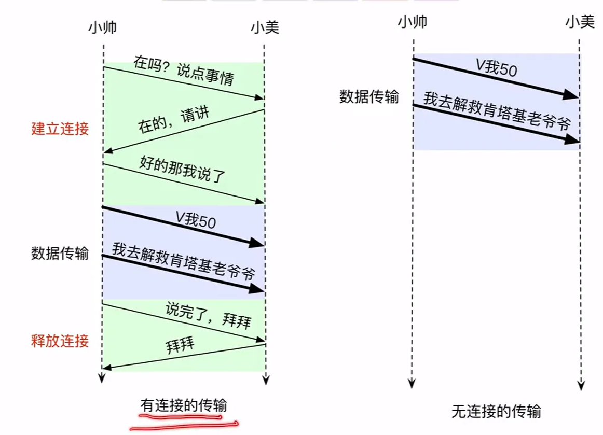

- **面向连接（TCP）**：先“打招呼”（建连）→ 传数据（有编号与确认ACK）→ “再见”（释放）。
- **无连接（UDP）**：**直接发数据**，无建连/无确认。
- **可靠（TCP）**：确认与重传保证**不丢不重不乱（配合序号/ACK）**。
- **不可靠（UDP）**：可能丢失/乱序/出错，**实时性好**、开销小。

---

## 6) 典型应用场景

- **TCP**：文件/网页/邮件/重要业务（对**正确性**敏感）。
- **UDP**：直播、语音/视频通话、DNS 查询等（对**实时性**敏感，偶尔误码/丢包可容忍）。

---

## 7) 可能的考点小题

1. “**传输层实现端到端还是主机到主机？**” → 端到端（进程到进程）。
2. “**为何 TCP/UDP 的端口可以同号？**” → 端口空间**按协议分离**。
3. “**复用与分用的方向**” → 复用：上→下；分用：下→上。
4. “**熟知端口范围**” → 0–1023（记住即可，其他范围以题干或 IANA 约定为准）。
5. “**UDP 出错怎么处理？**” → 丢弃，不通知；TCP 会重传。
6. “**Socket 作用**” → 封装对端地址与端口，便于多次通信调用。

---

## 二、UDP

### UDP 数据报

## 1) 一眼看懂

- **作用**：用 **端口号** 把数据准确送到**目标主机上的目标进程**（端到端/进程到进程）。
    - **位置**：应用报文 → 加 **UDP首部(8B)** → **UDP数据报** → 交给 IP 封装。

---

## 2) UDP vs TCP（高频对比）

- **首部开销**：UDP **8B**（定长）｜TCP **≥20B**（可选项导致更大）。
- **长报文处理**：UDP **不做**拆分/重装（应用自己切分；IP 可能碎片化）；TCP **自动**分段与重组。
- **连接与可靠性**：UDP **无连接、不可靠**（无确认/重传）；TCP **面向连接、可靠**（序号/ACK/重传）。
- **拥塞控制**：UDP **无**；TCP **有**。
- **通信关系**：TCP **一对一**；UDP **一对一/一对多**（**广播/多播** + 目的端口匹配）。

---

## 3) UDP 数据报格式（8 字节首部）


- **源端口**：发送进程端口；**若不期望对方回包可置 0**（IPv4 语境）。
- **目的端口**：必填，指向接收进程端口。
- **长度**：**UDP首部+数据** 的总字节数。
- **校验和**：差错检测（发送端计算，接收端校验；**IPv4 可为 0 表示不校验；IPv6 必须启用**）。

---

## 4) 最大长度与速算

- 字段最大值 **65535** → **理论 UDP 长度 ≤ 65535**。
- 受 IPv4 **Total Length ≤ 65535** 与 **IP首部≥20B** 限制：
    - **UDP 数据报(首部+数据) 实际最大 ≤ 65535−20 = 65515 B**
    - **UDP 负载最大 ≤ 65515−8 = 65507 B**（常考数字）
- **例**：应用报文 96 B → UDP 长度 = **96 + 8 = 104**。

---

## 5) 一对多怎么做（UDP 的“杀手锏”）

- **广播**：目的 IP=**255.255.255.255** 或本网段定向广播，目的端口设为目标服务端口 → **同网段所有主机**的该端口进程都可收到。
- **多播**：目的 IP 在 **224.0.0.0/4**，加入该多播组的主机按端口接收。
- 注意：最终仍由**目的端口**决定哪个进程获得数据。

---

## 6) 收发流程要点


1. 发送进程给出：对端 **IP+端口**，把**完整报文**交给 UDP。
2. UDP 添 8B 首部（源/目的端口、长度、校验和）。
3. 交给 IP 封装并转发。
4. 目的主机 IP 拆封 → 交 UDP → **按目的端口分用**到目标进程。

---

## 7) 易错&易混

- **长度字段包含首部**（不是只含数据）。
- **最大负载 65507B**，不是 65535。
- **校验和置 0 仅在 IPv4 可选**；**IPv6 必须校验**。
- UDP **不保证到达/顺序/不重复**；可靠性需要**应用层**自管（序号、ACK、重传等）。
- 一对多能力来自 **IP 的广播/多播**，不是 UDP 自身魔法。

---

## 8) 小练速答

1. 应用报文 1400B，UDP 长度 = **1408B**；若 IP 首部 20B，则 IP Total Length = **1428B**。
2. 若**不需要回包**，**源端口**可设 **0**（IPv4）。
3. 直播/通话优先选 **UDP**（实时性），网盘/网页优先 **TCP**（可靠性）。

## 三、UDP校驗

# UDP 校驗速讀


- **目的**：用 **16 位一補和（one’s complement sum）** 檢出比特錯誤（端到端）。
- **計算範圍**：
    
    **偽首部 + UDP 首部 + UDP 數據**（必要時補 1 個 0 字節湊偶數）。
    
- **偽首部（12B）**：`源IP(4) | 目的IP(4) | 0x00(1) | 協議=17(1) | UDP長度(2)`
    
    只在計算/驗證時臨時加入，**不隨包發送**。
    
- **UDP 長度**：首部(8B)+數據總長；偽首部中的長度與首部中的一致。
- **步驟（發送端）**
    1. 在 UDP 首部中將校驗和欄位**置 0**。
    2. 把「偽首部、UDP 首部、數據」**按 16 位分組**做**一補加法**（有進位就**回卷**到最低位）。
    3. 將和**逐位取反** ⇒ 得到 16 位校驗和，填回首部。
- **步驟（接收端）**
    1. 重新構造相同偽首部。
    2. 對「偽首部、UDP 首部、數據（含收到的校驗和）」做一補加。
    3. 結果若為 **0xFFFF（全 1）** ⇒ 通過；否則丟棄。

## 與 IP 首部校驗的對比（常考）

- **UDP**：覆蓋**首部+數據**，含**偽首部**，**端到端**檢錯。IPv4 **可為 0 表示未計算**（歷史上可選），**IPv6 必須計算**。
- **IP（IPv4）首部校驗**：只覆蓋**IP 首部**，**逐跳**校驗，每跳都要重算；**無偽首部**。

## 一補加法要點（易丟分）

- 16 位分組；最高位進位要**回卷（end-around carry）**再加到低位。
- 組數為奇數時，最後補一個 **0 字節**再算（只為校驗用途，不進入真正負載）。
- **計算時校驗和欄位置 0**；**驗證時包含收到的校驗和一起相加**，結果應為 0xFFFF。

---

## 迷你例題（手算格式）

已知 3 組 16 位（十六進制）：「0x1357、0x2468、0xFACE」，求校驗和。

1. 一補加：`0x1357 + 0x2468 = 0x37BF`
2. 再加：`0x37BF + 0xFACE = 0x1298D` → 產生進位 1 ⇒ **回卷**：`0x298D + 0x0001 = 0x298E`
3. **取反**：`~0x298E = 0xD671` ⇒ 校驗和 **0xD671**。
    
    驗證時把四組（含 0xD671）一補相加，結果應得 **0xFFFF**。
    

---

## 典型考點速記

- **偽首部欄位順序與值**（特別是 Protocol=17、長度一致）。
- **IPv4 中 UDP 校驗和可為 0（未計算）**；**IPv6 不允許為 0**。
- **回卷與取反順序**、**校驗和欄位置 0 再算**、**奇數長度補 0**。
- **區分**：UDP 校驗 vs IP 首部校驗（覆蓋範圍、是否逐跳、是否有偽首部）。

## 四、TCP

# TCP 总览


- **面向连接**：通信分三阶段——**建立连接（三次握手）→ 数据传输 → 释放连接（四次挥手）**。
- **全双工**：连接建立后，**双方都可同时发送**。
- **面向字节流**：应用层交给 TCP 的是**连续字节序列**；TCP 依据 **MSS** 切成段发送。
- **封装关系**：`应用数据 → TCP 段（首部+数据）→ 作为 IP 数据报的数据部分`。
- **有序交付**：即使 IP 层乱序/丢包，TCP 通过序号/确认等机制在接收端**重排、补全再交付**。
- **MSS（最大段长）**：单个 TCP 段**有效载荷**的上限（不含 TCP 首部）。不要求每段填满，只要**≤ MSS** 即可。

---

## 三次握手（建立连接）

1. **SYN**：客户端 → 服务器（发起连接，请求同步序号）。
2. **SYN+ACK**：服务器 → 客户端（同意并确认）。
3. **ACK**：客户端 → 服务器（最终确认）。

> 作用：双方交换初始序号、确认对方收发能力可用，建立全双工连接。
> 

## 四次挥手（释放连接）

- **2 + 2 模式**：先关闭一侧的发送方向，再关闭另一侧；中间对方仍可单向发送。
    1. **FIN**(A→B) → 2) **ACK**(B→A) —— A→B 通道关闭
    2. **FIN**(B→A) → 4) **ACK**(A→B) —— B→A 通道关闭

> 谁先没有数据，谁先发 FIN；先后顺序不固定。
> 

---

## 面向字节流 & MSS 示例（视频里的图意）

- 设 `MSS=1000B`，应用层两份报文 **Y、Z** 交给 TCP。
- TCP 可能切成 4 个段：
    - 段1：Y[0..999]
    - 段2：Y[1000..1599] + Z[0..399]（跨报文拼接，**体现字节流**）
    - 段3：Z[400..1399]
    - 段4：Z[1400..1799]
- 4 个 TCP 段在 IP 层各成一个 IP 包，**到达可乱序**；接收端 TCP 按序号**重排**再交付应用层。

---

## 与 UDP 的核心对比（易考）

| 特性 | TCP | UDP |
| --- | --- | --- |
| 连接 | **有连接**（三次握手/四次挥手） | 无连接 |
| 传输视图 | **字节流** | **报文**（一报文一包） |
| 可靠性 | 有：序号、ACK、重传、流控、拥塞控制 | 无：尽力而为 |
| 顺序 | 保序 | 不保证 |
| 开销 | 较大 | 较小 |

---

## 必背考点句

- **“TCP 是面向字节流，UDP 面向报文。”**
- **“一次 TCP 连接可连续传多份应用数据，不是每个报文都要重新建连。”**
- **“MSS 限制的是 TCP 有效载荷，不含首部；不要求每段都满载。”**

---

## 速练小题

1. 判断正误：
    
    A. TCP 每发送一条应用层报文都要先三次握手一次。（×）
    
    B. TCP 数据到达接收方网络层可能乱序，但最终交付应用层是有序的。（√）
    
    C. MSS 包含 TCP 首部。（×）
    
2. 简答：为什么四次挥手常写作“2+2”？

> 因为先关闭一侧方向（两报文：FIN/ACK），另一侧仍可发数据；再关闭另一侧方向（两报文：FIN/ACK），合计四次。
> 

---

# TCP 报文段首部一览（20B 固定 + 可变选项 ≤ 40B）


| 字段 | 位数 | 作用与要点（考试高频加粗） |
| --- | --- | --- |
| 源端口 / 目的端口 | 16 / 16 | 进程标识，0–65535。谁发谁是“源”。 |
| **序号 SEQ** | **32** | **标记本段“数据部分第一个字节”的序号**；起始序号**由发送方选**，不一定从 0。 |
| **确认号 ACK（小写）** | **32** | **若 ACK 标志=1，则此值有效，表示“确认到（不含）该序号”，即累计确认。** |
| **数据偏移（首部长度）** | **4** | **单位=4 字节**；首部 20–60B；需要时在末尾**填充**补齐 4B 整数倍。 |
| 保留 | 6 | 置 0。 |
| **标志位** | 6 | **URG / PSH / RST / **ACK** / **SYN** / **FIN**（各 1bit）——下表详解。 |
| **窗口（RCV.WND / rwnd）** | **16** | **接收窗口大小（还能接收多少字节）→ 流量控制核心。** |
| 校验和 | 16 | 需加**伪首部**计算（与 UDP 同法，协议号改为 6，长度为 TCP 长度）。 |
| 紧急指针 | 16 | URG=1 时有效，指示**紧急数据**位置。 |
| 选项（可变） | ≤40B | 常用：**MSS**（最大段长）在**握手 1/2**中协商；还有 WS、SACK 等。 |
| 填充 | — | 把首部补到 4B 整数倍。 |

---

## 六个标志位（谁常考？怎么记？）


| 标志 | 何时为 1 | 记忆与易考结论 |
| --- | --- | --- |
| **ACK（大写）** | 除**握手一**外几乎总为 1 | 表示“确认号字段有效”。题目常把“ACK 段”= 该位为 1。 |
| **SYN** | **握手一、握手二** | 建立连接用；“SYN 段”= 握手报文。 |
| **FIN** | **挥手一、挥手三** | 释放连接用；“FIN 段”= 关闭一侧发送方向。 |
| URG | 携带紧急数据时 | 配合“紧急指针”，少考。 |
| PSH | 期望对方**尽快交付上层/尽快响应** | 交互式应用；少考理解题。 |
| RST | 严重错误/拒绝非法段/强制复位 | 异常场景；识记。 |

> 高频口诀：
> 
> - **SYN**：握手 **1、2**；**FIN**：挥手 **1、3**；**ACK(大写)**：除握手一外**基本都有**。
> - **ACK(小写 32bit)** 是**确认号字段**；**ACK(大写 1bit)** 是“确认号是否有效”的标志——**大小写别混**。

---

## 易混点一次讲清

- **面向字节流**：SEQ 标的是**字节号**；一个段的 SEQ=本段**首字节**序号。
- **累计确认**：确认号=“下一期待字节序号”，表示**此前所有字节均已收齐**。
- **长度如何得？**
    - TCP 段**首部长度**=数据偏移×4B（段内可得）。
    - **总长度/数据长度**不在 TCP 首部里写；由**IP 首部“总长度”− IP 首部长度**得到 TCP 总长，再减 TCP 首部长度得**数据长度**。
- **MSS**：只约束**有效载荷**大小（不含 TCP 首部）；**握手 1/2 的选项里协商**；两端可不相等。
- **伪首部**：TCP/UDP 校验和都用；字段=源 IP、目的 IP、0、协议号(6/17)、TCP/UDP 长度。

---

## 必做小题（10 秒判断）

1. 某段：`SYN=1, ACK=1`。问它是握手几？
    
    → **握手二**（服务器同意并确认）。
    
2. 收到 ACK=**3500**（小写），表示什么？
    
    → **序号 < 3500 的字节都已正确收到**，下一个应发 3500。
    
3. 数据偏移=**7**，TCP 首部长度=?
    
    → **7×4=28B**；需要填充到 4B 整数倍。
    
4. 窗口=**500**，MSS=1000。下一段最多带数据=?
    
    → **500B**（受 rwnd 限制，小于 MSS）。
    
5. 哪些报文一定带 ACK（大写）=0？
    
    → **握手一**。其余一般为 1。
    

---

## 画重点（背就对了）

- **SEQ/ACK（小）/窗口**三大字段 + **ACK/SYN/FIN**三标志 = **命题核心**。
- **数据偏移单位=4B**；**MSS 在握手 1/2 选项协商**；**累计确认**语义。
- **总/数据长度靠 IP 推**（TCP 首部自身不写总长）。

## TCP連線管理

# 三次握手（建立連線）

**角色**

- 客戶端：主動發起連線（握手一）
- 伺服器：被動接受連線（握手二），再由客戶端回覆（握手三）

**標誌位規則**

- `SYN=1`：**只**出現在握手一、握手二
- `ACK=0`：**只**出現在握手一；其餘報文 `ACK=1`（表示確認號有效）
- `FIN` 與此階段無關（之後斷開才用）

**序號/確認號（重點）**

- 握手一：`SYN=1, ACK=0, SEQ = x`（客戶端自選起始序號）
- 握手二：`SYN=1, ACK=1, SEQ = y`（伺服器自選起始序號），`ACKnum = x+1`
- 握手三：`SYN=0, ACK=1, SEQ = x+1`（若不帶資料可不消耗序號），`ACKnum = y+1`
- **特別規定**：握手一、握手二**不帶資料也各自消耗 1 個序號**；握手三**不帶資料可不消耗**。

**是否可帶資料**


- 握手一 / 握手二：不可帶資料
- 握手三：可不帶，也可帶（帶 N 位元組就消耗 N 個序號）

**最短耗時**（RTT=往返時延）

- 客戶端：自發出握手一 → 可開始發數據 ≈ **1×RTT**（收到握手二即能發）
- 伺服器：自握手一發出時刻算起 → 可開始發數據 ≈ **1.5×RTT**（要等握手三再到）

---

# 四次揮手（釋放連線）

**標誌位規則**

- `FIN=1`：**只**出現在揮手一、揮手三
- 其他報文 `FIN=0`；`ACK=1` 依然普遍有效

**語意**

- 揮手一（FIN=1，A→B）：A 不再發送資料；A→B 方向關閉
- 揮手二（ACK，B→A）：確認 A 的 FIN
- 揮手三（FIN=1，B→A）：B 也不再發送資料；B→A 方向關閉
- 揮手四（ACK，A→B）：確認 B 的 FIN，連線完全關閉

---

# 狀態轉換（常見英文字）

**建立階段**

- Client：`CLOSED → SYN-SENT → ESTABLISHED`
- Server：`CLOSED → LISTEN → SYN-RCVD → ESTABLISHED`

**釋放階段**（舉例 A 先關）

- A：`ESTABLISHED → FIN-WAIT-1 → FIN-WAIT-2 → TIME-WAIT → CLOSED`
- B：`ESTABLISHED → CLOSE-WAIT → LAST-ACK → CLOSE`

> 題目常問「收到某報文段後在何狀態？」要把 SYN-SENT、SYN-RCVD、ESTABLISHED、FIN-WAIT、CLOSE-WAIT、LAST-ACK、TIME-WAIT 這些名詞對上圖。
> 

---

# 一題一招（真題型態）

1. **判斷回應報文內容**（如 2011/39）：
    - 抓規則：握手二必有 `SYN=1, ACK=1`，且 `ACKnum = 客戶端 SEQ + 1`；伺服器的 `SEQ` 是它自己的起始序號（值任意，不被題目限制）。
2. **序號/確認號推導**：
    - 記住**誰消耗序號**：握一/握二固定 +1；握三帶資料才按資料長度消耗。
3. **耗時題**：
    - 客戶端能發資料的最早時刻：收到握手二 → **1 RTT**
    - 伺服器能發資料：收到握手三 → **1.5 RTT（從握一發出時算）**

---

# 快速口訣

- **握 1、2 SYN 置一；握 1 ACK 置零。**
- **握 1/2 零資料也 +1 序號；握 3 無資料不 +1。**
- **確 認 號 =「我想要的下一個序號」。**
- **客收二可發、服收三可發**（1 RTT / 1.5 RTT）。

---

# 易混點提醒

- 「ACK 段」= `ACK=1`；「SYN 段」= `SYN=1`；「FIN 段」= `FIN=1`。同一報文可同時是多個（如握手二是 **SYN+ACK**）。
- `SEQ` 是**本端**起始/首位序號；`ACKnum` 是**對端**期望的下一號（具有**累積確認**語意）。
- MSS 通常在**握手一/二**的 **Options** 協商，與首部長度無關。

---

## TCP 連線管理：四次揮手（釋放連線）

# 旗標位與序號規則


- `SYN=1`：只在**握手一、握手二**（建立階段），揮手階段都是 0
- `ACK=1`：除**握手一**外，其餘報文都為 1（表示確認號有效）
- `FIN=1`：只在**揮手一、揮手三**
- **序號消耗**
    - 揮手一、揮手三：**即使不帶資料也各消耗 1 個序號**
    - 揮手二：可帶資料（按實際資料長度消耗序號）
    - 揮手四：**不能帶資料**

# 四次揮手語意（預設：Client 先發 FIN）

1. **揮手一（FIN=1, C→S）**：C 不再發送資料（C→S 方向關閉）；`SEQ = c`
2. **揮手二（ACK, S→C）**：確認 C 的 FIN；`ACKnum = c+1`（可夾帶資料）
3. **揮手三（FIN=1, S→C）**：S 也不再發送資料；`SEQ = s`（不帶資料也要 +1）
4. **揮手四（ACK, C→S）**：確認 S 的 FIN；`ACKnum = s+1`（**不可**夾帶資料）
    
    → 之後連線完全關閉
    

> 若換成 Server 先發 FIN，角色與狀態鏡像對調，步驟一致。
> 

# 狀態轉換（英文名要能對上）


**Client（先發 FIN 範例）**

`ESTABLISHED → FIN-WAIT-1 → FIN-WAIT-2 → TIME-WAIT → CLOSED`

**Server**

`ESTABLISHED → CLOSE-WAIT → LAST-ACK → CLOSED`

# TIME-WAIT 與 MSL

- **MSL**（Maximum Segment Lifetime）＝最長報文段壽命（時間單位，如 800 ms）
- Client 收到揮手三並回 ACK（揮手四）後，進入 **TIME-WAIT**，需等待 **2×MSL** 才能關閉：
    - 用途：確保若揮手四遺失，能重收對方重傳的揮手三並再回 ACK
    - 若 TIME-WAIT 期間**又**收到揮手三，計時器**重置**（再等 2×MSL）

# 最短耗時（記住誰何時可關閉/可發）

假設 **Client 先發 FIN** 且 Server 在收到揮手一時**無待發資料**（最短情況）：

- **Client**：從發出揮手一起算 → 進入 `CLOSED` 需
    
    RTT+2×MSL\boxed{\text{RTT} + 2 \times \text{MSL}}
    
- **Server**：從 Client 發出揮手一起算 → 進入 `CLOSED` 需
    
    1.5×RTT\boxed{1.5 \times \text{RTT}}
    
    解釋：揮手一往返（1×RTT）＋揮手四單程（0.5×RTT）
    

> 變形題心法：改起訖時刻就把路徑上的往返/單程時延相加，再視 TIME-WAIT 是否落在量測窗口加入 2×MSL。
> 

# 典型題型速解

1. **判斷各段旗標/序號/確認號**
    - 揮手一/三 `FIN=1`，二/四 `FIN=0`；所有揮手 `ACK=1`（確認號有效）
    - 揮手一/三不帶資料也要讓對端回 **ACKnum = SEQ+1**
2. **狀態名選擇題**
    - 「收 S 的 FIN 並回 ACK 後，Client 狀態？」→ **TIME-WAIT**
    - 角色對調題要小心（Server 先發 FIN 時，Client 先到 **CLOSE-WAIT**）
3. **耗時題**
    - 看到「進入 CLOSED」且是 Client 端，多半要加 **2×MSL**；Server 端通常不需加 MSL（沒有 TIME-WAIT）

# 易混淆對照

- **MSS**（Max Segment Size，**長度/位元組**）vs. **MSL**（最長壽命，**時間**）
- 握手 vs. 揮手：握手一/二不帶資料也各 +1；揮手一/三同理，但**揮手四不可帶資料**

## TCP可靠傳輸&流量控制

# 總體框架

- **可靠傳輸**：資料要「對、全、按序」到達。
- **流量控制**：別把對端塞爆（靠滑動視窗 `RWND`）。

> 這兩件事都靠雙方互相回饋完成：接收端在 ACK 內帶回 「我已收到到哪」＋「我還能收多少（RWND）」；發送端依此滑動／縮放自己的發送視窗。
> 

# 三個核心欄位（名詞解釋）

- **Seq（逐位元組編號）**：每個位元組都有序號 → 接收端能檢查**遺漏**與**亂序**。
- **ACK 的語義（累積確認）**：`ACK = N` 表示「**N 之前全部收齊，我要 N**」。
    - 例：0–799 已收、800–999 未到，即使先收 1000–1799，仍回 **ACK=800**（不跨缺口）。
- **RWND**：`從 ACK 起我還能收 N 位元組` → 決定發送端**可發送區**長度。

<aside>
💡

# 緩衝區與視窗


- 每個連線兩端各有：
    - **發送緩衝區**：應用程式寫入待傳資料 → TCP 依序組段、重傳管理。
    - **接收緩衝區**：網路收進來先放著 → 交給應用程式 `recv`。
- **發送視窗大小** = `min(對方 RWND, 自身擁塞視窗cwnd)`
    
    （本節聚焦 RWND；擁塞控制在後面章節）
    
- 發送端不可一次超過對方 RWND；接收端讀走資料後會回報**更大的 RWND**（窗口打開）。
</aside>

> 只有這三條，就足以讓發送端靠 ACK 是否前進 來判斷「需不需要重傳」。
> 

# 流量控制：怎麼限制

**告訴對方 RWND**：「從 ACKnum 起我還能收 N 位元組」達到流量控制


- 接收端在每個 ACK(除了握手1) 中附上 **RWND**：「從 ACKnum 起我還能收 N 位元組」。
- 發送端的**可發送區**（發送視窗）從 `ACKnum` 起，長度 ≤ RWND；超出區域必須等待視窗擴大（接收端讀走資料並回報較大的 RWND）。
- **按序交付**：僅當接收緩衝區**前綴連續**時，才拷貝到應用層；可**未滿即交付**以騰出空間。

# 可靠傳輸：怎麼保證

用ACK機制，沒收到會重傳

## 發送端如何讀 ACK

- **ACK 前進** → 左邊「已確認區」擴大、視窗右移；可釋放快取(若數據有序)。
- **ACK 卡住**（長時間停在同一個 N）→ 代表**N 開頭的段缺失**或其 ACK 丟了。

## 接收端 ACK 處理

1. **捎帶確認（Piggyback）**：
    
    接收方剛好也要發送數據時，**不單獨發ACK**，而是把 ACK **夾在自己要發的數據段裡一起送出**。
    
    
    
    - 客端發 2B（608–609）；伺服器同時有 5B 待發→ 回段同時帶**自己的數據**：`Seq=200` 起，且 `ACK=610, RWND=6`。
    - 客端處理：清到 609，SWND 調為 6；同理客端之後也可在回 ACK 時**捎帶**自己的數據。
2. **推遲確認（Delayed ACK）規則**（默認行為）：
    
    接收方**暫緩一小段時間（最多約0.5s）再回ACK**，以便**累積確認更多數據或等有數據可捎帶**，從而減少報文數。
    
    - 收到段先等一小段（≤0.5s），盡量用**一次 ACK 累積確認多個段**，或等到有資料可**捎帶確認**再回。缺點：**丟包偵測慢**，常得等**超時重傳**，會把其實已到達的段也重傳，浪費頻寬。
3. **立即確認（Immediate ACK）**：每收一段就回 ACK；**失序也立刻回相同 ACK**。
    
    ⇒ 快速產生**重複 ACK**線索，啟動**快速重傳（Fast Retransmit）**。
    

## 兩種重傳方式（何時啟動）

- **超時重傳（Timeout, RTO）**
    
    觸發：對應段的計時器到期（或 ACK 遲遲沒越過該段）。
    
    優缺：**保守但慢**；可能把其實已到的段也重傳（浪費頻寬）。
    
    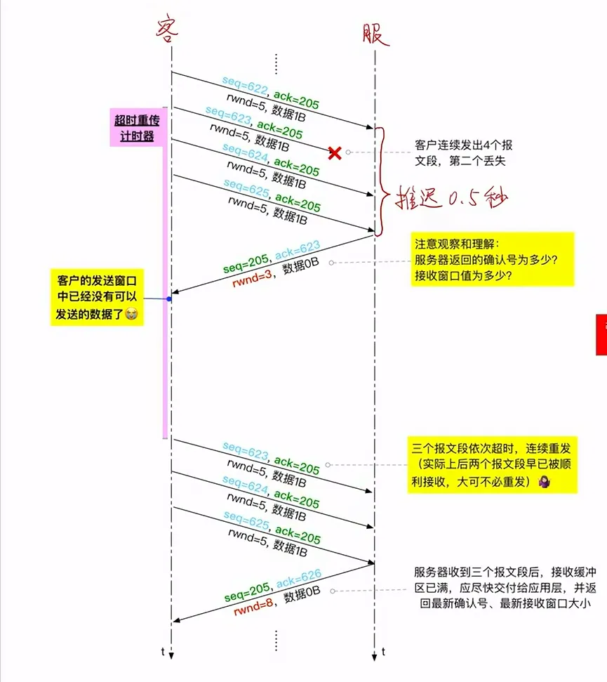
    
    此為推遲確認+超時重傳
    
- **快速重傳（Fast Retransmit）**
    
    前提：**立即確認**＋視窗夠大。
    
    觸發：連收 **3 個相同的 ACK = X**（三個「冗餘 ACK」）。
    
    判定：缺的是「**以 X 開頭**」的那段。
    
    動作：**立刻重傳**該段，不等 RTO。（後續 cwnd 調整屬擁塞控制的「快速恢復」）
    
    
    

> 小結：Delayed ACK ⇒ 常走 Timeout；Immediate ACK ⇒ 能走 Fast Retransmit。
> 
> 
> 這就是「確認機制自然引導出重傳機制」的核心因果。
> 

# 心得口訣

- **ACK 報到、RWND 報量**：
    
    ACK＝「**下一個想收的序號**」，RWND＝「**從這裡起還能收多少**」。
    
- **窗內才敢發**：
    
    發送視窗 `SWND = min(RWND, cwnd)`；**窗外不發，窗內可並行**。
    
- **ACK 會累積**：
    
    收到 0～799 就回 **ACK=800**；**中間缺口不跨越**。
    
- **按序才交付**：
    
    **有序就拋給應用層**（未滿也可交）；亂序先**暫存不交付**。
    
- **捎帶 vs. 推遲**：
    
    **有貨就捎帶**（把 ACK 夾在要傳的資料段裡）；
    
    **沒貨可稍等**（≤0.5s）以累積再回 ACK。
    
- **握手/揮手的 +1 法則**：
    
    **SYN 段要 +1**（握手1、2）；**FIN 段要 +1**（揮手1、3）；
    
    **握手3無資料可不 +1**。
    
- **超時就重傳，三重複就快重傳**：
    
    計時器到期→**超時重傳**；連收 **3 個相同 ACK**→**快速重傳**缺段。
    
- **讀走就長窗**：
    
    接收端應用層一 `recv`，**RWND 變大**；發端視窗跟著**滑動變寬**。
    
- **長段要快回**：
    
    連收 **兩個 MSS** 長度段→**立刻 ACK**（重傳代價大）。
    
- **一句話總結**：
    
    **ACK 推窗，RWND 定寬；三重複立刻傳，延遲 ≤0.5 秒；失序必回重複 ACK。**
    

## 壅塞控制

---

# 0) 兩大目標、兩種控制（別混）

- **流量控制**：端到端，避免把**接收端**塞爆（接收端回報 **RWND**）。
- **擁塞控制**：全網路，避免把**網路**塞爆（發送端維護 **cwnd**）。

> 發送視窗 SWND = min(RWND, cwnd)
> 
> 
> 本章重點在 **cwnd**；RWND 只在題目有提到接收緩衝限制時一併考慮。
> 

---

# 1) 三個欄位回顧（ACK 決定一切）

- **Seq**：逐位元組編號，能看出缺失／亂序。
- **ACK（累積）**：`ACK=N` 表示「**N 之前全到，我要 N**」。
- **RWND**：從 `ACK` 起還能收 N 位元組（流量控制）。

> 之後所有 cwnd 的增減，都是看 ACK 有沒有順利往前推，以及是否發生異常事件（超時或冗餘 ACK）。
> 

---

# 2) 擁塞控制的兩個核心演算法

## (A) 慢開始（Slow Start）

- 初始：`cwnd = 1 MSS`
- 規則：**每收到 1 個 ACK，cwnd += 1 MSS**
    
    ⇒ 約 **每個 RTT 翻倍**（1,2,4,8,…）
    
- 停止條件：當 `cwnd >= ssthresh` → 轉入 **擁塞避免**

## (B) 擁塞避免（Congestion Avoidance）

- 規則：**每個 RTT 約 +1 MSS**
    
    （精確寫法：每個 ACK 增量 `$MSS^2$ / cwnd`，一個 RTT 累積 ≈ +1 MSS）
    

> **ssthresh（慢開始門限）**是分水嶺：
> 
> 
> `cwnd < ssthresh` 用慢開始；`cwnd ≥ ssthresh` 用擁塞避免。
> 

---

# 3) 事件處理（ACK 引導出重傳；事件反過來改 cwnd）

- **超時（Timeout）＝嚴重擁塞**
    
    ⇒ `$ssthresh = cwnd/2$`，`cwnd = 1 MSS`，重新慢開始。
    
- **三個相同 ACK（Fast Retransmit 觸發）＝輕度擁塞**
    
    ⇒ 引出**快速重傳/快恢復**（下節詳談；先記口訣：`ssthresh = cwnd/2`，之後進入快恢復邏輯）。
    

> 因果主線：
> 
> 
> **ACK 正常前進** → 不擁塞 → 照演算法增長。
> 
> **ACK 卡住／超時** → 嚴重擁塞 → 立刻拉回 `cwnd=1`、`ssthresh=半分`。
> 
> **連續重複 ACK** → 輕度擁塞 → 走快速重傳（之後快恢復）。
> 

---

# 4) 常見陷阱

- **單位**：`cwnd=9` 是 **9×MSS**，不是 9KB，除非 `MSS=1KB`。
- **題目默認**：多採**單向傳輸**＋**立即 ACK**（便於觸發快重傳）。
- **忽略傳輸時延**：只看**往返時延 RTT**（題目若特別聲明）。
- **SWND 同時受 RWND、cwnd 約束**：題目給了接收緩衝就一定要算 RWND。

---

# 5) 口訣收尾

**「ACK 推窗，RWND 定寬；慢開始翻倍跑，撞門限改加一；超時半門一重來；三重複快重傳。」**

---

# 0) 兩大目標、兩種控制（別混）

- **流量控制**（端到端）：避免把**接收端**塞爆。接收端用 **RWND** 回報可收容量。
- **擁塞控制**（全網路）：避免把**網路**塞爆。發送端維護 **cwnd**。

---

# 3) 擁塞控制三件套

## (A) 慢開始（Slow Start）

**每收到 ACK，cwnd +1 (MSS)** ⇒ 約 **每個 RTT 翻倍**（1,2,4,8,…）。當`cwnd ≥ ssthresh` 使用**擁塞避免**

- 初始：`cwnd = 1 MSS`。
- 規則：**每收到 1 個 ACK，cwnd += 1 MSS** ⇒ 約 **每個 RTT 翻倍**（1,2,4,8,…）。
- 停止：`cwnd ≥ ssthresh` → 轉 **擁塞避免**。


## (B) 擁塞避免（Congestion Avoidance）

- 規則：**每個 RTT 約 +1 MSS**
    
    （精確：每 ACK 增量 `MSS^2 / cwnd`，一個 RTT 累積 ≈ +1 MSS）。
    

## (C) 事件處理（關鍵考點）

- **超時（Timeout）＝嚴重擁塞**
    
    → `ssthresh = cwnd/2`，`cwnd = 1 MSS`，**重走慢開始**。
    
- **3 個相同 ACK＝輕度擁塞[（Fast Retransmit 觸發）](網路參考模型.md)**
    
    → **快恢復（Fast Recovery）**（採課內口徑，計算簡潔）：
    
    1. 立刻**快速重傳**缺段；
    2. 設 **`ssthresh = cwnd/2` `cwnd = ssthresh`（下限 2 MSS）**；
    3. 直接進入**擁塞避免**（之後每 RTT +1 MSS）。
    
    > 舊版 TCP 會把 cwnd 打回 1；考試以本口徑為準。
    > 
    
    
    

---

# 4) 解題模板（照表推就對）

逐 RTT 列：`時間 | ssthresh | cwnd | RWND(若給) | SWND=min(RWND,cwnd) | 事件/演算法`

- 若本輪**全成功**且 `cwnd < ssthresh` → **cwnd×2**（慢開始）。
- 若本輪**全成功**且 `cwnd ≥ ssthresh` → **cwnd+1**（擁塞避免）。
- 若**超時** → `ssthresh=cwnd/2`、`cwnd=1`。
- 若**3 相同 ACK** → 快重傳；`ssthresh=cwnd/2(≥2)`、`cwnd=ssthresh`，轉擁塞避免。
- 若題目給**接收緩衝**/RWND → 同步算 `SWND`，以 **SWND** 決定可並行在途段數。
- 題目常設：**單向傳輸、立即 ACK、每段=滿載 MSS、忽略傳輸時延只看 RTT**，單位以 **MSS 倍數**。
    
    
    

---

# 5) 常見陷阱

- **單位**：`cwnd=9` 表 **9×MSS**，非 9KB；除非題目明示 `MSS=1KB`。
- **門限下限**：`ssthresh` **不得 < 2 MSS**。
- **SWND 受雙重約束**：`SWND=min(RWND,cwnd)`；別只看 `cwnd`。
- **握手/揮手 +1 規則**（順帶複習）：SYN 段（握手1、2）+1；FIN 段（揮手1、3）+1；握手3 無資料可不 +1。

---

# 6) 口訣總結

**「ACK 推窗，RWND 定寬；慢開始翻倍跑，撞門限改加一；
超時半門一重來；三重複快重傳，門限與窗對半後，直接加一慢慢還。」**

---


# 5️⃣應用層

## 應用層概論

---

# 一、應用層概述（協定定義的四件事）

應用層在傳輸層之上，替應用程式之間「怎麼說話」訂規矩。典型協定要**明確規定**：

1. **報文型別**：請求 / 回應（request / response）
2. **語法**：報文字段有哪些、各字段格式
3. **語意**：每個字段代表什麼意思
4. **時序**：什麼情況/何時送、如何回（互動流程）


> 常見功能與協定：
> 
> - 檔案傳輸：**FTP**
> - 電子郵件：**SMTP**（發）、**POP3/IMAP**（收）
> - Web：**HTTP**
> - 名稱解析：**DNS**
> - 虛擬終端/遠端登入：Telnet/SSH（課本常提「虛擬終端」概念）

---

# 二、兩種應用模型

## 1) 客戶—伺服器（C/S, Client–Server）


- **角色分明**：伺服器提供服務、**長期上線**、**固定 IP/域名**；客戶端**間歇上線**、可用動態 IP。
- **通訊關係**：**客戶端只與伺服器通訊**（客戶彼此不直接連）。
- **優點**：管理簡單、控制集中、易於安全審計。
- **瓶頸/風險**：**帶寬與連線數受伺服器限制**、單點故障（Server 掛了服務全掛）。
- **典例**：Web/HTTP、Email（SMTP/POP3/IMAP）、FTP、傳統聊天室/遊戲大廳。

## 2) 對等網（P2P, Peer-to-Peer）


- **無常駐伺服器**：每個節點同時可**上傳與下載**，地位對等。
- **通訊關係**：**節點彼此可直接通訊**。
- **連線特性**：節點可**隨時上/下線**、IP 常變。
- **優點**：**高可擴展**（人多資源也多）、**健壯**（個別節點故障不致整網掛）。
- **挑戰**：管理/安全較難、NAT 穿透、搜尋定位機制、一致性與版權問題。
- **典例**：BitTorrent/eMule；不少新式系統採**混合式**（如用 Tracker/超級節點發現對等點）。

> 一眼分辨題小抄：
> 
> - 「固定域名/24×7/單點壅塞」→ C/S
> - 「節點皆可提供服務、彼此直連、擴展性佳」→ P2P

---

# 三、易混重點 & 出題套路

- **流量控制 vs 擁塞控制**：本章談「應用模型」，但別混到前章：
    - 流量控制=端到端、靠 **RWND**；擁塞控制=全網路、靠 **cwnd**。
- **DNS 與模型**：DNS 本身採**分散式資料庫**（非簡單單一伺服器），但客戶端查詢行為仍是「向名稱伺服器請求回應」的 **C/S 互動**。
- **判斷題常見**：
    - 「客戶端必須有固定 IP」❌（C/S 下客戶通常可動態 IP）
    - 「P2P 沒有任何伺服器」→ **嚴格意義**下可行，但**實務常見混合式**（有追蹤/引導伺服器）。
    - 「C/S 中客戶彼此直接通訊」❌
- **健壯性比較**：C/S 容易受**伺服器單點**影響；P2P 去中心，**容錯高**。

---

# 四、極簡口訣

- **「定規矩在應用層：型別語法語意時序。」**
- **「C/S 有家可找（固定域名），P2P 大家都忙（彼此直連）。」**
- **「人一多：C/S 看伺服器扛不扛，P2P 人多力也多。」**

---

## DNS

---

# 1) 為何需要 DNS

- 人類記**名字**，機器靠 **IP 位址**。
- **DNS（Domain Name System）把域名 → IP**（正向解析），也可 **IP → 域名**（反向解析，`in-addr.arpa` / `ip6.arpa`）。

---

# 2) 域名結構（從右到左，級別由高到低）


- 例：`www.cskaoyan.com.` ← 最右邊有個**根點 `.`**（常省略）。
- **標號 label**：英數與 ，**每段 ≤ 63 字元**；**整個名稱 ≤ 255 位元組**；**不分大小寫**。
- **TLD**（頂級域）：`com / net / org`（通用 gTLD）、`cn/us/...`（ccTLD）、`arpa`（基礎/反向）。
- **二級域**：可做**類別**（如 `edu.cn`、`com.cn`）或**行政區**（`bj.cn`），或**自行註冊**（如 `cskaoyan.com`）。

---

# 3) 誰來回答（四種「伺服器/角色」）

| 類型 | 作用 | 你要知道的話 |
| --- | --- | --- |
| **根伺服器（Root）** | 知道**每個 TLD** 的名稱伺服器在哪 | 全球 **13 組 IP（A–M）**，透過 **Anycast** 部署很多節點 |
| **TLD 伺服器** | 知道**對應二級域**該找哪個**授權伺服器** | 如 `com` TLD 會指向 `cskaoyan.com` 的 NS |
| **授權伺服器（Authoritative）** | **最終權威回答**某個「區 zone」內的紀錄 | 由域名擁有者/託管商提供 |
| **本地域名伺服器（Local / Resolver）** | **離你最近**，先問它；負責幫你一路查 | **不屬於層級的一層**，但**最常被問**，而且**有快取** |

---

# 4) 怎麼問：遞歸 vs 迭代（考點！）

## 一句話分辨

- **遞歸（靠別人）**：我問你，你**幫我一路問到底**再回來。
- **迭代（靠自己）**：你只告訴我**下一步該問誰**，**我自己**再去問。


## 實務常態

- **主機 → 本地 DNS**：**遞歸**（主機只丟問題，等答覆）。
- **本地 DNS ↔ 其他伺服器**：**多為迭代**（本地 DNS 逐級問 Root → TLD → Authoritative）。

---

# 5) DNS 快取（為什麼有時「第二次更快」）

- **本地 DNS**與**主機**都可快取：儲存「名稱 ↔ IP」與**下一步該問誰（NS）**。
- 依 **TTL** 到期清除；也有**負向快取**（記錄「沒有此名」一段時間），避免重複查詢風暴。
- 先看**主機快取** → 沒有再問**本地 DNS** → 沒有才往上問 Root/TLD/Authoritative。

---

# 6) 常考補充（高頻小點）

- **傳輸埠/協定**：
    - **查詢/回覆多用 UDP/53**（開銷小）；
    - **區域傳送（AXFR）與回覆太大/截斷**會用 **TCP/53**。
- **常見 RR 類型**：`A`（IPv4）、`AAAA`（IPv6）、`CNAME`（別名）、`NS`（名稱伺服器）、`MX`（郵件交換）、`PTR`（反向）、`TXT/SOA` 等。
- **本地 DNS 不是層級的一級**，但**每次解析第一站**幾乎都是它。
- **根伺服器通常不直接給主機 IP**，而是指路到 TLD。

---

# 7) 易錯/易混

- 「域名**分大小寫**」❌ → **不分**。
- 「層級**由左到右**」❌ → **由右到左，右邊級別最高**。
- 「只有 13 台根伺服器」❌ → **13 組 IP，多點 Anycast 節點**。
- 「本地 DNS 屬於層級」❌ → **不屬於**，但負責遞歸與快取。
- 「無法打開網站＝網站掛了」❌ → **可能是 DNS 解析失敗**。

---

# 8) 口訣

**「右高左低看根點；先問本地再迭代；遞歸靠別人、迭代靠自己；快取憑 TTL；大包改走 TCP。」**

---

# 9) 速練兩題（附答）

1. 主機第一次訪問 `y.abc.com`，本地 DNS 無快取。**通常**主機到本地 DNS 用哪種查詢？之後本地 DNS 向上怎麼查？
    
    **答**：主機→本地 DNS **遞歸**；本地 DNS 對 Root/TLD/Authoritative 多採**迭代**逐級查。
    
2. 為何亞洲上網常說「根節點少所以可能慢」？
    
    **答**：根服務用 Anycast 全球多點，**節點密度與距離**影響往返延遲；可用節點少、距離遠時，**首查延遲大**。
    

---

## FTP & TFTP

---

# 1) 兩個協定的定位

| 協定 | 可靠性/傳輸層 | 用途&特性 | 典型埠號 |
| --- | --- | --- | --- |
| **FTP** (File Transfer Protocol) | **TCP**（可靠） | 通用檔案傳輸；**CS 架構**；能上傳/下載、列目錄、改名/刪除等；**控制與資料分離** | 控制連線 **21/TCP**；資料連線 **20/TCP（主動）** 或 **伺服器動態埠>1024（被動）** |
| **TFTP** (Trivial FTP) | **UDP**（需自帶確認重傳） | 極簡、**小程式碼**、**小檔/開機下載**（PXE、路由器韌體），不驗證、無目錄列舉 | **69/UDP**（起始），資料以**固定區塊**＋ACK 停等式傳輸 |

> 一句話：FTP 功能全但複雜（兩條 TCP 連線）；TFTP 超輕量（UDP、小檔案、內建簡易可靠機制）。
> 

---

# 2) FTP 架構與行為（考點集中）

## 2.1 兩條連線（控制/資料分離＝帶外控制）

- **控制連線：** 客戶端 ↔ 伺服器 **21/TCP**，**整個會話期間常駐**，傳**命令/回覆**（USER、PASS、RETR、STOR、LIST、QUIT…）。
- **資料連線：** 僅在**傳一個檔案或一次列表時建立**，傳完即關；每次傳輸**重新建**。


> 對比 HTTP：控制與資料在同一連線（帶內）；FTP 是帶外控制（兩條 TCP）。
> 

## 2.2 主動 vs 被動

### 主動（Active, 預設早期常見）

1. 客戶端從 **N→21/TCP** 建立**控制**；發 **PORT** 命令，告知「**我這邊資料埠與 IP**」。
2. **伺服器從 20/TCP** 主動**連回**客戶端宣告的資料埠，建立**資料連線**。
- **考點：** 伺服器資料來源埠固定 **20**；**易被防火牆/NAT 擋**（因伺服器向客戶端主動連入）。

### 被動（Passive，現代更常用）

1. 客戶端建立控制連線後送 **PASV**。
2. **伺服器回覆一組 IP,Port（>1024）** 並在該埠**被動監聽**。
3. **客戶端** 主動連到該 **伺服器高埠** 建立**資料連線**。
- **考點：** **不再用 20**；資料埠由伺服器回覆指定，**較友善防火牆/NAT**。

> 口訣：主動伺服器來、被動客戶端來；主動用 20，被動用高埠。
> 

## 2.3 登入型態

- **一般帳密**；
- **匿名 FTP**：使用者 **anonymous**（密碼多填 email），取公共檔。

## 2.4 傳輸模式

- **ASCII（文本）** vs **Binary（二進位）**：考題常問**別把可執行檔用 ASCII 傳**。

## 2.5 伺服器程序模型（了解即可）

- 伺服器有**主進程**（聽 21、受理新連線、派工）＋**多個從屬**：
    - **控制進程**：處理命令；
    - **資料進程**：實際搬檔（一次傳輸一個）。

---

# 3) TFTP 一頁通

- **UDP/69** 起手，接著由傳輸雙方改用**臨時 UDP 埠**互傳。
- **封包型式**：`RRQ/WRQ`（讀/寫請求）、`DATA`（預設 512B 區塊）、`ACK`、`ERROR`。
- **可靠性**：靠**區塊號＋ACK＋超時重傳**（停等）。
- **限制**：無驗證、無目錄/改名、通常**小檔**（早期 512B*65535 ≈ 32MB 上限，後續 RFC 可擴充）。
- **典型用途**：網卡/路由器 **無碟開機**、韌體/配置檔分發。

---

# 4) 常見陷阱 & 易考點

- **埠號要分清：** FTP 控制 **21/TCP**；資料 **20/TCP（主動）** / **伺服器高埠（被動）**；TFTP **69/UDP**。
- **兩條連線概念**：控制常駐、資料按次建立（**每個檔案各建一次**）。
- **主動/被動差異**與**防火牆/NAT**行為。
- **FTP 一切明文**（帳密、內容皆可被抓包）→ 安全要用 **FTPS（FTP over TLS）** 或 **SFTP（SSH File Transfer，非 FTP）**（名稱像，但**不同協定**）。
- **ASCII/Binary 模式選錯**導致檔案損壞。
- **TFTP 是 UDP**：所以**協定內建 ACK/重傳**；用途**偏小檔/初始化**，不是通用大檔傳輸。

---

# 5) 速練 6 題（自己答一下）

1. FTP「帶外控制」是指什麼？
2. 主動模式下資料連線的**來源/目的埠**各是什麼？
3. 被動模式下誰主動發起資料連線？連到哪種埠？
4. 為何企業防火牆常建議用被動模式？
5. TFTP 如何在 UDP 上做到可靠？常見封包有哪些？
6. 上傳可執行檔/影像檔，應選哪種傳輸模式？

> 參考快答：
> 
> 1. 控制與資料用**兩條獨立 TCP 連線**；控制不走資料連線（帶外）。
> 2. 伺服器 **20 →** 客戶端宣告的資料埠。
> 3. **客戶端** 主動連到**伺服器回覆的高埠（>1024）**。
> 4. 不需讓伺服器**對內主動連入**；較容易只開一段對外連線範圍。
> 5. **區塊編號＋ACK＋超時重傳**；封包有 **RRQ/WRQ/DATA/ACK/ERROR**。
> 6. **Binary**。

---

# 6) 記憶口訣

- **主動伺服器連你 20，被動你去連它高埠；控制 21 常打開，資料按次建關閉。**
- **FTP 兩線 TCP、TFTP 停等 UDP。**
- **文字 ASCII、檔案 Binary；匿名 anonymous，明文需加密。**

## 電子郵件

---

# 1) 大圖先行：角色與資料流

**三類角色**

- **MUA**（Mail User Agent）＝使用者端/用戶代理（Outlook、Foxmail、Webmail 頁面）。
- **MTA**（Mail Transfer Agent）＝郵件傳遞代理（伺服器↔伺服器，用 **SMTP** 推送）。
- **MDA**（Mail Delivery Agent）＝投遞到信箱（本地 mailbox / Maildir），供 **POP3/IMAP** 取信。

**資料流（典型）**


**Webmail**：使用者↔網站走 **HTTP/HTTPS**，但網站後端仍用 **SMTP/IMAP** 與郵件伺服器互動。

---

# 2) 郵件格式（Envelope ≠ Header）

- **信封（Envelope）**：SMTP 傳輸用的外層地址（`MAIL FROM` / `RCPT TO`）。
- **內容（Message）**：
    - **首部（Header）**：`From:`, `To:`, `Subject:`, `Date:` …（顯示用，可與信封不同；群寄/轉寄常見不一致）。
    - **主體（Body）**：文字 + 附件（靠 **MIME** 表達）。

> 口訣：信封送達、首部顯示。看投遞看信封、看收件人欄看首部。
> 

---

# 3) 協定分工與連線埠

## SMTP（Simple Mail Transfer Protocol）

- **用途**：**推（push）郵件**：MUA→MSA、MTA↔MTA。
- **傳輸**：TCP；**25**（伺服器間）、**587**（提交/Submission，推薦，常需認證+STARTTLS）、**465**（Implicit TLS，歷史但常見）。
- **三階段**：連線→傳送→釋放。
    - 典型命令：`EHLO/HELO` → `MAIL FROM` → `RCPT TO`（可多個）→ `DATA`（內文以 **.** 結束）→ `QUIT`
    - 回覆碼：`2xx` 成功，`3xx` 待續，`4xx` 暫時錯，`5xx` 永久錯。
- **要點**：
    - 原生 **7-bit**；非 ASCII / 二進位靠 **MIME** 或擴充（ESMTP 的 `8BITMIME`）。
    - **ESMTP**（`EHLO`）支援 `SIZE`、`STARTTLS` 等擴充。
    - **投遞≠顯示**：`RCPT TO` 與 `To:` 可能不同（群組、密件副本）。

## MIME（Multipurpose Internet Mail Extensions）

- **效果**：把任意內容封裝成 SMTP 可傳的形態。
- **解決**：非 ASCII 文字、多媒體、附件。
- **關鍵欄位**：
    - `Content-Type`: `text/plain; charset=UTF-8`、`multipart/mixed`/`alternative`/`related`…
    - `Content-Transfer-Encoding`: **base64**（二進位/附件）、**quoted-printable**（含重音/中文）。
    - `boundary` 用於 multipart 分段。

## POP3（Post Office Protocol v3）

- **用途**：**拉（pull）郵件**到單一用戶端。
- **埠**：TCP **110**，TLS 版 **995**。
- **常見流程**：`USER`/`PASS` → `STAT`/`LIST` → `RETR`/`DELE` → `QUIT`
- **模式**：下載後**刪**或**保留伺服器**（設定項）。
- **特性**：簡單、適合單機；伺服器端狀態/資料夾管理弱。

## IMAP（Internet Message Access Protocol）

- **用途**：伺服器端儲存/同步，支援多裝置。
- **埠**：TCP **143**，TLS 版 **993**。
- **優勢**：伺服器端資料夾、標記（已讀/旗標）、**部分抓取**（先標頭、後附件）、多客戶端並發（`IDLE` 即時通知）。

---

# 4) 端口與安全一覽（背表）

| 功能 | 預設埠 | 加密埠 | 備註 |
| --- | --- | --- | --- |
| SMTP（轉送） | **25/TCP** | 25+STARTTLS | MTA↔MTA |
| SMTP Submission | **587/TCP** | 587+STARTTLS | MUA→MSA，建議用 |
| SMTPS（歷史） | — | **465/TCP** | Implicit TLS，仍常見 |
| POP3 | **110/TCP** | **995/TCP** | 取信 |
| IMAP | **143/TCP** | **993/TCP** | 取信/同步 |
| TIPS | — | — | **優先 TLS（STARTTLS/SSL）**，避免明文帳密 |

# 6) 易錯點 / 出題愛考

---

- **SMTP 是「推」；POP3/IMAP 是「拉」**（使用者取信）。
- **Envelope vs Header**：真正投遞看 `RCPT TO`；收件匣顯示看 `To:`。`Bcc:` 不出現在內容首部。
- **MIME 才能帶附件/中文**（`Content-Type`、`Content-Transfer-Encoding=base64/QP`）。
- **Webmail 用 HTTP 介面**；伺服器間仍是 SMTP，APP/手機多用 IMAP 同步。
- **安全**：避免用純 25/110/143 明文登入；用 **587+STARTTLS / 993 / 995 / 465**。
- **DATA 結束符**：**CRLF.CRLF**；別忘了「點透明化」規則（內容行首的 `.` 需轉義）。
- **大小限制**：MTA 常設 `SIZE` 上限；base64 膨脹約 **~33%**。

---

# 7) 口訣收尾

- **「信封送、首部顯；SMTP 推，POP/IMAP 撿；MIME 轉碼帶附件；587 提交要加密。」**

---

# 8) 速練 6 題

1. 為何需要 MIME？常見兩個欄位是？
2. 說出 SMTP 三個關鍵命令與結束標記。
3. POP3 與 IMAP 的核心差別？
4. MUA 應該用哪個埠提交郵件？為何不建議用 25？
5. Webmail 兩端分別用什麼協定？
6. `To:` 與 `RCPT TO` 有何不同？哪個決定實際投遞？

## HTTP

---

## 1) WWW 三件套（各司其职）

- **URL**：定位资源的“地址”（唯一标识 *哪儿*）。
    
    形如：`协议://主机[:端口]/路径?查询#片段`
    
- **HTTP**：浏览器↔服务器*如何*请求/传回资源的规则（应用层协议）。
- **HTML**：页面内容的标记语言（资源内容*长什么样*）。

> 口诀：URL 定位、HTTP 传、HTML 展示。
> 

---

## 2) URL 速记

- 例：`http://www.pku.edu.cn:80/index.html`
    - 协议：`http`（或 `https` / `ftp` …）
    - 主机：`www.pku.edu.cn`（也可写 IP）
    - 端口：可省略（HTTP=80，HTTPS=443）
    - 路径/查询：服务器上资源位置与参数

---

## 3) 浏览一个页面的典型 8 步

1. 用户输入 URL / 点击超链接
2. 浏览器**解析 URL**
3. **DNS 解析**域名→服务器 IP
4. 与服务器**建立 TCP 连接**（三次握手，HTTP/80 或 HTTPS/443）
5. 浏览器发送 **HTTP 请求报文**
6. 服务器返回 **HTTP 响应报文**（含文档/资源）
7. 关闭连接或保持（见下节）
8. 浏览器**渲染**；遇到图片/脚本/音频等**再发起后续请求**

---

## 4) HTTP 的两个“无”

- **无状态**：服务器不记得上一次请求是谁发的
    
    → 需要 **Cookie/会话** 在客户端/服务端*补状态*。
    
- **（应用层）无连接**：协议本身不维护会话通道；**运输层用 TCP**，由 TCP 保证可靠传输。

---

# ✅ **1) Cookie（瀏覽器端的小字串）**


### ✔ **存放位置**

- 永遠存在 **使用者瀏覽器**（每網域/路徑隔離）。
- 每次發送請求時，若 **符合** `Domain` / `Path` / `SameSite` 規則，就會自動附在：
    
    `Cookie: key=value`
    

### ✔ **生命週期**

- **Session cookie**（預設）：
    - 欠缺 `Expires` / `Max-Age` → 多數瀏覽器在**關閉後刪除**。
- **Persistent cookie**：
    - 有 `Expires` / `Max-Age` → 到期或手動清除才消失。

### ✔ **常見用途**

- **登入狀態（常只放 Session ID）**
- UI 偏好設定（語系、主題）
    
    -（逐漸淘汰）第三方追蹤
    

### ✔ **限制**

- 單顆 ≤ **4KB**
- 每網域約 **20～50 顆**
- **每次請求都會帶上**（流量成本）

### ✔ **安全配置（必考）**

- `Secure`：只在 HTTPS 傳送
- `HttpOnly`：JS 不能讀（防 XSS 偷 cookie）
- `SameSite=Lax/Strict`：防 CSRF
- `Path=/`：覆蓋整站
- `__Host-*` 前綴（更安全）
- ❗ **不要把敏感資料明文放 cookie**

### ✔ **常見錯誤**

- `Domain` 設太寬 → 子域之間互相污染
- 忘記設 `HttpOnly/SameSite` → XSS/CSRF 破洞
- 把大量 UI 資料塞 cookie

---

# ✅ **2) Session（伺服器端的會話狀態）**

### ✔ **存放位置**

- 真正的 session 資料存在 **伺服器端**：
    - 記憶體
    - Redis / Memcached
    - 資料庫
    - 或 **加密後放 cookie（cookie-based session）**
- 瀏覽器端只存 **Session ID**（通常透過 cookie 自動帶回）。

### ✔ **生命週期**

- **Idle timeout**：若 30 分鐘沒操作 → 失效
- **Absolute timeout**：例如最多活 24 小時
- **Sliding**：活躍即續期
- 登出 = 清空 Session＋清除 SID Cookie

### ✔ **用途**

- 身分驗證後的狀態（登入）
- 使用者資料、購物車
- 權限資訊

### ✔ **Session 與 Cookie 的關係（必懂）**

- Cookie 裡通常只放一個：
    
    👉 **SID = Session ID**
    
- Session 本體放在 **伺服器的 Session Store**

### ✔ **優缺點**

| 優點 | 缺點 |
| --- | --- |
| 可集中管理、可撤銷 | 多機部署需共享 Session Store |
| 權限變更立即生效 | 若 SID 洩漏會被盜用 |
| 比 JWT 更容易強制失效 | 需設計 sticky session 或 Redis |

### ✔ **安全重點**

- SID 要有 **高熵（不可猜）**
- 全站 HTTPS
- Cookie 設 `HttpOnly / Secure / SameSite`
- **登入後重新生成 SID（防 Session Fixation）**

---

# ✅ **3) Web Cache / Proxy（瀏覽器快取＋中繼快取：節省 RTT/流量）**


### ✔ **存放位置**

- **瀏覽器快取（private cache）**
- **代理/共享快取（企業代理、Forward Proxy）**
- **CDN / 反向代理（邊緣節點）**

命中 → 不到源站

未命中 → 到源站抓，並存回快取

---

### ✔ **生命週期（新鮮度 + 驗證）**

### 🔹 直接使用（新鮮度）

- `Cache-Control: max-age=<秒>`
- `s-maxage=<秒>`（代理用）
- `Expires: <時間>`
- `immutable`（Firefox）表示永不改變

### 🔹 驗證後使用

- `ETag` ＋ `If-None-Match`
- `Last-Modified` ＋ `If-Modified-Since`
    
    → 命中則回 **304 Not Modified**
    

### 🔹 不允許快取（必考）

- `Cache-Control: no-store` → **完全不能存**
- `no-cache` → 可存但**使用前必驗證**
- `private` → 只有瀏覽器可存、代理不可存

---

### ✔ **典型用途**

- 靜態檔案（CSS/JS/Image）
- API 若適當控制快取頭也可加速

---

### ✔ **HTTPS 與快取（大重點）**

- CDN/反向代理會在邊緣**終止 TLS**，才能快取內容
- Forward proxy + HTTPS → 用 `CONNECT`，僅建立隧道，**無法快取**

---

### ✔ **常考點**

- 可快取方法：**`GET`、`HEAD`**
- 常被快取的狀態碼：`200/203/204/206/301/308/404/410`
- `Vary` 會影響快取鍵，例如：
    
    `Vary: Accept-Encoding`
    

---

# 🎉 **改好後的三大技術總表（可直接貼筆記）**

| 項目 | 存放位置 | 何時送出 | 誰決定壽命 | 主要用途 | 風險/關鍵設定 |
| --- | --- | --- | --- | --- | --- |
| **Cookie** | 使用者瀏覽器 | 符合 Domain/Path/SameSite 時自動帶上 | `Expires/Max-Age` 或使用者清除 | SID、偏好、追蹤 | `Secure`/`HttpOnly`/`SameSite`、容量小、每請求都帶 |
| **Session** | 伺服器端（Redis/DB/Mem） | 帶上 SID 時由伺服器取回 | Idle/Absolute/Sliding、登出 | 登入狀態、購物車、權限 | SID 高熵；HTTPS；SID 重生；Session 共享 |
| **Web Cache** | 瀏覽器/代理/CDN | 命中直接回 | `max-age`、驗證頭 | 加速、節省頻寬 | `no-store`、`no-cache`、`s-maxage`、`Vary`、ETag |

---

## 5) 连接管理：非持久 vs 持久（流水线）


| 模式 | 做法 | 时延特点 | 说明 |
| --- | --- | --- | --- |
| **非持久** | 每个对象**新建**一次 TCP | 约 **2×RTT + 传输时延/对象** | 简单但开销大 |
| **持久（非流水线）** | 一条 TCP 上**顺序**收发多个请求/响应 | 每个对象 ≈ **1×RTT** | 常见的 keep-alive |
| **持久（流水线）** | 一条 TCP 上**连续**发多个请求 | 多对象合并占 **≈1×RTT** | 理论好，但因队头阻塞实际使用少；HTTP/2 用多路复用替代 |

> 关键首部：Connection: keep-alive / close
> 

---

## 7) 方法 & 状态码

**常见方法**

- `GET`（取资源）｜`HEAD`（只要首部）｜`POST`（提交表单/上传）
- `PUT`（整体更新/创建）｜`DELETE`｜`OPTIONS`｜`TRACE`

**状态码家族**

- **1xx** 信息：处理中
- **2xx** 成功：**200 OK**｜201 Created
- **3xx** 重定向：**301/308** 永久｜**302/303/307** 临时（配 `Location`）
- **4xx** 客户端错：**400** 请求错误｜**401** 未认证｜**403** 禁止｜**404** 未找到
- **5xx** 服务器错：**500** 内部错误｜**502** 网关错误｜**503** 暂不可用

---

## 8) 易错点 / 考点提醒

- **“HTTP 无状态”≠“不能做会话”**：依靠 Cookie/服务端会话即可。
- **Host 首部**：HTTP/1.1 必须带（虚拟主机共用同一 IP 的依据）。
- **持久连接与流水线**别混；流水线并不等于并发下载（HTTP/2 才是并发多路）。
- **URL 大小写**：协议/主机不区分大小写，路径*通常*区分（视服务器/文件系统而定）。
- **重定向真正跳转地址**在 `Location` 首部，不在状态行。
- **HTTPS** = HTTP + TLS（端口 **443**），仍走 TCP。

---

## 9) 口诀收尾

- **“URL 定位，HTTP 传；无状态靠 Cookie 牵；非持久两个 RTT，keep-alive 省握手；报文 CRLF，Host 必带不遗漏。”**

---

## 10) 速练 6 题

1. 说出**非持久**与**持久**连接在 RTT 开销上的差异。
2. HTTP 为什么被称为**无状态**？通常如何“记住用户”？
3. 写出一个最小 **GET** 请求需要哪些关键行/首部？
4. 浏览器收到 **302** 应该看哪个首部来继续访问？
5. 请求和响应中的**空行**有什么含义？
6. 说明 `GET` 与 `POST` 的典型使用差别（幂等/语义/缓存等）。

### HTTPS

---

# HTTPS (HyperText Transfer Protocol Secure)

## 1. 基本定義

- **全名：** HyperText Transfer Protocol Secure
- **本質：** **HTTPS = HTTP + TLS/SSL**
    - 它不是一個全新的協定，而是將標準的 HTTP 協定疊加在 **TLS/SSL** (安全傳輸層) 之上。
- **通訊埠 (Port)：** 預設使用 **443** (HTTP 預設為 80)。
- **目的：** 解決 HTTP 明文傳輸的不安全性，提供網站身分驗證。

---

## 2. 三大安全目標 (CIA Triad 應用)

HTTPS 透過密碼學技術，滿足資安的三大要素：

1. **機密性 (Confidentiality) - 防竊聽**
    - **機制：** 資料在傳輸過程中是亂碼。
    - **技術：** 對稱式加密 (如 AES)。
2. **完整性 (Integrity) - 防竄改**
    - **機制：** 若封包在傳送途中被駭客修改，接收端會發現雜湊值 (Hash) 不符。
    - **技術：** 雜湊演算法 (SHA-256) 與 MAC (訊息鑑別碼)。
3. **身分驗證 (Authentication) - 防冒充**
    - **機制：** 確保使用者連到的真的是 Google，而不是釣魚網站。
    - **技術：** 數位憑證 (Digital Certificate) 與 PKI。
    - *註：HTTPS 支援雙向驗證 (Mutual Authentication)，但通常只驗證伺服器端。*

---

## 3. 核心加密技術 (混合使用)

HTTPS 為了兼顧「安全性」與「速度」，同時使用了兩種加密方式：

| **類型** | **名稱** | **特性** | **在 HTTPS 中的用途** | **演算法範例** |
| --- | --- | --- | --- | --- |
| **非對稱式** | 公鑰加密 (Asymmetric) | 安全但慢 | 用於 **握手階段 (Handshake)**。
用來安全地傳送「會話金鑰」。 | RSA, ECC |
| **對稱式** | 私鑰加密 (Symmetric) | 快速但需共享金鑰 | 用於 **傳輸階段 (Data Transfer)**。
大量網頁資料傳輸使用此方式。 | AES, ChaCha20 |

---

## 4. 數位憑證 (Digital Certificate) 結構

這是考題重點。憑證由 CA (Certificate Authority) 發放。

一張憑證 (Certificate) 就像網站的身分證，包含兩大區塊：

### A. 明文資料包 (TBSCertificate)

- **Subject (主體)：** 網址 (Common Name, e.g., [www.google.com](https://www.google.com/))、公司名稱。
- **Issuer (發發者)：** 哪個 CA 發的 (e.g., DigiCert)。
- **Validity (效期)：** 起始日與到期日。
- **★ Subject Public Key Info：** **申請者 (Server) 的公鑰**。

### B. 數位簽章 (Digital Signature)

- **來源：** CA 用 **CA 的私鑰** 對「明文資料包的 Hash」進行加密。
- **用途：** 讓瀏覽器驗證這張憑證是否被竄改。

---

## 5. HTTPS 運作流程：TLS 握手 (Handshake)

這是從「Client 連線」到「鎖頭出現」的詳細步驟。

### **Step 1: Client Hello (打招呼)**

- **Client (瀏覽器)** 告訴 Server：
    - 我支援的 TLS 版本 (如 TLS 1.3)。
    - 我支援的加密演算法列表 (Cipher Suites)。
    - 產生一個隨機數 (Client Random)。

### **Step 2: Server Hello (給憑證)**

- **Server** 回覆：
    - 決定使用的加密演算法。
    - 產生一個隨機數 (Server Random)。
    - **傳送 Server 的數位憑證 (Certificate)**。

### **Step 3: 驗證憑證 (Verification) ★考題熱區**

- **Client** 收到憑證後，進行「比對遊戲」：
    1. **解密：** 用內建的 **CA 公鑰** 解開憑證上的「數位簽章」，得到 **Hash A**。
    2. **計算：** 用 SHA 演算法計算收到「資料包」的雜湊，得到 **Hash B**。
    3. **比對：** 若 `Hash A == Hash B` 且網址正確、未過期 $\rightarrow$ **認證成功**。
    - *此時 Client 確認憑證內的 **Server Public Key** 是真的。*

### **Step 4: 金鑰交換 (Key Exchange)**

- **Client** 產生一個新的隨機字串，稱為 **Pre-Master Secret**。
- **加密：** Client 用剛剛驗證過的 **Server Public Key** 將這個 Secret 鎖起來。
- **傳送：** 傳給 Server。

### **Step 5: 產生會話金鑰 (Session Key)**

- **Server** 收到後，用自己的 **Server Private Key** 解開，拿到 Pre-Master Secret。
- 現在 Client 和 Server 手上都有相同的原料 (Client Random + Server Random + Pre-Master Secret)。
- 雙方各自運算，生成同一把 **會話金鑰 (Session Key)**。

### **Step 6: 加密通訊 (Encrypted Session)**

- 握手結束。
- 之後所有的 HTTP 請求與回應 (HTML, 圖片, 密碼...)，全部改用 **會話金鑰** 進行 **AES 對稱式加密** 傳輸。

---

## 6. 考試易混淆觀念釐清 (必背)

### Q1: 加密與簽章的方向？

- **機密傳輸 (保密)：** 用對方的 **公鑰加密** $\rightarrow$ 對方用 **私鑰解密**。
    - *口訣：公鑰是用來鎖東西給別人看的。*
- **數位簽章 (認證)：** 用自己的 **私鑰加密** (簽署) $\rightarrow$ 對方用 **公鑰解密** (驗證)。
    - *口訣：私鑰是用來蓋章證明是我發的。*

### Q2: 為什麼不全程用 RSA (非對稱) 加密就好？

- **答案：** 太慢了。非對稱加密的運算非常消耗 CPU 資源。
- **解法：** 只在剛開始 (握手) 用非對稱加密來傳送鑰匙，後面傳輸大檔案都用對稱式加密 (AES)。

### Q3: Forward Proxy vs. Reverse Proxy (考題第 13 題延伸)

- **Forward Proxy (正向代理)：** 代表 Client 出去要資料 (如：VPN、公司網管)。**隱藏 Client 身分**。
- **Reverse Proxy (反向代理)：** 代表 Server 接收資料 (如：Load Balancer, Cloudflare)。**隱藏 Server 身分**，常與 HTTPS 卸載 (SSL Termination) 搭配使用。