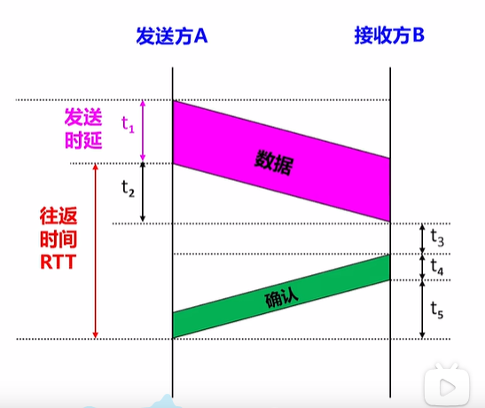

# 計算機網路的概念

上次編輯時間: 2025年8月19日 下午7:33
建立時間: 2025年7月21日 下午10:42

### **計算機網路（Computer Network）**

- **定義**：由若干**結點（node）**與連接這些結點的**鏈路（link）**組成。
    - 結點可以是：計算機、集線器、交換機、路由器等。
- **主要功能**：
    - ✅ 數據通信（信息傳遞）
    - ✅ 資源共享
    - ✅分佈式處理
    - ✅提高可靠性
    - ✅負載均衡
    
    ---
    
    **互連網（Internet，小寫 i）**
    
    - 多個計算機網路透過**路由器**互連而成。
    - 可使用**任意通信協議**。
    
    ---
    
    **互聯網（Internet，大寫 I）**
    
    - 世界上**最大規模的互連網**。
    - 又稱「**因特網**」。
    - 由各大 **ISP（Internet Service Provider）** 和國際機構共同構建。
    - 使用 **TCP/IP 協議族** 為通信規則。

---

### 📡 三種交換技術

---

**一、電路交換（Circuit Switching）**

🔗 **概念**：

- 在通訊前，先建立一條**固定的物理連接通路**（如電話網路）。
- 整個通訊過程中，通路**專屬保留**，不與他人共享。

📌 **特點**：

- ✔️ 連線穩定、延遲低
- ❌ 資源浪費（即使不傳資料也占用通道）
- ❌ 建立連線需花時間

📘 **例子**：

- 傳統電話系統

---

**二、報文交換（Message Switching）**

🔗 **概念**：

- 整個報文（message）**整體轉發**。
- 每個節點接收整個報文後**儲存 → 轉發**（store-and-forward）。

📌 **特點**：

- ✔️ 不需專用連線、資源利用率高
- ❌ 延遲大（需等整份報文接收完才可轉發）
- ❌ 報文過大時占用記憶體空間

📘 **例子**：

- 舊式電報系統

---

**三、分組交換（Packet Switching）**

🔗 **概念**：

- 將報文分成**多個小分組（packet）**，每個分組**獨立傳送**。
- 各分組可經由不同路徑送達，接收端再**重組**。

📌 **特點**：

- ✔️ 傳輸效率高、資源共享性好
- ✔️ 適合**突發性資料傳輸**
- ❌ 分組順序可能不同 → 需重組
- ❌ 每個分組需帶有額外標頭（header）

📘 **例子**：

- 網際網路（Internet）

---

📊 三者對比總表：

| 比較項目 | 電路交換 | 報文交換 | 分組交換 |
| --- | --- | --- | --- |
| 完成傳輸所需時間 | 最少（排除建立/釋放連接耗時） | 最多 | 較少 |
| 存儲轉發時延 | 無 | 較高 | 較低 |
| 通信前是否需要建立連接 | 是 | 否 | 否 |
| 緩存開銷 | 無 | 高 | 低 |
| 是否支持差錯控制 | 不支持 | 支持 | 支持 |
| 報文數據有序到達 | 是 | 是 | 否 |
| 是否需要額外控制信息 | 否 | 是 | 是（控制信息佔比最大） |
| 線路分配靈活性 | 不靈活 | 靈活 | 非常靈活 |
| 線路利用率 | 低 | 高 | 非常高 |

---

### **🧠計算機網路分類**

---

🔹 一、按**分佈範圍**（依覆蓋區域大小）

| 分類 | 範圍 | 代表例子 |
| --- | --- | --- |
| PAN（個人網路） | 幾公尺內 | 藍牙耳機、手機熱點 |
| LAN（區域網） | 小於數公里 | 家用網路、學校、公司內部 |
| MAN（城域網） | 整個城市 | 有線電視網路、城域光纖 |
| WAN（廣域網） | 跨城市或全球 | Internet（網際網路） |

---

🔹 二、按**傳輸技術**

| 分類 | 說明 |
| --- | --- |
| 廣播式網路 | 所有主機共享一條通信媒介（如總線）→ 使用地址識別訊息接收方 |
| 點對點網路 | 通訊雙方一對一傳輸，每對主機之間有獨立鏈路 |

---

🔹 三、按**拓撲結構**（物理或邏輯連接方式）

| 結構類型 | 特點簡述 |
| --- | --- |
| 星狀拓撲 | 中心節點集中管理，如交換機 |
| 環形拓撲 | 每節點形成封閉環，按順序傳遞 |
| 匯流排拓撲 | 所有節點共用一條主幹線，靠地址識別 |
| 網狀拓撲 | 每節點多通道連接，可靠性高但成本大 |
| 樹狀拓撲 | 多層級階層架構，常見於大型組織網路結構 |

---

### 📊 **計算機網路性能指標**

---

🔹 **速率（Rate）**

- 表示節點在通訊通道上傳輸資料的**速度**，又稱：
    - **資料率（Data Rate）**
    - **比特率（Bit Rate）**
    - **資料傳輸速率**
- 📏 **單位**：`bit/s`、`b/s`、`bps`
    
    ⚠️ **注意：`B/s` 表示 Byte per second（1 Byte = 8 bits）**
    

---

🔹 **帶寬（Bandwidth）**

- 表示通道在單位時間內**所能傳送的最大速率**（理論最大值）
- 常用於數位網路中表示最大傳輸能力

> ⚠️ 在模擬信號中，「帶寬」也可能指頻率範圍
> 

---

🔹 **吞吐量（Throughput）**

- 實際單位時間內**通過某一網路節點的資料量**
- 實測值，**通常小於帶寬**
- 受限於：網路擁塞、協議效率、設備處理能力等

---

🔹 **時延（Delay）**

資料從發出端到接收端所需的時間，包含以下 **四種延遲**：

| 類型 | 說明 | 公式 / 特點 |
| --- | --- | --- |
| **傳送時延** | 發送端將封包「推入媒介」所需時間 | $dtrans=LRd_{trans} = \frac{L}{R}$   `L：封包長度（bit） R：傳輸速率（bps）` |
| **傳播時延** | 封包在信道中「實際傳播」的時間 | $dprop=dvd_{prop} = \frac{d}{v}$    `d：媒介長度（m） v：訊號傳播速度（約光速）` |
| **排隊時延** | 封包在路由器排隊等待轉發的時間（依網路負載變動） | 無固定公式，擁塞越嚴重越高 |
| **處理時延** | 路由器接收封包後的處理時間（查找路由表等） | 一般很短，可忽略 |

📌 **總時延公式**：

**⚠️每經過一個信道就會多一次[傳送/發送時延+傳播時延]**

$$
總時延{總時延} = d_{trans} + d_{prop} + d_{queue} + d_{proc}
$$

<aside>
💡

**時延帶寬積**

**時延帶寬積=傳播時延（s）×通道帶寬（bps）**

意義與用途：

- 表示：**通道中可「容納」多少資料正在傳送**
- 就像「水管長度 × 流速 = 同時存在管中的水量」
- 在設計**高效能協議（如 TCP）**時，要考慮「通道填滿」問題
</aside>

---

🔹 **往返時間（RTT）**

一個資料來回一趟所需的總時間（雙向時延）

✅ 計算公式：

RTT=t2+t3+t4+t5

| 符號 | 含義 | 備註 |
| --- | --- | --- |
| **t₂** | 資料單向的**傳播時延** | 網路中行進時間 |
| **t₃** | 接收端收到資料後的**處理時延** | 解析與準備確認 |
| **t₄** | 確認訊息的**發送時延** | 封包發送耗時 |
| **t₅** | 確認訊息的**傳播時延**（通常 ≈ t₂） | 回傳行進時間 |
| **t₁** | 資料的**發送時延**（❌ 不計入 RTT） | 所以不包含在內 |

---

 

🔹 信道利用率（Channel Utilization）

---

✅ 一、定義：

👉 **信道利用率**是指資料傳輸過程中，信道真正被用來傳送「有效資料」的比例。

$\text{利用率} = \frac{\text{有效傳輸時間}}{\text{總時間}}$

---

### 🧱 計算機網路分層結構

---

✅ 一、為什麼要分層？

- 降低複雜性：每層只專注自身功能
- 易於實現與維護：每層可**獨立設計與修改**
- 有助於**標準化通訊協定**

---

✅ 二、常見兩種模型

| 模型 | 層數 | 名稱 |
| --- | --- | --- |
| **OSI模型** | 7層 | 應用層、表示層、會話層、傳輸層、網路層、資料鏈路層、物理層 |
| **TCP/IP模型** | 4層 / 5層 | 應用層、傳輸層、網路層、資料鏈路層、物理層（實作上常採5層） |

---

✅ 三、五層協議模型（實際最常考）

| 層級 | 功能簡述 | 對應設備／協定 |
| --- | --- | --- |
| **應用層** | 為使用者提供應用服務（HTTP、FTP、DNS…） | 應用程式、瀏覽器 |
| **傳輸層** | 負責端對端通訊，提供可靠或不可靠傳輸 | TCP、UDP |
| **網路層** | 負責選路與邏輯尋址（將資料包送到目標主機） | IP、路由器 |
| **資料鏈路層** | 將資料封裝成「幀」，處理MAC地址與錯誤檢測 | 乙太網協定、交換機 |
| **物理層** | 傳送「0與1」的比特流，規範電氣訊號與物理連接方式 | 線材、網路卡、集線器（Hub）等硬體 |

---

✅ 四、封裝與解封裝流程（由上往下／由下往上）

📦 傳送端封裝：應用資料 → 加頭（TCP）→ 加頭（IP）→ 加頭（幀）→ 0/1 傳送

📨 接收端解封裝：收到比特流 → 解幀 → 解IP頭 → 解TCP頭 → 還原資料

---