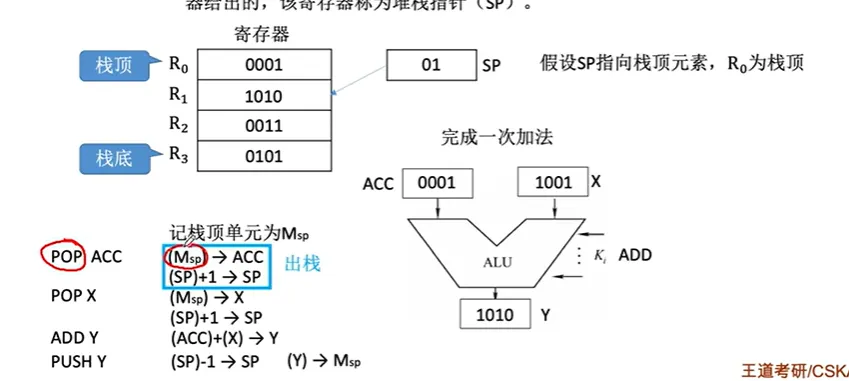

# CPU控制器

上次編輯時間: 2025年9月15日 下午4:49
建立時間: 2025年8月26日 下午3:37


## 一、CPU 功能結構

- **指令控制**：自动完成“取—译—执”，维持程序顺序（PC 自动形成下一条地址）。
- **操作控制**：发出控制/微操作信号，驱动寄存器、ALU、存储器与 I/O 动作。
- **时间控制**：用节拍/时序信号规定微操作先后。
- **数据加工**：ALU 做算术/逻辑/移位等运算。
- **中断处理**：每条指令后检查中断/异常；保存现场→转入中断服务程序→返回。

# 运算器（ALU）组成与要点

- **ALU**：核心计算单元。
- **通用寄存器组**（R0/R1/… 或 x86 的 AX/BX/CX/DX 等，含 **SP** 栈指针）。
- **暂存/锁存寄存器**：给 ALU 输入/输出“缓冲”，消除总线竞争；常可带**移位**或**累加**功能（ACC）。
- **PSW/标志寄存器**：记录 ZF/SF/CF/OF 等状态；影响条件转移与后续微操作。
- **计数器**：配合乘除等多步运算计次。

# 控制器（CU）组成与工作流

1. **PC** 给出下一条指令地址（PC+1 可由 CU 或经 ALU 完成）。
2. 经**地址总线**访问主存，取到指令 → **IR（指令寄存器）**。
3. **操作码 → 译码器**；**地址码/寻址方式 → 形成有效地址（EA）**。
4. **微操作发生器**：据“指令类型 + PSW 标志 + 时序”产生控制信号序列。
5. **执行末尾检查中断/异常**：外设中断（如鼠标/键盘）与内部异常（如除零）。

# 数据通路两种设计（核心对比）

**1) 专用数据通路**

- 每对部件用独立连线；常配 **MUX** 或 **三态门** 选通来源。
- ✅ 高性能、无总线冲突；❌ 线多、结构复杂、成本高。

**2) CPU 内部单总线**

- 各寄存器/ALU 通过一条**内部总线**交换数据；用 `R0_out`/`R2_in` 等信号控制三态门选通。
- 需增加**暂存寄存器**（ALU 端口/输出锁存）避免同一时刻多源驱动与竞态。
- ✅ 结构简单易实现；❌ 同时只能一路驱动，易有冲突，性能略低。

# 典型寄存器与信号（常考）

- **MAR**（存储器地址寄存器）：**只输入**（`MAR_in`），无到内部总线的输出。
- **MDR**（数据寄存器）：区分内部/外部方向
    - `MDR_inE`/`MDR_outE`：与**外部数据总线**交换（E=External）；
    - `MDR_in`/`MDR_out`：与**CPU 内部总线**交换。
- **PC、PSW、ACC、通用寄存器、SP**：**用户可见**（可被指令读写/影响）。
- **IR、MAR、MDR、各类暂存/移位/计数器**：**对用户不可见**（对程序透明）。

# 微操作示例（内存读到 R0）

1. `ADIR_out → MAR_in`（把 IR 的地址码送入 MAR）
2. `MemRead`，主存把数据经**外部数据总线**送入 `MDR_inE`
3. `MDR_out → R0_in`（MDR 经**内部总线**写入 R0）

# 易错点速记

- **内部总线**：CPU 内部部件共享；**外部总线**：CPU 与主存/I-O 共享。
- **单总线**一次只能**一源**驱动；冲突用三态门/MUX + 暂存寄存器化解。
- **PSW**不仅能读（条件转移要用），也会被比较/算术指令改写。
- **中断检查时机**：现代机通常在每条指令结束后统一检查。

## 二、指令執行過程

# 一、三层时间单位

- **时钟周期 / T 周期**：CPU 最小时间单位；主频 f 表示每秒 T 周期数。
- **机器周期（CPU 周期）**：完成一个“子任务”的时间（由若干 T 周期组成）。
- **指令周期**：完成一条指令的全部时间（由若干机器周期组成）。

> 不同指令、不同子任务用的 T 周期可不同 ⇒ 机器周期、指令周期不定长很常见。
> 

# 二、四个阶段 & 一热编码触发器

阶段：**`取指(Fetch)**、**间址(Indirect)**、**执行(Execute)**、**中断(Interrupt)**`。

用 4 个触发器（如 F₁/F₂/F₃/F₄ 的一热编码）标示“当前处于哪个阶段”。

# 三、各阶段的数据流


## 1) 取指周期（访存读“指令”+ PC 自增）


（地址走**地址总线**，数据走**数据总线**，读/写意图走**控制总线**）

## 2) 间址周期（把“形式地址”变“有效地址 EA”）


## 3) 执行周期（因指令而异）

- 可能继续访存（取操作数/写回结果）
- 也可能只做寄存器-ALU 内部操作
    
    （本节不细化，后续按指令类型分解）
    

## 4) 中断周期（保存断点→跳到 ISR）

```
SP ← SP - 1            // 栈向低地址生长
MAR ← SP               // 选定栈顶地址
MDR ← PC               // 准备要保存的断点
MemWrite               // 写PC到栈顶
PC ← 中断向量地址      // 跳到中断处理程序入口

```

> 处理完 ISR，再把栈中断点恢复到 PC，回到原程序继续执行（通常在“每条指令结束”处统一检查中断）。
> 

# 四、举例理解“周期可变”

- **NOP**：只有取指（1 个机器周期）。
- **ADD**：取指 + 执行（2 个机器周期），执行较短。
- **MUL**：取指 + 执行（执行更长，因为多次加/移位）。
- **间接寻址指令**：取指 + **间址** + 执行（3 个机器周期）。

# 五、三种“连续执行多条指令”的方案

1. **单指令周期**
    - 统一把**所有指令周期**拉到等于“最慢指令”的长度；串行执行；控制简单；**低效**（快指令被迫空等）。
2. **多指令周期**
    - 每条指令按**自身需要**用不同步数；仍然串行；总体更高效；控制电路更复杂。
3. **流水线**
    - 每个时钟周期**启动一条新指令**，多条指令**并行、分阶段**推进；提高部件利用率与吞吐量（细节与冒险处理在后续专题）。

# 六、易混与易错点

- “访存慢、译码快”：取到 IR 后的译码基本是**内部逻辑**，时间相对短。
- 间址周期的本质：**再访存一次**，把 IR 里的“形式地址”换成**有效地址 EA**。
- 中断周期的核心：**保存断点（PC）**→ 改 PC 为向量地址；（题目若扩展，还可能涉及保存 PSW，但本节核心是 PC）。

# 七、模板

- **取指模板**：`PC→MAR; 读; M[MAR]→MDR→IR; PC←PC+"1"`
- **间址模板**：`IR.AD(or MDR.AD)→MAR; 读; M[MAR]→MDR(EA); (EA→MAR 或 回填IR)`
- **中断模板**：`SP←SP-1; MAR←SP; MDR←PC; 写; PC←向量`

### 2.1指令(**Instruction**)

**1) 核心概念摘要**

- **指令(Instruction)**＝**操作碼(OpCode)**＋**地址碼(Address/Operand specifier)**，CPU 可執行的最小單位；所有指令的集合為 **指令集(ISA)**。
    
    
    

- 重要關聯：
    - **操作碼**決定「做什麼」與譯碼複雜度。
    - **地址碼**決定「對誰做」與**可尋址範圍。**
    - **指令字長**影響**取指次數**與指令密度；可分**定長**與**變長**。
    - **操作碼長度**可**定長**或**可變長(擴展操作碼)**。
    - **PC（程式計數器）:** 保存下一條指令位址；分支/呼叫/返回/Trap 皆會改寫 PC。

> **可尋址範圍**（單一地址碼位寬 `n`）：`$2^n$`。
> 

> **最大指令種類數**（定長 OpCode＝`k`）：`$2^k$`。
> 

> **單條指令總訪存 ≈** `取指` + `讀操作數次數` + `寫回次數`（見表）。
> 

---

**2) 依地址碼數量分類（＋訪存次數）**

> 一次訪存＝一次主存讀或寫（含取指）。實際次數與硬體/快取無關的理論估算。
> 

| 類型 | 典型語意（結果存放） | 訪存次數 | 常見用途 / 特性 |
| --- | --- | --- | --- |
| **0 地址** | 操作數隱含於棧頂/次棧頂；或無操作數（`HALT`,`NOP`,`CLI`） | ≈1 | 堆疊機、控制類指令 |
| **1 地址**（原地） | `M[A1] ← op(M[A1])` | **3**（取指、讀 A1、寫回 A1） | 單元運算：`INC/DEC/NOT/補碼` |
| **1 地址**（ACC） | `ACC ← op(ACC, M[A1])` | **2**（取指、讀 A1） | 另一操作數隱含於 **ACC** |
| **2 地址** | `M[A1] ← op(M[A1], M[A2])` | **4**（取指、讀 A1、讀 A2、寫 A1） | 常見二元算術/邏輯 |
| **3 地址** | `M[A3] ← op(M[A1], M[A2])` | **4**（取指、讀 A1、讀 A2、寫 A3） | 目的地獨立、不覆寫來源 |
| **4 地址** | 同三地址＋**A4 指明下一條位址**（`PC ← A4`） | **4**（改 PC 不額外訪存） | 把分支/跳轉融合於指令 |

**四地址指令（A4 決定下一條）**

取指→讀 A1→讀 A2→寫 A3


> 考點：在固定指令字長下，地址碼越多 ⇒ 分給每個地址的位數越少 ⇒ 單一地址可尋址範圍變小（但整條指令可同時指稱更多操作數）。
> 

---

**3) 依指令字長分類**

- **定長指令字**：取指/譯碼簡單、管線友善；指令密度可能偏低。
- **變長指令字**：密度高更靈活；取指對齊與譯碼控制較複雜。
    
    **例**：機器字長＝存儲字長＝16 bit；取一條**雙字長(32 bit)** 指令需 **2 次**取指訪存。
    
- **取指成本近似**：`取指訪存次數 = ceil(指令字長 / 存儲字長)`。

---

**4) 依操作碼長度分類**

- **定長操作碼**：若 `OpCode = n bit` ⇒ 最多 **`$2^n$`** 條指令；譯碼簡單。
- **可變長操作碼（擴展操作碼）**：以前綴/層級方式，**常用短、冷門長**；靈活但控制器更複雜。

---

5) 依操作類型分類

1. **資料傳送**：Load/Store、暫存器 ↔ 主存。
2. **運算**：算術（加減乘除）、邏輯（AND/OR/NOT/XOR）、**移位**（算術/邏輯/循環）。
3. **程序控制**：無/有條件轉移、呼叫/返回、Trap/中斷（本質＝**改寫 PC**）。
4. **輸入/輸出**：CPU 暫存器 ↔ I/O 埠/控制暫存器（I/O 章詳述）。

---

### 2.2擴展操作碼（Extended OpCode）

**1) 核心概念**

**設計動機**：在有限指令字長下，同時容納多種地址格式與**較多的指令種類**，且把**高頻指令配短碼**以加速譯碼（類似哈夫曼思維）。

- **定長指令字 + 可變長操作碼**：指令**總長度固定**（例：16 位），但 **OpCode 長度可變**；藉由**前綴碼(prefix-free)分層，讓不同地址數(0/1/2/3)的指令擁有不同長度的 OpCode**。
- **兩大約束**
    1. **短碼不得是長碼的前綴**（prefix-free），避免譯碼歧義。
    2. **不同指令之操作碼不得重複**。

---

**擴展操作碼（16 位；每地址 4 位**

---

> **統一寫法：[OpCode][A1][A2][A3]，每個 Ai 皆 4 位。**
> 


3 地址（15 條）

- 需 12 位做地址 → **剩 4 位 OpCode**。
- **可用範圍**：`0000 ~ 1110`（**15** 條），**`1111` 保留**作下一層擴展。
- 形狀：`oooo A1 A2 A3`（`oooo∈0000..1110`）

2 地址（12 條）

- 以 **`1111`** 作為二地址前綴 → `1111 + Op4 + A1 + A2`。
- **可用範圍**：`Op4 ∈ 0000..1011`（**12** 條），**`1100..1111` 保留**（4 個擴展碼）-最高為都是1的保留。
- 形狀：`1111 oooo A1 A2`（`oooo∈0000..1011`）

1 地址（62 條）

- 承接上層保留 **4** 個 → 可擴 **`4 × 2^4 = 64`**，取其 **62**。
- **等價總前綴**：前 **6 位皆為 1**（因 `1111 1100/1101/1110/1111` 皆以 `111111` 開頭）。
- **可用範圍**：`op6 ∈ 000000..111101`（**62** 種），**`111110、111111` 保留**。
- 形狀：`111111 oooooo A1`（`oooooo∈000000..111101`）

0 地址（32 條）

- 承接上一層保留 **2** 個 → **`2 × 2^4 = 32`**，剛好滿足。
- **等價總前綴**：前 **11 位皆為 1**；第 12 位為 `X`（對應兩個保留碼）。
- **可用範圍**：最後 **5 位**全取 `00000..11111`（**32** 種）。
- 形狀（便於背誦）：
    - **表達式**：`1111 1111 111X XXXX`
    - 含義：前 11 位 = 1、接著 1 位二擇 (`X`)、再 4 位細分。

---

| 類別 | 位型（空白僅為閱讀） | 可用 Op 範圍 | 條數 | 保留給下一層 |
| --- | --- | --- | --- | --- |
| 3 地址 | `oooo  A1   A2   A3` | `oooo=0000..1110` | 15 | `1111` |
| 2 地址 | `1111  oooo A1   A2` | `oooo=0000..1011` | 12 | `1100..1111`（4） |
| 1 地址 | `111111 oooooo A1` | `oooooo=000000..111101` | 62 | `111110,111111`（2） |
| 0 地址 | `1111111111 1X XXXX` *≈* `1111 1111 111X XXXX` | 全 32 種 | 32 | — |

> 註：上表把「多個保留碼」收斂成共同前綴來記，背法更穩。
> 

---

**CPU 譯碼流程**

1. **看前 4 位**：≠`1111` ⇒ **3 地址**；=`1111` ⇒ 下探。
2. **看中間 4 位**：`0000..1011` ⇒ **2 地址**；`1100..1111` ⇒ 下探。
3. **看接著 6 位**：`000000..111101` ⇒ **1 地址**；`111110/111111` ⇒ 下探。
4. **最後 4 位** ⇒ **0 地址**細分。

---

### 2.3指令尋址

**1) 核心概念**

- **目的**：決定「**下一條**要執行的指令」在主存中的位址。由 **PC（Program Counter）** 指出。
- **關鍵點**：PC **指向下一條**指令，不是當前指令。每次「取指」後 PC 會自動更新；若遇到**轉移類指令**（JUMP/CALL/RET/Trap），PC 會被**覆寫**為目標位址。

---

**2) 順序尋址（Sequential Addressing）**

> 取完當前指令後，PC 依「指令長度」與「存儲編制」遞增。
> 

**總規則（統一寫法）**

- 設：
    - `AddrUnit`＝主存**可編址單位**（**按字節**：1B；**按字**：1 個存儲字 = W Bytes）。
    - `IL`＝指令總長度（Bytes）。
- 則順序更新：`PC ← PC + ceil(IL / AddrUnit)`（以**編址單位**計數）。

**四種常見情形**

| 存儲編制 | 指令字長 | PC 的增量（順序） | 說明 |
| --- | --- | --- | --- |
| **按字編制** | **定長**，且 = 1 個存儲字 | `+1` | 最簡情形 |
| **按字節編制** | **定長**，例：每條 = 2B | `+2` | 每條指令佔兩個位址 |
| **按字編制** | **變長**，例：佔 `k` 個字 | `+k` | 先取首字判長度，再補取其餘 |
| **按字節編制** | **變長**，例：佔 `n` B | `+n` | 同上；PC 於取指階段末加 `n` |

> 變長指令的取指流程：先取首字（含 OpCode），由譯碼得到總長度 → 再補取剩餘字節/字 → 取指結束時做 PC ← PC + IL(以編址單位計)。
> 

---

**3) 跳躍尋址（Jump / Control-Transfer）**

- 由**程序控制類**指令直接改寫 PC（無條件/有條件轉移、CALL/RET、Trap…）。
- 典型執行序（定長、按字編制）：
    1. 取指 → 暫令 `PC ← PC + 1`（先指向**順序**下一條）。
    2. 譯碼得知為 `JUMP target` → **覆寫** `PC ← target`。
    3. 下次取指即從 `target` 位置開始。

---

### 2.4數據尋址

---

**基本觀念**

- **目標**：把指令中的**形式地址 `A`** 依指定規則映射為主存的**有效地址 `EA`**，以取得**操作數**。
- **做法**：指令含**尋址方式欄位**（例如 4 bit → 最多 16 種），告訴硬體「該怎麼解讀 `A`」。
- 記號：`A`＝形式地址，`EA`＝有效地址（真實可用地址）。

---

**六種基本尋址（公式 × 特性）**

**① 直接（Direct）**

- **公式**：`EA = A`
- **優**：簡單；執行期通常**1 次訪存**（取操作數）。
- **劣**：受 `A` 位寬限制 → **尋址範圍小**；資料搬家需改指令 → **可重定位性差**。

**② 記憶體間接（Memory Indirect）**

- **公式**：`EA = (A)`；多級：`EA = ((...(A)...))`
- **優**：指標可放在記憶體、位寬可大 → **擴大可尋址空間**；支援鏈結結構。
- **劣**：每多 1 級多 1 次訪存 → **最慢**。

**③ 寄存器（Register）**

- **公式**：操作數在 `Ri`（暫存器）內，**不需 EA**。
- **優**：**最快**（執行期 0 次訪存）；`A` 只需幾個 bit 編號暫存器 → 指令短。
- **劣**：暫存器少、成本高 → **容量有限**。

**④ 寄存器間接（Register Indirect）**

- **公式**：`EA = (Ri)`（`Ri` 內存主存地址）
- **優**：**1 次訪存**取操作數；比「記憶體間接」快（因指標在暫存器，不必先讀指標）。
- **劣**：仍受暫存器數量、一次訪存延遲限制。

**⑤ 隱含／隱式（Implicit / Implied）**

- **公式**：位址**不顯式給出**，由慣例隱含（如 `ACC`、棧頂、旗標暫存器）。
- **優**：**指令最短**（無 `A`）；常見於 0/1-地址指令集。
- **劣**：**彈性差**（操作數位置被固定）。

**⑥ 立即（Immediate）**

- **公式**：`A` **就是常數值**（多以 `#` 標示，如 `#5`）
- **優**：**最快**（操作數在指令中，執行期 0 次訪存）。
- **劣**：受位寬／補碼範圍限制；僅適用常數。

---

**偏移尋址三兄弟（同構式：`EA = 基址 + 偏移`）**

> 三者計 EA 後再讀操作數，執行期一般 1 次訪存（不含取指）。
> 

**1) 基址（Base）**

- **公式**：`EA = BR + A`
- **BR 來源**：專用 **`BR`** 或由**通用暫存器代任**（指令需編號，位寬 ≈ `⌈log2(N_regs)⌉`）。
- **權限**：**面向作業系統**（OS 設／改 `BR` 指向**程式起始裝入位址**；一般程式不可隨意改）。
- **用途**：**程式重定位／浮動（跨主存位置）**；`BR` 位寬可大 → **擴大尋址範圍**。
- **易混**：這裡的「浮動」＝**整個程式在主存的位置變**。

**2) 變址（Indexed）**

- **公式**：`EA = A + IX`（**`A` 當基底**、**`IX` 當偏移**）
- **特性**：**面向使用者**，可用指令調整 `IX`（迴圈的 `i++`）。
- **用途**：**陣列/向量巡訪、迴圈**（`A` 設為首址，改 `IX` 逐一走訪）。
- **與基址差異**：變址管**資料走訪**的偏移；基址管**裝入位址**的偏移。
- **可複合**：常與基址合用 → `EA = BR + A + IX`。

**3) 相對（PC-relative）**

- **公式**：`EA = PC_after_fetch + A`
    - **關鍵**：相對的是**「下一條指令位址」**，因 CPU **取指後 PC 已自增**。
    - `A` **可正可負**（補碼）→ **前/後跳**皆可。
- **用途**：**分支/條件轉移**；讓一段程式碼在**同一程式內移動**仍能正確跳轉。
- **對比基址的「浮動」**：相對＝**片段在程式內移動**；基址＝**整個程式在主存移動**。

---

**堆疊（Stack）尋址**

- **概念**：操作數位址**隱含在 `SP`（Stack Pointer）** 指到的**棧頂**。
- **實作**
    - **硬堆疊**（一串暫存器）：`push/pop` 執行期 **0 次訪存**（取指除外）；快、貴。
    - **軟堆疊**（記憶體區塊）：`push` 1 次寫、`pop` 1 次讀；慢、便宜；實務主流。
- **方向與時序（常考）**
    
    以**堆疊向下成長**（棧頂在較小位址）為例：
    
    - `push x`：`SP ← SP - 1`；`M[SP] ← x`（**先移 SP 再寫**）
    - `pop → x`：`x ← M[SP]`；`SP ← SP + 1`（**先讀再移 SP**）
        
        若向上成長，`+1/−1` 互換。
        
- **用途**：函式呼叫/返回（返回位址、保存暫存器、區域變數）、遞迴、表達式求值、異常/中斷現場保存。
- **陷阱**
    1. 以為 `EA` 永遠等於舊 `SP`：**push 是 pre-decrement**，**pop 是 post-increment**（或相反視成長方向）。
    2. 別把堆疊尋址與「基址/變址/相對」混：堆疊是**隱含位址模式**，通常**沒有 `A` 欄位**。
    3. 訪存次數：硬堆疊 `push/pop` 0 次；軟堆疊各 1 次（寫/讀）。

**微例（向下成長）**：將棧頂兩數相加並壓回



1. `POP → ACC`；`SP ← SP+1`
2. `POP → X`；`SP ← SP+1`
3. `Y ← ACC + X`
4. `SP ← SP−1`；`M[SP] ← Y`（`PUSH Y`）

---

**複合尋址思維**

把每一種模式視為 `f: A → EA` 的**映射函數**；複合＝**函數合成**。

常見：`EA = BR + A + IX`（先定位段/模組，再在段內偏移）。

---

**快速選型口訣**

- **多程式並發／需重定位** → **基址**（OS 改 `BR` ⇒ 程式可「搬家」）
- **陣列／迴圈巡訪** → **變址**（程式改 `IX` ⇒ 「在房間裡走路」）
- **分支跳轉／片段可移** → **相對**（相對**下一條**！）

---

**易錯整理**

- **PC-relative**：相對**取指後的 PC**，不是當前指令位址。
- **基址 vs 變址角色**：
    - 基址：`EA = BR + A`（`BR`=基，`A`=偏）；**OS 管**。
    - 變址：`EA = A + IX`（`A`=基，`IX`=偏）；**使用者程式可改**。
- **通用暫存器代任 BR/IX**：別忘了**編號欄位位寬 = ⌈$log₂(N_regs)$⌉**。

---

## 三、數據通路**与控制信号**

- **数据通路（datapath）**：数据在**功能部件间**传送的路径。确定“从哪来→经过谁→到哪去”。
- **控制信号**：由 **CU（控制器）** 每个时钟周期发出一组微操作信号：
    - `Rout`：寄存器把值**驱动到内部总线**（输出门打开）
    - `Rin`：寄存器**从内部总线锁存**数据（输入门打开）
    - `MEMR / MEMW`：主存读/写控制（经**控制总线**）
    - 常见寄存器：`PC, IR, MAR, MDR, ACC, Y, Z`

### **3.1单总线数据通路**

# 核心概念

- **数据通路（datapath）**：数据在**功能部件间**传送的路径。确定“从哪来→经过谁→到哪去”。
- **三类数据流动**
    1. **寄存器 ↔ 寄存器**
    2. **寄存器 ↔ 主存**（经 MAR/MDR）
    3. **寄存器 ↔ ALU**（经暂存寄存器 Y/Z）
- **控制信号**：由 **CU（控制器）** 每个时钟周期发出一组微操作信号：
    - `Rout`：寄存器把值**驱动到内部总线**（输出门打开）
    - `Rin`：寄存器**从内部总线锁存**数据（输入门打开）
    - `MEMR / MEMW`：主存读/写控制（经**控制总线**）
    - 常见寄存器：`PC, IR, MAR, MDR, ACC, Y, Z`
- **内部总线 vs 系统总线**
    - 内部总线：CPU 内部各寄存器/ALU 间的数据通路。
    - 系统总线：CPU 与主存/IO 之间的数据通路。
- **单总线限制**：同一时刻**只允许一对**部件在总线上传送；ALU 需**同时两个操作数** ⇒ 需配合**Y/Z 暂存**。
    - 多总线/专用通路：硬件成本↑，但可并行多组传送，ALU 可不依赖 Y。

---

# 模板：三类数据流的基本写法

## 1) 寄存器 → 寄存器

把 `PC` 送入 `MAR`：

```
T1: PCout, MARin

```

> 思路：谁出→谁入；写清时序与有效信号。
> 

## 2) 主存 ↔ 寄存器（取一条指令示例）

取指：`[PC] → MAR → (MEM) → MDR → IR`

```
T1: PCout, MARin
T2: MEMR, MDRin(E)  ⟵ 外部数据总线写入 MDR（考试常写 MDRin）
T3: MDRout, IRin
（PC ← PC+1 同步进行/单独一拍，题目若未给控制细节可只标“PC+1”）

```

> 备注：严格区分 MDR 从外部总线锁存 与 从内部总线锁存 的控制；很多教材与试题把它合并写成 MDRin，按题干口径作答。
> 

## 3) 寄存器 ↔ ALU（以“ACC ← ACC + M[[addr]]”为例）

思路：**先取内存操作数→Y**，再用 **ACC→ALU**，结果经 **Z→ACC**。

```
(地址码) → MAR：   IRout(or MDRout), MARin
读操作数：         MEMR, MDRin(E)
MDR → Y：          MDRout, Yin
ACC → ALU：        ACCout, ALUin   ; CU 发出 “ADD” 控制
ALU → Z：          （内部连线，ALU 完成后 Z 锁存）
Z → ACC：          Zout, ACCin

```

---

# 典型综合题套路（单总线）

## 指令范例：`(R0) ← (R0) + (R1)`（R0 为**寄存器间接寻址**）

> 结果写回 R0 指向的主存单元。
> 

### ① 取指周期（各指令通用）

```
T1: PCout, MARin
T2: MEMR, MDRin(E)
T3: MDRout, IRin
    （PC ← PC+1）

```

### ② 间址/建址周期（按本题口径：直接把 (R0) 指向的**操作数**读入）

```
T4: R0out, MARin
T5: MEMR, MDRin(E), MARout
T6: MDRout, Yin          ; 把 (R0) 的操作数暂存到 Y

```

### ③ 执行周期（加法并写回 (R0)）

```
T7: R1out, ALUin, ALU=ADD   ; 与 Y 同时作为 ALU 两输入
    （运算结果 → Z）
T8: Zout, MDRin             ; 结果准备写内存
T9: MARout, MEMW            ; 写回到 (R0) 指向的单元

```

> 小心：写回目标是 (R0) 指向的主存，不是寄存器 R0 本身。若题图未显式给出 “MAR→地址总线” 的门控信号，按题干简化写 MARout/MEMR|MEMW 即可。
> 

---

# 出题关注点 & 易错提醒

- **必须写**：每一步的**有效控制信号**；只写“PC→MAR”不给信号，易失分。
- **MDRin(E) 与 MDRin**：理论上区分“外部/内部总线输入”，但**按题目口径**书写。
- **单总线冲突**：同拍内**只能**有一个 `Rout` 驱动总线、一个 `Rin` 接收。
- **ALU 两输入**：单总线下必须用 **Y/Z**；多总线/专用通路题目可直接双源输入。
- **PC+1 位置**：可与取指并行或单独一拍——看题图是否给出专门加法器与信号；无细节就标注“PC←PC+1”。
- **术语对齐**：内部总线≈CPU 内；系统总线≈CPU↔存储/IO。
- **答题风格**：分拍列出**微操作序列**＋**信号**，必要时在每拍后简注“数据从 X 到 Y”。

---

# 一句话记忆

> 谁出谁入写信号（Rout→Rin），读写内存记 MEMR/MEMW，单总线遇到 ALU 先进 Y 后回 ACC。
> 

### **3.2专用数据通路控制信号**

---

# 核心差异：单总线 vs 专用通路

- **单总线**：同一时刻**一对**源/宿在总线上传数据；并行度低；硬件省。
- **专用数据通路**：需要互联的两部件**直接拉一根线**（或多路复用到同一输入端）；**可并行多路传送**；硬件多、成本高，但**执行更快**。
- 为了把“多个输入接到一个寄存器”，常见两法：
    1. *多路选择器（MUX）**选一路；
    2. 每条输入前接**三态门**，CU只使能其中之一。

---

# 控制信号的含义

- 图上标的 **C0、C1、…** 就是**通路开关**：该位有效 ⇒ 所指连线可传数据。
- 主存读/写仍靠 **MEMR / MEMW**（控制总线）。
- 其他约定保持不变：`PC, IR, MAR, MDR, ACC, ALU` 等寄存器/部件名称与职责不变。

---

# 取指周期（专用通路范式）


以图中编号信号举例：

```
1) C0：PC → MAR                      （给出指令地址）
2) C1：MAR → 地址总线               （把地址送主存）
3) MEMR：主存读                      （CU发读命令）
4) C2：主存 → MDR                   （数据总线进 MDR）
5) C3：MDR → IR                     （指令装入 IR）
6) PC ← PC + 1                      （取指后自增）
7) C4：IR.OP → CU(译码)             （若题目未给此线，可省）

```

> 重点：每步写清“谁到谁 + 哪根线（哪位 Cx）+ 是否 MEMR/MEMW”。
> 

---

# 算术/逻辑类（专用通路的并行优势）

场景：执行 `ACC ← ACC + M[addr]`

```
a) IR.addr(or MDR.addr) → MAR      （地址到 MAR）
b) MEMR, 主存 → MDR                （把操作数取到 MDR）
c) 并行输入 ALU：ACC → ALU、MDR → ALU
d) CU 下达 “ADD” 控制；ALU → ACC  （题图若无Z寄存器，结果可直返 ACC）

```

> 与单总线不同：这里无需先把一个操作数暂存到 Y，因为两路是两条独立通路，能同时喂给 ALU。
> 

---

# 典型题型与解题套路

## 1) 识别寄存器（A/B/C/D 是谁？）

- 看**功能与连线方向**：
    - 有 **+1**/自增且连到地址路径者 ⇒ **PC**。
    - 与**主存双向**相连 ⇒ **MDR**。
    - 从PC到它、再到主存地址 ⇒ **MAR**。
    - 向 **CU/译码器**提供操作码 ⇒ **IR**。

## 2) 用“只写数据流”回答（题目不要求信号名时）

- 取指：`PC → MAR → (主存) → MDR → IR （+ PC←PC+1；IR.OP→CU）`
- 读数到 ACC：`MAR 指向 → (主存) → MDR → ALU → ACC`
    
    （ALU 可作直通/与 0 相加）
    
- 写回主存：`ACC → MDR；IR.addr(or Z) → MAR；MEMW`

## 3) 三条指令连做（常见综合）

- **LOAD** `ACC ← M[X]`
    
    `X → MAR；MEMR；主存→MDR；MDR→ALU→ACC`
    
- **ADD** `ACC ← ACC + M[Y]`
    
    `Y → MAR；MEMR；主存→MDR；(ACC & MDR) → ALU(ADD) → ACC`
    
- **STORE** `M[Z] ← ACC`
    
    `ACC → MDR；Z → MAR；MEMW`
    

> 写法要求：每步只走一条清晰路径；若题图给了 Ck 编号，同时标注 Ck；主存访问务必写 MEMR/MEMW。
> 

---

# 易错点与扣分坑

- **忘写 MEMR/MEMW** 或把读写搞反。
- **并行误用**：只有**独立专用线**才可并行；共享端口/同一输入经MUX时仍需**分时**。
- **把 ALU 当寄存器**：ALU**不存数**，若题图无 Z/结果锁存器，默认**结果直写目标寄存器**。
- **IR/PC 自增细节**：题干无专用控制名时，**文字注明即可**；不要硬编信号名。

---

# 一句话记忆

> 专用通路=哪对要通就拉线；能并行就并行；主存一定写 MEMR/W；答题按“谁→谁 + Ck + 读写”列拍即可。
> 

### **3.3硬布线控制器（Hardwired Control Unit）**

---

# 一、总览：指令执行与时序

- 一条机器指令可分为**四个机器周期**：
    
    **F**etch 取指（F）、**IND** 间接寻址、**EX** 执行、**INT** 中断。
    
- 每个机器周期由**若干节拍**（T0、T1、T2…）组成；本节示例采用**定长机器周期**（如统一 3 个节拍）。
    
    选定“最大可能节拍数”作为统一长度——通常由**访存**路径最慢决定。
    
- **触发器含义**（要记住缩写！）：`F=1/IND=1/EX=1/INT=1` 分别表示当前处于相应机器周期。
- **微操作（μ-op）与微命令（μ-command）**
    - 微操作：功能描述（例如 `PC→MAR`）。
    - 微命令：让该微操作发生的**控制信号集合**（例如使能 `PCout, MARin`、或 `MEMR`）。

> 关键：同一节拍内可并行执行相容微操作（无资源冲突）。
> 

---

# 二、硬布线控制器的输入/输出

**输入四件套**（决定当前应发哪些微命令）：

1. **操作码译码**：`IR.OP → Decoder`，得到“当前是哪类指令”的一根选通信号。
2. **周期指示**：`F/IND/EX/INT` 触发器。
3. **节拍信号**：`T0, T1, T2, …` 由节拍发生器按时钟脉冲循环给出。
4. **机器状态条件（标志）**：来自 PSW/ACC/存储器/IO 的标志位（如溢出、符号位 A0、就绪等）。

**输出**：一组**微命令线**（每根线对应一个微操作），例如：

- `PCout, MARin`（实现 `PC→MAR`）
- `MEMR / MEMW`（读/写主存）
- `MDRout, IRin`、`ACCin/ACCout`、`ALUop=ADD/NOT/...` 等

---

# 三、取指/间指/执行：典型时序排布（定长 3 节拍示例）

## 取指（F）

- **T0**：`PC→MAR` 与 **`MEMR=1`**（被控对象不同，可并行）
- **T1**：`M[MAR]→MDR` ＋ `PC←PC+1`
- **T2**：`MDR→IR` ＋ `IR.OP→ID(译码)`
- 末尾依据**I 位**（是否间址）：`I=1 ⇒ IND←1；I=0 ⇒ EX←1`

## 间接寻址（IND，可能重复多级）

- **T0**：`IR.addr(or R)→MAR` ＋ `MEMR=1`
- **T1**：`M[MAR]→MDR`
- **T2**：`MDR(EA)→IR.addr`（回填有效地址）；若仍需下一级间址则保持 IND=1，否则 **EX←1**

## 执行（EX，举例）

- `CLA`（清 ACC）：`T2: ACC←0`（短小操作安排在末尾节拍）
- `LDA X`：`T0: X→MAR + MEMR`；`T1: M[MAR]→MDR`；`T2: MDR→ACC`
- `ADD X`：`T0: X→MAR + MEMR`；`T1: M[MAR]→MDR`；`T2: (ACC,MDR)→ALU(ADD)→ACC`
- `JMP X`：`T2: X→PC`
- `BAN X`（ACC<0 则转移）：`T2: if A0=1 then X→PC else PC←PC`

> 原则回顾
> 
> 
> ① 前后依赖不可打乱（先 `PC→MAR` 再 `M[MAR]→MDR`）。
> 
> ② 被控对象不同的微操作尽量放同一节拍（如寄存器互传 + `MEMR`）。
> 
> ③ **占用时间短**的“片内寄存器互传”可同节拍串联（如 `MDR→IR` 与 `IR.OP→ID`）。
> 

---

# 四、从“操作时间表”到“逻辑表达式”再到“电路”

## 1) 操作时间表（核心工作底稿）

为 F/IND/EX/INT ×（T0/T1/T2）逐格列出**可能用到**的微操作，并对**会用到**的指令处**标 1**。

示例（关心 `M[MAR]→MDR` 这条微操作）：

- 在 **F/T1**：**所有指令**都要用（取指把指令字读到 MDR）。
- 在 **IND/T1**：**所有“可能间址”的指令**会用（把有效地址读到 MDR）。
- 在 **EX/T1**：例如 **`ADD`、`LDA`** 需要用（把操作数读到 MDR）。

## 2) 写出该微命令的逻辑表达式（可化简）

以微命令 `C_{MtoMDR}`（表示 “主存→MDR” 通路使能）为例：

```
C_{MtoMDR} =  (F ∧ T1)
            ∨ (IND ∧ T1 ∧ 〈该类指令集合〉)
            ∨ (EX ∧ T1 ∧ (ADD ∨ LDA))
         =   T1 ∧ [ F ∨ (IND ∧ 〈集合〉) ∨ (EX ∧ (ADD ∨ LDA)) ]

```

> 把 节拍 T1 提出来，实现电路更省门。
> 

## 3) 画硬件电路

- 用 **与/或/非门**把 `F/IND/EX/INT`、`Tk`、译码器输出（如 `ADD`、`LDA`）与状态位组合，输出到该微命令线。
- 牢记：**逻辑表达式 ⇔ 组合电路**（数学化描述 vs. 物理实现）。

---

# 五、考试常见问法与套路

- **识别/安排时序**：给出若干指令与数据通路，让你把 **F/IND/EX** 各节拍的微操作列出来，并标出能并行的项与必要的 `MEMR/MEMW`。
- **写逻辑表达式**：指定某个微操作（如 `MAR→MDR`/`M[MAR]→MDR`），要求给出**在何时使能**的**布尔式**（按操作时间表提取 → 合并化简）。
- **对比题**：硬布线 vs 微程序（见下一节），或与**单总线/专用通路**配合说明“能否并行”。

---

# 六、硬布线控制器的优缺点（记忆版）

- **优点**：纯硬件组合逻辑，**速度快、延迟小**。
- **缺点**：
    - **设计复杂度随指令数爆炸**（指令越多，门电路越庞大）。
    - **扩展/修改困难**（加新指令需大改硬件）。
- **适配**：多用于 **RISC**（指令少、规则统一）；**CISC** 倾向 **微程序控制**（下一节）。

---

# 七、易错点 & 速查

- 把**微操作**和**微命令**混淆；记得“**微命令=控制信号**”。
- 忘记在访存步写 **`MEMR/MEMW`**。
- **节拍合并**不当：涉及**主存**的读写通常**单独占用一个节拍**；片内寄存器互传可并到同一节拍。
- **PC+1 时机**：取指期间，常放在 `T1` 与 `M[MAR]→MDR` 并行。
- **条件转移**要写出**标志位条件**（如 `A0=1` 才 `X→PC`）。

---

# 八、答题模板（可直接套用）

1. **列时序**（F/IND/EX × T0/T1/T2），写“谁→谁”+ 是否 `MEMR/MEMW`。
2. **并行合并**：被控对象不同或片内快路径可同节拍。
3. **操作时间表**：把“某微操作在哪些（周期, 节拍, 指令）被用到”汇总。
4. **写 μ-命令布尔式**并**提取公共因子**（如 `T1` ），必要时给出最简式。

### 3.4微程序控制器

## ① 核心思想

- **程序 = 指令序列**；**指令 = 微指令序列(微程序)**。
- 一条**微指令**可同时触发**若干微操作**（并行的控制信号）。
- 把所有指令对应的**微程序**预先写进**控制存储器(Control Memory, CM)**（通常 ROM），CPU 按 “取微指令→发控制信号→求下一微地址” 的节奏运行。

---

## ② 关键术语与对应关系（易混必会）


- **微操作**：做“什么事”（如 `PC→MAR`、`MemRead`、`MDR→IR`）。
- **微命令**：为完成某个微操作而发出的**控制信号**（与微操作**一一对应**）。
- **微指令**：本条微指令包含的**多个微命令** + **顺序控制信息**（**一条微指令 ⇢ 多个微操作**）。
- **微程序**：完成一条**机器指令**所需的**微指令序列**（**一条机器指令 ⇢ 一个微程序**）。
- **微周期**：取出并执行**一条微指令**的时间。

---

## ③ 组成与作用（CU 内部）


- **CM（控存，ROM）**：存放各指令的微程序。
    - **共享段**：取指 / 间接 / 中断（通常各存一份）。
    - **专用段**：执行周期（每条指令各不相同）。
- **CMAR = μPC（微程序计数器）**：下一条**微指令地址**。
- **地址译码器**：选中 CM 的目标字。
- **CMBR = μIR（微指令寄存器）**：暂存“当前微指令”。
- **μ地址形成部件**：由**操作码**给出该指令**执行段首地址**。
- **顺序逻辑(Sequencer)**：据**下一地址字段** + **条件（标志/中断/寻址方式）**决定下一个微地址（直跳、条件转移、回到取指0、转中断段等）。

---

## ④ 微指令格式（抽象）

- **控制字段**：指出本条微指令要**并行发出的控制信号集合**（微命令集合）。
- **顺序控制字段（下地址/分支控制）**：给出**下一微指令地址**或**转移方式**。

---

## ⑤ 运行流程（典型）


1. **取指段**（常从 CM 地址 **0** 起）
    - 0：`PC→MAR`，`MemRead`
    - 1：`M(MAR)→MDR`
    - 2：`MDR→IR`
2. **是否间接**：顺序逻辑据**寻址特征位**决定跳不跳**间接段**。
3. **执行段**：由**μ地址形成部件**给出**首地址**（随操作码而定），按序执行。
4. **结束去向**：无中断 → **回取指(0)**；有中断 → **转中断段**，后再回取指。

> 例：LDA 指令可能在 CM 的 13–15 为执行段；执行完若无中断则 μPC←0。
> 

---

## ⑥ 计数类与易错点


- 设有 **N 条机器指令**：
    - **微程序段**（物理段）至少 **N+1**：**N 个执行段 + 1 个共享取指段**（是否再算“间接/中断段”视机型是否提供而定）。
    - 也可说**微程序个数为 N**（逻辑上“一条指令 = 取指+（可选间接）+执行+（可选中断）”整体看作**一个**微程序）。
- **控存为何用 ROM**：读快、非易失，出厂即写好微程序。
- 名称对照：`MAR ↔ CMAR(=μPC)`，`MDR ↔ CMBR(=μIR)`，`IR ↔ (机器指令寄存器)`。
- **并行性**：**同一微指令内**的多个微操作可并行；不同微指令**顺序**执行。
- **共享 vs 专用**：取指/间接/中断 **共享一份**；执行段 **每指令一份**。

---

## ⑦ 微程序 vs 硬布线（速记表）

- **硬布线**：速度快、改动难、设计复杂，适合简单/高性能。
- **微程序**：灵活易扩展/维护（靠改微码），实现难度低，速度略慢，需控存。

---

## ⑧ 秒答三题

1. **关系**：微命令↔微操作(1:1)；微指令→多微操作；微程序→多微指令；机器指令↔微程序(1:1)。
2. **控存用?**：**ROM**，因非易失且读快。
3. **N 条指令、无间接/中断**时，控存最少要几段？**N+1 段**（每指令一个执行段 + 共享取指段）。

### 微指令设计

## 1. 微指令三种格式（记关键词）


- **水平型**（胖而快）：一条微指令可**并行**触发**多个微操作**
    - 优：程序**短**、**并行性强**、**速度快**
    - 缺：**字长长**、编写复杂、控存容量大
- **垂直型**（瘦而慢）：一条微指令只**编码一个微操作**（用“微操作码”）
    - 优：**字长短**、格式规整、易编写
    - 缺：程序**条数多**、总体**慢**
- **混合型**：在垂直型基础上加入**少量并行**
    - 兼顾：**字长较短 + 速度较快**（两者折中）

> 术语回忆：相容微命令可并行；互斥微命令不可并行（如 PC←PC+1 与 PC→MAR 互斥；PC→MAR 与 MemRead 相容）。
> 

---

## 2. 水平型微指令——控制字段的**三种编码方式**


### 2.1 直接编码（Direct / 直接控制）

- 思想：**控制字段每一位 ↔ 一条微命令**
- 画法：该位=1 就**直接**拉高对应控制线（如把某位接到 `PCout`、`MARin`、`MemRead`）
- 优：**最直观、最快、并行性最好**
- 缺：**字长=微命令总数 N**（很长），控存大、成本高

### 2.2 字段直接编码（Fielded Direct / 分段直译码）★高频

- 思想：按**互斥类**把微命令分段；**每段**用少量比特**编码该段的一个微操作**，段内经**译码器**产生控制信号
- 关键：
    - **不同段**可并行（放相容微命令）
    - **同一段**互斥（一次只译出段内一个微命令）
    - 每段需预留一个**“空码”**（常用**全零**）=该段**不发命令**
- 位数计算公式：
    
    对于包含 **k** 个微命令的互斥段，位数 = **⌈log₂(k+1)⌉**（+1 给“空码”）
    
- 优：**显著缩短字长**
- 缺：需译码，**速度略慢**于直接编码

### 2.3 字段**间接**编码（Fielded Indirect / “译码→再译码”）

- 思想：某段的译码**不直接**出控制线，而是作为**次级译码器**输入，再产生最终控制信号
- 优：**进一步**缩短字长
- 缺：**两级译码更慢**，并行能力降低（了解即可）
    
    
    

---

## 3. 微指令的**顺序控制/下地址**（怎么找下一条微指令）★高频

常见 6 源：

1. **断定法（下地址字段）**：微指令自带**下一地址**（最常考）
2. **μPC+1（增量计数）**：类似指令 `PC←PC+1`，顺序执行（高频）
3. **操作码映射**（μ地址形成部件）：由**机器指令操作码 → 执行段首地址**
4. **条件/分支微指令**：带**条件测试**与**转移目标**
5. **测试网络/Sequencer**：综合标志位、中断、寻址方式等决定下地址
6. **硬件给定常量地址**：如**取指段首地址=0**、**中断段首地址=常量K**

> 流程速记：取指（通常从 0）→（可选）间接→执行（由操作码映射）→无中断回 0 / 有中断转中断段。
> 

---

## 4. 典型计算题模板

### 4.1 控制字段位数（字段直接编码）

- 给出若干**互斥类**规模 $k_1,k_2,\dots$
- 每段位数：$b_i=\lceil \log_2(k_i+1)\rceil$
- **总位数**：$B=\sum b_i$

> 易错：别忘 +1 的“空码”；把相容微命令放不同段，互斥放同段。
> 

### 4.2 下地址字段最少位数

- 先算控存内**微指令总数 M**
    - 若有 **N** 条机器指令、每条**执行段**平均 **e** 条微指令；**公共取指段** **f** 条；（可选）**间接/中断段**按题意是否计入
    - 例（文中题）：**32 条**指令，**取指段 2 条**，**执行段平均 4 条** →
        
        $M=32\times4+2=130$
        
- 下地址位数 $w=\lceil \log_2 M \rceil$
    - 例：$\lceil \log_2 130\rceil=8$

---

## 5. 并行/互斥判断小锦囊

- 可**并行**：`PC→MAR` 与 `MemRead`；`MDR→IR` 可与**下一阶段**无冲突操作并行（视总线/端口是否冲突）
- **互斥**典型：`PC←PC+1` vs `PC→MAR`（同一寄存器同拍内不可同时**读写/多源**）；同一总线**同拍**不可**多驱动**

---

## 6. 一眼看懂对比（速背表）

| 类别 | 速度 | 字长 | 并行性 | 实现复杂度 |
| --- | --- | --- | --- | --- |
| 直接编码 | **最快** | **最长** | **最好** | 低（布线直达） |
| 字段直接编码 | 快 | 短 | 好（段间并行） | 中（译码） |
| 字段间接编码 | 较慢 | **更短** | 较弱 | 高（两级译码） |

---

## 7. 高频问答秒记

- **Q：为何段内需“空码”？**
    
    A：表示该段**本拍不发任何微命令**；同时为将来扩展预留。
    
- **Q：控存通常用什么？为什么？**
    
    A：**ROM**。读快、非易失，出厂烧写微程序。
    
- **Q：微程序条数怎么算？**
    
    A：物理“段”至少 **N（执行）+1（取指）**；是否再加“间接/中断”看机型与题意。逻辑上也可说**每条指令一个微程序**（包含取/间/执/中断四段）。
    

---

## 8. 迷你自测（对/错 or 计算）

1. 水平型微指令更快但更长。（对）
2. 字段直接编码的段位数为 ⌈log₂(k)⌉。（错，**应为 ⌈log₂(k+1)⌉**）
3. `PC→MAR` 与 `MemRead` 可并行。（对）
4. 有 40 条指令，执行段平均 5 条，公共取指 3 条。下地址字段至少几位？
    - 解：$M=40\times5+3=203$，$\lceil \log_2 203\rceil=8$（因 2⁷<203≤=2⁸）


### 微程序控制器设计

## 1）设计四步法（和硬布线对比记忆）

1. **列微操作序列**：按 *取指/（间接）/执行/（中断）* 分阶段，把每条机器指令需要的**微操作**罗列全。
2. **拍与并行分组**：把**相容**微操作放同一拍（=同一条微指令），**互斥**分开。
3. **定微指令格式**
    - 控制字段编码：
        - 直接编码：1位=1微命令（**快**、字长**长**）。
        - 字段直接编码★：按“互斥类”分段，每段**译码**发信号（更**短**，略慢）。
        - 字段间接编码：两级译码（**最短**，最慢，了解）。
    - 下地址字段位数：若控存总微指令数 **M**，则 **w=⌈log₂M⌉**。
    - 微指令字长 = 控制字段位数 + 下地址位数（+ 条件/方式位视题目而定）。
4. **写码点**：按每拍要发的控制信号给控制字段置位；“下地址”写下一条 μ 指令地址；把整张 μ 程序烧进 **控存 CM(ROM/EEPROM)**。

---

## 2）取指周期：为什么 μ 程序比硬布线多拍


- 典型硬布线取指 **3 拍**；μ 程序取指常见 **5 拍**，多在两处：
    - 每条 μ 指令执行后，都要**再用 1 拍**把**“下地址”→ CMAR(μPC)**；
    - 取指最后，还需 **1 拍**把 **执行段首地址 = μ地址形成部件(OPCODE 映射)** → CMAR。
- 书上也有把“送 OPCODE→μ地址形成部件”与“IR←MDR”同拍/分拍两种写法，**都可**，只要不冲突。

**套路**：取指首地址常固定为 **0**；执行段首地址由 **OPCODE→μ地址形成部件**给出；执行段最后一条的**下地址**常回到 **0**（若无中断）。

---

## 3）控存内容组织（必背）

- **公共段只存一份**：取指、（间接）、（中断）共享；**执行段**按每条机器指令各自不同。
- 若有 **N** 条指令，执行段平均 **e** 条，公共取指 **f** 条（是否加间接/中断看题意）：
    - **微指令总数 M = N·e + f (+ …)**
    - **下地址位数 w = ⌈log₂M⌉**。

---

## 4）静态/动态与“毫微程序”

- **静态 μ 程序**：ROM 固化，不改。
- **动态 μ 程序**：可电擦写（EEPROM/Flash），可修补/扩展（x86 微码范式）。
- **毫微程序**：再下一层，用“毫微指令”解释“微指令”（了解）。

---

## 5）RISC vs. CISC


- **RISC → 硬布线**：指令少且固定，**更快**。
- **CISC → μ 程序**：指令多且常扩展，**易扩展**但**慢**。

---

## 6）易错点

- 段位数**别忘 +1 空码**。
- **公共段只一份**，但也可从“**逻辑上每条指令一个微程序（含四段）**”表述。
- 并行合法性：同拍**不可同寄存器既读又写**；总线同拍**不可多驱动**。
- μ 程序慢的直接原因之一：**每条 μ 指令后要装入下地址占拍**。

---

## 四、指令流水線

### 1.指令流水线基本概念

## 核心概念

- 把一条指令拆成若干**阶段**（例：取指 IF、译码 ID、执行 EX、写回 WB…），设阶段数为 **K**。
- 理想假设：各阶段耗时相等且硬件互不冲突；每阶段用时 **Δt**（常取一个拍/时钟周期）。

## 两张图要会看


- **流程图**：横轴=时间，纵轴=指令序号（I1、I2…）。看并发“高度”。
- **时空图**：横轴=时间，纵轴=功能部件/阶段（IF/ID/EX…）。面积用来算效率。

## 三大指标（理想、无冲突）

设共有 **n** 条指令、K 个阶段、每阶段 Δt。

1. **总时间**
    - 串行：`T_serial = n · K · Δt`
    - 流水：`T_pipe = (K + n − 1) · Δt` （首条装入到完成要 KΔt，此后每 Δt 完成一条）
2. **吞吐率 TP**（单位时间完成的指令数）
    
    
    
    - `TP = n / T_pipe = n / [(K + n − 1)Δt]`
    - 极限：`n → ∞ ⇒ TP_max ≈ 1/Δt`
3. **加速比 S**
    - `S = T_serial / T_pipe = (nK) / (K + n − 1)`
    - 极限：`n → ∞ ⇒ S_max ≈ K`
4. **效率 E**（设备利用率 = 干活面积 / 总面积）
    - `E = S / K = n / (K + n − 1)`
    - 极限：`n → ∞ ⇒ E → 1`

> 术语：装入时间≈首条指令从开始到完成（KΔt）；排空时间≈最后一条从开始到完成（同为 KΔt 的镜像概念）。
> 

## “一次/二次重叠”对比


- 串行：`T = 3n·t`
- **一次重叠**（仅尾阶段与下一条首阶段重叠）：`T = 3t + (n−1)·2t`
- **二次重叠**（三阶段全形成流水）：`T = 3t + (n−1)·t`
    
    → 可见重叠越深，后续每条边际成本越接近 **Δt**。
    

## 易错/易混

- `Δt` 取**阶段时延**（理想化等长；实际以最长阶段定拍，会在后续“阻塞/不均衡/冲突”里讲）。
- `E=S/K` 别忘了再除以 K。
- “装入/排空”不是空白时间，而是流水线**填满/清空**的边缘区段。

> 预告：真实机器中会遇到结构/数据/控制三类冒险（冲突），阶段不等长与分支/Cache 失配会让上面公式出现“气泡”修正；到时只要在时空图里插空拍并重算 $T_{pipe}$ 即可。
> 

### 2.影響與分類

## 经典五段式（MIPS）


- **IF**：取指（Instruction Fetch）→ 访问 **I-Cache**，PC→IF/ID。
- **ID**：译码/读寄存器（Instruction Decode）→ **通用寄存器堆读**，必要时取**立即数**；结果入 ID/EX。
- **EX**：执行（Execute）→ ALU 计算/地址生成；输出入 EX/MEM。
- **MEM**：访存（Memory）→ 访问 **D-Cache**；结果入 MEM/WB。
- **WB**：写回（Write Back）→ 写寄存器堆。
- **统一拍长**：以最慢段定拍；段间设**流水寄存器/锁存器**（IF/ID、ID/EX、EX/MEM、MEM/WB）。
- **分离缓存**（I-Cache / D-Cache）可消除 IF 与 MEM 的存储体冲突。

## 流水线三类相关（Hazards）

1. **结构相关（Structural）= 资源冲突**
    
    同拍争用同一硬件（如单端口存储器）。
    
    - 解法：**资源复制/分离**（I/D Cache、双端口存储器），或**插入停顿**（stall 1 拍+气泡）。
2. **数据相关（Data）= 同步依赖**
    - 以 RAW（读后写）最常见：后指令需要前指令结果。
    - 解决：
        - **硬件阻塞**（自动插**气泡**）。
        - **数据旁路/转发（forwarding）**：EX/MEM→EX、MEM/WB→EX（大幅减少停顿）。
        - **编译重排/填充 NOP**：将独立指令移到空隙处，或显式 NOP。
    - 小结：**可转发仍不够时才 stall**（典型：Load-Use 依赖需 1 拍停顿）。
3. **控制相关（Control）= 分支/改PC**
    - 来源：条件/无条件跳转、调用/返回、中断。
    - 解决：
        - **分支预测**：静态（永不跳/永跳/后向跳转预测跳）、动态（1/2 位饱和计数器、BHT、BTB）。
        - **双路径预取**（两手准备，硬件代价大）。
        - **提前生成条件**（加快比较/目标地址生成）。
        - **提高命中率**（更智能预测器）。
    - 代价：**误判冲刷（flush）** → 多拍损失。

## 流水线分类（会辨析概念）

- **按层级**：部件级（ALU 内部再流水，如浮点加法4段）／处理机级（指令流水线）／处理机间（多CPU分阶段）。
- **按功能**：单功能（专用，如FP加法线）／多功能（指令流水线）。
- **按连接**：静态（同一时刻固定连法）／动态（并行支持多种连法）。
- **按反馈**：线性（无反馈）／**非线性**（有反馈，典型即**旁路**；或某段多次通过实现乘法=多次加）。

## 多发技术（要区分）

- **超标量（Superscalar）**：一个时钟**同时**发射多条指令（空分复用），需多套部件；通常**按序**或支持乱序由硬件调度。
    
    
    
- **超流水（Superpipelining）**：把**一个拍再细分多拍**，在同一时钟内多个时间点发射（时分复用）；对拍间对齐和旁路时序更苛刻。
    
    
    
- **超长指令字 VLIW**：编译器把多条可并行操作**捆成一条很长指令**（含多个操作码域）；**调度靠编译器**，硬件简单但对编译器要求高。
    
    
    

## 考试常见问法 & 答题模板

1. **判断/定位冒险**：画 5 段表（IF/ID/EX/MEM/WB），在有转发前提下标出仍需的气泡。
2. **CPI/吞吐率/加速比**：给分支率、误判率、Load-Use 频度 → 套 `CPI` 公式，再算 `TP=1/CPI/Tclk`、`Speedup`。
3. **如何消除某冲突**：优先答“**资源复制/分离**→**旁路**→**编译重排/NOP**→**Stall**”，控制相关则“**预测+早生成目标**”。
4. **I-Cache / D-Cache 的作用**：说明**消结构相关**（IF 与 MEM 并行）。

## 易错点

- 只加转发并不能消除所有 RAW（**Load-Use** 仍需 1 拍）。
- **统一拍长=取最长段定拍**；段间**必须**有流水寄存器。
- 超标量 vs 超流水：**同时**发 vs **分时**发。
- VLIW 调度在编译期；超标量多由硬件（可配合编译器提示）。

### 3.五段式指令管線

## 统一设定

- **五段**：IF 取指 → ID 译码/取操作数 → EX 执行/地址计算 → MEM 访存 → WB 写回。
- **时序**：各段**对齐为同一时钟周期**（按最长段对齐），理想情况下每段 1 个周期。
- **访存约束（RISC）**：**只有 `load/store`** 能访问存储；其他指令的操作数来自**寄存器或立即数**。
- **Cache 假设**：IF 用 I-Cache、MEM 用 D-Cache（命中使得“1 周期/段”可行）。

---

## 各段职责速记

- **IF**：PC → 取指（I-Cache）；PC 默认加指令字长（一般 4）。
- **ID**：译码；从**通用寄存器组**取操作数到锁存器 **A/B**；取**立即数**到 **IMM**。
- **EX**：ALU 运算；或**有效地址 EA** 计算（基址+偏移）；或**（无条件）写回 PC**。
- **MEM**：对 EA **读/写 D-Cache**；或**（条件）写回 PC**（常把 *WRPC* 放在此段）。
- **WB**：把结果写回**通用寄存器**（PC 不是在 WB 写）。

---

## 五类常见指令——分段动作一览

| 指令类别 | IF | ID（取数） | EX | MEM | WB |
| --- | --- | --- | --- | --- | --- |
| **算术/逻辑**（reg, reg/imm, 移位等） | 取指 | `A,B/IMM` 备好 | ALU 运算 → 结果进 EX 锁存 | **空操作** | 写回目标寄存器 |
| **`load`**（基址+偏移 或 直接给出 MEM 地址） | 取指 | `A←基址寄存器`, `IMM←偏移` | **EA = A + IMM** | **读 D-Cache[EA]** → M 锁存 | 把从 MEM 读出的数据写回目标寄存器 |
| **`store`** | 取指 | `A←基址`, `IMM←偏移`, `B←待写数据` | **EA = A + IMM**，并把 `B` 送到 Store 数据通路 | **写 D-Cache[EA] ← B** | **空操作** |
| **条件转移**（如 `BEQ/ BNE rs, rt, imm`） | 取指 | `A←rs`, `B←rt`, `IMM←偏移` | 比较 `A ? B`（得条件真/假） | **写 PC**：`PC ← PC+4 + IMM×4`（若条件真），否则顺序执行 | **空操作** |
| **无条件转移**（`J imm` 等） | 取指 | `IMM←偏移` | **直接写 PC**：`PC ← PC+4 + IMM×4` | **空操作** | **空操作** |

> 公式说明：相对寻址的 偏移量单位是“指令数”，所以要乘以指令字长（常为 4）；偏移基准是下一条指令地址（故有 PC+4）。
> 

---

## 关键寄存器/锁存器名字

- **A/B**：从**通用寄存器**读出的两个源操作数。
- **IMM**：指令中的**立即数/偏移量**。
- **EX/MEM/WB 段锁存器**：分段间结果暂存（如 ALU 结果、EA、读出的数据等）。

---

## 常考“阻塞/相关/冲突”点


### 1) 数据相关（RAW）导致的阻塞

- 典型：`I1: load -> r1`、`I2: load -> r2`、`I3: add r1, r2 -> r2`
- **原因**：`load` 的目标寄存器值要到 **WB 段末**才写回寄存器组；
    
    `I3` 在 **ID** 段需要从寄存器组取 `r1/r2`，因此**必须等 `I1/I2` 的 WB 完成**。
    
- 结论：`I3` 的 **ID 段被推迟**（等待前面 `load` 的写回完成）。

> 注：若题目未说明前递/旁路与load-use 气泡，按无前递保守处理（即等 WB）。
> 

### 2) 结构/控制引起的取指阻塞

- 上例里 `I3` 因等待而**滞留在 IF/ID 锁存器**中；
    
    直到 `I3` 进入 ID 后，**IF 锁存器释放**，`I4` 的 **IF** 才能进行。
    
- 结论：`I4` 的 **IF 被阻塞**，因为**IF 锁存器仍被 I3 占用**（避免覆盖已取出的 I3）。

### 3) 控制相关（分支）

- **无条件跳转**：**越早**写 PC 越好（本课程设定放在 **EX 段**），尽早发现控制冲突。
- **条件分支**：比较在 **EX**，根据结果**在 MEM 段写 PC**（WRPC 放在 MEM 时间窗内完成）。

---

## 易错/速记卡

- **算术类**：**MEM 段空操作**；**WB 写寄存器**。
- **store**：**WB 空操作**（只写内存/Cache，不写寄存器）。
- **load**：EX 算 EA；**MEM 读**；**WB 写寄存器**（→ 产生典型 load-use 相关）。
- **PC 写回不走 WB**：
    - **无条件跳转**：EX 段写 PC；
    - **条件分支**：MEM 段写 PC（WRPC）。
- **相对寻址**：`PC' = PC+4 + imm×4`（imm 以“条”为单位，正负偏移均可）。
- **只有 `load/store` 访问存储**；其余靠寄存器/立即数。
- **阶段统一 1 周期**是靠 **Cache 命中** 与 **段时间对齐** 的工程假设。

---

## 迷你自测

1. 一条 `BEQ r1,r2, +8` 在五段中何时修改 PC？
    
    → **MEM 段（WRPC）**；目标地址 `PC+4 + 8×4`。
    
2. `store rS, imm(rB)` 哪些段必做实事？
    
    → **ID**（取基址/数据/偏移）、**EX**（EA=基址+偏移）、**MEM**（写 D-Cache[EA]）。
    
3. 为什么 `I3(add)` 的 ID 要等 `I1/I2(load)` 的 WB？
    
    → 因为 `load` 的值**到 WB 才写回寄存器组**，`add` 在 ID 才能读到对的数。
    
4. 为什么 `I4` 的 IF 被阻塞？
    
    → **IF/ID 锁存器还被 I3 占着**，不能覆盖。
    

### 4.FLYnn分類

## Flynn 四分类（按“指令流 × 数据流”）

- **SISD（单指令流、单数据流）**
    - 单核标量处理器；一次只执行**一个指令序列**，每条指令只作用于**1～2 个数据**。
    - 为提速常用：**指令流水线**、**多模块交叉存储器**。
    - 并行类型：**无数据级并行**，最多是段级并行（流水线）。
- **SIMD（单指令流、多数据流）**
    - 一个控制单元发**同一条指令**给多执行单元（PE/ALU），各 PE 处理**各自局部存储器**里的**不同数据**。
    - 典型场景：图像像素处理、数组/循环同构运算、GPU 早期架构等。
    - 并行类型：**数据级并行（DLP）**。
    - 结构要点：CU + 多 PE；每个 PE 有**局部存储/通用寄存器/地址寄存器**（各自数据位置不同）。
- **MISD（多指令流、单数据流）**
    - 基本**只在理论上**存在，实际系统中几乎不用。
- **MIMD（多指令流、多数据流）**
    - 多核/多处理器并行执行**不同指令序列**，各自处理**不同数据**。
    - 并行类型：**线程级/进程级并行（TLP/PLP）**。
    - 两大实现：
        - **多处理器（共享内存，SMP）**：多个核**共享主存**与**最低级 Cache（常为 L3）**，**Load/Store**可互访。**共享物理地址空间**。
        - **多计算机（分布式内存，Message Passing）**：多台机子，各有**私有主存**、**地址空间独立**，互访**不能用 Load/Store**，靠**消息传递/网络**通信。

---

## 向量处理器（Vector Processor）

- **SIMD 思想的工程化形态**：指令的操作对象是**整段向量**（而非标量）。
- **Vector 寄存器**一次装入/写回一整个向量；**Vector ALU**一次对整向量做加/乘等。
- 优势：如两个 n 维向量相加，**标量机需 n 次加法指令**，向量机**1 条指令**即可。
- 应用：高性能科学计算（矩阵/向量、浮点为主）。
- 存储：**大容量、常见多端口主存**以支撑多向量单元并行访问。

---

## 多处理器（SMP）vs 多计算机（分布式）——一眼分辨

| 维度 | 多处理器（SMP/共享内存） | 多计算机（分布式/消息传递） |
| --- | --- | --- |
| 主存 | **共享一份主存** | **各自私有主存** |
| 地址空间 | **共享物理地址空间** | **地址空间相互独立** |
| 通信 | **Load/Store 共享内存** + 共享**最低级 Cache（L3）** | **消息传递/网络** |
| 程序模型 | 线程/共享内存并行 | 进程/消息并行（MPI 等） |
| 所属 | **MIMD** | **MIMD** |

> 术语对齐：“共享内存多处理器” ≈ “多核处理器（片级多处理器，CMP）”
> 
> 
> 区别只在强调点不同（是否同一芯片），**概念上等价**于共享主存、共享低级 Cache 的 MIMD。
> 

---

## 高频易混与命题陷阱（张冠李戴警报）

- ❌“SIMD 是线程级并行” → **应为数据级并行**。
- ❌“MIMD 同一时刻只能执行一条指令” → **可并行多指令序列**。
- ❌“多处理器系统各处理器不能用 Load/Store 访问对方存储器” → **能**（它们访问的是**同一主存**）。
- ❌“多计算机可通过 Load/Store 访问对方主存” → **不能**，必须**消息传递**。
- ❌“向量处理器一次处理一个标量” → **一次处理一个向量**；指令、寄存器、功能部件皆向量化。

---

## 速记口诀

- **SISD**：一条令、一撮数；提速靠**流水线**。
- **SIMD**：一号令、群数据；**同操不同块**。
- **MIMD**：多号令、多数据；**多核/多机**都算它。
- **SMP**：**共存共 L3，Load/Store 皆可达**。
- **分布式**：**各顾各内存，互聊走网络**。
- **Vector**：**一令一向量**，科学计算强。

---

## 3 道小测（自检）

1. 下面哪项属 **SIMD**？
    
    A. 线程级并行 B. 数据级并行 C. 进程级并行 D. 消息传递
    
    **答：B**
    
2. 关于**多处理器（SMP）**错误的是：
    
    A. 共享主存 B. 共享最低级 Cache 可互通数据 C. 地址空间独立 D. 属 MIMD
    
    **答：C**
    
3. **向量处理器**叙述正确的是：
    
    A. 指令一次处理一个标量
    
    B. 主要用于 I/O 加速
    
    C. 常配多端口主存支撑并发访问
    
    D. 属 MISD
    
    **答：C**
    

### 5.硬件多線程

# 硬件多线程三种形态（细/粗/同时）

| 机制 | 发射节奏 | 何时切线程 | 并行特征 | 切换代价 | 侧重点/优缺点 |
| --- | --- | --- | --- | --- | --- |
| **细粒度多线程** | **每个时钟周期只给一个线程发射**（可一次发射多条该线程指令，取决于发射宽度） | 固定轮转（每周期） | **指令级并行（ILP）√**；**线程级并行（TLP）×**（同一周期不混发多线程） | **低**（无需保存到主存，线程状态在芯片内多套寄存器中） | 最能**隐藏短/中等延迟**（如流水线气泡）；但**单线程延迟被拉长**（轮转插空） |
| **粗粒度多线程** | 连续多个周期服务**同一个线程** | **遇到大延迟**（如 cache miss）才切到下个线程 | **ILP √**；**TLP ×**（同一周期不混发多线程） | **较高**（阻塞点切换，需**重载/回填流水线**） | 正常时**单线程吞吐较好**；遇阻塞再用另一线程**覆盖长延迟** |
| **同时多线程（SMT）** | **一个周期内可从多个线程同时取/发**到多个功能部件 | 持续选择就绪指令（调度器按资源和相关性挑选） | **ILP √** + **TLP √**（同周期混发多线程） | 题纲不考细节 | **最充分利用功能部件**；调度复杂、资源竞争更明显 |

> 共同点：为避免 OS 那种“保存到主存/再恢复”的高开销，上述三者的核心思路是在硬件里复制线程的架构状态（多套寄存器组 + 多个 PC），切换时直接在片上切换活动寄存器组。
> 

---

## 和“非硬件多线程”处理器的对比（基线）

- **非硬件多线程**：同一时段只跑**一个线程**；线程切换要把**通用寄存器 + PC 等上下文**存/取主存，**开销大**。
- **硬件多线程**：片上多套寄存器/PC；切换**不落内存**，**极快**。细/粗粒度只差在**切换时机**，SMT则是**同周期混发**。

---

## 一分钟判断题（考场易错模板）

1. “细粒度多线程在一个周期内会**同时从多个线程**发射指令。”
    
    → **错**（每周期只发**一个线程**的指令；但流水线里会同时“在途”存在多线程的旧指令，这不叫同周期混发）。
    
2. “粗粒度多线程只有在**流水线阻塞**时才切换线程。”
    
    → **对**（切换频率低，遇阻塞再切；代价较高，需要重载流水线）。
    
3. “SMT 同时实现了 **ILP 与 TLP**。”
    
    → **对**（同周期可从多个线程取/发）。
    
4. “硬件多线程切换时要把寄存器写回主存，代价大。”
    
    → **错**（寄存器/PC 在芯片上**多份常驻**，切换**片上完成**）。
    
5. “细粒度多线程最能隐藏长时延（如大规模 cache miss）。”
    
    → **一般**（它更擅长**平滑短/中等时延**；遇超长时延，粗粒度/SMT覆盖更直接）。
    
6. “SMT 必然提升单线程性能。”
    
    → **不一定**（资源竞争可能让**单线程延迟**上升；但整体**吞吐**提升）。
    

---

## 关键词速背

- **细粒度**：**每周期换线程**、轮转、低切换开销、**掩盖短延迟**、单线程被稀释。
- **粗粒度**：**遇阻塞才换**、需重载流水线、**切换代价高**、平时**利单线程**。
- **SMT**：**同周期多线程混发**、**ILP+TLP**、吞吐王、调度与资源竞争更复杂。
- **硬件支撑**：**多套寄存器组 + 多个 PC**（片上保留上下文，快速切换）。

---

## 小结版选择题套路

- 张冠李戴 1：把“**同周期混发**”说成细/粗粒度特性 → **SMT** 才对。
- 张冠李戴 2：把“**遇阻塞才切**”说成细粒度特性 → **粗粒度** 才对。
- 张冠李戴 3：把“**重载流水线代价高**”说成细粒度 → 应为**粗粒度**。
- 张冠李戴 4：说硬件多线程“**需要把上下文写主存**” → **错误**，那是 OS 级上下文切换。