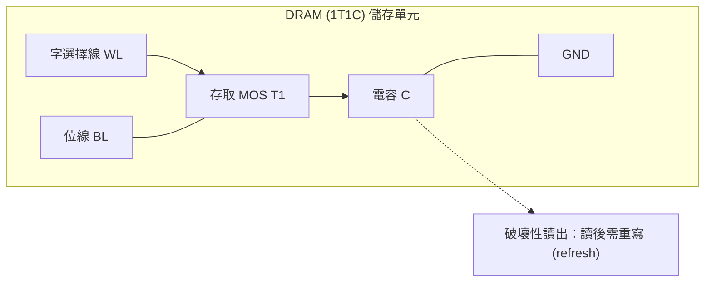
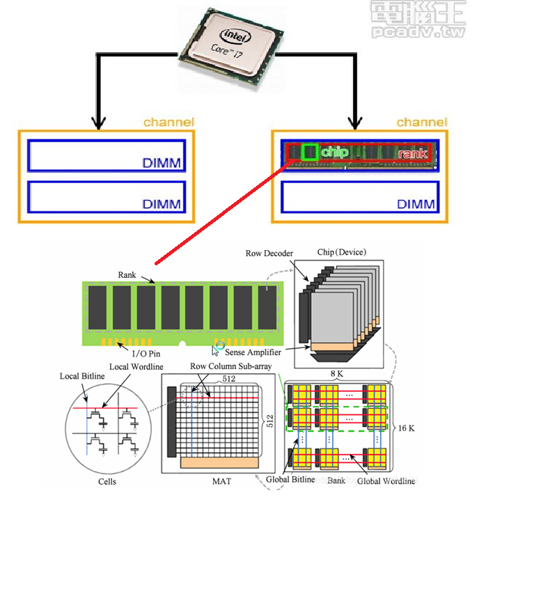
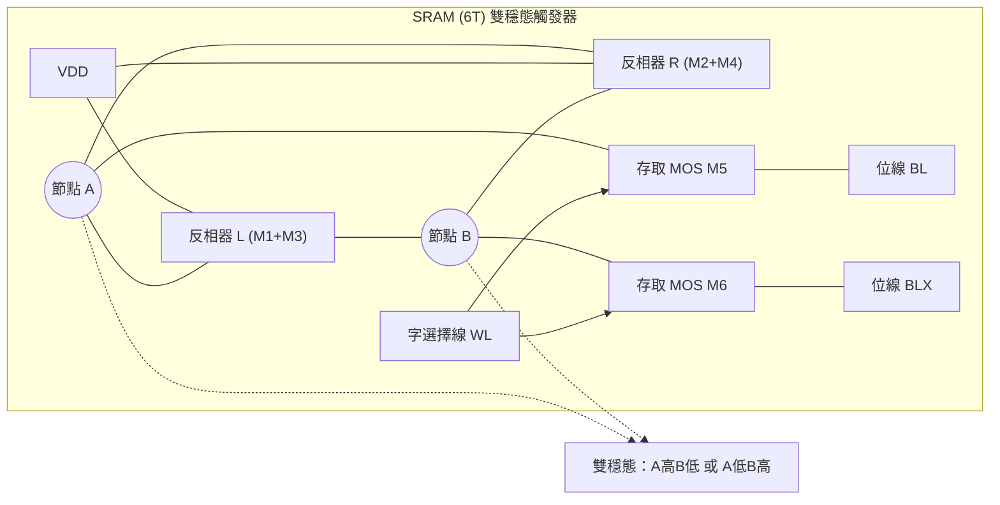
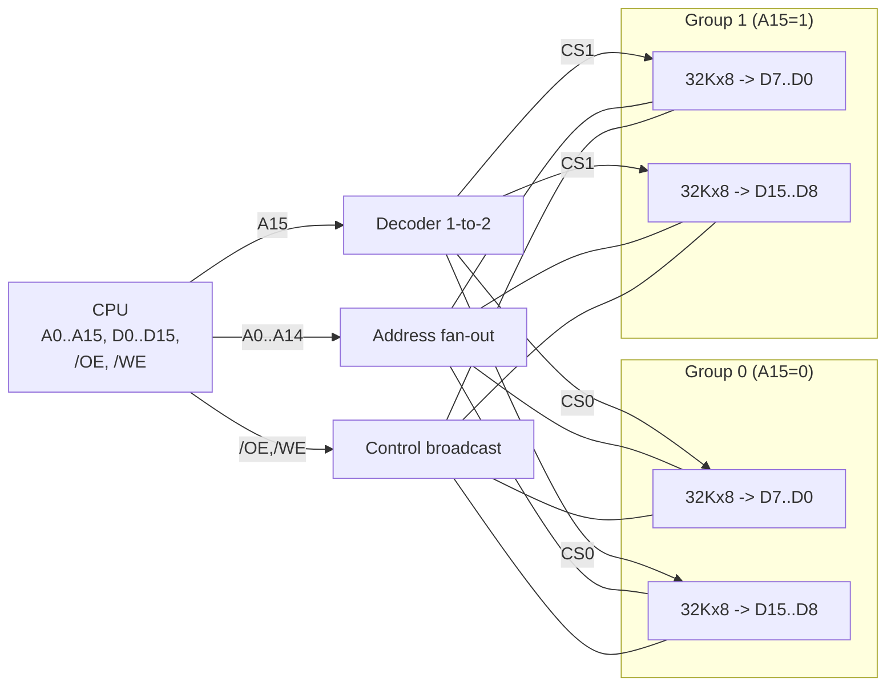
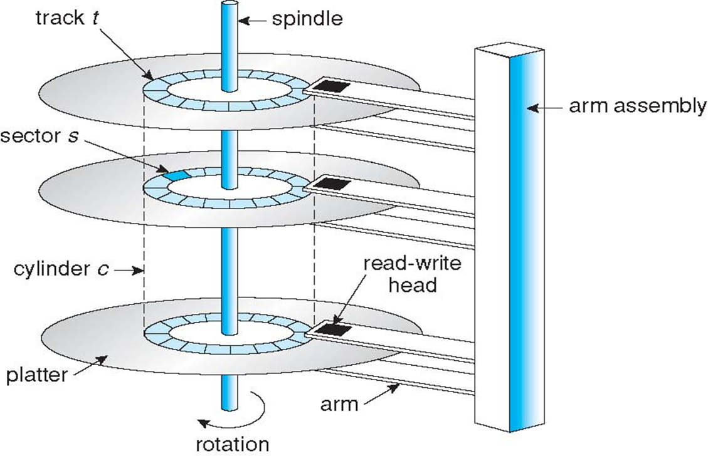
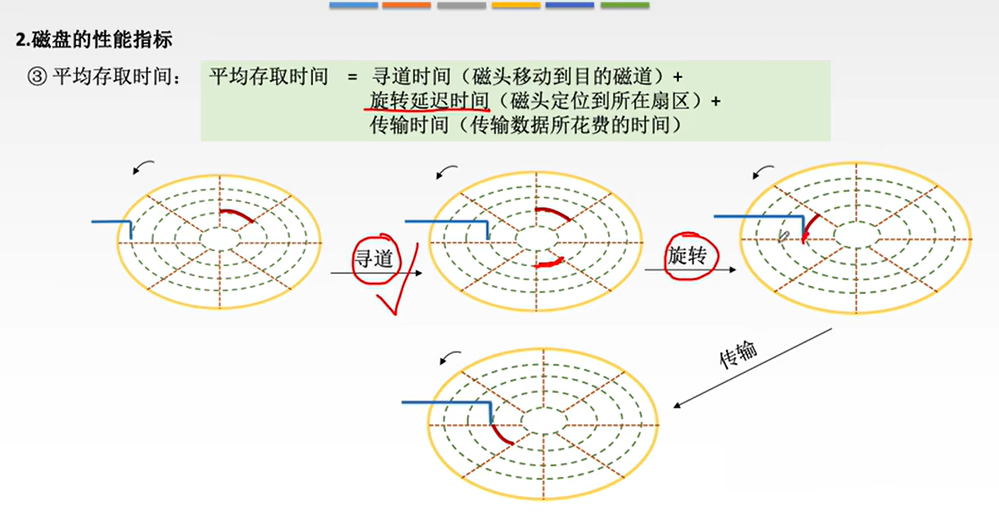
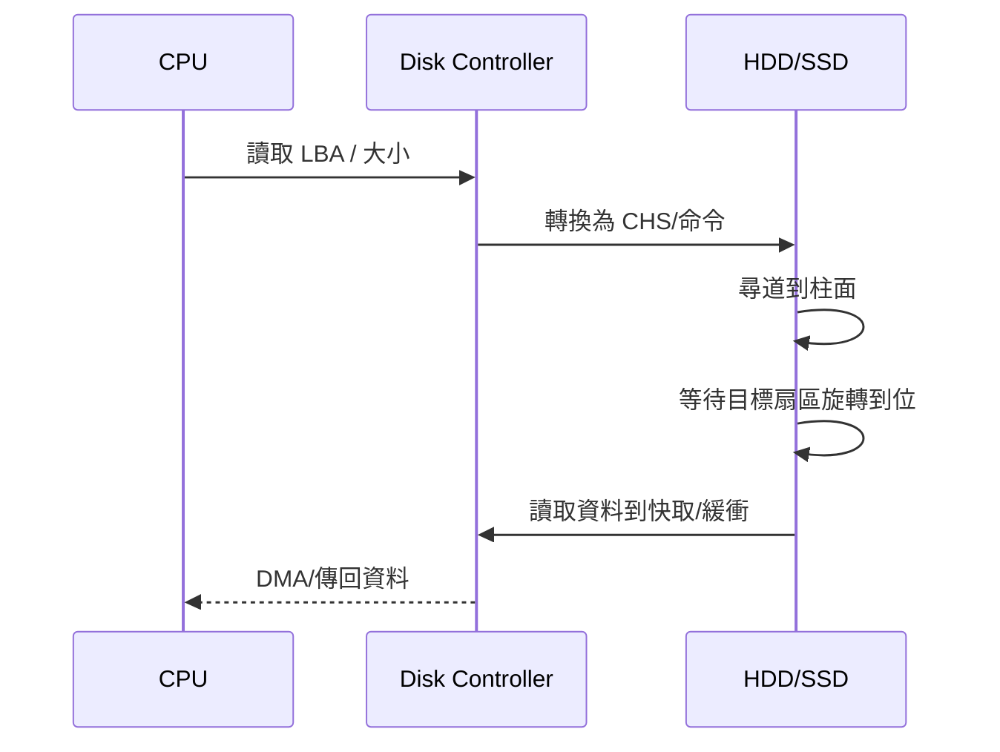
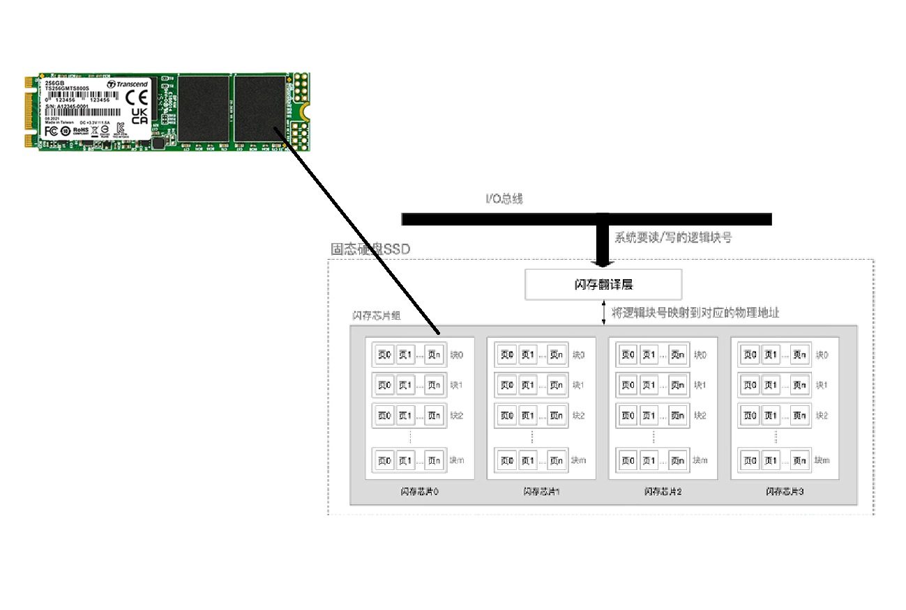

# 存储系统

上次編輯時間: 2025年11月19日 下午5:35
建立時間: 2025年8月13日 下午3:29

# **存儲器分類**

---

**存儲器案層次分類** 


**register→cache→main memory→disk→CD-ROM→tape(floppy)**

---

**按存取方式分類**

- **RAM（Random Access Memory）隨機存取**：任意位址等時存取；常見為 **SRAM、DRAM**。[HackMD](https://hackmd.io/%40bob840806/SJTSbKEUU)
- **SAM（Sequential Access Memory）順序存取**：需按順序讀寫，典型如磁帶。[維基百科](https://en.wikipedia.org/wiki/Sequential_access_memory?utm_source=chatgpt.com)[GeeksforGeeks](https://www.geeksforgeeks.org/computer-organization-architecture/difference-between-sequential-and-random-memory-access/?utm_source=chatgpt.com)
- **DAM（Direct-Access storage，直接存取）**：先**直接定位區塊**再順序讀取（受磁碟旋轉/磁頭移動影響），如 HDD、光碟、也包括 SSD。[維基百科](https://en.wikipedia.org/wiki/Direct-access_storage_device?utm_source=chatgpt.com)[TechTarget](https://www.techtarget.com/searchstorage/definition/DASD?utm_source=chatgpt.com)[IBM](https://www.ibm.com/docs/en/aix/7.2.0?topic=subsystem-direct-access-storage-devices-dasds&utm_source=chatgpt.com)
- **CAM／相聯式記憶（Content-Addressable Memory）**：按「內容」比對並回傳位址，用於高速查找（如路由器、TLB）。屬**硬體搜尋引擎**型記憶體。[維基百科](https://en.wikipedia.org/wiki/Content-addressable_memory?utm_source=chatgpt.com)[GeeksforGeeks+1](https://www.geeksforgeeks.org/associative-memory/?utm_source=chatgpt.com)


---

## RAM

---

### DRAM（Dynamic RAM）

---



- **儲存單元**：1T1C（1 晶體管＋1 電容）；電容會漏電，需**週期性重新整理（refresh）**，JEDEC 常見規格約 **每 64ms**。[HackMD](https://hackmd.io/%40bob840806/SJTSbKEUU)
- **結構與命名**：
    - **結構**
    
    
    
    channel→DIMM→rank→chip→bank→row/column；
    
- 主記憶體採 **DDR SDRAM（DDR3/DDR4…）**，如 DDR4 降壓至 1.2 V、頻寬以 MT/s 表示。[HackMD](https://hackmd.io/%40bob840806/SJTSbKEUU)
- **特性**：密度高、成本低、速度較 SRAM 慢；讀寫速率相近。[HackMD](https://hackmd.io/%40bob840806/SJTSbKEUU)
- **典型用途**：**主記憶體**。[HackMD](https://hackmd.io/%40bob840806/SJTSbKEUU)

### SRAM（Static RAM）

---

- **儲存單元**：兩個交叉耦合 CMOS 反相器（4T）+ 兩個存取管（2T）= 6T 交叉耦合 ，通電即可保持，不需 refresh（仍屬揮發性）。[HackMD](https://hackmd.io/%40bob840806/SJTSbKEUU)
- **特性**：**更快、功耗較高、成本高、容量小**；適合作為**快取（Cache）**。[HackMD](https://hackmd.io/%40bob840806/SJTSbKEUU)[GeeksforGeeks](https://www.geeksforgeeks.org/computer-organization-architecture/difference-between-sram-and-dram/?utm_source=chatgpt.com)




---

### **主存速度提升**

基本

- **存取週期**：$T = t_{access} + t_{recovery}$（= 存取時間 + 恢復時間）

---

**方法一：雙端口 RAM（Dual-Port）**


- 兩個埠可同時訪問 **不同位址**（讀/寫皆可）。
- **同位址**：可**同讀**；**不可**同時寫（也不可一讀一寫同位址）。
- 衝突時送出 **BUSY**，暫時關閉其中一個埠。

---

**方法二：單體多字（寬記憶體 / Wide Memory）**

- 一次並行讀/寫 **m 個連續字**。
- **系統匯流排寬度**也要擴成 **m 個字**，吞吐量≈提升 m 倍。

---

**方法三：多體並行（Interleaved Memory）**


把主存切成 **m 個模組（bank）**，地址交錯分配。

- **高位交叉編址（High-Order）**
    - 高位決定模組 → 連續位址多落在**同一模組**。
    - 理論可並行，但實務常被匯流排「連續訪問」限制，效果接近**容量擴充**。
- **低位交叉編址（Low-Order）** ✅ 常考
    - 低位決定模組 → 連續位址分散到**不同模組**，可做**存取流水線**。
    - 若 **模組數 $m \ge \dfrac{T}{r}$**（r=單次存取時間），可使流水線**不斷流**。
    - **每個存取週期**可完成**連續 m 字**的讀/寫。
    - 直觀：微觀上對各模組**依序**發請求；宏觀上看起來是**同時**完成。

---

**速記表**

| 技術 | 觀念 | 效果/限制 |
| --- | --- | --- |
| 雙端口 RAM | 兩埠并行、同位址只允許同讀 | 衝突→BUSY |
| 單體多字 | 擴匯流排寬度到 m 字 | 吞吐≈×m，成本↑ |
| 多體並行（高位交叉） | 連續位址集中同模組 | 併行差，像擴容 |
| 多體並行（低位交叉） | 連續位址分散各模組 | 流水線好；要滿足 $m \ge T/r$ |

> 小例：若 T=80 ns、r=20 ns，則 m≥4 可做到不斷流。
> 

---

### **主存與 CPU 的連接**

---

**1) 必備訊號線**

- **地址線 A[ ]**：選字（row/col 與片選解碼的輸入）。
- **數據線 D[ ]**：資料讀/寫。
- **控制線**：`/CS`(片選)、`/OE`(輸出使能/讀)、`/WE`(寫入)；全片共用。

---

**2) 三種擴展方法**

- **位擴展（寬度）**：讓**多片並聯**到同一地址與控制線，各片接到**不同的資料位**，一次傳 m 個位或字節。→ 增加**資料總線寬度**（吞吐↑）。
    
    > 重點：**位擴展**時，所有晶片共用 **A0..A12 與 /WE**，**/CS 置 1**；各晶片分別接 **D0..D7**，即可把 8Kx1 擴成 **8Kx8**。
    > 
    
    
    
    ```mermaid
    flowchart LR
      CPU[CPU]
      ADDR[Addr A0..A12]
      WE[WE]
      CS[CS = 1]
    
      CPU -->|A0..A12| ADDR
      CPU -->|WE| WE
    
      subgraph MEM[Bit Expansion: 8Kx2 from two 8Kx1 chips]
        C0[8Kx1 -> D0]
        C1[8Kx1 -> D1]
      end
    
      ADDR --- C0
      ADDR --- C1
      WE --- C0
      WE --- C1
      CS --- C0
      CS --- C1
    
      D0L[D0 line] --- C0
      D1L[D1 line] --- C1
      CPU -->|D0| D0L
      CPU -->|D1| D1L
    
    ```
    
- **字擴展（容量/深度）**：用**高位地址**做片選，讓「一次只啟用一片」。
    - **線選法**：高位直接接到各片 `/CS`。
    - **譯碼片選法**：高位進 1→N 解碼器（如 74HC138）再去選片（更規整、扇出好）。
    
    
    
    ```mermaid
    flowchart LR
      CPU[CPU]
      AL[Addr A0..A12]
      AH[Addr A13..A15]
      WE[WE]
      DEC[Decoder 1-to-4]
    
      CPU -->|A0..A12| AL
      CPU -->|A13..A15| AH
      CPU -->|/WE| WE
      AH --> DEC
    
      subgraph BANKS[Word Expansion: 32Kx8 from four 8Kx8 chips]
        M0[8Kx8]
        M1[8Kx8]
        M2[8Kx8]
        M3[8Kx8]
      end
    
      AL --- M0
      AL --- M1
      AL --- M2
      AL --- M3
    
      WE --- M0
      WE --- M1
      WE --- M2
      WE --- M3
    
      DEC -->|CS0| M0
      DEC -->|CS1| M1
      DEC -->|CS2| M2
      DEC -->|CS3| M3
    
      DBUS[Data bus D7..D0]
      CPU -->|D7..D0| DBUS
      DBUS --- M0
      DBUS --- M1
      DBUS --- M2
      DBUS --- M3
    
    ```
    
- **字位同時擴展**：先做**位擴展成一個“組”（group）**，再用**解碼器**在多個組之間**選一組**。

---

**3) 設計步驟（背）**

1. 目標容量：$W_{\text{target}}（字數）× 資料寬度 B_{\text{target}}$。
2. 已有晶片：$W_{\text{chip}} × B_{\text{chip}}$。
3. **位擴展片數**：$N_{\text{bit}}=\dfrac{B_{\text{target}}}{B_{\text{chip}}}$。
4. **組數/字擴展**：$N_{\text{grp}}=\dfrac{W_{\text{target}}}{W_{\text{chip}}}$。
5. 片數總計：$N_{\text{total}}=N_{\text{bit}} \times N_{\text{grp}}$。
6. 連接：
    - A[低位] → 所有晶片的 A[ ]；
    - A[高位] → 解碼器 → 各**組**的 `/CS`；
    - `/OE`,`/WE` 廣播；
    - 各組內 **N_bit** 片 → 接到 D[對應位段]。

---

**4) 典型考題範例**

**用 32K×8 晶片做 64K×16 主存，需要幾片？如何接？**

- $N_{\text{bit}}=16/8=2$（每組 2 片做 16 位寬）
- $N_{\text{grp}}=64K/32K=2$（兩組擴深）
- **總片數 4**；A0..A14 接所有片；**A15 作選組**（或 1→2 解碼）。
- 每組兩片分別接 **D[7:0]** 與 **D[15:8]**；`/OE`,`/WE` 廣播。



> 口訣：先寬後深；寬用並聯共享地址/控制，深用高位地址→解碼選組。
> 

## **ROM**

---

**一、分類**

- **MROM**：掩膜寫死，**出廠即定**，只能讀。
- **PROM**：使用者可**寫一次**（不可改）。
- **EPROM**：**紫外線整片抹除**，可反覆重寫（慢）。
- **EEPROM**：**電性抹除**，可**以位元/位元組為粒度**改寫（很細，但慢、容量小）。
- **Flash**：在 EEPROM 的基礎上做**區塊抹除**，**容量大、速度快**（相對 EEPROM），分 **NOR** 與 **NAND**。
- **SSD**：**裝置**，= 控制器 + **NAND Flash**；不是記憶體型別本身。

---

**二、對照表（高分速記）**

| 類型 | 可否自行寫入 | 抹除方式 | 抹除/寫入粒度 | 讀/寫速度(相對) | 耐久(P/E次數，概略) | 典型用途 |
| --- | --- | --- | --- | --- | --- | --- |
| **MROM** | 否 | 無 | 無 | 讀快、無寫 | 無 | 出廠固化程式 |
| **PROM** | **一次** | 無 | 無 | 讀快、無改寫 | 無 | 生產後一次性客製 |
| **EPROM** | 可多次 | **紫外線整片** | 晶片級 | 讀中；改寫非常慢 | 中 | 早期韌體開發 |
| **EEPROM** | 可多次 | **電性抹除** | **位元/位元組/小頁** | **讀慢、寫更慢** | 中 | 少量參數、設定值 |
| **Flash-NOR** | 可多次 | **電性、以區塊(Block)為單位** | 位元組讀、**區塊抹/寫** | 讀快、啟動快 | 中 | **啟動程式（BIOS/UEFI）** |
| **Flash-NAND** | 可多次 | 同上 | **頁寫、區塊抹** | **順序寫/讀吞吐高** | 視 SLC/MLC/TLC/QLC | **U 盤/記憶卡/SSD/手機儲存** |
| **SSD(裝置)** | N/A | 由控制器管理 | N/A | 取決於控制器/通道 | 由 Wear-Leveling/ECC 管理 | 個人電腦儲存 |

> 常見耐久概念：SLC＞MLC＞TLC＞QLC（寫入壽命依次降低；實際值看資料表）。
> 

---

**三、必考觀念與易錯點**

- **為何 Flash「寫比讀慢」？**
    
    需先**區塊抹除**再寫入；寫入過程還要 **Program-Verify** 多次迭代，故寫慢於讀。
    
1. **EEPROM vs Flash**
    - **EEPROM**：**細粒度（位元/位元組）抹除**，控制簡單但**容量小、速度慢**。
    - **Flash**：**區塊抹除**，**密度高、成本低、速度較快**；更適合大容量。
2. **NOR vs NAND**（一定會考）
    - **NOR**：**隨機讀**效率佳、啟動快，適合放**啟動碼**。
    - **NAND**：**順序存取**吞吐高、密度高，適合**資料儲存**（SSD 等），但需要 **ECC、Wear-Leveling、壞塊管理**。
3. **「每個存儲元只需單個 MOS」是指 Flash Cell**
    - **Flash**：1 個**浮動閘極**晶體管即可存位元（可多位元/單元：MLC/TLC/QLC）。
    - **SRAM**：一位要 **6T**；**DRAM**：**1T1C**。所以 **Flash 的位密度＞SRAM**（也常＞DRAM）。
4. **SSD 不是記憶體型別**
    
    SSD = 控制器 + **NAND**；支援 **對映/磨耗平均/垃圾回收/TRIM/ECC** 等，屬**儲存裝置**。
    

---

**四、超短公式與口訣**

- **「掩一次紫多電快」**：掩膜(M)固定；一次(P)不可改；紫外線(E)整片；電抹(EE)細粒度；快閃(Flash)區塊抹、容量快長大。
- **NOR=啟動、NAND=儲存**。
- **寫慢因先抹再寫 + 驗證回寫**。

---

## Disk Storage

1. 基本組成 & 儲存區域

- **硬體組成**：磁碟驅動器（Drive）、磁碟控制器（Controller）、碟片（Platters）、磁頭（Heads）、致動器（Actuator）、主軸馬達（Spindle）。
- **儲存區域（CHS）**
    - **C**ylinders（柱面）：各盤面同半徑的**磁道**集合。
    - **H**eads（盤面/磁頭）：對應每個可讀寫的盤面。
    - **S**ectors（扇區）：磁道上最小可尋址單位（常見 512B 或 4KB）。
        
        
        
- **容量**
    - **非格式化容量**：物理可用總面積（未計入標頭/間隙/校驗）。
    - **格式化容量**：使用者可見容量。
    - 近代採 **ZBR（分區位元密度）**：外圈每磁道扇區更多。

---

**2. 記錄密度（密度三要素）**

- **道密度**（Track density，TPI）：每英吋可放的**磁道數**。
- **位密度**（Linear/Bit density，BPI）：磁道**單位長度**可放的**位數**。
- **面密度**（Areal density）≈ **TPI × BPI**（整體儲存密度指標）。

---

**3. 性能指標與公式（背熟）**

- **平均存取時間**
    
    $T_{\text{avg}} = T_{\text{seek}} + T_{\text{rot}} + T_{\text{trans}}$
    
    - $T_{\text{seek}}$：**尋道時間**（移磁頭到目標柱面）。
    - $T_{\text{rot}}$：**旋轉延遲**（等扇區轉到磁頭下）。
        
        $T_{\text{rot(avg)}}=\frac{60}{2 \times \text{RPM}}\;\text{(秒)}=\frac{30000}{\text{RPM}}\;\text{(毫秒)}$
        
    - $T_{\text{trans}}：傳輸時間$
        
        $T_{\text{trans}}=\frac{\text{資料量}}{\text{內部傳輸率}}$
        
    
    
    
- **資料傳輸率**：I/O 介面速率（SATA/NVMe）與**盤片內部率**孰低取決。
- **其他延遲**：**磁頭切換時間**（同柱面換盤面）、**控制器排隊/命令處理**。

> 操作流程口诀：尋道 → 等轉 → 傳輸。同柱面命中可省去尋道；連續讀寫可攤薄旋轉與定位成本。
> 

---

**4. 磁碟地址表示**


- **CHS 位址**：`驅動器號 | 柱面號 | 盤面(磁頭)號 | 扇區號`。
- **LBA（Logical Block Addressing）**：以**邏輯區塊號**線性編址（由控制器對映到實際 CHS）。

---

**5. 磁碟陣列（RAID）核心觀念**

> 利用多顆便宜磁碟以分條/校驗/鏡像換取效能/可靠度/容量的綜合平衡。
> 

| 級別 | 概念 | 容量使用率* | 讀/寫效能 | 容錯 | 常見用途/特點 |
| --- | --- | --- | --- | --- | --- |
| **RAID0**（條帶） | 按區塊分條並行 | 100% | **高/高** | 無 | 追求速度；**任何一碟毀即全毀** |
| **RAID1**（鏡像） | 成對複本 | 50% | **讀高/寫中** | 1 碟 | 可靠度高，讀多寫少 |
| **RAID2** | 位元級＋漢明碼 | 低 | 特殊 | 多碟 | 罕用（硬體ECC已足） |
| **RAID3** | 位元/位元組級＋**專用校驗碟** | (n−1)/n(n-1)/n | 連續讀高/寫受限 | 1 碟 | 流式、長串流量 |
| **RAID4** | 區塊級＋**專用校驗碟** | (n−1)/n(n-1)/n | 讀可、**寫瓶頸** | 1 碟 | 校驗碟成瓶頸 |
| **RAID5** | 區塊級＋**分散校驗** | (n−1)/n(n-1)/n | **讀高/寫中** | 1 碟 | 綜合性佳、最常見 |
- 容量使用率以 n 顆同容量碟計。

**快算**

- RAID0 容量：`n × 單碟容量`。
- RAID1 容量：`(n/2) × 單碟容量`（成對）。
- RAID5 容量：`(n-1) × 單碟容量`（1 顆作校驗）。

---

**6. 考題熱點 & 秒答句**

- **公式題**：給 **RPM / 平均尋道 / 區塊大小 / 內部率**，套 $T_{\text{avg}}$。
- **位址題**：CHS 與 LBA 互換、**柱面/盤面/扇區**意義。
- **密度題**：面密度 = **道密度 × 位密度**。
- **RAID 容量/容錯**：背熟 RAID0/1/5 的**容量與能容忍的壞碟數**。
- **效能直覺**：**順序 I/O** 佳、**隨機小 I/O** 受 $T_{\text{seek}}+T_{\text{rot}}$ 支配。

---

**7. 存取流程（時序圖，理解型考題）**



---

```css
半導體記憶體
│
├── RAM（可讀可寫、斷電資料消失）
│     │
│     ├── SRAM（靜態 RAM）
│     │     ├ 每個 cell 用 6 顆晶體管組成
│     │     ├ 只要供電資料就一直在
│     │     ├ 不需刷新
│     │     ├ 對電磁干擾不敏感
│     │     ├ 速度最快、但最貴
│     │     └ ➜ 用作 CPU Cache（L1/L2/L3）
│     │
│     └── DRAM（動態 RAM）
│           ├ 每個 cell 用 1 個電容 + 1 個晶體管
│           ├ 電容會漏電 → 必須不斷 refresh
│           ├ 對電磁干擾較敏感
│           ├ 速度比 SRAM 慢、但很便宜
│           └ ➜ 作為主記憶體（Main Memory）
│
└── ROM（斷電資料不消失）
      │
      ├── 傳統 ROM / Mask ROM（無法改寫）
      │
      ├── PROM（一次性可寫）
      │
      ├── EPROM（紫外線可抹除）
      │
      ├── EEPROM（電可抹除）
      │
      └── Flash（Flash ROM）
            ├ 讀取速度接近 DRAM
            ├ 寫入速度接近硬碟
            └ ➜ 用作 BIOS、SSD、USB、記憶卡
zs
```

## SSD

---

**1. 原理與組成**

- **原型/介質**：以 **NAND Flash Memory** 為基礎，屬**電可擦除 ROM（EEPROM）**。
- **控制核心**：**控制器（Controller）＋快閃翻譯層 FTL**
    
    將主機的 **LBA（邏輯區塊位址）→ 物理頁/塊**，並處理對齊、磨損平均、垃圾回收、ECC。
    
- **存儲層級術語**
    - **Chip（晶片）**：每顆晶片含多個 **Die（晶粒）**；每個 die 有多個 **Plane（平面）**。
    - **Block（塊）**：擦除單位；由多個 **Page（頁）** 構成。
    - **Page（頁）**：**讀/寫單位**（常見 4–16KB），含 OOB/校驗資訊。
    
    
    
- **關鍵特性（務必背）**
    - **讀/寫以「頁」為單位；擦除以「塊」為單位**（**Erase-Before-Write**，寫前必擦）。
    - **隨機讀快、寫相對慢**：修改一頁時常需**整塊複製→擦除→回寫**，引出**寫放大**。

---

**2. 讀寫性能與行為**

- **隨機存取**：無機械頭/旋轉延遲 → **讀延遲 µs 級**，高 IOPS。
- **寫入流程（簡化）**
    1. 主機寫某 LBA → **FTL 查映射**。
    2. 若舊頁存在：**將新資料寫到一個「空閒頁」**，舊頁標記為**無效**。
    3. **更新映射表**（LBA→新頁）。
    4. 空間不足時觸發 **GC（Garbage Collection）**：搬移有效頁→**擦除整塊**→回收空間。
- **寫放大（WAF）**：
    
    WAF=實際寫入到快閃的資料量主機請求寫入量(≥1)\text{WAF}=\frac{\text{實際寫入到快閃的資料量}}{\text{主機請求寫入量}}\quad(\ge 1)
    
    WAF 受 **GC、頁/塊大小、對齊、過度預留空間（OP）** 影響。
    
- **TRIM**：OS 告知 SSD **哪些 LBA 已不再使用**，便於 GC 直接回收，**降 WAF、提壽命**。

---

**3. 與機械硬碟（HDD）比較（速記）**

| 面向 | SSD | HDD |
| --- | --- | --- |
| 延遲 / IOPS | **µs** 級、**高 IOPS** | **ms** 級、受**尋道/旋轉**限制 |
| 順序吞吐 | 高（尤其 NVMe 多通道） | 中等 |
| 隨機訪問 | **極優** | 差 |
| 耗電/噪音/抗震 | **低/無/佳** | 高/有/差 |
| 價格/GB | 較高 | 低 |
| 壽命模式 | **P/E 次數**限制、**資料保持**隨時間下降 | 機械磨損、壞道 |
| 失效模式 | **整塊/頁老化**、控制器/韌體風險 | 機械損傷 |

---

**4. 磨損平均（Wear Leveling）與壽命**

- **為何需要**：每個 **Block 的 P/E（Program/Erase）次數有限**（SLC ≫ MLC > TLC > QLC）。
- **動態磨損平均**：寫新資料時**優先挑低 P/E 次數**的空閒塊。
- **靜態磨損平均**：**搬移冷資料**（很少改變）到**老塊**，把**新塊**留給頻繁寫入。
- **過度預留（OP）**：預留一部分不可見容量（如 7–28%），**降低 WAF、提升壽命與穩定吞吐**。
- **TBW / DWPD**：保固常見壽命指標（總可寫入位元組 / 每日可寫入整盤次數）。

---

**5. 可靠性與維護機制**

- **ECC（BCH/LDPC）**：校正位翻轉，提高讀可靠度。
- **壞塊管理**：出廠與使用中壞塊標記、避開。
- **寫入快取**：DRAM/SL C Cache（在 TLC/QLC 上用 SLC 模式作暫存，加速短寫）。
- **掉電保護（PLP）**：工規/伺服級常見（電容群）以避免**映射表/資料**丟失。
- **韌體功能**：背景 GC、熱調節（Thermal Throttling）、SMART 監控。

---

**6. 題目高頻點（易混淆 → 秒答）**

- **頁/塊粒度**：**讀寫=頁，擦除=塊**（考點王）。
- **為何 SSD 隨機讀快、寫較慢？** 無機械延遲，但寫要「**先搬再擦**」，且受 GC/對齊影響。
- **FTL 映射粒度**：
    - **頁級**（耗 DRAM、多彈性、WAF 低）、
    - **塊級**（DRAM 小、WAF 高）、
    - **混合式**（常見折衷）。
- **TRIM 的作用**：提前告知「已刪除 LBA」，**減少搬移頁、降低 WAF**。
- **靜態 vs 動態磨損平均**：動態只管**新寫入**，靜態會**搬冷資料**到老塊以均衡 P/E。
- **SLC/MLC/TLC/QLC**：每單元位元數↑ → **密度↑、成本↓、速度/耐久↓**。
- **寫放大成因**：頁/塊粒度不匹配、未對齊、OP 不足、GC 頻繁。

---

## Cache

---

**1) 基礎概念（快取行內容）**

- **交換單位**：主存塊（Block） ⟷ **Cache 行（Line）**
- **每行包含**：`Valid`、`Tag`、`Data(=一塊資料)`、`Dirty(寫回用)`、`替換狀態(如LRU位)`
- **局部性**：時間局部性、空間局部性（命中率提升的根本）


---

**2) 性能分析（必背）**

- **命中率** $h$，**缺失率** $m=1-h$
- **AMAT**（單層）：$AMAT=T_C + m \times P$
    
    多層（L1/L2）：$\text{AMAT}=T_{L1}+m_{L1}\big(T_{L2}+m_{L2}\times P_{L2}\big)$
    
- **兩種查詢**：
    
    串行（先查 Cache，Miss 再主存；硬體簡單） / 並行（同時發出；Miss 懲罰小但複雜）
    


---

**3) Cache–主存映射方式（地址如何映到 Cache）**


| 類型 | 地址拆分 | 規則 | 優點 | 缺點/考點 |
| --- | --- | --- | --- | --- |
| **直接映射** | **Tag | Index | Offset** | 每個主存塊只去**唯一**一行（由 Index 決定） |
| **全相聯** | **Tag | Offset** | 任一主存塊可放**任一行** | 衝突最低、命中率高 |
| **組相聯（n 路）** | **Tag | Set-Index | Offset** | 每個 Set 有 n 行；塊可放該 Set **任一行** |

---

**4) 替換演算法 & 寫入策略（只放考點）**

- **替換**：LRU（常用近似 LRU）、FIFO、Random、Pseudo-LRU

- **Cache 寫入策略（Write Policies）**
    
    **1) 寫「命中」（write hit）**
    
    - **Write-Through（全寫法）**
        - 行為：同時寫 **Cache** 與 **下一層（L2/主存）**。
        - 優點：**一致性簡單**、資料即時落到下層。
        - 缺點：**頻寬耗大**、延遲↑ → 常搭配 **Write Buffer**。
    - **Write-Back（寫回法）**
        - 行為：只改 **Cache**，標 **Dirty**；被替換時才寫回下層。
        - 優點：**頻寬省、速度快**（把多次寫合併）。
        - 缺點：需**髒位**與**一致性協定（MESI/MOESI）**；掉電風險需保護（PLP）。
    
    **2) 寫「不命中」（write miss）**
    
    - **Write-Allocate（寫分配）**
        - 行為：**先把塊調入 Cache**，再寫入。
        - 適用：後續可能**再讀/再寫同一塊**（利用局部性）。
        - 常見搭配：**Write-Back + Write-Allocate**（最主流）。
    - **No-Write-Allocate（非寫分配）**
        - 行為：**不調入**，直接寫下一層。
        - 適用：**寫一次就不再用**、或避免污染 Cache。
        - 常見搭配：**Write-Through + No-Write-Allocate**。
    
    ---
    
    **3) 一張對照表（秒背）**
    
    | 場景 | 策略 | 主要優點 | 主要缺點 | 常見搭配 |
    | --- | --- | --- | --- | --- |
    | 寫命中 | Write-Through | 一致性簡、資料即時落盤 | 頻寬大、慢 | + Write Buffer |
    | 寫命中 | Write-Back | 快、省頻寬 | 需 Dirty 位與一致性 | + Write-Allocate |
    | 寫不命中 | Write-Allocate | 後續命中率↑ | 可能多搬資料 | + Write-Back |
    | 寫不命中 | No-Write-Allocate | 不汙染 Cache | 之後仍可能 miss | + Write-Through |
    
    ---
    
    - **要速度省頻寬 → WB+WA（寫回＋寫分配）**。
    - **要一致性簡單 → WT+NWA（全寫＋非分配）**。
    - **有寫後常讀/再寫 → 用寫分配**；**一次性流式寫 → 非分配**。

---

**5) 查找與訪存流程（考題答題模板）**

1. **拆位址**：從實體地址切出 **Tag / (Set)Index / Offset**。
2. **定位集合**：用 (Set)Index 找到**對應集合**（或直接映射的一行）。
3. **比較 Tag**：在集合內**並行比對 Tag**（全相聯對整個 Cache 比對）。
4. **命中？**
    - **Hit**：回傳 `Data`；若寫入 → 依策略設/不設 `Dirty`、是否直寫下一層。
    - **Miss**：依替換演算法選**Victim**；若 `Dirty` 且 Write-Back → 先回寫主存；再把目標塊載入該行，更新 Tag/Valid/LRU，完成讀/寫。

---

**6) 秒背 Q&A**

- **哪種最易衝突缺失？** 直接映射。
- **哪種硬體成本最高？** 全相聯。
- **組相聯 n 路代表什麼？** 每個集合有 **n 行**，同一塊可放其中任一行。
- **AMAT 怎算？**  $T_{L1}+m_{L1}(T_{L2}+m_{L2}P_{L2})$。
- **寫 Miss 一定會把塊調入嗎？** 只在 **Write-Allocate** 時會。

---