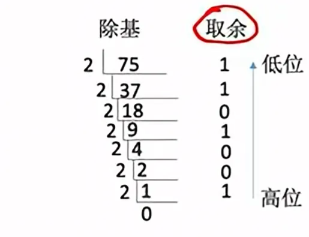
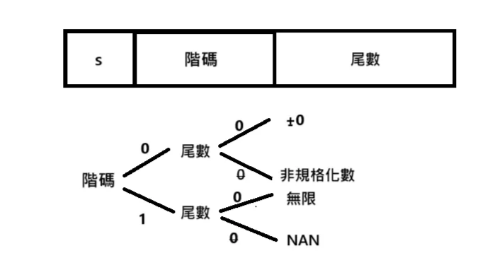

# 數據表示和運算

上次編輯時間: 2025年8月11日 下午6:19
建立時間: 2025年8月6日 下午5:45

## 進位計數值

r 進制數

- **基數 r**：每個數碼位可能出現 r 種符號，進位逢 r 進 1
- 一般表示形式：
    
    $K = k_n \times r^n + k_{n-1} \times r^{n-1} + \dots + k_1 \times r^1 + k_0 \times r^0 + k_{-1} \times r^{-1} + \dots$
    

---

<aside>
💡

**進制轉換**

r 進制 → 十進制

- 將 r 進制數的每位數碼乘以該位的權值（r 的冪次）後相加

二進制 ↔ 八進制

- 每 **3 位二進制** 對應 1 位八進制

二進制 ↔ 十六進制

- 每 **4 位二進制** 對應 1 位十六進制
    
    
    
</aside>

---

<aside>
💡

### 十進制 ↔ r 進制

**十進制整數部分 → r 進制**

- **除基取餘法**：不斷除以 r，依次取餘數（低位在前，高位在後）

**十進制小數部分 → r 進制**

- **乘基取整法**：不斷乘以 r，依次取整數部分（高位在前）

</aside>

---

## 數值表示（原碼、反碼、補碼）

🧩 1. 真值與表示格式

- 真值（𝑋真值）：數值帶正負號
    - 正數 → 符號為 +0
    - 負數 → 符號為 −1
- 數值位：不含符號的部分

---

### **🔢 2. 四種數值表示法**

| 稱呼 | 特點與運算方式 | 正數表示 | 負數表示 | 0的表示 | 表示範圍（n 位） |
| --- | --- | --- | --- | --- | --- |
| 原碼 | 加減須特判符號 | 相同 | 符號位為 1，數值位與正數相同 | 2種 | −(2ⁿ⁻¹ − 1) ~ +(2ⁿ⁻¹ − 1) |
| 反碼/ 1’s | 減法可用加法器 | 相同 | 符號位為 1，數值位取反 | 2種 | −(2ⁿ⁻¹ − 1) ~ +(2ⁿ⁻¹ − 1) |
| 補碼/2’s | 可統一用加法器 | 相同 | 符號位為 1，數值位取反 +1 | 1種 | −2ⁿ⁻¹ ~ +(2ⁿ⁻¹ − 1) |
| 移碼 | 用於排序與比較 | 加上偏移量 K | 同上（皆為非負整數表示） | 1種 | 0 ~ 2ⁿ − 1（無負數） |

**✅ 負數補碼→原碼:  1.取反+1   2.從最右邊第一個 1 開始，左邊取反，右邊保留**

---

🧮 3. 補碼計算特性

- 補碼讓 **加減法可以用相同加法電路實現**（減法 = 加上負數的補碼）
- 只有一個 0（原碼、反碼會有正 0、負 0 兩種）

---

📍 定點數表示

📘 定點整數

- 格式：`[符號位][數值部分]`
- 適用：整數運算

📘 定點小數

- 格式：`[符號位][小數點位置固定][數值部分]`
- 特性：小數點位置固定（例如固定在符號位後 1 位）

📌 補充：

- **移碼**：用於浮點數的指數部分，不適用於整數（圖右上註記）

---

🔹 移碼（只用於浮點數指數）

- **定義**：移碼=真實值+K（K = 2n−1)
    
    移碼=$\text{移碼} = \text{真實值} + K \quad \text{（K = 2}^{n-1})$
    
- 優點：
    - 將有號數轉為無號表示（方便比較大小）
    - 與補碼搭配，構成 IEEE 浮點格式

<aside>
💡

 **邏輯移位 vs 算術移位   &溢位判斷**

 邏輯移位 vs 算術移位

| 類型 | 左移 | 右移 | 左側補位 | 適用於 |
| --- | --- | --- | --- | --- |
| 邏輯移位 | 左移補 0 | 右移補 0 | 一律補 0 | 無號數 |
| 算術移位 | 同邏輯左移 | **右移補原符號位（0 或 1）** | 保留符號位 | 有號數（補碼） |

---

**溢位判斷**

| 條件 | 是否溢位 |
| --- | --- |
| **正數 + 正數 = 負數** | ✔ 溢位 |
| **負數 + 負數 = 正數** | ✔ 溢位 |
| **正數 + 負數 = 任意（正常）** | ✘ 不溢位 |

> ✅ 口訣:**「同號加，看符號；異號加，不會錯」**
> 
</aside>

---

## 邏輯閘

---

## 🧠 IEEE 浮點數的表示（IEEE 754 標準）

---

1️⃣ 基本概念

- 浮點數 = **符號位 + 尾數（有效數） + 階碼（指數）**
- 階碼用**移碼（Excess-K）**表示
- 尾數規格化時，小數點前隱含 1（即 **隱含位**）

---

2️⃣ 結構與偏置值（Bias）

**單精度（float，32 位）**

- 符號位：1 位
- 階碼位：8 位（移碼表示，Bias = 127）
- 尾數位：23 位（實際有效位數為 1 + 23 = 24 位）

**雙精度（double，64 位）**

- 符號位：1 位
- 階碼位：11 位（移碼表示，Bias = 1023）
- 尾數位：52 位（實際有效位數為 1 + 52 = 53 位）

---

3️⃣ 浮點數 ↔ 真值

**真值轉浮點數**

1. 將十進制真值轉為二進制科學計數法
2. 轉為浮點數格式（符號位、階碼、尾數）
    - 規格化尾數前隱含 1
    - 階碼 = 真實指數 + 偏置值（Bias）

**例題**

---

**4️⃣ 特別注意**

---

非規格化浮點數（Denormalized Numbers）

- **條件**：階碼全為 0，尾數不全為 0
- **階碼真值**：= 1 − Bias（單精度為 −126）
- **尾數**：小數點前隱含 0（即 0.f）
- **用途**：表示接近 0 的極小數，避免精度突變（漸進到 0）

---

其他特殊狀態（階碼全為 1）

- **階碼全 1，尾數全 0**：±∞（正負無窮大）
- **階碼全 1，尾數不全 0**：NaN（非數值）

- **IEEE 754 浮點數判斷決策樹**
    - **階碼 ≠ 全 0 且 ≠ 全 1**
        - 規格化浮點數
    - **階碼 = 全 0**
        - **尾數 = 全 0**
            - **符號位 = 0** → 正零 (+0)
            - **符號位 = 1** → 負零 (−0)
        - **尾數 ≠ 全 0**
            - **符號位 = 0** → 非規格化正數
                
                值 = $+2^{1-Bias} \times 0.f$
                
            - **符號位 = 1** → 非規格化負數
                
                值 =$-2^{1-Bias} \times 0.f$
                
    - **階碼 = 全 1**
        - **尾數 = 全 0**
            - **符號位 = 0** → 正無窮大 (+∞)
            - **符號位 = 1** → 負無窮大 (−∞)
        - **尾數 ≠ 全 0**
            - NaN（非數值）

---