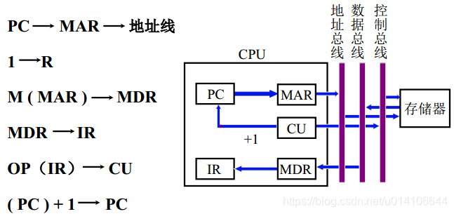
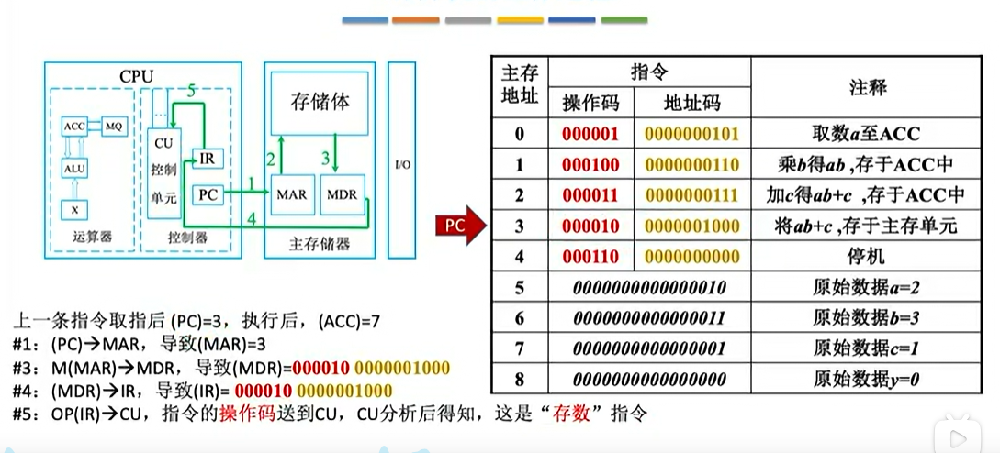
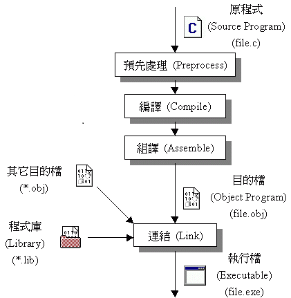

# 計算機組成

上次編輯時間: 2025年11月18日 下午3:52
建立時間: 2025年8月6日 下午2:56

---

## 📘 計算機的組成（Computer Organization）

- 1️⃣ 計算機的基本組成
    
    採用 **馮·諾依曼（Von Neumann）結構**：
    
    - **Sequential Execution**
    - **Stored programming**

### ❗**五大部件**：

1. **運算器（ALU, Arithmetic Logic Unit）**
    - 執行算術運算（加、減、乘、除）
    - 執行邏輯運算（與、或、非、比較）
    - 主要元件：算術邏輯單元、累加器（AC）、狀態暫存器（PSW）
2. **控制器（Control Unit, CU）**
    - 解讀指令、發送控制信號
    - 協調各部件工作
    - 主要元件：指令暫存器（IR）、程式計數器（PC）
3. **記憶體（Memory Unit）**
    - 儲存程式與資料（指令與數據混合存放）
    - 分為 **主記憶體（RAM、ROM）** 與 **快取記憶體（Cache）**
    
    <aside>
    💡
    
    **主存器**
    
    1. **MAR（Memory Address Register）**：存放要存取的記憶體位址。
    2. **MDR（Memory Data Register）**：存放從記憶體讀出或要寫入記憶體的資料。
    3. **PC（程式計數器, Program Counter）**：存放**下一條要執行的指令位址，有自動加1功能**。
    4. **IR（指令暫存器, Instruction Register）**：存放**正在執行的指令**（由 MDR 載入）。
    5. **CU（控制單元, Control Unit）**：負責**解碼指令並發送控制訊號**。
    
    **NOTE. 辨析三个概念的核心定义：**
    
    - **机器字长 (Machine Word Length)：**
        - 是指计算机进行一次整数运算（即 ALU 算术逻辑单元）所能处理的二进制数据的位数。
        - 通常等于 CPU 内部**通用寄存器**的位数（也是 ALU 的宽度）。
        - 它决定了计算机的运算精度和处理速度。
    - **指令字长 (Instruction Word Length)：**
        - 是指一条指令包含的二进制代码的位数。
        - 指令字长取决于操作码的长度、操作数地址的个数及长度。
        - 它可以是机器字长的整数倍（单字长指令、双字长指令），也可以是变长的。
    - **存储字长 (Storage Word Length)：**
        - 是指**一个存储单元**中存储的二进制代码的位数。
        - 它通常由主存的结构决定，与 **MDR (数据寄存器)** 的位数通常是相等的。
    
    
    
    
    
    </aside>
    
4. **輸入設備（Input Unit）**
    - 將外部資料轉換為計算機可處理的形式
    - 例：鍵盤、滑鼠、掃描器
5. **輸出設備（Output Unit）**
    - 將計算機處理結果轉換為人可理解的形式
    - 例：螢幕、印表機、喇叭

---

- 2️⃣ 資料在計算機中的表示
    - **數值型資料**：二進位表示，補碼（Two’s Complement）常用於整數運算
    - **非數值型資料**：文字（ASCII、Unicode）、圖像、聲音（取樣與編碼）
    - **指令**：由操作碼（Opcode）+ 操作數（Operand）組成

---

- 3️⃣ 記憶體層次結構
    
    由快到慢、由貴到便宜：
    
    1. **暫存器（Register）**：位於 CPU 內部，速度最快
    2. **快取記憶體（Cache）**：CPU 與主記憶體之間的高速記憶體
        - **L1 Cache**（貼近 CPU 核心）
        - **L2/L3 Cache**（容量更大，速度稍慢）
    3. **主記憶體（RAM）**
    4. **輔助記憶體（硬碟 HDD、固態 SSD）**
    5. **外部儲存（光碟、USB、雲端）**

---

- 4️⃣ 指令執行過程（指令週期）
    1. **取指（Fetch）**：PC → MAR → 記憶體 → MDR → IR
    2. **譯碼（Decode）**：CU 解析操作碼與操作數
    3. **執行（Execute）**：ALU 或相關硬體完成運算
    4. **寫回（Write Back）**：將結果存回暫存器或記憶體

---

- 5️⃣ 匯流排（Bus）系統
    - **資料匯流排（Data Bus）**：傳送資料（雙向）
    - **位址匯流排（Address Bus）**：傳送記憶體或 I/O 位址（單向，CPU → 其他元件）
    - **控制匯流排（Control Bus）**：傳送控制訊號（讀/寫、時脈、重置等）

---

- 6️⃣ CPU 性能指標
    - **時脈頻率（Clock Rate）**：GHz（越高越快，但也受架構影響）
    - **CPI（每指令週期數）**：越低越好
    - **MIPS（每秒百萬指令數）**、**MFLOPS（每秒百萬浮點運算）**
    - **吞吐量（Throughput）**：單位時間完成的工作量
    - **延遲（Latency）**：完成一項任務所需的時間

---

- 7️⃣ 現代 CPU 技術
    - **流水線（Pipeline）**：取指、譯碼、執行等階段並行
    - **超純量（Superscalar）**：同時執行多條指令
    - **分支預測（Branch Prediction）**
    - **多核心（Multi-core CPU）**
    - **SIMD / MIMD**：平行運算架構

---

- 8️⃣ 系統啟動過程（簡要）
    1. 開機 → **BIOS/UEFI** 初始化
    2. 自檢（POST）
    3. 載入開機載入程式（Bootloader）
    4. 載入作業系統核心（Kernel）

---

## 📘 計算機軟件

- **1. 兩類軟件**
    1. **系統軟件**
        - 管理計算機系統的硬件資源
        - 向上層應用程序提供服務
        - 例：作業系統、編譯程式、工具程式
    2. **應用軟件**
        - 按應用場景需要編制成的各種程式
        - 直接為用戶提供服務
        - 例：文字處理、遊戲、財務軟件

---

- **2. 三個級別的語言**
    1. **高級語言**（High-level Language）
        - 例：C、Java、Python
        - 易於理解，接近人類語言
    2. **匯編語言**（Assembly Language）
        - 使用助記符對應機器指令
        - 需經匯編程序轉換為機器碼
    3. **機器語言**（Machine Language）
        - 二進制指令，直接由硬件執行

---

- **3. 語言翻譯方式**
    - **編譯程序（Compiler）**
        - 將高級語言一次性全部翻譯為機器碼
        - 編譯後執行，效率較高
    - **匯編程序（Assembler）**
        - 將匯編語言翻譯成機器碼
    - **解釋程序（Interpreter）**
        - 高級語言翻譯為機器語言並立即執行
        - 一句一句翻譯，執行效率較低
        
        
        
        <aside>
        💡
        
        - **1. 编译程序 (Compiler)：**
            - 编译程序（编译器）。将高级语言程序翻译成汇编语言或机器语言程序。
        - **2. 解释程序 (Interpreter)：**
            - 它也处理高级语言，但它的工作方式是**逐条翻译并立即执行**，**不会生成**独立的目标代码**文件**。
            - 题干中红框强调了“**文件**”二字，这就是为了排除解释程序。
        </aside>
        

---

- **4. 軟硬件功能實現的可替代性**
    - 同一功能既可以用**硬件**實現，也可以用**軟件**實現
    - 硬件實現：速度快、成本高、靈活性低
    - 軟件實現：速度較慢、成本低、靈活性高

---

- **5. 指令集架構（ISA, Instruction Set Architecture）**
    - 定義計算機可以支持的指令集，以及每條指令的作用與格式
    - 是硬件與軟件之間的接口
    - 內容包括：
        1. 支持的操作（加減乘除、邏輯運算、資料搬移等）
        2. 指令格式（操作碼 + 操作數）
        3. 資料型態與尋址方式

---

### **計算機的性能指標**

**儲存器的容量**

- **MAR 位數**：反映儲存單元的數量
- **MDR 位數**：反映每個儲存單元的大小

> MAR 32位  ，MDR 8 位  ；
> 
> 
> 總容量=$2^{32} * 8bit$ =4GB
> 

**CPU**

**時鐘週期**

- 完成一次震盪所需的時間

**主頻（時鐘頻率）**

- 定義：主頻 = CPU 時鐘頻率，決定了處理器的基本運行速度
    - 作用：每個時鐘週期可推進 CPU 一個或多個微操作（micro-operations）—震盪/週期
- 單位：
    - 1 MHz = 每秒 100 萬次震盪
    - 1 GHz = 每秒 10 億次震盪

**CPI（每指令週期數）**

- 執行一條指令所需的時鐘週期數

影响 CPI 的因素

---

- **指令集架构 (ISA)：**
    - **CISC (如 x86)：** 指令复杂，一条指令能干很多事，但执行一条可能需要很多个周期（**CPI 较高**）。
    - **RISC (如 ARM, MIPS)：** 指令简单，执行快，通常争取让 **CPI 接近 1**。
- **计算机组织 (Microarchitecture)：**
    - **流水线技术 (Pipelining)：** 让多条指令重叠执行，理想情况下可以让 CPI 接近 1。
    - **多发射/超标量 (Superscalar)：** 一个周期发射多条指令，可以让 CPI 小于 1（即 0.5 CPI 意味着一个周期能跑 2 条指令）。
- **存储器层次结构：**
    - 如果发生 **Cache Miss (缓存未命中)**，CPU 必须等待内存数据，这会产生大量的等待周期，导致平均 CPI 大幅上升。

**CPU 執行時間**

- 表示運行一個程式所花費的時間
- 計算公式：
    
    CPU 執行時間 = (指令數 × CPI) / 主頻
    

**IPS（每秒指令數）**

- 每秒可以執行多少條指令
- 計算公式：
    
    IPS = 主頻 / 平均 CPI
    

**FLOPS（每秒浮點運算次數）**

- 測量 CPU 處理浮點運算的能力