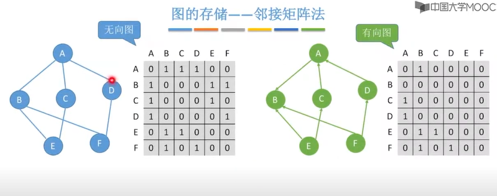
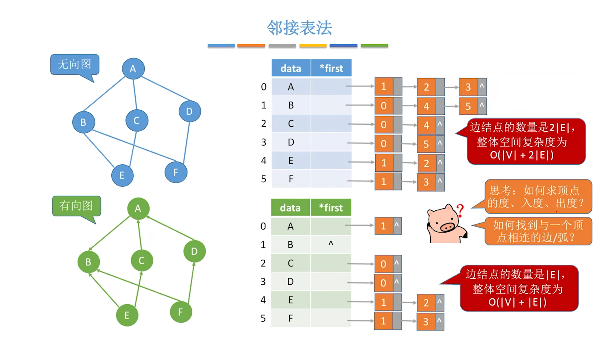
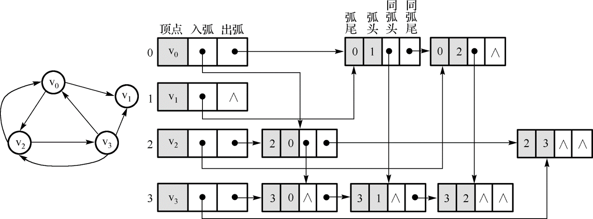
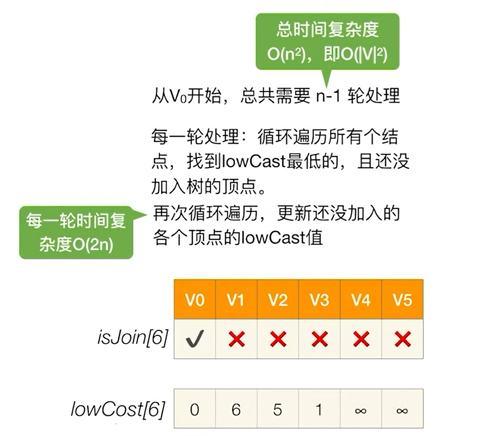
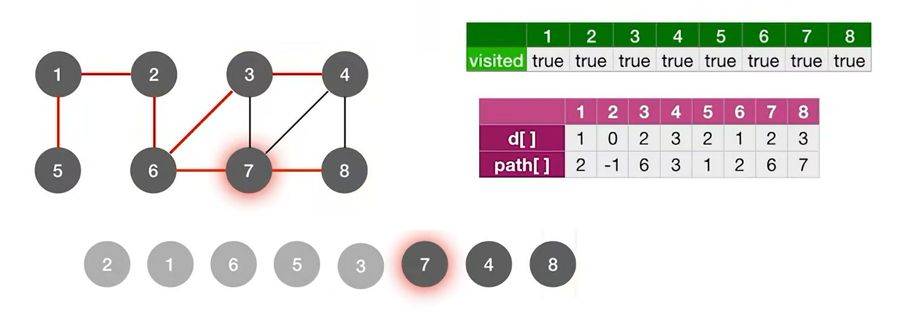
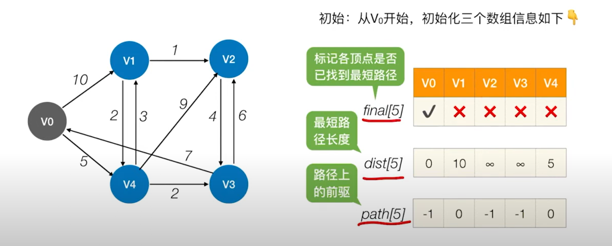
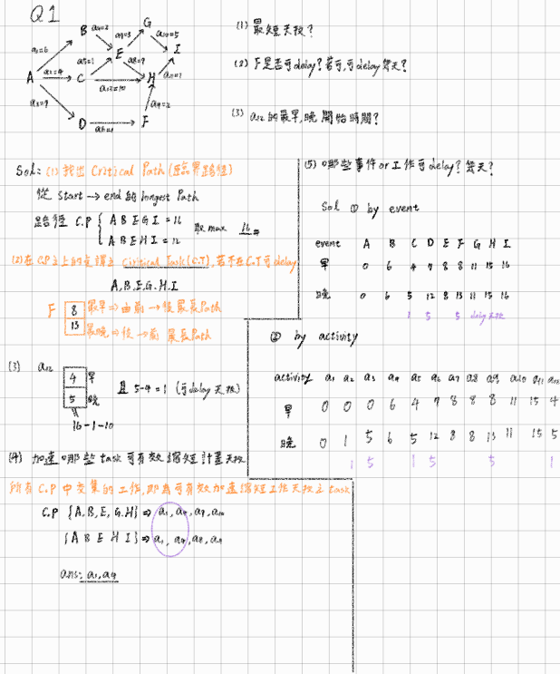

# 圖

上次編輯時間: 2025年10月3日 下午2:16
建立時間: 2025年8月3日 下午10:20

# 圖（Graph）

**圖（Graph）** 是一種**非線性資料結構**，用來表示**物件（節點）之間的關係（連結）**。

它在計算機科學、網路技術、人工智慧、交通規劃等領域中都有廣泛應用。

---

🧩 圖的基本定義

圖由兩個主要組成部分構成：

1. 頂點（Vertex）或節點（Node）：

- 表示一個物件或實體
- 記為集合 `V`
- 例如：`V = {A, B, C, D}` 表示有四個節點

2. 邊（Edge）：

- 表示兩個頂點之間的連結或關係
- 記為集合 `E`
- 例如：`E = {(A, B), (B, C), (C, D)}` 表示有三條邊

---

✅ 圖的數學表示法

一個圖 `G` 通常定義為：

G=(V,E)G = (V, E)

其中：

- `V` 是頂點集合
- `E` 是邊集合

---

📌 圖的常見類型

| 圖類型 | 說明 |
| --- | --- |
| 無向圖 | 邊沒有方向，例如 `(A, B)` 表示 A 和 B 互相連結 |
| 有向圖 | 邊有方向，例如 `(A → B)` 表示 A 指向 B |
| 加權圖 | 邊具有數值權重，例如 `(A → B, weight=5)` |
| 稀疏圖 | 邊的數量遠小於理論最大值 |
| 稠密圖 | 邊的數量接近最大可能值 |
| 完全圖 | **每一對頂點之間都有一條邊相連**，也稱為「全連通圖」 |
| 子圖 | **從原圖中抽出的一部分圖**，包含原圖中的部分頂點與邊 |

---

🔗 連通性相關定義

**● 連通圖（Connected Graph）：**

> 在無向圖中，任意兩個頂點之間都有路徑連接。
> 

---

### 一、連通分量 / 連通元件（Connected Component, CC）

- **對象**：**無向圖**。
- **定義**：極大連通子圖；子圖內任兩點都有路徑可達，且再加任何鄰點就不再連通。
- **性質**：
    - 一張無向圖可被唯一分割成若干個 CC。
    - CC 數 = 外層對所有點做 **BFS/DFS** 時「啟動次數」。
- **演算法**：BFS/DFS (O(V+E))。
- **不連通時**可做 **生成森林**（每個 CC 各一棵生成樹）。

---

### 二、強連通 / 強連通分量（Strongly Connected, SCC）

- **對象**：**有向圖**。
- **強連通（兩點）**：$(u \rightsquigarrow v) 且 (v \rightsquigarrow u)$ 都存在有向路徑。
- **強連通分量（SCC）**：極大強連通子圖；子圖內任兩點皆彼此可達。
- **性質**：
    - 將有向圖縮成 SCC 為節點，得到的**凝縮圖**是 **DAG**。
- **演算法**：
    - **Kosaraju**：兩次 DFS（正圖一遍、反圖依完成時間一遍），(O(V+E))。
    - **Tarjan**：一趟 DFS + 棧，(O(V+E))。
- **弱連通**：把邊方向忽略後視為連通（常用來「分組」但不等於強連通）。

---

### 三、生成樹 / 生成森林（Spanning Tree / Forest）

- **對象**：**無向圖**（經典定義）。
- **生成樹**：在**連通無向圖**中，含**全部頂點**、**恰 (V-1) 條邊**、**無環**且**連通**的子圖。
    - **最小生成樹（MST）**：邊權總和最小的生成樹（Prim / Kruskal）。
- **生成森林**：原圖**不連通**時，對每個 CC 各取一棵生成樹的集合。
- **有向圖對應**（了解即可）：**有向生成樹**又稱 **分支樹/樹形圖（Arborescence）**，相對應問題為 **最小分支樹**$（Edmonds/Chu–Liu）$。

---

### 四、名詞快對照

| 名詞 | 圖類型 | 內部可達條件 | 最大性 | 如何求 |
| --- | --- | --- | --- | --- |
| 連通分量（CC） | 無向 | 任兩點互相可達（無向） | **極大**連通子圖 | BFS/DFS，數啟動次數 |
| 強連通分量（SCC） | 有向 | 任兩點皆有**雙向有向路** | **極大**強連通子圖 | Kosaraju / Tarjan |
| 生成樹（ST） | 無向、且整圖連通 | 覆蓋所有頂點、無環、(V-1) 邊 | – | 任一 CC 上做 DFS/BFS 拿樹邊；MST 用 Prim/Kruskal |
| 生成森林 | 無向、且整圖不連通 | 各 CC 各自一棵生成樹 | – | 對每個 CC 取生成樹 |

---

🖼 圖的範例圖（文字版）

```
      A
     / \
    B   C
         \
          D

V = {A, B, C, D}
E = {(A, B), (A, C), (C, D)}
```

---

# 圖的存儲方式（Graph Storage Methods）

圖的儲存方式影響圖的處理效率，常見有以下三種：

---

1️⃣ 鄰接矩陣（Adjacency Matrix）

📘 定義：使用一個 **n × n 的矩陣**（n 是頂點數）表示邊的存在與否。

✅ 特點：

- 矩陣元素 `A[i][j] = 1` 表示從頂點 i 到 j 有邊（無邊則為 0）
- 適用於**稠密圖**
- 判斷是否有邊：**快速（O(1))**
- 空間複雜度${O(|V^2|)}$



- **出度 → 看橫排（row）有幾個 1**
- **入度 → 看直排（column）有幾個 1**

---

2️⃣ 鄰接表（Adjacency List）

定義：每個頂點對應一個「串列」，列出與其相連的所有鄰接點。

✅ 特點：

- 適用於**稀疏圖**
- 節省空間（空間複雜度 O(V + E)）
- 適合遍歷鄰接點



- **出度 →**  **看該頂點的鄰接串列有幾個孩子**
- **入度 → 遍歷整個鄰接表，看有幾個串列提到該頂點**

---

3️⃣ 十字鏈表（Orthogonal List）

 **定義**：是一種**針對有向圖的進階儲存方式**，每個**邊節點**會同時紀錄：

- 所屬起點的「出邊串列」與所屬終點的「入邊串列」
- 可以先沿者入弧在由同弧頭找到入度序列

✅ 特點：

- 可同時快速遍歷出邊與入邊
- 適用於**有向圖且需要頻繁查詢出入度**的場景
- 節點結構比鄰接表複雜，但功能更強大



---

4️⃣鄰接多重表（Adjacency Multilist）

📘 定義：

**鄰接多重表** 是一種**無向圖專用的儲存結構**，它對於每一條**邊只儲存一次**，但又能從**任一端點出發存取該邊**，因此節省空間並提高查詢效率。

✅ 適用情境：

- **無向圖**
- 需要頻繁**遍歷某個頂點的所有鄰邊**
- 對於邊的**共享性高（只存一次）**要求明確


---

**圖的儲存方式比較表**


---

# 圖的遍歷(Traversal)

---

**一、Breadth-First-Search**

- **類似水波擴散**

**訪問順序**：受**圖的存儲**影響

- **矩陣**：鄰接掃描固定（通常由小→大）。
- **鏈表/向量**：依容器中的鄰接次序，不一定固定。

---

**時間複雜度(Time Complex)**

**矩陣:訪問頂點鄰接需要O(|V|) ，共有|V|個頂點→$O(|V^2|)$**

**鏈表:訪問所有頂點鄰接需要O(|2E|)，共有|V|個頂點→$O(|E|+|V|)$**

---

**空間複雜度**

若為星狀圖則輔助隊列 會加入全部|V|→$O(|V|)$


**演算法**

類似層序遍歷

- 製作一個 visit 標記
- 依訪問順序加入 輔助隊列
- 依出隊順序訪問

1) 主程序：遍歷整圖並計數連通分量

```c
bool visited[MAXV];

int BFSTraverse(Graph G) {           // 回傳：連通分量數（無向圖）
    for (int i = 1; i <= G.vnum; ++i) 
    visited[i] = false;
    InitQueue(Q);
    int comp = 0;
    for (int i = 1; i <= G.vnum; ++i) {
        if (!visited[i]) {
            BFS(G, i);
            comp++;                  // 每啟動一次 BFS，就發現一個新的連通分量
        }
    }
    return comp;
}

```

2) 單次 BFS（從起點 v 出發）


```c
void BFS(Graph G, int v) {
    visit(v);              
    visited[v] = true;
    Enqueue(Q, v);

    while (!IsEmpty(Q)) {
        int u = Dequeue(Q);
        for (int w = FirstNeighbor(G, u); w != -1; w = NextNeighbor(G, u, w)) {
            if (!visited[w]) {
                visit(w);
                visited[w] = true;
                Enqueue(Q, w);
            }
        }
    }
}

```

---

**二、Depth-First Search**

- 像走迷宮——**一路到底，不通就回頭（回溯）**
- 類似先序遍歷

---

**訪問順序**：受**圖的存儲**影響

- **矩陣**：鄰接掃描固定（通常由小→大）。
- **鏈表/向量**：依容器中的鄰接次序，不一定固定。

---

**複雜度**

- **時間**
    - **鄰接矩陣**：對每個頂點掃一行 → **$O(|V^2|)$**
    - **鄰接串列**：每邊、每點各訪一次 → **$O(|E|+|V|)$**
- **空間**
    - `visited[]`：O(∣V∣)
    - **遞迴深度 / 類棧**：最壞 O(∣V∣)

---

**演算法**

```c
bool visited[MAXV];

int DFSTraverse(Graph G) {          // 回傳連通分量數
    for (int i = 1; i <= G.vnum; ++i) visited[i] = false;
    int comp = 0;
    for (int i = 1; i <= G.vnum; ++i) {
        if (!visited[i]) {
            DFS(G, i, -1);          // 從未訪點啟動一次 DFS
            comp++;                  // -> 發現一個連通分量
        }
    }
    return comp;
}
```

```c
void DFS(Graph G, int u, int parent) {
    visit(u);                       // 可輸出/記錄
    visited[u] = true;
    for (int w = FirstNeighbor(G, u); w != -1; w = NextNeighbor(G, u, w)) {
        if (!visited[w]) {
            DFS(G, w, u);
        }
    }
}
```

---

# 最小生成樹(Minimum Spanning Tree)

---

- **最小生成樹（MST）**：在**連通無向圖**中，選出一些邊使**所有頂點連通**且**總權重最小**。
    
    ➜ 任一生成樹都有 **n−1** 條邊（n=頂點數）。
    

**性質:**

1. **「權值互不相同，最小生成樹唯一」**
2. **「有權值相同的邊，最小生成樹可能唯一」** 
    
    
    
3. **「最小生成樹中，某些被選邊的權重可以大於某些未被選邊的權重」** 
4. 若**原圖**「連通且邊數 = n−1」(一棵樹)，此時**唯一**的生成樹就是它本身（因此 MST 唯一）

**經典演算法**

### **prim's**

- **挑代價最小頂點加入set中，且此頂點的邊要和已選的頂點集合交集**

時間複雜度:$O(|V^2|)$



### Kruskal’s

- **挑選最小的邊且未被連通**

時間複雜度:$O(|E|log|E|)$


### **BFS**

**何時可用**：目標是在圖中找到從起始節點到其他所有節點的最短路徑。無向/有向圖、**邊等權或無權**（找「邊數最少」的路徑）。

---



**「排隊量距，先到為短；首次見面，父指一路。」**

- **排隊量距**：用**隊列**分層排隊，距離 `d` 就是**層數**（起點層 0）。
- **先到為短**：**第一次**把某點「發現並入隊」時，就拿到**最短距離**（因為無權或等權邊 → 分層擴散）。
- **首次見面**：第一次遇到 `w` 時
    
    `d[w] = d[u] + 1`、`path[w] = u`、把 `w` **立刻標記已訪**並**入隊**。
    
- **父指一路**：要路徑就從終點沿 `path[]` **倒著追**回起點。

```c
//求顶点 u 到其他顶点的最短路径
void BFS_MIN_Distance(Graph G,int u){
    //d[i]表示从u到结点的最短路径
    for(i=0;i<G.vexnum;++i){
        d[i]=∞;              //初始化路径长度
        path[i]=-1;          //最短路径从哪个顶点过来
    }
    d[u]=0;
    visited[u]=TRUE;
    EnQueue(Q,u);
    while(!isEmpty(Q)){
        DeQueue(Q,u);        //队头元素u出队
        for(w=FirstNeighbor(G,u);w>=0;w=NextNeighbor(G,u,w)) //检测u所有邻接点
            if(!visited[w]){
                d[w]=d[u]+1; //路径长度加1
                path[w]=u;   //最短路径应从u到w
                visited[w]=TRUE; //设已访问标记
                EnQueue(Q,w);    //顶点w入队
            }
    } //while
}

```

---

### Dijkstra

適用於帶**正權重的有向或無向圖**。目標是在圖中找到從起始節點到其他所有節點的最短路徑。

- `dist[]`：源點到每個節點的最短距離（初始化為 ∞）
- `visited[]`：記錄是否已確定最短路徑
- `prev[]`（可選）：記錄前驅節點（用於還原路徑）



**✅ Dijkstra 演算法步驟**

**🟢 初始設定**

1. **選擇起點** `S`，設 `dist[S] = 0`（其餘點設為 ∞）
2. `visited[S] = false`（起初所有點都未訪問）

---

**🔁 重複以下操作直到所有節點都訪問：**

1. **選**（Pick）
    
    在未訪問(鎖定)中，**挑 dist 最小的 u**（離起點最近的邊界點）。
    
    
    
    在這裡V1~V4還未訪問且V4的dist最小
    
2. **鎖**（Freeze）
    
    把 **u 標記已確定**：`visited[u]=true`。含義：因為是單元最短路徑起點到 u 的最短路 **已定不變**。
    
3. **鬆**（Relax）
    
    對每個鄰點 v，檢查
    
    `dist[v] > dist[u] + w(u,v)` → 就更新：
    
    `dist[v] = dist[u] + w(u,v)`，`prev[v]=u`。
    

---

**Time Complexity**

- 需做n-1 輪處理
- 每round 會scan `visited` O(n) 找出未確定的V，並檢查此V相鄰的頂點(鄰接矩陣需要O(n))
    
    final→$O(n^2)$
    

---

**❗ 為什麼 Dijkstra 不能處理負權圖？**

**🧠 關鍵原因：**

Dijkstra 是基於「**一旦確定最短路徑，就不會再被更新**」的假設。

- Dijkstra 需要的性質是**單調性**：被取出的距離值是非遞減序列。負權邊會打破單調性，導致取出的順序可能不是「真正從近到遠」。
- 若有**負環**（總權重 < 0 的迴路），則從源點可達的最短路甚至**不存在**（可無限繞圈降成本）；這種情況下當然任何最短路演算法都無法給出有限解。

**❌ 二、負權環的問題在哪裡？**

如果從某一點出發可以**無限次繞一圈負環**，則：

- 每繞一次，總路徑就會 **越來越小**（距離不斷下降）
- ➤ 最短距離就變成 **負無窮（−∞）**

> ⚠ 這使得「最短路徑」沒有意義，因為沒有最短，永遠可以更短。
> 

[https://youtu.be/VmZ08J94ngU](https://youtu.be/VmZ08J94ngU)

---

### Floyd

是一種 **動態規劃演算法**，用於計算**任意兩點間的最短路徑**，適用於：

- 有向圖或無向圖
- 可以包含**負權邊**
- **不能有負環**

---

🧠 演算法核心思想（動態規劃）

對於任意兩個頂點 i 和 j，判斷經過頂點 k 是否可以讓路徑更短：

$D[i][j] = \min(D[i][j],\; D[i][k] + D[k][j])$

這表示：

「i 到 j 的最短距離」要從：

- 原本的距離 D[i][j]，和
- 經過中繼點 k 的距離 D[i][k] + D[k][j]

二者中選擇較小者。

---

**🧭 Floyd 演算法步驟**

初始化：


$A^{-1}$計算在沒有中轉點每個節點的最短路徑，$path^{-1}$ 建立中轉點矩陣

建立一個鄰接矩陣 `A[n][n]`：

- 若 i 到 j 有邊：設為權重
- 若 i == j：設為 0
- 無邊則設為 ∞

---

三層迴圈核心演算法：

```cpp
for (int k = 0; k < n; k++)       // 中繼點
    for (int i = 0; i < n; i++)   // 遍歷全部矩陣，i為行row號，j為列column號
        for (int j = 0; j < n; j++){
            if (D[i][j] > D[i][k] + D[k][j])
                D[i][j] = D[i][k] + D[k][j];
                path[i][j]=k;
                }

```

---

⏱ 時間與空間複雜度

| 項目 | 複雜度 |
| --- | --- |
| 時間複雜度 | O(n³) |
| 空間複雜度 | O(n²) |

---

[https://youtu.be/SdZRgL6UV6Y](https://youtu.be/SdZRgL6UV6Y)

你問的是「**有向無環圖（DAG）描述表達式**」，這通常指的是如何用一個 **DAG 來表示一個數學/邏輯表達式的計算流程**，也就是：

> 使用 DAG（Directed Acyclic Graph）來表示一個 表達式的結構與重複子式共用
> 

---

# 📘 有向無環圖（DAG）表達式表示法

✅ 應用目的：

- 表示 **運算順序**
- 避免重複計算（例如：共用子表達式）
- 常用於編譯器、優化中間碼、語法樹壓縮等

---

**🔢 例子：**

表達式：

$(a + b) \times (a + b)$

---

🎯 使用「樹」表示的話：

```
     *
    / \
   +   +
  / \ / \
 a  b a  b

```

> 👉 a + b 被重複出現兩次 → 重複子式
> 

🎯 使用「DAG」表示的話：

```
     *
    / \
   \   /
    +
   / \
  a   b

```

> 👉 a + b 這個子式只出現一次，被兩個路徑共用！
> 

---

🧠 關鍵特性：

| 特性 | 說明 |
| --- | --- |
| 有向 | 算式計算有先後順序（從葉節點到根） |
| 無環 | 運算不能循環依賴 |
| 子表達式共用 | 同一個子式不會重複建樹 |

---

✅ 實際用途：

- 編譯器中中間碼優化
- 表達式計算圖（如 TensorFlow 的 computational graph）
- 簡化代數表達式、優化運算

---

# 拓撲排序（Topological Sorting）

---

**目的**

- 針對DAG 的排序法。在 DAG 上因為沒有 cycle 所以可以讓所有 edge 朝向同一個方向延伸，所有點就會有先後次序，這種排序就稱為 Topological Sorting。

**特性**：

- 若在任一時刻有**多於一個**入度 0 的點，則拓撲序**不唯一**。
- 常用於**檢測環**、**依賴解析**、**課程先修排程**。

---

**算法**

**步驟**


1. 計算每個頂點 `indeg[v]`。
2. 將所有 `indeg=0` 的點入隊(s)（或入堆/棧）。
3. while 隊列(s)不空：
    - 取出一個頂點 `u`，輸出到序列；
    - 對 `u` 的每條出邊 `u→w`：`indeg[w]--` (類似於刪除結點所以被它相鄰的節點入度都要被 - - )，若降為 0 則入隊。
4. 若輸出頂點數 < `|V|` ⇒ 有**環**。
    
    **時間/空間**：`O(V+E)` / `O(V)`。
    

---

# AOV & AOE  網路

---

**1) 基本概念（模型）**

- **AOE（Activity-On-Edge）網**：
    - **邊=活動**（帶權，為活動所需時間），**點=事件**（活動開始/結束時刻）。
    - 通常只有一個**起點**（僅出度）與一個**終點**（僅入度）。
    - 必為 **DAG**；有環則工程無法按先後約束開展。
- **路徑長度**：沿路徑邊權之和。
- **關鍵路徑**：從起點到終點**總長度最大的路徑**；其上活動稱**關鍵活動**。

---

**2) 需要求的量（符號與公式）**

- **事件的最早發生時刻**：`ve(v)`
    
    > 前驅取max
    > 
- **事件的最遲發生時刻**：`vl(v)`
    
    > 關鍵路徑回推到該點  Ex:關鍵路徑ABEGHI=16，  求F，ADFHI 則關鍵路徑 -(I-H),-(H,F)求得
    > 
- **活動 i = (u→v, 時長 $w_i$)**
    - **最早開始時刻**：`e(i) = ve(u)`
    - **最遲開始時刻**：`$l(i) = vl(v) - w_i$`
    - **時差/餘量**：`d(i) = l(i) - e(i)`
        - `d(i) = 0` ⇒ **關鍵活動**
- **工程總工期**：`T = ve(終點)`（= 關鍵路徑長度）

---



---

4) 常考性質／易錯點

- **不唯一性**：關鍵路徑可**多條**；只要路徑長度都等於 `T`。
- **壓縮工期**：
    - **只縮短關鍵活動**才可能縮短總工期；
    - 多條關鍵路徑時，需同時處理它們**共同穿越**的活動，或逐步更新後再次判斷新的關鍵路徑。
- **虛活動**（時長=0）可用來表達純前後約束。
- **與 AOV 的差異**：
    - **AOV**：點=活動、邊=先後（做拓撲排序本體）。
    - **AOE**：邊=活動、點=事件（做 CPM 求工期與關鍵路徑）。
- **複雜度**：基於鄰接表與拓撲序，**O(V+E)**。
- **判斷工期**：`T = ve(終點)`；若計算中出現負餘量（理論上不會），多為建模或實作錯誤。

---

6) 速記

- **前推取最大、後推取最小**；`T=ve(終點)`。
- **活動時差** `d = (vl[v]-w) - ve[u]`；**d=0 ⇒ 關鍵**。
- **只動關鍵才縮工期**；多條關鍵路徑要一併處理。

# 觀念總結 &錯誤題回顧

1.名詞與關係（有向 vs 無向）

- **生成樹（Spanning Tree）／最小生成樹（MST）**：
    
    針對**連通無向圖**：覆蓋**全部頂點**、**無環**、邊數**恰 V−1**。
    
    **MST**：在所有生成樹中**邊權總和最小**（不是「最少邊」；邊數固定V−1）。
    
    圖不連通時得到**生成森林**／**最小生成森林**。
    
- **連通（Connected）**：
    
    只談**無向圖**。任兩點之間存在無向路徑。
    
    **連通分量／連通元件（Connected Component, CC）**：**極大連通子圖**（再加任何外點就不連通）。
    
- **強連通（Strongly Connected）**：
    
    只談**有向圖**。任兩點 u,v 皆有路徑 $u\to v$ 且  $v\to u$。
    
    **強連通分量（SCC）**：**極大**強連通子圖；把每個 SCC 縮成點會得到 **DAG**。
    

2. 度與邊的關係

- **無向圖**：$\sum_{v\in V}\deg(v)=2|E|$  (總度數和=2E)
- **無向完全圖邊的個數:  n(n-1)/2**
- **有向圖**：$\sum \text{outdeg}(v)=\sum \text{indeg}(v)=|E|$
1. 要會找入度出度 ，和理解時間空間複雜度且
    - 鄰接矩陣，鄰接表都可以處理有向無向圖，
    - 十字鏈表處理有向圖
    - 鄰接多重表處理無向圖
2. DFS可以測迴路(類似前序遍歷)，BFS可以算單元最短路徑。

最小生成樹

1. **「權值互不相同，最小生成樹唯一」**
2. **「有權值相同的邊，最小生成樹可能唯一」** 
    
    
    
3. **「最小生成樹中，某些被選邊的權重可以大於某些未被選邊的權重」** 
4. 若**原圖**「連通且邊數 = n−1」(一棵樹)，此時**唯一**的生成樹就是它本身（因此 MST 唯一）

1. Dijk 雖然是求單位最短路徑但可以遍歷 |V| 得到 全對最短路徑
2. 拓圤排序，可以用stack/queue 實作。
3. 拓排唯一，回推圖不一定唯一
4. 關鍵路徑不一定唯一

| 演算法 | 目標 | 鄰接矩陣 | 鄰接表 | 備註 |
| --- | --- | --- | --- | --- |
| **BFS** | 無權單源最短路/分層 | $(O(V^2))$ | (O(V+E)) | 先入先出佇列 |
| **DFS** | 遍歷/連通分量/SCC基礎 | $(O(V^2))$ | (O(V+E)) | 遞迴/棧 |
| **拓撲排序** | DAG 線性序 | $(O(V^2))$ | (O(V+E)) | 入度法或 DFS |
| **關鍵路徑（AOE/CPM）** | 工期/關鍵活動 | $(O(V^2))$ | (O(V+E)) | 需拓撲序 |
| **Dijkstra** | 單源最短路（非負邊） | $(O(V^2))$ | $(O((V+E)\log V))*$ | *堆實作；陣列掃描為 $(O(V^2))$ |
| **Prim** | 最小生成樹 | $(O(V^2))$ | $(O(E\log V))*$ | *堆 + 鄰接表；矩陣/陣列為 $(O(V^2))$ |
| **Floyd–Warshall** | 全對最短路 | ${O(V^3)})$ | 允負邊，不允負環 |  |
| **Kruskal** | 最小生成樹 | ${O(E \log E)})$ | 需並查集 |  |


