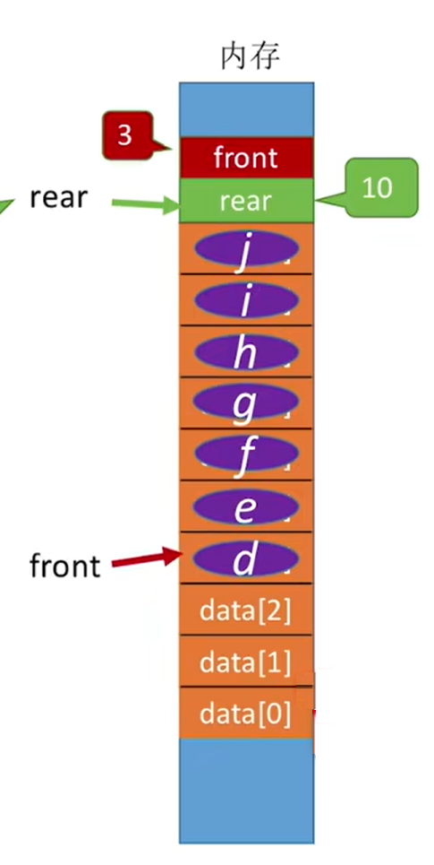

# 堆疊-Stack & 隊列 Queue

上次編輯時間: 2025年10月17日 下午6:58
建立時間: 2025年7月15日 上午9:44

# Stack

Stack  一種**先進後出**（LIFO, Last In First Out）的資料結構。

想像你堆盤子：

- 新的盤子總是放在最上面
- 拿的時候也只能從最上面拿

### #排列組合


| 特性 | 說明 |  |
| --- | --- | --- |
| **結構類型** | 線性結構 |  |
| **存取方式** | 先進後出 LIFO |  |
| **基本操作** | `push()`（壓入） `pop()`（彈出） |  |
| **進出限制** | 只能從「頂端」進出 |  |
| **應用場景** | 函式呼叫、Undo功能、括號配對等 |  |

ADT

| 操作 | 意義 |
| --- | --- |
| `push(x)` | 把 x 放到堆疊頂部 |
| `pop()` | 移除並回傳最上層元素 |
| `top()` | 查看最上層元素，不刪除 |
| `isEmpty()` | 檢查堆疊是否為空 |

## 實作(**Implementation**)

---

### **結構(structure)**

```c
#define MAXSIZE 20 
typedef struct Stack{
		int data[MAXSIZE];//Array型資料域
		int top;      //定位棧頂指標
} SqStack;
```

---

### **一、初始化(initial)**

```c
void initStack(SqStack &S){
	S.top=-1;
}
```

---

### **二、插入(Push)**

`push(SqStack &S,x)` 把 x 放到堆疊頂部

```c
bool push(SqStack &S,ElemType x){
		if(S.top<MAXSIZE-1){
			S.top=S.top+1;
			S.data[top]=x;
			return true;
		}
		else
				return false;
}
```

---

### 三、刪除(POP)

`pop(SqStack &S,ElemType x)` 移除棧頂元素並回傳

```c
bool pop(SqStack &S,Elemtype &x){
		if(S.top!=-1){
			x=S.data[top]; 
			S.top=S.top-1;
			return true;
		}
		else
			return false;
}
```

---

### #共享棧(Shared Stack)

- **同個記憶體空間，存放多個stack**
- 使用多個top控制

**兩個Stack:**

```c
Index:   0   1   2   3   4   5   6   7   8   9
         ↑                               ↑
       top1                           top2
      Stack1         ← 可共用 →         Stack2

```

```c
#define MAXSIZE 50
typedef int Elemtype;

typedef struct ShareStack {
    int data[MAXSIZE];
    int top1;
    int top2;
} ShStack;

// 初始化
void initShStack(ShStack &S) {
    S.top1 = -1;
    S.top2 = MAXSIZE;
}

// i==1 表示使用 Stack1 ，i==2 表示使用 Stack2
bool push(ShStack &S, int i, Elemtype e) {
    if (S.top1 + 1 == S.top2)
        return false; // 共用棧已滿

    if (i == 1) {
        S.data[++S.top1] = e;
        return true;
    } else if (i == 2) {
        S.data[--S.top2] = e;
        return true;
    } else {
        return false; // 無效棧號
    }
}

// 彈出操作
bool pop(ShStack &S, int i, Elemtype &e) {
    if (i == 1) {
        if (S.top1 == -1)
            return false; // stack1 空
        e = S.data[S.top1--];
        return true;
    } else if (i == 2) {
        if (S.top2 == MAXSIZE)
            return false; // stack2 空
        e = S.data[S.top2++];
        return true;
    } else {
        return false; // 無效棧號
    }
}

```

---

**多個Stack**

```c
#define N 50       // 總空間大小
#define K 3        // 要模擬的 Stack 數量

typedef int ElemType;
typedef struct {
    ElemType data[N];  // 實際資料
    int top[K];        // 各 stack 的頂端
    int next[N];       // 下一個元素或空格
    int free;          // 指向目前可用空位
} MultiStack;

// 初始化
void initStack(MultiStack* S) {
    for (int i = 0; i < K; i++)
        S->top[i] = -1;

    for (int i = 0; i < N - 1; i++)
        S->next[i] = i + 1;

    S->next[N - 1] = -1;
    S->free = 0;
}

// Push：把元素 e 推入第 i 個 stack（0-based）
bool push(MultiStack* S, int i, ElemType e) {
    if (S->free == -1) {
        printf("Stack Overflow\n");
        return false;
    }

    int index = S->free;         // 取得一個空格
    S->free = S->next[index];    // 更新 free

    S->data[index] = e;          // 存入資料
    S->next[index] = S->top[i];  // 串接到 stack i 的鏈表
    S->top[i] = index;           // 更新 top[i]

    return true;
}

// Pop：從第 i 個 stack 彈出元素
bool pop(MultiStack* S, int i, ElemType* e) {
    if (S->top[i] == -1) {
        printf("Stack Underflow (Stack %d)\n", i);
        return false;
    }

    int index = S->top[i];
    *e = S->data[index];

    S->top[i] = S->next[index];  // 移動 top[i]
    S->next[index] = S->free;    // 回收空間
    S->free = index;

    return true;
}

```

---

## Stack 應用

---

### 括號匹配

---

判斷左右括號是否對應

**🧠原理**

- 當`Scan`到左括號就`push(S)`，掃描到右括號就`pop(S)`
- 無法`pop(S)` 表右括號較多，若`Scan`完 Stack S ≠ `empty`  表左括號多。

```c
bool bracketCheck(char str[], int length) {
    SqStack S;
    InitStack(S);

    for (int i = 0; i < length; i++) {
        if (str[i] == '(' || str[i] == '[' || str[i] == '{') {
            Push(S, str[i]);  // 左括號入棧
        } else {  // 遇到右括號
            if (StackEmpty(S))
                return false;  // 右括號多

            char topElem;
            Pop(S, topElem);  // 彈出棧頂

            // 判斷是否成對
            if ((str[i] == ')' && topElem != '(') ||
                (str[i] == ']' && topElem != '[') ||
                (str[i] == '}' && topElem != '{')) {
                return false;
            }
        }
    }

    // 若掃描完畢棧仍非空 → 左括號多
    return StackEmpty(S);
}

```

---

### 表達式求值

---

**一、表達式**

- 前序 :`+ab`
- 中序 :`a+b`
- 後序 :`ab+`

---

**二、表達式轉換**

---

**中序轉 前/後序 (括號法)**

- 轉後序:`scan→` operator 依序代替最近的 ”`)`” 右括號
- 轉前序:`←scan`operator 依序代替最近的 ”`(`” 左括號


---

## #**中序轉 前/後序 (以stack 實現)**規則（逐字掃描）

**中序轉前**

1. **遇到「操作數」**（數字/變數/多位數整串）：**直接輸出**。
2. **遇到 `(`**：**push** 進棧。
3. **遇到 `)`**：**pop** 到輸出直到遇到 `(`，丟掉成對括號。
4. **遇到「運算子 op」**：和「棧頂 top」比優先順序/結合性：
    - **左結合**（`+ - * /`）：當 **top 的優先 >= op** 且 top ≠ `(` → **pop 到輸出**，再把 `op` push。
    - **右結合**（`^`）：當 **top 的優先 > op** 且 top ≠ `(` → **pop 到輸出**，再把 `op` push。
        
        （**同級不彈**，確保 `a^b^c` 變成 `a b c ^ ^`。）
        
5. **掃描結束**：把棧裡 **剩下的運算子全彈出** 到輸出（不會有括號殘留；若有代表原式不合法）。

> 提示：把 ( 視作「棧內最低優先」：遇到它就停止彈出。
> 
- 舉例
    
    ---
    
    ## 範例 1：中序 → 後序
    
    表達式：`a + b * (c - d) - e ^ f ^ g`
    
    > 規則重點回顧：^ 右結合 → 同級不彈；( 視為棧內最低。
    > 
    
    | 讀入 token | 棧（top 右側） | 輸出 |
    | --- | --- | --- |
    | a |  | a |
    | + | + | a |
    | b | + | a b |
    | * | + * | a b |
    | ( | + * ( | a b |
    | c | + * ( | a b c |
    | - | + * ( - | a b c |
    | d | + * ( - | a b c d |
    | ) | + * | a b c d - |
    | - | - | a b c d - * + |
    | e | - | a b c d - * + e |
    | ^ | - ^ | a b c d - * + e |
    | f | - ^ | a b c d - * + e f |
    | ^ | - ^ ^ | a b c d - * + e f |
    | g | - ^ ^ | a b c d - * + e f g |
    | （結束）彈空 |  | **a b c d - * + e f g ^ ^ -** |
    
    **後序結果：**`a b c d - * + e f g ^ ^ -`
    
    （注意 `e f g ^ ^` ：因 `^` 右結合，同級不彈，形成右結構）
    
    ---
    
    ## 範例 2：右結合特例
    
    `a ^ b ^ c`
    
    步驟會得到：`a b c ^ ^`（不是 `a b ^ c ^`），理由同上。
    
    ---
    
    ## 想要「中序 → 前序」怎麼做？
    
    ### 方法 A：三步小技巧（最常用）
    
    1. **反轉**字串（左右對調 token 序）
    2. **括號互換**：把 `(` ↔ `)`
    3. 對結果**套剛才「中序→後序」規則**得到一串「後序」；**最後再反轉**，就是前序。
    
    對 `a + b * (c - d) - e ^ f ^ g` 套用後可得：
    
    **前序：**`- + a * b - c d ^ e ^ f g`
    
    ### 方法 B：用「前序棧算法」（不經反轉）
    
    從右往左掃描：
    
    - 遇到**操作數**→ push
    - 遇到**運算子**→彈出兩個字串 `x,y`，組成 `op x y` 再 push
    - 遇到 `(`、`)` 依優先與結合處理（規則與後序相反）
        
        最後棧頂即為前序。
        
        （考場上更建議用**方法 A**，穩定又好記）
        
    
    ---
    
    ### 小結
    
    - 你列的彈棧規則是**中→後**的；想要**中→前**，用「反轉＋換括號＋後序＋再反轉」最省心。
    - 任何含 `^` 的右結合運算，都要記得**同級不彈**這個關鍵。

---

**中轉後序**

- 1.`Stack` 是用來存放 `Operator` 的，但有priority之分(當新`push`的`Operator`比原本的優先級低時 )
    - 將`Stack` 全部處理直到 `Operator` ≤ 新的`operator`，再加入新的`Operator` (確保`Stack` 優先級由高到低)
        
        

```c
int precedence(char op) {
    if (op == '*' || op == '/') return 2;
    if (op == '+' || op == '-') return 1;
    return 0;
}
//peek 為查看棧頂元素
void infixToPostfix(const char* expr) {
    Stack s;
    init(&s);

    for (int i = 0; expr[i] != '\0'; i++) {
        char c = expr[i];

        if (isalpha(c)) {
            printf("%c", c);  // 操作數直接輸出
        }
        else if (c == '(') {
            push(&s, c);
        }
        else if (c == ')') {
            while (!isEmpty(&s) && peek(&s) != '(') {
                printf("%c", pop(&s));
            }
            pop(&s); // 丟棄左括號
        }
        else if (c == '+' || c == '-' || c == '*' || c == '/') {
		        //確保stack priority 由高到低 
            while (!isEmpty(&s) && precedence(peek(&s)) >= precedence(c)) {
                printf("%c", pop(&s));
            }
            push(&s, c);
        }
    }

    while (!isEmpty(&s)) {
        printf("%c", pop(&s));
    }

    printf("\n");
}
```

---

**中轉前序**

**邏輯相同於後序，`scan`方向相反 右→左(這會導致順序相反所以需要額外多一個`stack` 處理 operation )**

---

**三、表達式運算**

需要兩個`Stack` 一個放`operation` ，另個放 `operator`

```c
int evaluatePostfix(const char* expr) {
    Stack s;
    init(&s);
    int i = 0;

    while (expr[i]) {
        char c = expr[i];

        if (isdigit(c)) {
            push(&s, c - '0');  // 轉數字
        }
        else if (c == '+' || c == '-' || c == '*' || c == '/') {
            int b = pop(&s);  // 注意順序：右
            int a = pop(&s);  // 左
            int result;

            switch (c) {
                case '+': result = a + b; break;
                case '-': result = a - b; break;
                case '*': result = a * b; break;
                case '/': result = a / b; break;
            }

            push(&s, result);
        }

        i++;
    }

    return pop(&s);  // 最後剩下的是答案
}

```

---

# Queue

Queue（佇列）是一種 **先進先出（FIFO, First In First Out）** 的線性資料結構。

就像排隊買票：

- 先來的先服務（front 出隊）
- 新來的只能排在隊尾（rear 入隊）

| 特性 | 說明 |
| --- | --- |
| 資料結構類型 | 線性 |
| 存取方式 | FIFO（先進先出） |
| 基本操作 | `enqueue()`（入隊）`dequeue()`（出隊） |
| 應用場景 | 線程排程、印表機任務、BFS、資源管理 |

ADT

| 操作 | 意義 |
| --- | --- |
| `enqueue(x)` | 將 x 加入尾端（rear） |
| `dequeue()` | 移除並回傳前端（front）元素 |
| `isEmpty()` | 判斷佇列是否為空 |

## 實作(**Implementation**)

> 移動 front 和rear  達到新增和刪除效果
> 
> 
> 
> 

**結構**

```c
#define MAXSIZE 20
typedef struct Queue{
		ElemType  data[MAXSIZE];
		int  front ;
		int  rear ;
		bool tag; //用來輔助判斷full ,empty   
}SqQueue;
```

---

### 一、初始化

```c
void InitQueue(SqQueue &Q){
		Q.front=Q.rear=0;
}
```

---

### 二、入隊(EnQueue)

`EnQueue(SqQueue &Q,ElemType e)` 將e加入隊尾

```c
bool EnQueue(SqQueue &Q ,ElemTpye e ){
		if((Q.rear+1)%MAXSIZE==Q.front && Q.tag)
				return false // Queue full
				
		Q.data[Q.rear]=e;
		Q.rear=(Q.rear+1)%MAXSIZE;
		Q.tag=true;
		return true;	
}
```

---

### 三、出隊(DeQueue)

`DeQueue(SqQueue &Q ,ElemType &e)` 移除並回傳前端（front）元素

```c
bool DeQueue(SqQueue &Q,ElemType &e){
		if(Q.rear==Q.front && Q.tag==false)
			return false; // Queue is empty
		e=Q.data[Q.front];
		Q.front=(Q.front+1)%MAXSIZE;
		Q.tag=false;
		return true;
}.304
21
```

## **循環隊列（circular queue）**

---

# 循環隊列核心觀念

- 用**陣列首尾相接**形成「環」，`front` 指向**隊首元素**，`rear` 指向**下一個可放入的位置**。
- 兩種常見判斷「滿/空」做法：
    1. **浪費一格法（最常用，簡單）**
        - 空：`front == rear`
        - 滿：`(rear + 1) % MAXSIZE == front`（容量 = `MAXSIZE - 1`）
    2. **tag 法（用一個布林記錄最後動作是入/出）**
        - 空：`front == rear && tag == 0`（最後一次是出隊）
        - 滿：`front == rear && tag == 1`（最後一次是入隊）

---

## ✅ 推薦：浪費一格法

> 簡單、穩定，不用 tag，但容量只有 MAXSIZE-1。
> 

```c
#include <stdbool.h>
#include <stdio.h>

#define MAXSIZE 20              // 注意：不是 =20
typedef int ElemType;

typedef struct {
    ElemType data[MAXSIZE];
    int front;                  // 指向隊首元素
    int rear;                   // 指向下一個可插入位置
} SqQueue;

void InitQueue(SqQueue *Q) {
    Q->front = Q->rear = 0;
}

bool IsEmpty(const SqQueue *Q) {
    return Q->front == Q->rear;
}

bool IsFull(const SqQueue *Q) {
    return ((Q->rear + 1) % MAXSIZE) == Q->front;
}

bool EnQueue(SqQueue *Q, ElemType e) {
    if (IsFull(Q)) return false;                        // 滿
    Q->data[Q->rear] = e;
    Q->rear = (Q->rear + 1) % MAXSIZE;
    return true;
}

bool DeQueue(SqQueue *Q, ElemType *e) {
    if (IsEmpty(Q)) return false;                       // 空
    *e = Q->data[Q->front];
    Q->front = (Q->front + 1) % MAXSIZE;
    return true;
}

// 目前長度
int Length(const SqQueue *Q) {
    return (Q->rear - Q->front + MAXSIZE) % MAXSIZE;
}

// 取隊首
bool GetFront(const SqQueue *Q, ElemType *e) {
    if (IsEmpty(Q)) return false;
    *e = Q->data[Q->front];
    return true;
}

```

---

## 若你想用 **tag 法**

> 容量可達 MAXSIZE，但要正確維護 tag：入隊後 tag=1，出隊後 tag=0。
> 

```c
#include <stdbool.h>
#define MAXSIZE 20
typedef int ElemType;

typedef struct {
    ElemType data[MAXSIZE];
    int front;
    int rear;
    bool tag;   // 1: 最後一次是入隊；0: 最後一次是出隊
} SqQueue;

void InitQueue(SqQueue *Q) {
    Q->front = Q->rear = 0;
    Q->tag = 0;                     // 視為空
}

bool IsEmpty(const SqQueue *Q) {
    return (Q->front == Q->rear) && (Q->tag == 0);
}

bool IsFull(const SqQueue *Q) {
    return (Q->front == Q->rear) && (Q->tag == 1);
}

bool EnQueue(SqQueue *Q, ElemType e) {
    if (IsFull(Q)) return false;
    Q->data[Q->rear] = e;
    Q->rear = (Q->rear + 1) % MAXSIZE;
    Q->tag = 1;                     // 最後動作是入隊
    return true;
}

bool DeQueue(SqQueue *Q, ElemType *e) {
    if (IsEmpty(Q)) return false;
    *e = Q->data[Q->front];
    Q->front = (Q->front + 1) % MAXSIZE;
    Q->tag = 0;                     // 最後動作是出隊
    return true;
}

```

---

---

## 時間複雜度與優點

- `enqueue/dequeue/getFront/isEmpty/isFull` 都是 **O(1)**。
- 循環隊列避免了線性隊列「假溢位」與整段搬移，**更適合長時間運行的緩衝區**（印表機列隊、BFS、工作隊列、環形緩衝）。

---

# 觀念總結&錯誤題回顧

1. 鏈棧是以前插法操作的
2. 上溢:嘗試像已滿棧插入元素
3. 下溢:嘗試在空棧取出元素
4. 循環隊列 空滿判斷 Empty : rear=front   ，Full : front=(rear+1) mod `MaxSize`
5. Stack的表達式求值和 轉前/後序


D. front 和rear 是用 `malloc/new` **分配器會回傳任意可用位址**（受碎片/對齊/釋放重用影響），不保證與前一個節點相鄰。所以無法


結論先說：這題是**輸出受限雙端佇列（output-restricted deque）**。

a→e 依序入隊，但可選擇「從左端或右端入」，**全部入完才出**（只許從一端出）。

因此最後的出隊序列 = 入完時佇列從 front 到 rear 的排列。

一眼判斷規則（超快）

由於每次只把新元素丟到**最左或最右**，入完後的序列一定是：

> 左邊一段是「按到來順序的反向」(嚴格遞減索引) + 右邊一段是原順序(嚴格遞增索引)
> 
> 
> ——整體**只允許一次由降轉升**。
> 

把 a,b,c,d,e 當索引 1,2,3,4,5，檢查四個選項：

- A `b,a,c,d,e` → 2,1,3,4,5：先降(2>1)後全升 ✅
- B `d,b,a,c,e` → 4,2,1,3,5：先降(4>2>1)後全升 ✅
- **C `d,b,c,a,e` → 4,2,3,1,5：先降(4>2)→升(2<3)→又降(3>1) ⇒ 兩次轉折，❌ 不可能**
- D `e,c,b,a,d` → 5,3,2,1,4：先降(5>3>2>1)後升 ✅

所以**答案：C 不可能**。