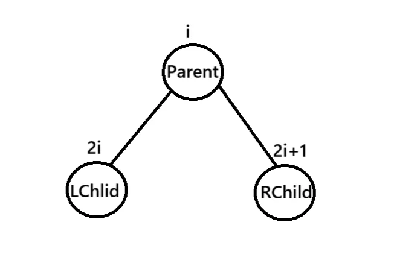

# 排序

上次編輯時間: 2025年11月5日 下午6:20
建立時間: 2025年9月1日 下午2:02

# 一、排序基本概念

### 1) 什么是排序

- 依据关键字把一组记录**按非降（升序）或非升（降序）重排，使关键字有序**。
- 现实里关键字**可以相同**（如游戏战力、财富值）。

### 2) 评判排序算法的三个维度

- **时间复杂度**：平均/最坏/最好。
- **空间复杂度**：额外内存使用。
- **稳定性**（高频选择题）
    - 定义：若两个记录关键字相等，**排序后其相对次序不变** ⇒ 稳定；否则不稳定。
    - 何时重要：需要多关键字排序（先按A，再按B），或相等键还承载其他信息时。
    - 若问题保证键**不重复**，稳定/不稳定**效果等价**。

### 3) 排序的两大类

- **内部排序**：数据量适中，可一次性放入内存。
    - 关注点：时间/空间复杂度。
- **外部排序**：数据量大，需存放在**外存（磁盘）**，分批处理。
    - 额外关注：**磁盘I/O次数最少化**（磁盘远慢于内存）。
    - 基本思路：分块读入→块内排好→多路归并（细节后续小节讲）。

---

# **二、插入排序**

# 核心思想

把当前元素插进**前面已排好序**的子序列里：

从第 2 个元素起，向左找插入位，**把所有比它大的右移一格**，再放入。

# 性质与结论

- **稳定**：相等元素相对次序不变（关键：只右移 `>` 当前值的元素，不移动 `==`）。
- **就地**：额外空间 **O(1)**。
- **时间复杂度**：最好 **O(n)**（原序有序，仅做 n−1 次比较）、最坏/平均 **O(n²)**。
- **适用场景**：数据量小、**近乎有序**、作为快排/归并的小规模收尾。

# 直接插入排序（数组，升序）伪码

```c
void InserSort(int A[],int n){
	int i,j,temp;
	for(i=1;i<=n;i++){  //A[i]小於前驅
		tmp=A[i];        //放入暫存器
		for(j=i-1;j>=0 && A[j]>A[i] ;--j){  //檢查**前面已排好序**
			A[j+1]=A[j];                      //大於tmp的都後移
		A[j+1]=temp;                        //最後j=-1 複製到插入位子 
		}
	}
}
```

# 带哨兵写法（1-based，更省一次边界判断）

- 数据放在 `a[1..n]`，把 `a[0]` 作为哨兵：

```c
void InserSort(int A[],int n){
	int i,j;
	for(i=2;i<=n;i++){  
		A[0]=A[i];        
		for(j=i-1; A[0]<A[j] ;--j){ 
			A[j+1]=A[j];                      
		A[j+1]=A[0];                        
		}
	}
}
```

> 作用：去掉 j >= 0 的反复判断，常数级提速，思想不变。
> 

# 折半插入排序（Binary Insertion）

前缀已有序，用二分**找位置**（但仍需整体右移，所以总复杂度仍是 **O(n²)**）。

- **稳定性关键**：用 **upper_bound**（相等时往右找），或等价地在相等时令 `low = mid + 1`。

```
for i = 1 .. n-1:
    temp = a[i]
    low = 0; high = i-1
    while low <= high:
        mid = (low + high) // 2
        if a[mid] <= temp:      // <= 保证稳定，继续往右
            low = mid + 1
        else:
            high = mid - 1
    // 结束于 low > high，插入位置是 low（书上常写 high+1，同义）
    for j = i-1 downto low: 
        a[j+1] = a[j]
    a[low] = temp

```

# 链表版

- 思想相同：从无序区取结点，插入到已排好序的链表中**合适位置**。
- 优点：插入只改指针，**不需要批量移动**元素。
- 但定位插入位仍需线性扫描 ⇒ 总体时间 **O(n²)**；二分不适用。

# 常见考点 / 易错点

- **稳定性**：内层条件必须是 `>`，写成 `>=` 会把相等也右移，变不稳定。
- **折半插入位置**：停在 `low > high`，**插在 `low`**（或 `high+1`，两者等价）。
- **为何折半仍是 O(n²)**：比较次数少了，但**右移**仍是线性量级。
- **哨兵前提**：用 1-based 或者预留 `a[0]`；0-based 原样照搬会越界。

## Shell Sort

# 核心思想（基于插入排序的优化）

让序列先**分组变“局部有序”**，再逐步缩小分组，最终在 `d=1` 做一次普通插入排序收尾。

做法：选一个**增量序列** `d1 > d2 > ... > 1`；每趟把“相距 d 的元素”视为同一子表，对每个子表做**直接插入排序**。

# 关键步骤（以升序为例）

1. 选增量 `d`（如 `n/2, n/4, ..., 1` 或 `3,1` 等）。
2. 对每个 `i = d..n-1`：把 `a[i]` 插入到子表 `..., a[i-2d], a[i-d]` 的正确位置（内层比较步长为 `d`，移动也按 `d` 右移）。
3. 将 `d` 缩小，重复直到 `d = 1`。

# shell sort

```c
void ShellSort(int list[], int n) {
    int gap = n / 2;  // 初始步長
    while (gap > 0) {  // 當 gap 為 0 時結束排序
        for (int i = gap; i < n; i++) {  // 依序訪問子分組
            if (list[i] < list[i - gap]) {  // 如果需要進行插入排序
                list[0] = list[i];  // 使用 A[0] 暫存目前元素
               
                for (int j = i; j >= gap && list[j - gap] > list[0]; j -= gap) {
                    list[j] = list[j - gap];  // 將元素向後移動
                }
                list[j] = list[0];  // 插入到正確位置
            }
        }
        gap /= 2;  // 縮小步長
    }
}

```

```csharp
void ShellSort(int a[], int n) {
    for (int gap = n / 2; gap > 0; gap /= 2) {          // 不斷縮小間距
        for (int i = gap; i < n; i++) {
            int temp = a[i];                            // 暫存當前值
            int j = i;
            while (j >= gap && a[j - gap] > temp) {     // 插入排序
                a[j] = a[j - gap];
                j -= gap;
            }
            a[j] = temp;
        }
    }
}
```

# 性质与复杂度

- **就地**：额外空间 **O(1)**。
- **不稳定**：不同子表跨步移动会打乱相等元素的相对次序。
- **时间复杂度**：依赖增量序列与数据分布，严格分析困难；
    - 最坏可退化到**直接插入**的量级（如一开始就用 `d=1`，或常见序列在极端输入下），即 **O(n²)**。
    - 实务中常见表现约 **O(n^1.3 ~ n^1.5)**（经验值，非严格上界）。
- **适用场景**：中等规模、对稳定性无要求、期望胜过纯插入排序。

# 与插入排序的关系

- 当 `d=1` 时，**等价于直接插入排序**。
- 通过“先粗后细”的分组，使元素更接近目标位置，从而**减少最终 `d=1` 时的移动量**。

# 实现细节 / 易错点

- 内层位移步长是 `d`：赋值时用 `a[j] = a[j-d]`，`j -= d`。
- 代码两种写法都对：
    
    1）像教材一样用单个外层 `i++` 轮转各子表；
    
    2）也可先**逐子表**（从每个起点 `start=0..d-1`）把该子表元素取出做插排，更直观。
    
- 只能高效地用于**顺序表/数组**（需要随机访问按步长跳），链表版代价高。

# **三、交換**排序

透過**比較相鄰或特定兩元素**，若次序錯誤就**交換**，持續消除**逆序對**，讓元素逐步到正確位置的排序方法

## 冒泡排序（Bubble Sort）

## 核心思想與類別

- 屬於**交換排序**：比較相鄰元素的關鍵字，若逆序則交換。
- 一趟掃描後，會把「**極值**」冒到邊界：
    - 從**後往前**比：最小值冒到最前。
    - 從**前往後**比：最大值冒到最後。兩種寫法等價。

## 演算法流程

- 外層第 `i` 趟（從 0 開始）：只需處理到 `n-1-i`（因為前/後面的 i 個已就位）。
- 內層相鄰兩兩比較；若左 > 右則交換。
- **提早結束優化**：一趟中若**未發生任何交換**（`flag=false`），序列已全局有序，可提前停止。

## 複雜度與移動次數

- **時間**：
    - 最好：`O(n)`（原本有序；僅比較 `n-1` 次，0 交換）。
    - 平均：`$O(n^2)$`.
    - 最壞：`$O(n^2)$`（原本逆序；比較 `$n(n-1)/2$` 次；交換同數量級）。
- **空間**：`O(1)`（常數輔助變數）。
- **移動 vs 交換**：一次 `swap` 典型實作需**三次賦值**（A→tmp、B→A、tmp→B）；考題常問「移動次數」要與「交換次數」區分。

## 穩定性

- **穩定**：當相等時**不交換**（僅在 `left > right` 時交換），可保持相等鍵的相對次序。

## 鏈表可行性

- 思想可直接用於**單/雙向鏈表**：以相鄰節點比較，必要時交換**節點值**或**調整指標**。複雜度仍為 `O(n^2)`；保持只在「大於」時交換即可維持穩定。

## 常見變體與進一步優化

- **Cocktail Shaker Sort**（雙向冒泡）：一次從左到右再從右到左，收縮邊界；實務稍快，理論仍 `$O(n^2)$`。
- **lastSwapPos**：記錄本趟最後交換位置，下一趟內層邊界可縮到該位置，減少不必要比較。

## 典型偽碼（遞增排序）

```cpp
	void swap(int &a ,int &b){
			int temp=a;
			a=b;
			b=temp;
	}
	void BubbleSort(int A[],int n){
		for(int i=0;i<n-1;i++){
			bool flag=false;
			for(int j=n-1;j>i;j--){
				if(A[j]<A[j-1]){
					swap(A[j],A[j-1]);
					flag=true;
				}
			if(!flag){
				return;
			}
			}
		}
	}
```

## 易錯/考點提醒

- 記得**提早結束**的 `flag` 判斷（最佳情況達到 `O(n)`）。
- 「交換次數」≠「移動次數」；一次交換通常=3次移動。
- **穩定性**取決於相等時是否交換。
- 兩種方向的冒泡（小泡冒前/大泡冒後）要能互相理解與轉寫。

## **快速排序(Quick Sort)**

# 速览笔记（考点）

- **核心思想**：每次选一个**枢轴/基准**（pivot），做**一次划分**：把区间按“左 `< pivot`、右 `≥ pivot`”拆成两段；然后对左右子表递归（或迭代）继续划分。
- **一次划分 vs 一趟排序**
    - *一次划分*：对一个连续区间调用一次 `partition`，**只**确定一个枢轴的最终位置。
    - *一趟排序（按408原题口径）*：把当前**所有**尚未有序的元素**都**处理一遍，可能确定**多个**元素的位置。
- **复杂度**：
    - 最好/平均：`O(n log n)`；最坏（近乎有序/逆序且枢轴极端）：`$O(n^2)$`
    - 空间（递归栈）：平均 `O(log n)`，最坏 `O(n)`
- **稳定性**：**不稳定**（相等键的相对次序可能改变）。
- **常用优化**：
    1. 枢轴选择——**三数取中** 或 **随机枢轴**；
    2. **小区间改用插入排序**（如阈值 16）；
    3. **尾递归消除/显式栈**，降低栈深；
    4. 比较符号与不变量对应：本实现遵循“左 `< pivot`、右 `≥ pivot`”。

---

# C++ 实现合集

```cpp
int partitionHoare(T a[], int low, int high) {
    // 若需要更稳健的枢轴，先用 medianOfThreeToLow(a, low, high);
    // 这里给两个版本：一个基础版、一个三数取中版（见下面优化版）
	  int pivot = a[low];      // 挖坑：保存枢轴值
    while (low < high) {
        while (low < high && a[high] >= pivot) --high; // 找到 < pivot 的放左边坑
        a[low] = a[high];           // 填坑，左坑右移成新坑
        while (low < high && a[low] <= pivot) ++low; // 找到 > pivot 的放右边坑
	      a[high--] = a[low];           // 填坑，右坑左移成新坑
    }
    a[low] = pivot;             // 枢轴归位/=-0=3
    return low;                  // 返回枢轴最终位置
}

void quickSortBasic(T a[], int low, int high) {
    if (low >= high) return;
    int pivot = partitionHoare(a, low, high);
    quickSortBasic(a, low,  pivot- 1);
    quickSortBasic(a, pivot + 1, high);
}
```

## 使用说明

- 想和你课上**完全一致**（首元素为枢轴、挖坑法）的，就用 `quickSortBasic`。
- 考试/实战推荐 `quickSortOptimized`（三数取中 + 小区间插排 + 尾递归消除），既**不易退化**又**跑得快**。
- 极端长数据、栈深担心溢出*，用 `quickSortIterative`。

# 四、选择排序

每一趟從待排序序列中**選出最小（或最大）元素**，與本趟的**起始位置**元素交換，放到正確位置；重複直到全部有序。

## 简单选择排序

- 思想：每一趟在未排序区间里**选最小**元素，和未排序区间的**第一个**位置交换；共做 **n−1 趟**。
- 复杂度：比较次数**恒定** `n(n-1)/2`；交换次数 ≤ `n-1`；时间 `$O(n^2)$`、空间 `O(1)`。
- 稳定性：**不稳定**（最小元素与前面的交换可能打乱相等键次序）。
- 适用：实现简单；当数据量大或需稳定时不推荐（可用插入/归并/快排等）。

---

## 1) 基础版（不稳定，原地 `O(1)`）

```cpp
#include <iostream>
#include <vector>
#include <algorithm>
using namespace std;

void selectionSort(int a[], int n) {
    for (int i = 0; i < n - 1; ++i) {
        int minIdx = i;
        for (int j = i + 1; j < n; ++j) {
            if (a[j] < a[minIdx]) minIdx = j;
        }
        if (minIdx != i) swap(a[i], a[minIdx]); // 这一步导致不稳定
    }
}

```

## #堆排序(Heap-sort)

---

# 堆與堆排序

## 1) 核心定義與索引關係

- **堆（Heap）**：以**陣列順序存儲**的**完全二叉樹**，滿足堆序性。
    - **最大堆**：任一節點 ≥ 其左右孩子。
    - **最小堆**：任一節點 ≤ 其左右孩子。
- **常用 1-index 索引**：
    
    
    
    `left=2i`，`right=2i+1`，`parent=⌊i/2⌋`；
    
    **葉**：`i > ⌊n/2⌋`，**非葉**：`i ≤ ⌊n/2⌋`。
    

**與 BST 容易混淆：**

| 面向 | 最大堆 | 最小堆 | BST |
| --- | --- | --- | --- |
| 結構 | 完全二叉樹 | 完全二叉樹 | 一般二叉樹 |
| 有序性 | 父 ≥ 子 | 父 ≤ 子 | 左 < 根 < 右（中序有序） |
| 取極值 | 最大=根 O(1) | 最小=根 O(1) | 需走邊界 O(h) |
| 適用 | 優先佇列、選擇極值 | 限期/最小值維護 | 有序查找/遍歷 |

---

## 2) 核心操作：下沉調整（SIFT-DOWN/HEAPIFY）

**目標**：修復以 `k` 為根、大小 `n` 的**最大堆**。

**簡潔虛擬碼（最大堆, 1-indexed）**

```c
// 建立大根堆（1-indexed，A[1..len]）
void BuildMaxHeap(int A[], int len){
    for(int i = len/2; i > 0; --i)       // 從後往前調整所有非葉節點
        HeadAdjust(A, i, len);
}

// 將以 k 為根的子樹調整為大根堆（1-indexed）
// A[0] 作為暫存變數
void HeadAdjust(int A[], int k, int len){
    A[0] = A[k];                         // 暫存根結點
    for(int i = 2 * k; i <= len; i *= 2){ // 沿較大的子結點向下篩選
        if(i < len && A[i] < A[i + 1])   // 取較大的子結點下標
            i++;
        if(A[0] >= A[i])                 // 已可放置
            break;
        else{
            A[k] = A[i];                 // 子結點上移
            k = i;                       // 繼續向下
        }
    } 
    A[k] = A[0];                         // 放回暫存的值
}
```

**時間複雜度**：最壞下沉至多 `⌊log2 n⌋` 層，**O(log n)**；每層最多 2 次關鍵字比較（只有左孩子時為 1 次）。

---

## 3) 建堆（Build-Max-Heap）

```c
void BuildMaxHeap(int A[], int len)
```

**目的**：由無序陣列在線性時間構造最大堆。


9為此最後的父節點

**步驟**：對所有**非葉**自右而左呼叫 `HEAPIFY(A, i, n)`（`i=⌊n/2⌋ … 1`）。

**為何是 O(n)（直覺）**：

深層節點多但高度小；高層節點少而高度大。將「各節點可能下沉高度」加總 < `2n` ⇒ **O(n)**。

---

## 4) 堆排序（HeapSort）

**升冪**：用**最大堆**；**降冪**：用**最小堆**。

**流程（最大堆→升冪）**

1. `BUILD-MAX-HEAP(A)`
2. 對 `i = n … 2`：
    
    `swap(A[1], A[i])`；縮小堆界到 `i-1`；`HEAPIFY(A, 1, i-1)`。
    

**虛擬碼**

```c
void BuildMaxHeap(int A[], int len)
void HeadAdjust(int A[], int k, int len)
// 堆排序（升冪）：n-1 輪「堆頂↔堆尾」交換 + 修復堆頂
void HeapSort(int A[], int len){
    BuildMaxHeap(A, len);                 // 初始建堆 O(n)
    for(int i = len; i > 1; --i){         // n-1 輪
        swap(A[i], A[1]);                 // swap(A[1], A[i])
        HeadAdjust(A, 1, i - 1);          // 修復縮小後的堆
    }
}
```

**複雜度與性質**

- 建堆 **O(n)** + `n-1` 次 `HEAPIFY`（各 **O(log n)**）⇒ **O(n log n)**
- 空間 **O(1)**（原地）
- **不穩定**：等鍵時「選較大孩子／交換到根」會破壞原有相對次序。
- **輸出序**：最大堆→**遞增**；最小堆→**遞減**。

---

## 5) 易考點＆易錯點

- **索引判斷**：葉 `i > ⌊n/2⌋`，非葉 `i ≤ ⌊n/2⌋`。
- **建堆複雜度**是 **O(n)**，不是 O(n log n)。
- **每輪排序只需修復堆頂**（`HEAPIFY(1, 範圍)`）。
- **等鍵處理**：常見實作在 `A[i] < A[i+1]` 才改指向右孩子 ⇒ 等鍵偏左；可作為「不穩定」反例考點。
- **升冪/降冪對應**：升冪→最大堆；降冪→最小堆。
- **與簡單選擇排序比較**：同為每趟確定極值，但堆每趟只需 **O(log n)**，總體 **O(n log n)**。

**小表：堆排序與其他排序**

| 演算法 | 時間（平均/最壞） | 空間 | 穩定性 |
| --- | --- | --- | --- |
| 堆排序 | O(n log n) | O(1) | ✗ |
| 合併排序 |   O(n log n) | O(n) | ✓ |
| 快速排序 |   O(n²) | O(log n)~O(n) | ✗ |
| 插入排序 |  O(n²) | O(1) | ✓ |

---

## 6) 考場手算模板（速用）

1. **建堆**：`for i=⌊n/2⌋..1: HEAPIFY(i)`
2. **排序**：`for i=n..2: swap(1,i); HEAPIFY(1,i-1)`
3. **檢核**：交換後只修復**堆頂**；葉判斷用 `i > ⌊n/2⌋`。

---

## 7) 典型問答（速記）

- **為何建堆是 O(n)**？
    
    回答：各節點下沉高度加權求和 < 2n（深層多但高度低）。
    
- **堆排序為何不穩定？**
    
    回答：等鍵時孩子選擇與根交換會改變原始相對次序（常見實作優先左孩子）。
    
- **升冪用哪種堆？** 最大堆；**降冪？** 最小堆。

> 記憶錨點：「建堆 O(n)；每趟 O(log n)；總 O(n log n)；原地 O(1)；不穩定」。
> 

---

# 基本觀念速記

- **插入（insert）**：把新鍵放到**堆尾** → 依堆序性**上浮（sift-up）**到正確位置。
- **刪除（delete-root 或刪任一位置）**：用**堆尾**覆蓋被刪位置 → 對該位置**下沉（sift-down）**。
- **比較次數**（考點！）
    - **下沉一層**：
        - 有**兩個孩子**：先比較左右子一次，再與較優孩子一次 ⇒ **最多 2 次/層**。
        - 只有**左孩子**：只需與左孩子一次 ⇒ **1 次/層**。
    - **上浮一層**：只與父節點比較 ⇒ **1 次/層**。
- **時間複雜度**：插入、刪除皆 **O(log n)**（樹高）。
- **空間**：原地 **O(1)**。

## **歸併排序（Merge Sort）**

---

# 核心概念摘要

**歸併**即把多個**已排序**子序列合成一個有序序列。內部排序常用**二路歸併**：每趟把相鄰兩段合併；可用**遞迴（自頂向下）**或**迭代（自底向上）**實作。每趟合併做線性工作 **O(n)**、共 ⌈log₂n⌉ 趟 ⇒ **O(n log n)**；需長度為 n 的輔助陣列 ⇒ **O(n)** 空間；由於相等時取左段，**穩定**。

---

## 1) 核心定義與性質

- **二路歸併（2-way merge）**：從兩段首元素中取較小者寫回，直到一段耗盡，再拷回另一段餘量。
- **m 路歸併**：每次從 m 個段首取最小，至少需 **m−1 次比較** 才能決出一個元素（若用最小堆可降為 **O(log m)**/次）。
- **穩定性**：合併時對等鍵使用 `<=` 先取左段 ⇒ 穩定。
- **時間**：每趟合併 O(n)，趟數 ⌈log₂n⌉ ⇒ **O(n log n)**（最好=最壞=平均）。
- **空間**：輔助陣列 **O(n)**；遞迴棧 **O(log n)**（被 O(n) 主導）。

---

## 2) 兩個關鍵操作與虛擬碼

### (A) 合併兩段（穩定）


```c
static inline int max(int a, int b) { return a > b ? a : b; }

// 將 A[low..high] 的內容先複製到 B，同步從 B 合併回 A
static void Merge(int A[], int B[], int low, int mid, int high) {
    // 複製到輔助陣列
    for (int k = low; k <= high; ++k) B[k] = A[k];

    int i = low, j = mid + 1, k = low;
    // 合併兩段（B[low..mid] 與 B[mid+1..high]）
    while (i <= mid && j <= high) {
        if (B[i] <= B[j]) A[k++] = B[i++];
        else              A[k++] = B[j++];
    }
    // 收尾（左半段或右半段剩餘）
    while (i <= mid)  A[k++] = B[i++];
    while (j <= high) A[k++] = B[j++];
}

static void MergeSortRec(int A[], int B[], int low, int high) {
    if (low >= high) return;
    int mid = low + (high - low) / 2;
    MergeSortRec(A, B, low, mid);
    MergeSortRec(A, B, mid + 1, high);
    // 小優化：若已經有序就不必合併
    if (A[mid] <= A[mid + 1]) return;
    Merge(A, B, low, mid, high);
}

// 封裝：一次配置輔助陣列
void MergeSort(int A[], int n) {
    int *B = (int*)malloc(sizeof(int) * (size_t)n);
    if (!B) { perror("malloc"); exit(1); }
    MergeSortRec(A, B, 0, n - 1);
    free(B);
}
```

---

---

## 4) 比較次數 & 趟數（常考）

- 合併兩段長度共 n：**比較 ≤ n−1 次**。
- 二路歸併趟數：**⌈log₂ n⌉**。
- m 路歸併：**至少 m−1 次比較/輸出 1 元素**；若用**最小堆**挑最小，整體 **O(N log m)**。

---

## 5) 與其他排序對照

| 演算法 | 時間（最壞/平均） | 空間 | 穩定性 | 特點 |
| --- | --- | --- | --- | --- |
| 歸併排序 | O(n log n) / O(n log n) | **O(n)** | **✓** | 分治、外部排序友好 |
| 堆排序 | O(n log n) / O(n log n) | O(1) | ✗ | 原地、不穩定 |
| 快速排序 | O(n²) / O(n log n) | O(log n)~O(n) | ✗ | 平均快、就地 |

---

## 6) 易錯點與常見優化

- **邊界**：`while (i ≤ mid && j ≤ high)`；餘量用兩個 `while` 補齊。
- **mid 計算**：`mid = low + (high-low)/2` 防溢位。
- **穩定性來源**：合併時一定用 `≤` 先取左段。
- **略過合併**：若 `A[mid] ≤ A[mid+1]`，本輪已整段有序可跳過。
- **小段優化**：段長很小時可改用**插入排序**再合併。

---

## 7) 手算模板（考場速用）

1. 標出 `low, mid, high`；先把 `A[low..high]` 複成 `B`。
2. 三指標：`i=low`、`j=mid+1`、`k=low`，每步把較小值寫回 `A[k++]`。
3. 一邊耗盡後，**整段拷回**另一邊餘量。
4. 每趟工作量 O(當前區段長度)；總趟數 ⌈log₂n⌉。

> 記憶錨點：穩定、O(n log n)、輔助陣列 O(n)、每合併 ≤ n−1 比較、趟數 ⌈log₂n⌉。
> 

# 五、Linear Sort

## **基數排序（Radix Sort）**

---

# 1) 核心概念摘要

**基數排序**不比較鍵值大小，而是把鍵拆成 **d 個“位”（digits）**，每位的取值範圍為 **0…r−1**。對每一位依**權重遞增**（最低位→最高位，LSD）或**遞減**（MSD）次序，反覆進行**分配（入 r 個桶/隊列）與收集**。每趟線性掃描元素一次，總時間 **O(d·(n+r))**；需 r 個桶（再加暫存指標/陣列）與可能的鏈結節點空間，**空間 O(n+r)**；穩定。

---

## 2) 基本模型與術語

- 鍵拆為：`K = <k_{d-1}, …, k_1, k_0>`
    - `k_0`：最低位（最次要，個位）；`k_{d-1}`：最高位（最主要，百位/年）。
- **基數 r**：每位可取的不同值數（十進位例子 r=10）。
- **桶/隊列**：`Q[0..r-1]`，通常用**鏈式隊列**（front、rear 指標）以 O(1) 連接整段。

---

## 3) 演算法（LSD 版：最低位優先，最常見）

**目標遞增**：收集時由 **Q0 → Q1 → … → Q(r−1)**。

**目標遞減**：收集時由 **Q(r−1) → … → Q0**。

**每一趟（處理位 t）**

1. **分配**：順序掃描表中 n 個元素，令 `v = k_t(x)`，把節點 **掛到 Q[v] 的隊尾**。
2. **收集**：按需求的順序把 Q 的鏈**整條接回**主鏈（隊列級連接，O(1) 每桶）。
3. 進入下一位 `t+1`，直到 `t = d−1`。


> 穩定性來源：同一桶內使用入隊在後、出隊在前（FIFO）；等鍵在較低位已排定先後 → 穩定。
> 

---

## 4) MSD vs. LSD

| 版本 | 處理順序 | 適用 | 穩定性 | 實作要點 |
| --- | --- | --- | --- | --- |
| **LSD** | 低位 → 高位 | 整數、等長字串 | ✓（桶內 FIFO） | 一個表周而復始，最常考 |
| **MSD** | 高位 → 低位 | 可變長字串、前綴重要 | 取決於實作 | 需對每桶**遞迴**或再桶化，實作較複雜 |

---

## 5) 複雜度

- **時間**：每趟分配 `O(n)` + 收集 `O(r)`，共 `d` 趟 ⇒ **`O(d·(n + r))`**。
- **空間**：r 個桶指標 + 節點/陣列緩衝 ⇒ **`O(n + r)`**（若就地用索引桶，常寫作 `O(n + r)`；只算桶指標則 `O(r)`）。
- **穩定性**：**穩定**（“基你太穩”好記）。

---

## 6) 何時好用？（考點＋直覺）

- **n 大**、**d 小**（位數少）、**r 小**（每位取值域小且固定/可映射）。
- 例：日期排序（`日→月→年`，d=3、r≤31/12/15）、固定長度 ID、整數鍵分塊。
- **不適合**：
    - d 很大（如 18 位但 n 很小）；
    - r 很大（漢字姓名每位上萬碼點）；
    - 鍵難以拆位或映射。

---

## 7) 手算模板（LSD、遞增）

1. 標定 **r 個桶 Q0..Q(r−1)**。
2. 對位 `t=0` 到 `d−1`：
    - 逐掃元素，依 `k_t` 入對應桶**隊尾**。
    - 依 **Q0→…→Q(r−1)** 連桶回主鏈。
3. 完成後即有序（若要遞減，收集順序反向）。

---

## 8) 與“計數/桶/比較類”排序關係

| 演算法 | 需比較? | 時間 | 空間 | 穩定 | 要求 |
| --- | --- | --- | --- | --- | --- |
| **基數** | ✗ | `O(d·(n+r))` | `O(n+r)` | ✓ | 能拆位、r 小 |
| **計數** | ✗ | `O(n+r)` | `O(n+r)` | ✓ | 鍵域連續、r 不宜過大 |
| **桶排序** | ✗ | 期望 O(n) | 依桶數 | 視實作 | 假設均勻分布 |
| **比較類（快/歸/堆）** | ✓ | ≥ `Ω(n log n)` | 視實作 | 歸並✓、堆✗ | 無鍵域假設 |

---

## 9) 例題速演（十進位，三位數，**遞減**）

- 桶 `Q0..Q9`。
- 第 1 趟按**個位**分配，**收集順序 9→…→0** → 得“按個位遞減”。
- 第 2 趟按**十位**分配，同樣反向收集 → “十位遞減，十位相等時按個位遞減”。
- 第 3 趟按**百位**分配，反向收集 → 得整體**遞減**結果。

> 對比次數：不比較鍵值，所以不考比較計數；考點常在桶順序、穩定性與趟數。
> 

---

## 10) 易錯點與小訣竅

- **收集順序決定升降冪**（升冪 0→r−1，降冪 r−1→0）。
- **桶內必 FIFO**，否則破壞穩定。
- **位權順序**：LSD 必從最低位開始；MSD 需對桶做遞迴處理。
- **r 的設計**：實務可把任意值映射為連續索引（如月份 1..12→0..11）。
- **空間估算**：鏈式桶常把 O(n) 視為已有節點記憶體；若以陣列緩衝實作，明確計入 O(n)。

---

### 一句話記憶

> 「不比大小，按位分配；d 趟掃描，O(d·(n+r))；桶內 FIFO 保穩定；收集順序控升降冪。」
> 

## **計數排序（Counting Sort）**

---

# 核心概念摘要

**計數排序**適用「整數鍵、取值域小」的情形：先統計每個值的出現次數，再做**前綴和**得到「≤i 的元素個數」，最後**從右往左**把元素放到輸出陣列對應位置（確保**穩定**）。時間 **O(n+k)**、空間 **O(n+k)**（k 為鍵域大小）。當 *k ≲ n* 時非常高效；否則不如比較式排序。

---

## 思想與步驟（穩定版，LSD 類）


1. 設鍵域 `[0..k-1]`（或先求 `min..max` 做偏移）。
2. **統計**：`C[v] = count of value v`。
3. **前綴和**：`C[v] = # of elements ≤ v`。
4. **安放**：自右向左掃原陣列，令 `v=A[i]`，位置 `-C[v]`，把 `A[i]` 放到 `B[C[v]]`。
    
    → 右到左 + 前綴和 ⇒ **穩定**。
    

---

## 複雜度 & 性質

- 時間：`O(n + k)`
- 空間：`O(n + k)`（輸出陣列 B + 計數陣列 C）
- 穩定：**是**（「先減一再放置」+ 右到左）
- 適用：整數鍵、鍵域小（`k = O(n)` 量級更佳）

---

## 常考延伸

- **排名/次序**：前綴和後的 `C[i]` 就是 `≤ i` 的數量；可直接求元素排名。
- **是否存在主元素**（> n/2 次）：只做**步驟2**統計即可，`O(n)`。
- **最小缺失正整數**：開長度 `n+2` 的 `C[0..n+1]`，統計 1..n，從 1 起找第一個 `C[i]==0`，`O(n)`。

---

## 0…k−1 鍵域的標準 C 代碼（穩定）


```c
#include <stdio.h>
#include <stdlib.h>

/* A[0..n-1] 的每個值都在 0..k-1 之間；排序結果寫回 A */
void counting_sort_range0k(int A[], int n, int k) {
    int *C = (int*)calloc(k, sizeof(int));
    int *B = (int*)malloc(n * sizeof(int));
    if (!C || !B) exit(1);

    // Step 1: 計數
    for (int i = 0; i < n; ++i) ++C[A[i]];

    // Step 2: 前綴和（C[v] = ≤v 的個數）
    for (int v = 1; v < k; ++v) C[v] += C[v-1];

    // Step 3: 從右往左安放（穩定）
    for (int i = n-1; i >= 0; --i) {
        int v = A[i];
        int pos = --C[v];
        B[pos] = v;
    }

    // 複製回原陣列
    for (int i = 0; i < n; ++i) A[i] = B[i];

    free(C); free(B);
}

```

---

## 兩道真題的「計數思維」提要

1. **2013-41 主元素**：鍵域 `0..n-1` 已給，建 `C[0..n-1]` 統計，找是否存在 `C> n/2` 即可，`O(n)`。
2. **2018-41 最小缺失正整數**：建 `C[0..n+1]`，掃描 A 時只計 `1..n`，最後從 `i=1` 起找第一個 `C[i]==0`，答案為 `i`，`O(n)`。

---

## 易錯點 & 考場速記

- **一定從右往左放置**才穩定；只做計數而不放置也能解「次數/主元素」類題。
- `C[v]` 的語義要分清：**統計**前是“等於 v 的個數”，**前綴和**後是“≤ v 的個數”。
- 當 **k ≫ n** 時不適合；選擇快排/堆排/歸併更實際。
- 可直接用 `C` 提供**排名**資訊（`rank = C[v]` 或 `C[v-1]+1..C[v]` 的區間）。

> 一句話：「小鍵域整數 → 數一數、做前綴、從右放 → O(n+k) 穩定。」
> 

# 六、外部排序（External Sorting）

### 1. 核心概念摘要

### 🔍 基本概念

**多路平衡歸併（Multiway Balanced Merge Sort）**

是外部排序（External Sort）的一種策略。

外部排序用於**資料量遠大於內存**時的排序。磁碟以「**塊（block）**」為最小讀寫單位，排序流程分兩步：

①在內存「工作區」生成若干**初始歸併段（runs）**；

②進行多趟 **k 路歸併**，最終合成一個有序檔。總開銷主要來自**磁碟 I/O**（讀寫塊次數≈與趟數成正比）；提升效率的兩大方向：**增大 k**（配合敗者樹減少比較）、**拉長初始段**（如置換選擇），以降低總趟數。：

---

### 🧠 “多路平衡”的核心目的：

- 一次同時歸併 **k** 個有序段（k 路歸併），
- 透過**平衡分配**各路輸入與輸出，
- **減少總的歸併趟數**（即需要合併的輪數）。

---

### 1) 基本術語


- **磁碟塊（Block）**：OS/磁碟的最小 I/O 單位（如 4KB）。
- **緩衝區（Buffer）**：內存中與塊等長的區域；最少需「**2 個輸入 + 1 個輸出**」。
- **初始歸併段（Run）**：在內存中排好序後寫回的連續有序區段。
- **k 路歸併**：同時從 k 個有序段輸入，逐次取最小（或最大）輸出。
- **多路平衡歸併**（考點修正）：每趟最多 k 段參與；若本趟有 m 段，處理後生成段數必為 ⌈m/k⌉。

### 2) 外部排序總流程（二步法）

1. **生成初始段**
    - 讀入工作區能容納的記錄，**內部排序**（任一內排序，如快排/堆/歸併），寫回形成有序段。
    - 若總記錄數為 *N*、工作區可容納 *L* 條記錄，則**初始段數** `r = ⌈N / L⌉`。
2. **多趟 k 路歸併**
    - 配置 **k 個輸入緩衝 + 1 個輸出緩衝**；任一輸入緩衝耗盡立刻補讀其對應段的下一塊；輸出緩衝滿即回寫一塊。

### 3) 關鍵公式與效率模型

- 設文件總塊數 **B**、初始段數 **r**、歸併路數 **k**。
- **歸併趟數**：
    
    $s \;=\; \left\lceil \log_k r \right\rceil$
    
- **總 I/O 次數**（讀 + 寫，以塊為單位）：
    
    $\text{I/O} \;=\; 2B \times (1 + s)$
    
    - 解釋：生成初始段需讀寫一次（`2B`）；每趟歸併都需全檔讀寫一次（`2B × s`）。
- **時間開銷構成**
    1. **磁碟 I/O 時間**（主導）。
    2. 生成初始段的**內部排序時間**。
    3. 每趟歸併的**內部歸併時間**（選最小元素的比較次數與 k 有關）。

### 4) k 路歸併中的比較成本

- 直接「線性尋最小」：每輸出 1 個元素需 **k−1 次比較**。
- **優化**：用**敗者樹（Loser Tree）/最小堆**，將單次輸出攤銷到 **O(log k)** 比較；I/O 不變，但**CPU 比較數**顯著下降（考點在後續小節）。

### 5) 兩大優化方向（降低 I/O）

1. **增大 k（路數） ⇒ 減少趟數 s**
    - 好處：`s` 下降 ⇒ `I/O` 下降。
    - 代價：需要 **k 個輸入緩衝**；若不用敗者樹，單次選擇成本升至 `k−1` 次比較。
    - 折衷：以敗者樹將比較降為 `O(log k)`。
2. **拉長初始段 ⇒ 減少 r**
    - 增大內存工作區可一次裝入更多記錄；或用**置換選擇排序**生成**期望長度≈2L** 的更長初始段（下節重點）。
    - `r ↓` ⇒ `s = ⌈log_k r⌉ ↓` ⇒ `I/O ↓`。

### 6) 典型最小配置與通用配置

- **最小可行**：`2 input + 1 output`（二路歸併）。
- **一般**：`k input + 1 output`；`k` 視內存與性能取捨（常配合敗者樹）。

### 7) 小例回顧（16 塊，二路→四路）

- 生成初始段：讀寫各 1 次 ⇒ `2B = 32` 次 I/O。
- 每趟歸併需 `2B` 次 I/O。
    - 二路、`s=3` ⇒ 總 I/O `= 2B(1+3)=128`。
    - 四路、`s=2` ⇒ 總 I/O `= 2B(1+2)=96`（更省）。

### 8) 易錯點速記

- **輸入緩衝耗盡必補讀**，否則下一個最小候選可能來自未載入區段，導致錯序。
- 多路 vs 多路**平衡**：滿足「最多 k 段合一」且「本趟 m 段→⌈m/k⌉ 段」才稱**平衡**。
- 外排核心瓶頸在**I/O**，不是比較次數；但大 k 時比較優化依然重要（敗者樹）。
- 初始段太短 ⇒ `r` 大 ⇒ `s` 大 ⇒ I/O 暴增。

---

## 常見考題框架（拿分模板）

1. **問趟數/ I/O 次數？**
    - 先求 `r=⌈N/L⌉`，再 `s=⌈log_k r⌉`，最後 `I/O = 2B(1+s)`。
2. **如何提速？**
    - 答：「**增 k（配敗者樹）** + **長 run（置換選擇/更大工作區）**」，並說明影響到 `s` 與 I/O。
3. **最小緩衝配置？**
    - `2in+1out`；k 路需 `k in + 1 out`；塊等長。
4. **為何需等長塊/緩衝？**
    - 因磁碟以塊為最小 I/O 單位；對齊可避免碎片與多餘 I/O。

---

> 一句話總結：外排 = 先造長 run，再用 k 路歸併；I/O ≈ 2B(1+⌈log_k r⌉)。想快：k 大＋run 長（配敗者樹、置換選擇）。
> 

## 败者树（Loser Tree）

# 败者树（Loser Tree）与多路归并

## 1) 它是啥 & 为啥用

- **败者树**：一棵完全二叉树，每个**非叶子结点存“失败者”**（较大者），**根保存“冠军”来源**（最小者的段编号）。
- **用途**：做 **k 路归并** 时从 k 个有序段里反复选出最小值。
- **动机**：朴素法每次选最小要 **k−1 次比较**；败者树将其降到 **⌈log₂k⌉ 次**（除第一次建树）。

## 2) 工作方式


1. 初始：每个段取当前最小元素放到各叶子（逻辑叶子），自底向上两两“比武”，**把失败的编号**填在父结点，**胜者往上走**，直到根。根指向**当前全局最小元素所属段**。
2. 输出一步：把根指向的那段的最小元素输出；该段**读入下一元素**替换其叶子。
3. **仅沿替换叶子到根的路径**逐层重比（每层 1 次比较），更新失败者，新的冠军到根。
    
    → 每次输出仅需 **树高** 次比较。
    

## 3) 复杂度对比

- **建树**：首次要比较 **k−1 次**（自底向上构造）。
- **每次选最小**：最多 **⌈log₂k⌉** 次比较（路径长度）。
- **总比较数（输出 m 个元素）**：
    
    $(k-1)\;+\; m\,\lceil \log_2 k\rceil$
    
- **I/O 不变**：败者树只降 **CPU 比较数**；外排总 I/O 仍由趟数 $s=\lceil \log_k r\rceil$ 决定。

## 4) 外部排序里怎么落地

- **缓冲配置**：至少 **k 个输入缓冲 + 1 个输出缓冲**（块对齐）。
- **流程**：
    1. 生成初始归并段（run）（尽量拉长，减少段数 r）。
    2. 做 **k 路平衡归并**，用败者树做“最小值选择器”。
    3. 任一输入缓冲**空即补读**该段下一块；输出缓冲满即回写。
- **优化策略**：
    - 增大 **k** ⇒ 趟数 s 少 ⇒ 总 I/O 少；用败者树将比较控制在 $O(\log k)$。
    - **初始段更长**（大工作区/置换选择）⇒ 段数 r 少 ⇒ 趟数少。

## 5) 数据结构（常用数组实现）

- 用长度 kk 的数组 `ls[]` 存失败者（**内部节点**），另有 `winner`/`ls[0]` 存冠军段编号。
- 叶子不显式存结构（**逻辑叶**）：用数组 `key[0..k-1]` 存各段当前键值；若段耗尽置为哨兵（如 +∞）。

## 6) 建树 / 复赛（核心操作）

- **建树**：对每个叶子 i，自底向上与路径上对手比，**把较大者（败者）放父结点**，**较小者（胜者）上移**；最终根记录冠军编号。
- **更新（选出并替换后）**：仅从该叶子沿路径向上重比，逐层更新失败者，直到根。

> 记忆口决：父结点放“败者”，根指“冠军”；换叶子、走一路。
> 

## 7) 与普通 k 路归并的比较次数

- 朴素：每个输出 `k−1` 次比较。
- 败者树：每个输出  $\le \lceil \log_2 k \rceil$  次比较。
- 例：k=1024 时，`1023` → `10` 次/元素，差距巨大。

## 8) 易错点

- **输入缓冲空不补读**会选错最小；必须**先补读再比较**。
- 把“冠军”错存到内部节点：内部节点只存**失败者编号**。
- 平衡归并概念：每趟若有 m 段，处理后应得 **⌈m/k⌉** 段；否则不算“k 路平衡”。

## 9) 搭配公式速背

- **归并趟数**：$s=\lceil \log_k r\rceil$
- **I/O 次数（按块）**：2B(1+s)（生成初始段一次 + s 趟归并）
- **比较数（用败者树）**：$(k-1)+m\lceil \log_2 k\rceil$

## 10) 小练习（自测）

1. 给 8 段的首元素：`[12, 27, 1, 17, 9, 4, 2, 11]`
    - 画出败者树失败者分布，标根冠军段。
    - 输出 1 后，段 3 替换为 6，沿路径更新，写出第二个输出是谁。
2. 若 `k=8, r=64, B=1000` 块：
    - $s=\lceil \log_8 64\rceil=\lceil 2\rceil=2$
    - $I/O =2\times1000\times(1+2)=6000 次块 I/O；$
    - 若输出总元素 m=10⁶，比较数 ≈$(7)+10^6\cdot 3$。

> 一句话记忆：多路归并想省时，k 大 run 长降趟数；败者树把每步比较压到 log₂k。
> 

## 置換選擇排序

## 背景与目标

- 外排总趟数：$s=\lceil \log_k r \rceil$（k 路归并、r 个初始归并段）。
- **优化思路**之一：**减少初始归并段数 r** ⇒ 降低 s ⇒ 减少总磁盘 I/O。

## 土办法 vs 置换选择

- **土办法**：工作区一次装下 **L** 条记录，排完就写出一个 run
    
    ⇒ run 长度 ≤ L；若有 N 条，**$r \approx \lceil N/L \rceil$**。
    
- **置换选择排序**：在仅有 **LL** 容量的工作区内，**动态“冻结”与置换**，把连续可递增的记录尽量写到同一 run 里
    
    ⇒ **单个 run 可远大于 L**，r 明显减少。
    

## 基本思想（按讲解的“minimax+冻结”描述）


1. 读入工作区（容量 L）。设当前 run 的**上次输出值** `minimax`。
2. 在工作区中**选择最小可输出记录**：
    - 若 `key ≥ minimax`：输出到当前 run（并用新读入的下一条记录补进工作区），更新 `minimax`。
    - 若 `key < minimax`：**冻结**（标红），暂不输出，留给**下一个 run**。
3. 当工作区内**所有可用记录都 < minimax**（全被冻结）时：
    - 当前 run 结束；把冻结标记**解冻**，开始**下一个 run**（`minimax` 重置为 −∞），继续 2）。
4. 直到源文件读空，最后把工作区剩余（未冻结/已解冻）的记录按规则输出完。

> 关键词：选择（取最小合法）+ 置换（输出后补一条）+ 冻结（小于 minimax 的留到下一 run）。
> 

## I/O 细节（外排通用）

- **输入缓冲**：按**块**读取（一次整块多条），逐条送入工作区。
- **输出缓冲**：记录先入缓冲，**满块再写盘**。
- 读/写都是**以磁盘块为单位**进行。

## 效果与结论

- run 长度可**显著大于 L** ⇒ **r 变小** ⇒ 归并**趟数 s** 下降 ⇒ **总 I/O 次数下降**。
- （常识补充）随机输入且用**最小堆实现**时，run 的**期望长度约 2L**，故$r \approx \lceil$ N/(2L) \rceil。

## 与堆实现（工程版常用）

- 用 **最小堆（容量 L**）存“可输出”的键；小于 `minimax` 的元素标“冻结区”。
- 每输出堆顶就“置换”进新记录：
    - 若新键 ≥ `minimax` → 进堆；
    - 否则标冻结（暂存，不进堆）。
- 堆空 ⇒ 本 run 结束；解冻区转为新一轮的堆，`minimax` 重置。

## 复杂度与对比

- 生成初始 run：
    - **比较**：每次输出/置换为 $O(\log L)$（堆），总 $O(N\log L)$。
    - **I/O**：同源文件遍历量（块读）+ run 写出（块写）。
- 归并阶段：仍做 kk 路（可配**败者树**，每选一次最小仅$\lceil \log_2 k\rceil$ 次比较）。

## 易错点

- 输出前**忘记与 `minimax` 比较**，破坏 run 的单调性。
- 工作区**全冻结**时没及时**切换新 run/重置 `minimax`**。
- 忽视**块 I/O**：逐条写盘会极慢，必须**缓冲成块**。

## 一句话记忆

> “能放就放（≥minimax），放不了就冻；堆顶出、读一补，run 满再换轮。”
> 
> 
> 置换选择让 run **变长**，败者树让归并**变快**；两者合用，外排省时省 I/O。
> 

## 最佳規併樹

# 外部排序·最佳归并树（Optimal Merge Pattern）

## 1️⃣ 目的

- 归并阶段总 I/O ≈ **读次数 + 写次数**，且
    
    **读次数 = 写次数 = 归并树的带权路径长度（WPL）**
    
    → **总 I/O = 2 × WPL**。
    
- 目标：在给定初始归并段长度（每段占用的“块数”为权值）下，**最小化 WPL** ⇒ **最小化磁盘 I/O**。

---

## 2️⃣ 二路归并的最佳方案

- **把每个初始归并段看成叶子，权值 = 段的块数**。
- 构造 **二叉哈夫曼树**（每次取**权值最小的两棵树**合并，父权=子权之和）。
- 构造完成后：
    - **WPL** = ∑(叶权 × 根距离)
    - **总 I/O** = **2 × WPL**（读一次、写一次）。
- 直觉：**先合并短段**，让短段多走的“层数”少，整体代价最低。

---

## 3️⃣ k 路归并的最佳方案（k-叉）

- 同理，构造 **k 叉哈夫曼树**：每次取**权值最小的 k 棵树**合并为一棵，父权=子权和。
- **严格 k 叉树**约束：内部节点度要么 0，要么 k。
- 若初始段数 r **无法**构成严格 k 叉树，需要**补零长虚段**。


### 补虚段数量

- 令
    
    $u=(r−1)  (k−1) \text{需补 } t = \big((k-1)-u\big) \bmod (k-1)$
    
    - 若 u=0，**不需补**。
    - 否则补 t 个**长度为 0**的“段”，仅用于树形态，不参与真实 I/O。
- 得到的新叶子数  r+t 满足 (r+t-1) 能被 k-1) 整除 ⇒ 可构成**严格 k 叉**。

### 结果计算

- 构造好的 k 叉哈夫曼树：
    - **WPL** 最小（在所有 k 叉归并形态中）。
    - **总 I/O** = **2 × WPL**。

---

## 4️⃣ 为什么 WPL = 读/写次数？

- 任一叶子（段）被访问的**层数** = 该段在整场归并中被“参与归并”的轮数。
- 每穿越一层，需要把该段数据整体**读一次、写一次**（以块为单位）。
- 对所有叶子按其权值（块数）累加 ⇒ **WPL**；读写各等于 **WPL**。

---

## 5️⃣ 操作步骤（实用版）

1. **统计权值**：每个初始归并段的块数 $w_i$。
2. **若 k=2**：用**小根堆**做哈夫曼合并（两两取最小）。
3. **若一般 k**：
    - 先按上式**补 t 个 0 段**，使能构造严格 k 叉。
    - 用**k 叉哈夫曼合并**：每次取最小的 k 个权值合并入新权值（和），再放回。
4. **WPL** 为所有内部合并产生的新权值之和（与层深公式等价）；
    
    **总 I/O = 2 × WPL**。
    
5. 归并执行时可再配合**败者树**做选择，进一步**减少比较次数**（I/O 量已由树形决定）。

---

## 6️⃣ 易错点 & 提醒

- **少算/不补“虚段”** → 最后一层非 k 路，**不是**严格 k 叉，**不是最佳**。
- **误把“记录数量”当权值**：应以**块数**为权（外排以块 I/O 计）。
- **把 I/O 当比较次数**：两者无关。I/O 由 WPL 决定；比较次数取决于实现（如败者树 $\lceil \log_2 k\rceil$ 次/选）。

---

## 7️⃣ 小例题速解模板

- 给段长：$[w_1,\dots,w_r]$，k=3。
    - 算 $u=(r-1)\bmod 2$，若 $u\neq 0$  补 t=2−u 个 0。
    - 用小根堆每次取 3 个最小合并，累加新权到 **WPL**。
    - **总 I/O** = $2\times \text{WPL}$。

---

## 8️⃣ 记忆串

> “外排 I/O 看 WPL；最佳归并用哈夫曼；
k 叉不齐先补零；总 I/O 就是二倍和。
> 

# 觀念總結&錯誤題回顧

| 算法種類 | 最好情況時間複雜度 | 平均情況時間複雜度 | 最壞情況時間複雜度 | 空間複雜度 | 是否穩定 |
| --- | --- | --- | --- | --- | --- |
| 直接插入排序 | O(n) | O(n²) | O(n²) | O(1) | 是 |
| 冒泡排序 | O(n) | O(n²) | O(n²) | O(1) | 是 |
| 簡單選擇排序 | O(n²) | O(n²) | O(n²) | O(1) | 否 |
| 希爾排序 | — | O(n¹·³) ~ O(n²) | O(n²) | O(1) | 否 |
| 快速排序 | O(n log n) | O(n log n) | O(n²) | O(log n) | 否 |
| 堆排序 | O(n log n) | O(n log n) | O(n log n) | O(1) | 否 |
| 二路歸併排序 | O(n log n) | O(n log n) | O(n log n) | O(n) | 是 |
| 基數排序 | O(d(n + r)) | O(d(n + r)) | O(d(n + r)) | O(r) | 是 |


