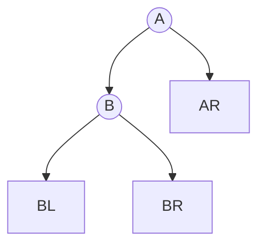
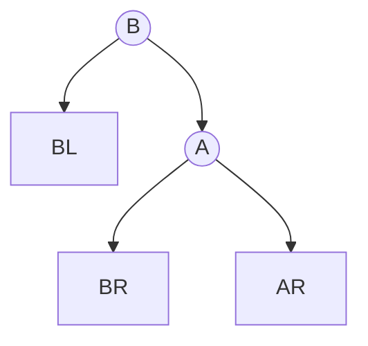
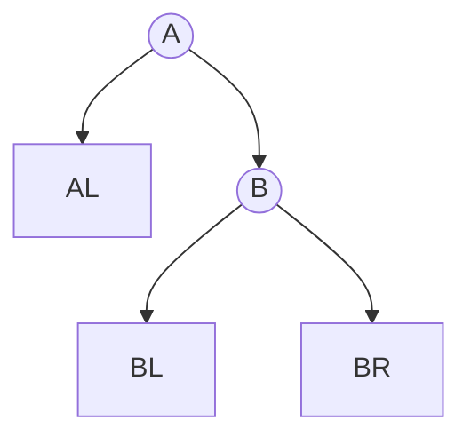
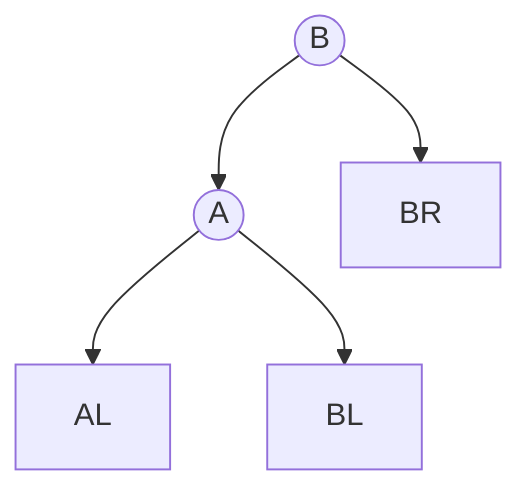
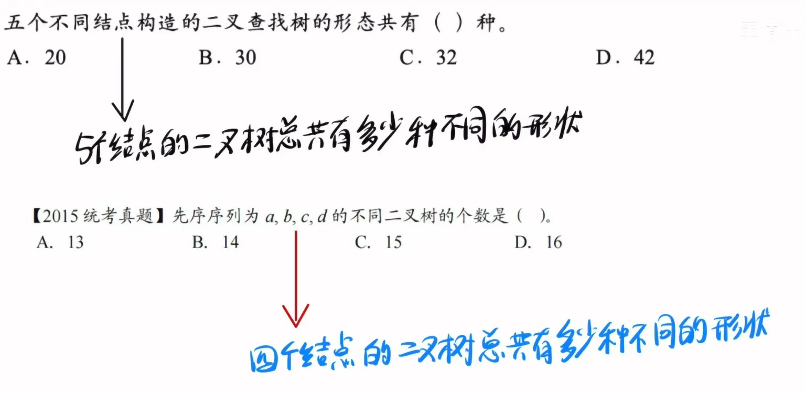

# 搜索樹

上次編輯時間: 2025年10月29日 下午3:29
建立時間: 2025年8月21日 下午6:36

# **BST（二元搜尋樹）**

---

**1. 定義與性質**

- **中序遍歷**（L-D-R）得到**非遞減序列**（判斷是否為 BST 的充要條件）。
- **BST 定義**：對任一結點 `x`，
    - 左子樹所有鍵 `< key(x)`；
    - 右子樹所有鍵 `> key(x)`（*允許重複時*：需**事先規約**：如「= 放右子樹」或「維護一個 `cnt`」）。
- **範圍查找**：在 BST 上沿路剪枝，可在  O(h+k) 輸出區間  [L,R] 內的 k  個鍵（h 為高度）。

---

**2. 複雜度與高度**

**不管insert、delete、search 都需要和node做比較 ，比較次數取決於樹的結構**

**Best-Case 在AVL tree 中比較次數最少，只需要比較某半邊的，取決於樹高** 𝑂(log𝑛)

**Worest-Case :在skewed 中比較次數最多，取決於nodes總數**	𝑂(𝑛)

**空間**：遞迴  O(h)，迭代  O(1)。

**平衡性**決定效率：實務以 AVL、紅黑樹等確保  $h=O(\log n)。$

---

**3. 基本操作偽碼**

**3.1 查找（Search）**

**一般**

```c
Node* BST_Find(Node *root, int key) {
    while (root && root->key != key) {
        root = (key < root->key) ? root->lchild : root->rchild;
    }
    return root;  // 找到回節點；找不到回 NULL
}
 
```

**遞歸**

```c
bool search(Node* root, int key) {
    if (root == NULL) return false;     // 找不到，返回 false
    if (key == root->data) return true; // 找到，返回 true
    if (key < root->data)
        return search(root->left, key); // 搜尋左子樹
    else
        return search(root->right, key);// 搜尋右子樹
}
```

**3.2 插入（Insert）**

```c
int BST_insert(BST &T, int k) {
    // 如果當前節點為空（即樹或子樹不存在），則創建新節點
    if (T == Null) {
        T = (BST)malloc(sizeof(BSTNode));  // 為新節點分配記憶體
        T->key = k;                        // 將鍵值 k 賦予新節點
        T->lchlid = T->rchlid = Null;      // 初始化左右子節點為 Null
        return 1;                          // 返回新創建的節點
    }
    // 如果插入的鍵值與當前節點的鍵值相同，不允許插入（避免重複鍵值）
    else if (k == T->key)
        return 0;                          // 返回 F 表示插入失敗（重複鍵值）
    // 如果插入的鍵值小於當前節點的鍵值，遞迴插入到左子樹
    else if (k < T->key)
        return BST_insert(T->lchlid, k);
    // 如果插入的鍵值大於當前節點的鍵值，遞迴插入到右子樹
    else
        return BST_insert(T->rchlid, k);
}
```

**3.3 刪除（Delete）**

**考點: 被刪除的節點用誰代替?**    

**用左子樹中的最大值或右子樹中的最小值替代被刪除的節點 (中序的第一個訪問節點)**

```c
Node* deleteNode(Node* root, int key) {
    if (root == NULL) return root;

    if (key < root->data)
        root->left = deleteNode(root->left, key);  // 刪除左子樹的節點
    else if (key > root->data)
        root->right = deleteNode(root->right, key); // 刪除右子樹的節點
    else {
        // 節點找到，處理刪除
        if (root->left == NULL) {  // 只有右子節點或無子節點
            Node* temp = root->right;
            delete root;
            return temp;
        }
        else if (root->right == NULL) { // 只有左子節點
            Node* temp = root->left;
            delete root;
            return temp;
        }
        // 有兩個子節點：找右子樹的最小值
        Node* temp = findMin(root->right);
        root->data = temp->data;
        root->right = deleteNode(root->right, temp->data);
    }
    return root;
}
// 其實就是中序第一個被訪問的節點
Node* findMin(Node* root) {
    while (root->left != NULL) root = root->left;
    return root;
}
```

---

<aside>
💡

**查找效率分析**

---

**看在第幾層就可知道比對幾次**

- **若是失敗節點則算在最後一個比較的節點那層**
    
    ex :11    比對路徑 50→26→21   ，最後一個比對的是21 所以比對 3次。
    


</aside>

# **AVL 平衡二叉樹**

---

### 1. 核心概念摘要

AVL 是在 **BST** 基礎上新增「**平衡因子 BF = h(left) − h(right)**」的平衡條件（每點 BF ∈ {−1,0,1}）。插入新節點後，自下而上找到**第一個不平衡結點 A**（最小不平衡子樹），按路徑方向判定 **LL、RR、LR、RL**，用單/雙旋恢復平衡。調整後此子樹**高度恢復原值**，因此更高層祖先的 BF 也隨之恢復。高度 $h=Θ(\log n)$ ⇒ 查找/插入/刪除 $Θ(\log n)$。

---

### 1) 定義與性質

- **平衡條件**：任意結點 $|BF|\le 1$，其中 $BF=h(L)-h(R)$。
- **最小不平衡子樹**：插入後，從新節點向上遇到的**第一個** $|BF|=2$ 的結點 A。
- **中序遍歷**仍為非遞減序列（保留 BST 性質）。
- **只需調 A 的子樹**：調整後該子樹高度回到插入前水準，祖先 BF 自動恢復。

### 2) 四類失衡判定與處置

> 中間值當D ，小的當L，大的當R
> 

| 類型 | 失衡條件（常用 BF 判斷） | 旋轉序列 | 口訣 |
| --- | --- | --- | --- |
| **LL** | $BF(A)=+2 且 BF(A.L)\ge 0$ | **RightRotate(A)** | 「左左→右旋」 |
| **RR** | $BF(A)=-2 且 BF(A.R)\le 0$ | **LeftRotate(A)** | 「右右→左旋」 |
| **LR** | $BF(A)=+2 且 BF(A.L)=-1$ | **LeftRotate(A.L)** → **RightRotate(A)** | 「左右→先左再右」 |
| **RL** | $BF(A)=-2 且 BF(A.R)=+1$ | **RightRotate(A.R)** → **LeftRotate(A)** | 「右左→先右再左」 |

> 快記規律：只有左孩子會觸發右旋；只有右孩子會觸發左旋；雙旋=把「內側」先轉成「同側」，再做單旋。
> 

### 3) 旋轉操作（示意）

**右旋（以 A 為根，B=A.left）**





**左旋（以 A 為根，B=A.right）**





**要點**：旋轉是**局部 O(1)** 操作；別忘了更新 A、B（與必要時 C）的 **height/BF**。

### 4) 插入與重平衡（伪碼）

```
InsertAVL(root, key):
  // 1) 常規 BST 插入，並回傳新根
  root = BST_Insert(root, key)

  // 2) 自下而上更新 height、BF，遇到第一個 |BF|=2 的 A
  A = FirstUnbalancedAncestor(of key)

  if A == null: return root    // 已平衡

  if BF(A) == +2:               // 左高
      if BF(A.left) >= 0: root = RightRotate(A)         // LL
      else:               root = LeftRotate(A.left)
                           root = RightRotate(A)         // LR
  else:                        // 右高
      if BF(A.right) <= 0: root = LeftRotate(A)          // RR
      else:               root = RightRotate(A.right)
                           root = LeftRotate(A)          // RL
  return root

```

# 4) 刪除（考場版 5 步驟 + 為何會「向上連鎖」）

## 4.1 考場速解 5 步驟

1. **BST 刪除**目標鍵（葉、單子、雙子：雙子用**前驅**或**後繼**替換）。
    - 前驅：從**左子樹**一路**向右**到底。
    - 後繼：從**右子樹**一路**向左**到底。
2. 由刪除位置**向上**找**第一個**不平衡祖先 AAA。若無 ⇒ 結束。
3. 在 AAA 之下找**更高的兒子**（taller child）與**更高的孫子**（taller grandchild）。
4. 依孫子所在方向（LL/RR/LR/RL）做對應（單/雙）旋，O(1)\mathcal{O}(1)O(1) 更新掛接、**更新 height/BF**。
5. **檢查是否向上連鎖**：刪除後此子樹**高度可能變矮**（例如 4→3），可能讓更高祖先再失衡 ⇒ 回到步驟 2，**重複到根**。

> 與插入不同，刪除可能需要多次沿路重平衡，因為高度會「變矮」。
> 

## 4.2 刪除重平衡偽碼（完整可套）

```
AVL_Delete(node, key):
  if node == null: return null

  // 1) BST 刪除
  if key < node.key:
      node.left  = AVL_Delete(node.left,  key)
  elif key > node.key:
      node.right = AVL_Delete(node.right, key)
  else:
      if node.left == null or node.right == null:
          node = (node.left != null) ? node.left : node.right
      else:
          // 用後繼（也可用前驅，二擇一）
          s = TreeMin(node.right)         // 右子樹最左
          node.key = s.key
          node.right = AVL_Delete(node.right, s.key)

  // 2) 刪除後空節點
  if node == null: return null

  // 3) 更新高度/BF
  Update(node)   // height = 1 + max(h(L), h(R)); BF = h(L)-h(R)

  // 4) 重平衡（可能多次沿遞迴回溯）
  if BF(node) == +2:                  // 左高
      if BF(node.left) >= 0: node = RightRotate(node)                 // LL
      else:                 node.left = LeftRotate(node.left);        // LR part 1
                             node = RightRotate(node)                 // LR part 2
  elif BF(node) == -2:                // 右高
      if BF(node.right) <= 0: node = LeftRotate(node)                 // RR
      else:                 node.right = RightRotate(node.right);     // RL part 1
                             node = LeftRotate(node)                  // RL part 2
  return node

```

---

# 5) 常見情境與速檢

- **最小不平衡子樹 A 的判定**：∣BF(A)∣=2。
- **選兒子/孫子**：取**更高**（高度較大者）。若孫子等高，**任取一側皆可**（結果都能恢復平衡）；考題通常避免有爭議的等高分支。
- **連鎖示例**：先在某子樹做 LR（或 RL）後，該子樹高度從 4→3，使再上一層左右差變為 2，需再做一次（例如 LL→右旋）。
- **雙子刪除的替換**：前驅/後繼都可；工程上二擇一一致即可；考題多選**單一答案**的情境。
- **驗證**：每次調整後一定要**檢查 BST 序**（左<根<右）與 **BF∈{−1,0,1}**。

---

# 6) 複雜度與高度

- **查找/插入/刪除**：Θ(logn)。
    - 插入：最多一次（單或雙）旋。
    - 刪除：可能**多次**沿路重平衡直到根。
- **高度上界**：設 N(h)為高度 h 的最少節點數，
    
    $N(0)=0,\;N(1)=1,\;N(h)=1+N(h-1)+N(h-2) ⇒ h=Θ(\log n)$（與 Fibonacci 同階）。
    

---

# 7) 對照表：插入 vs. 刪除（考點總結）


| 面向 | 插入 | 刪除 |
| --- | --- | --- |
| 起手式 | 依 BST 插入 | 依 BST 刪除（葉/單子/雙子→前驅或後繼） |
| 找誰調 | **第一個**不平衡點 A | 自刪除處**一路向上**每遇到不平衡就調 |
| 旋轉次數 | 一次（單/雙） | 可能多次（沿路） |
| 高度影響 | 子樹回到插入前高度 | 子樹可能變**更矮** → 觸發上層再失衡 |
| 判型 | 路徑方向 LL/RR/LR/RL | 同插入，按 taller child/grandchild 方向 |

---

# Red-Black Tree

## 定義（五條）

> 口訣：左根右｜根葉黑｜不紅紅｜黑路同
> 
1. **BST**：左 < 根 < 右（左根右）。
2. **~~顏色二元**：每個節點不是黑就是紅。廢話~~
3. **根/NIL 黑**：根必為黑；所有 **NIL（外部/空）葉**視為黑。
4. **不紅紅**：任何路徑上**不許相鄰兩個紅**（紅節點的父與子都為黑）。
5. **黑路同**：從任一節點到任一 NIL 的**黑節點數相同**（黑高一致）。

<aside>
💡

紅黑樹的「平衡」不是像 AVL 那種嚴格高度差 ≤1，而是滿足紅黑性質，讓**最長路徑 ≤ 最短路徑的 2 倍**

</aside>

> 小提醒：第 5 點裡的「Leaf」指外部 NIL，不是內部的末端關鍵字節點。
> 

---

## 插入（Insert）—兩種常見寫法，結果等價

### A) 自頂向下（Top-down，沿途「先改色再決策」）

1. 依 BST 規則找到插入位置，建立新節點 **紅**（若為根，最後會染黑）。
2. **搜尋途中**：若遇到某結點 `g` 的**兩個孩子都紅**，就**把兩子染黑，`g` 染紅**（稱「翻色」/color flip）。
    - 這一步把「2-3-4 樹的 4-結點」拆開；翻色後**若出現連續兩紅**，到 Case 修復（見下）。
3. 插入完成後，若出現「**連續兩紅**」，進入下方 Case 分類處理（旋轉/換色）。
4. 最後把**根染黑**。

### B) 自底向上（CLRS 版本）

1. 按 BST 插入新節點 `z`，先染**紅**。
2. **while 父 `p` 是紅**（違反不紅紅），令 `g` 為祖父、`u` 為叔：
    - **叔紅（Case 1）**：`p`、`u` 染黑，`g` 染紅；令 `z := g` 繼續往上。
    - **叔黑（Case 2/3）**：看 `z` 與 `p` 相對 `g` 的形態
        - **內側（LR/RL）**：先對 **父**做一次旋，讓內側→外側。
        - **外側（LL/RR）**：對 **祖父**做一次旋；**新子（原父或旋後樞紐）染黑，祖父染紅**，結束回合。
3. 將**根染黑**。

```c
 改色操作   (叔父爺改色)
         /                /
       black        --> red(爺)
		  /    \           /    \
    red    red      blcak(父)  black(叔)
	  /                /
	new              new

```

```c
旋轉操作   (中間值上拉為黑色，其他紅色)
   blcak  -- head                      mid -black   
      \                              /     \
      red -mid           --->    head-red  bot-red  
        \
     new_red -bot
```

> 速記口訣：兩紅先看叔；叔紅改色；叔黑做旋轉；根要黑。
> 
> 
> NIL/查找失敗節點**視為黑**。
> 

---

## 複雜度與高度

- RBT 高度 $h = O(\log n)$；查找/插入/刪除皆 $O(\log n)$。
- 插入最多 **2 次旋轉**；很多情況僅需**翻色**就解決。

---

## 練習/可視化

[https://www.cs.usfca.edu/~galles/visualization/RedBlack.html](https://www.cs.usfca.edu/~galles/visualization/RedBlack.html)

用它演練幾組插入序列，邊看**叔紅翻色**、**叔黑旋轉**，記口訣就穩了。

---

---

# #補充 —— B&B+ Tree 概論

**核心概念：為何需要 B-tree 和 B+ tree？**

在我們深入探討之前，必須理解這兩種資料結構被發明的主要目的：**為了解決磁碟 I/O 速度遠慢於記憶體的問題**。
傳統的二元搜尋樹（BST）或 AVL 樹雖然高效，但它們的高度與資料量成對數關係 $(O(\log N)$。當資料量極大（例如數百萬筆紀錄）時，樹的高度會變得很深。在資料庫或檔案系統中，資料儲存在磁碟上，樹的每個節點都可能對應一次磁碟讀取（I/O）。樹越深，查詢所需的 I/O 次數就越多，效能就越差。
B-tree 和 B+ tree 透過一個核心思想解決這個問題：**建立一個「矮胖」的樹**。它們允許每個節點儲存大量的鍵值和子節點指標，這被稱為**高扇出（High Fan-out）**。如此一來，即使資料量極大，樹的高度也能維持在很低的水平（通常 3-5 層），從而極大地減少了查詢所需的磁碟 I/O 次數。

---

## 一、B-tree（廣義 B 樹）：基本特性

### 定義與性質

- B-tree 是一種自平衡的多路搜尋樹（m-ary tree），允許每個節點有多個子節點。 ([維基百科](https://en.wikipedia.org/wiki/B-tree?utm_source=chatgpt.com))
- 節點可包含多個鍵值與指標。非葉節點既可作為索引，也可直接存放資料或記錄指標。 ([維基百科](https://en.wikipedia.org/wiki/B-tree?utm_source=chatgpt.com))
- 所有葉節點位於同一深度，確保存取路徑長度一致。 ([維基百科](https://en.wikipedia.org/wiki/B-tree?utm_source=chatgpt.com))
- 搜尋、插入、刪除的時間複雜度皆為 (O(\log n))。 ([維基百科](https://en.wikipedia.org/wiki/B-tree?utm_source=chatgpt.com))
- 特別適合用在二級存儲（磁碟、SSD）上，因為它以節點為單位讀寫，可以把大規模資料映射到較少的磁碟 I/O 操作。 ([維基百科](https://en.wikipedia.org/wiki/B-tree?utm_source=chatgpt.com))

---

## 二、B+ tree：在 B-tree 基礎上的改良

### 定義與性質

- B+ tree 是 B-tree 的變種／改良版本，其中 **只有葉節點儲存資料 (records 或 pointers to data)**，內部節點只存放鍵和子樹指標。 ([維基百科](https://en.wikipedia.org/wiki/B%2B_tree?utm_source=chatgpt.com))
- 所有資料都集中在葉節點，葉節點之間常連結成「鏈表」以支援順序掃描 (sequential access) 或範圍查詢 (range queries)。 ([維基百科](https://en.wikipedia.org/wiki/B%2B_tree?utm_source=chatgpt.com))
- 由於內部節點不必存資料指標，只需存鍵與子指標，因此可以在同樣空間下容納更多鍵，令扇出 (fan-out) 提高、樹高度降低。 ([維基百科](https://en.wikipedia.org/wiki/B%2B_tree?utm_source=chatgpt.com))
- 搜尋、插入、刪除時間複雜度也為 (O(\log n))，但對於範圍查詢來說，額外成本為 (O(\log n + k))，其中 (k) 是要輸出的資料個數。 ([維基百科](https://en.wikipedia.org/wiki/B%2B_tree?utm_source=chatgpt.com))

---

## 三、優缺點比較（B-tree vs B+ tree）

下面是比較表 + 延伸解釋：

| 項目 | B-tree 優點 | B-tree 缺點 | B+ tree 優點 | B+ tree 缺點 |
| --- | --- | --- | --- | --- |
| **存資料節點配置** | 資料可存於內部節點或葉節點 → 查詢時可能較快（若資料存於較高節點） | 內部節點攜帶資料指標，降低鍵數密度 | 所有資料集中在葉節點，內部節點只存鍵 → 鍵密度高、樹高低 | 查找任意資料都得到葉節點，多了一層路徑 （比某些 B-tree 實例稍慢） |
| **樹高度 / 扇出 (fan-out)** | 由於節點要同時存鍵 + 資料指標，其鍵容量受限 | 樹可能比 B+ tree 高 | 內部節點只存鍵 + 子指標，可存更多鍵 → 扇出高、樹低 | 在查詢資料時只能在葉節點讀取，其它內部節點無資料 |
| **範圍查詢 / 順序遍歷** | 較差 — 要在整棵樹做中序遍歷比較複雜 | 範圍查詢必須跨節點、不易鏈接 | 葉節點常連成鏈表，可從起點一路鏈走 → 非常高效 | 必須走到葉節點才能開始，對於單點查詢比有些 B-tree 慢 |
| **插入 / 刪除 / 調整** | 若資料在內部節點，更新較直接 | 複雜性高：在分裂或合併時，要同時處理資料指標 + 鍵指標 | 更新變簡單：只在葉節點做拆分或合併、內部節點只是鍵的調整 | 如果葉節點過滿或過少，仍需分裂 / 合併，且可能要調整許多葉或鍵 |
| **空間效率 / 存儲利用率** | 資料與鍵同存，空間利用率可能較平均 | 節點存資料指標降低可用鍵空間 | 內部節點空間專注於鍵，可以更高效利用空間 | 葉節點要額外存下一葉指標或鏈接指標 |
| **適應性 / 抗碎片** | 對於搜尋導向場景可能略有優勢 | 節點分裂、重組更昂貴 | 結構穩定、內部節點調整較簡單 | 若資料集中變動大，可能葉節點壓力大 |

**重點補充：**

- B+ tree 的葉節點鏈接機制是其一大優勢，使得範圍查詢（如「查出某鍵到某鍵之間所有記錄」）效率極高。
- 在 B-tree 中，由於資料可能散布在內部與葉節點，要做範圍查詢時不容易做連續掃描，可能每次都需回到父節點或樹上尋找。
- B+ tree 的設計使內部節點更加「瘦」— 因為它不承擔資料指標，只擔任導航功能，所以在磁碟 I/O 下更優。
- 在檔案系統、資料庫索引中，B+ tree 幾乎被視為標準選擇，因為它兼顧點查與範圍查詢。
- 某些情況下若記憶體（cache）非常強、讀取成本與資料局部性極佳，B-tree 在少數點查場景可能略勝。

---

## 四、使用時機與典型應用

### B-tree 的合適場景

- 當系統以 **大量單筆查詢 (point lookup)** 為主，且資料更新頻繁時，B-tree 的資料可能早被儲存在較高層節點，有機會節省部分搜尋時間。
- 在記憶體內的索引結構，有些變體可利用 B-tree，在記憶體小、資料與索引混合時被採用。
- 特殊嵌入式系統或小型資料庫中，在 I/O 開銷並不極端時，B-tree 也是可行選擇。

### B+ tree 的典型應用

- **資料庫索引 (Database Indexing)**：絕大多數資料庫（MySQL, PostgreSQL, Oracle 等）都使用 B+ tree 作為主索引或次索引。
- **檔案系統 (File Systems / Storage System)**：NTFS、HFS+, ext4、XFS、ReiserFS 等檔案系統在目錄結構與文件分配索引中多用 B+ tree。
- **鍵值儲存 (Key-Value Stores / NoSQL 引擎)**：許多採用磁碟儲存的鍵值庫、資料倉儲引擎，也基於 B+ tree 或其改良版本。
- **範圍查詢重視 (e.g. OLAP, 報表系統)**：當查詢常常要求「取某鍵到某鍵之間所有記錄」時，B+ tree 葉節點鏈表可加速掃描。

---


(a) 兩種情境：**B-tree 可能比 B+ tree 更適合**

| 情境 | 原因說明 |
| --- | --- |
| **1️⃣ 記錄節點 (Record) 較少、查詢多為單點查詢 (Point lookup)** | 在 B-tree 中，**鍵值與實際資料同存於節點**。查到鍵即得資料，不必再訪問葉節點，I/O 次數更少。 |
| **2️⃣ 系統記憶體有限、無法維持所有葉節點索引於快取中** | B-tree 的非葉節點也能存放資料，能在較小的樹高下快速命中。當快取命中率低時，B-tree I/O 效率可能高於 B+ tree。 |

## (b) 若系統同時需要頻繁的 point lookup 與 range query

> 建議：✅ 使用 B+ tree
> 

| 比較項 | B-tree | B+ tree | 評估結果 |
| --- | --- | --- | --- |
| **i. 空間效率 (Space efficiency)** | 非葉節點同時存放鍵與資料，導致每個節點能容納的鍵較少 → 樹高略高。 | 內部節點只存索引鍵，葉節點集中資料。可容納更多鍵，**更節省節點空間**。 | ✅ B+ tree 較佳 |
| **ii. 讀/寫效能 (Read/Write performance)** | Point lookup 直接命中節點資料 → 少一次 I/O。 | 所有資料在葉節點 → lookup 多 1 次磁碟 I/O；但**Range query 只需順向鏈接葉節點即可**，連續存取極快。 | ✅ 綜合上，B+ tree 效率更穩定 |
| **iii. 維護成本 (Insertion/Deletion complexity)** | 更新時需同時調整資料與索引，維護較複雜。 | 更新僅調整葉節點與少量索引鍵，結構穩定，易維護。 | ✅ B+ tree 較佳 |

# B 樹

## 名詞對齊

- **m 階（order m）**：單一節點**最多 m 個孩子**、**最多 m−1 個鍵**。
- **最小度 t（minimum degree）**：教科書常用；除根外每節點**至少 t 個孩子**、**至少 t−1 個鍵**。兩者關係：`t = ⌈m/2⌉`。[維基百科](https://en.wikipedia.org/wiki/B-tree)

root 值域 `[1,m-1]`

（非根）節點值域 `[⌈m/2⌉-1,m-1]`

---

## 高度與複雜度（一定是 O(log n)）

設最小度 `t = ⌈m/2⌉`、高度 `h`（根到葉的邊數）：

- **鍵數上下界**
    
    `$2 t^h − 1 ≤ n ≤ (2t)^(h+1) − 1$`
    
- **高度界**
    
    `$log_t((n+1)/2) ≥ h ≥ log_{2t}(n+1) − 1$`
    
    ⇒ `$h = Θ(log n)$`；I/O 友好，實務多用於磁碟/資料庫索引。
    

---

## 常見考點 & 易錯

- 查找失敗 IO次數 = level-1
- 葉（失敗節點）**同層**；終端節點（最下層存資料的那些）不是“葉”。
- 公式：`$n ≥ 2 t^h − 1$`、`$n ≤ (2t)^{h+1} − 1$` —— 兩頭夾出 `h`。

---

- **常見B  樹的種類**
    
    2-3 Tree
    
    - 3way Search tree
    - B-Tree of order 3
    - degree={2,3}
    
    2-3-4 Tree
    
    - 4way Search tree
    - B-Tree of order 4
    - degree={2,3,4}

## B樹的操作

---

### 查找

在節點內**順掃或二分**定位落點指針，向下直到命中或落到葉（失敗）⇒ 失敗。

### 插入（葉插入 + 上溢分裂）

1. 依查找路徑到**葉**插入鍵。
2. 若節點鍵數 **> m−1 (overflow)** ⇒ **`分裂(Split)`**：
    - 取**中位鍵(**`⌈m/2⌉`**)**上推到父節點；
    - 中位左邊鍵形成左子、右邊形成右子；
    - 父節點若也滿，再往上重複。
    
    
    

### 刪除（欠載修復）

1. 若在**內部節點**刪：用**前驅/後繼**替換，轉為在葉刪。
2. 葉刪後若鍵數 **< t−1**（欠載）：
    - **向兄弟借**（相鄰兄弟若有 ≥ t 鍵），父鍵下移、兄弟鍵上提；
        
        
        
        
        
        65刪除將父最大下拉，父向右兄弟借75 
        
    - 否則**與兄弟合併**（父的一個分隔鍵下來與兩兄弟合成一個），父鍵數減 1；若父欠載，向上連鎖 做 `rebuild`。
        
        
        
        
        
    
    `rebulid`
    
    
    

> 口訣：“缺則借，不足並”。
> 

---

# B+ 樹

**關鍵特性**

- **內部節點只存鍵（索引）**；**所有資料紀錄只放在葉節點**。
- **所有葉在同一層**，且**葉節點以鏈結串起**，很適合範圍查詢/順序掃描。
- 內部節點的鍵通常是**子樹鍵的上界（最大值）**。
- 搜索**一定走到葉**才算成功/失敗。[維基百科](https://en.wikipedia.org/wiki/B-tree)


**為何適合外存/資料庫索引？**

內節點不帶紀錄指標，**同一磁區塊可容納更多鍵**，使樹更「矮胖」⇒ **更少 I/O**

## 操作模板（手算）

**Insert（插入）**

**步驟**：

1. 按鍵值大小找到葉子節點，將數據項插入到葉子節點中。
2. 若葉子節點溢出（鍵值超過 M−1個）：
    - 將葉子節點分裂為兩個節點，將中間鍵值提升到父節點作為索引。
3. 若父節點也溢出，則遞迴分裂，直到根節點。
4. 若根節點分裂，則產生一個新的根節點，樹的高度增加。


**Delete（刪除）**

**步驟**：

1. 找到目標鍵值所在的葉子節點並刪除該鍵值。
2. 若葉子節點鍵值數量不足（小於 ⌈M/2⌉ ）：
    - 從兄弟節點借值，或者進行節點合併。
3. 若父節點索引不再有效，則遞迴調整父節點。


## 兩個超容易忽略的細節

1. **B+ 葉分裂上提的是“副本”**：葉仍保留該鍵，父只拿來當分隔；
2. **借/併後要「同步更新父分隔鍵」**：
    - 從左借 ⇒ 父分隔鍵更新為**當前葉新首鍵**；
    - 從右借 ⇒ 父分隔鍵更新為**右兄新首鍵**；
    - 合併 ⇒ 父**刪除**對應分隔鍵與一個子指標。

# 觀念總結&錯誤題回顧


1. BST不是平衡樹，可以是單支樹 所以都是`O(n)`
2. BST的構建型態其實和 n 個節點可以有多少不同型態是等價的
    
    
    
    卡特蘭數:[會用到的有stack的排列組合](%E5%A0%86%E7%96%8A-Stack%20&%20%E9%9A%8A%E5%88%97%20Queue%20231c1f61b25b80598ca6ce98b1d52511.md)，和 n 個節點可以有多少不同型態的樹
    
    
    
    動態規劃
    
    
    

4.AVL tree 深度問題

給結點求樹高


$T_4=T_3+T_2+1_{root}$

給樹高求型態


可以用動態規劃


A

5.紅黑樹最長路徑 ≤ 2*最短路徑

6.紅黑樹刪除最多需要3次`Rotation` 操作

7.Btree  性質   

- （非根）節點值域 `[⌈m/2⌉-1,m-1]`
- root 值域 `[1,m-1]`
- 分裂 **中位鍵(**`⌈m/2⌉`**)**


