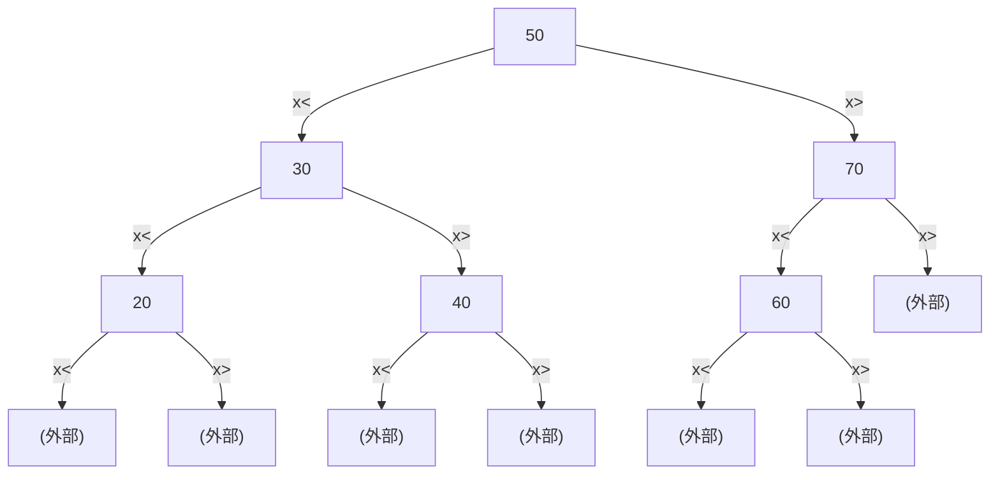
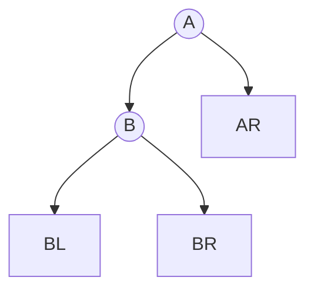
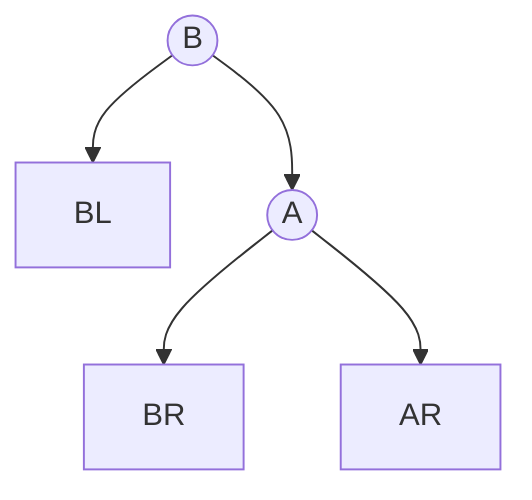
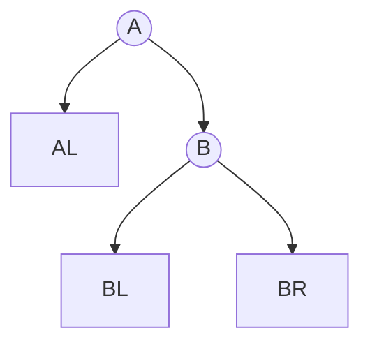
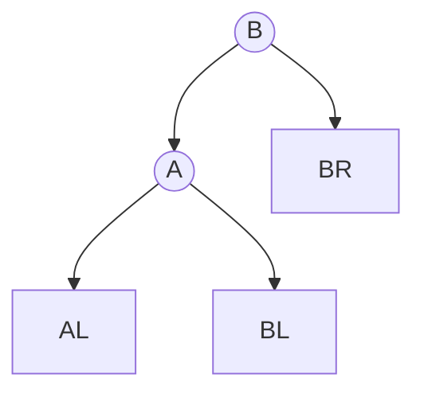

# 查找

上次編輯時間: 2025年10月7日 下午6:01
建立時間: 2025年8月19日 下午6:27

# 一、順序查找

---

**可以使用Sentinel(哨兵)** 

**可以減少範圍判斷**

```c
int void Sential(int A[], int& n, int k)
{
    A[0] = k;  // 將搜尋值設為哨兵
    int i = n;  // 從陣列尾部開始
    while (A[i])  // 迭代直到找到值或遇到哨兵
	    {
        if (A[i] == k) return i;  // 如果找到值，返回索引
        else
        {
            i -= 1;  // 向前移動索引
        }
    }
    return 0;  // 如果沒有找到，返回 0
}
```

---

**平均查找長度（ASL）—常考公式**

> 設鍵值命中機率為 $p_i$（第 i位），未命中落在第 i 個「間隙」的機率為 $q_i$（共 $n+1$  個間隙）。
> 
- **有序表：**
    - 成功：$ASL_{succ}=\sum_{i=1}^{n} i\,p_i$
    - 失敗：$ASL_{fail}=\sum_{i=0}^{n} (i+1)\,q_i$
    - **等機率近似**（教材常用背法）：
        - 成功 ≈ **(n+1)/2**
        - 失敗 ≈ **(n+1)/2**（顯著優於無序表的 n）
- **無序表：**
    - 成功 ≈ **(n+1)/2**
    - 失敗 = **n**

> 命題技巧：若「各鍵被查機率不同」，將元素依查找機率遞減排序，可最小化$ASLsucc=∑ipi$。
> 

---

**易錯點與速記**

- **哨兵**只減少邊界判斷，不改變**時間複雜度階**。
- **有序提早失敗條件**：升序用 `>`；若是降序則用 `<`。
- **鏈表**也可做順序查找，惟無隨機存取，僅能線性前進。

---

# **二、插值查找(**Interpolation Search)

---

**插值**：樞紐依**鍵值大小比例**選

$\text{mid}=low+\Big\lfloor (high-low)\times \frac{x-A[low]}{A[high]-A[low]} \Big\rfloor$

```c
int InterpolationSearch(int A[], int n, int key) {
    int low = 0, high = n - 1;
    
    while (low <= high && key >= A[low] && key <= A[high]) {
        // 計算插值位置
        int pos = low + ((key - A[low]) * (high - low)) / (A[high] - A[low]);
        
        // 檢查目標值是否在 pos
        if (A[pos] == key) {
            return pos;  // 找到目標值
        }
        
        // 縮小搜尋範圍
        if (A[pos] < key) {
            low = pos + 1;  // 目標值在右側
        } else {
            high = pos - 1; // 目標值在左側
        }
    }
    
    return -1;  // 未找到目標值
}
```

<aside>
💡

**Time Complexity**

---

- **平均/期望**（鍵分布近**均勻**）：$\mathbf{O(\log\log n)}$
- **最壞**（分布**極不均勻**或大量重複）：$\mathbf{O(n)}$
- **空間**：$\mathbf{O(1)}$

**2) 為什麼會退化到 O(n)（嚴謹版）**

**插值點**

	$\text{mid}=low+\Big\lfloor (high-low)\,\rho \Big\rfloor,\quad
\rho=\frac{x-A[low]}{A[high]-A[low]}$

每輪實際前進量  $\Delta\approx (high-low)\rho$。

若存在常數  c 使得在多數迭代中

$\rho \le \frac{c}{\,high-low\,}\quad\Rightarrow\quad \Delta \le c,$

一次只前進常數步 ⇒ **需要 $\Theta(n)$ 次比較**。

**3) 與折半查找的連結（穩健做法）**

- 插值是「**資料感知版**折半」：$\alpha=\rho$；折半是把 $\alpha$ 固定為  1/2。
- **實務建議**：Hybrid
    - 若計算出來的 `mid` 落在邊界（`mid==low` 或 `mid==high`），或連續數輪進展 < 2，**回退到折半**，即可同時擁有均勻時的 $O(\log\log n)$ 與穩定的最壞上界。
</aside>

---

**Binary Search**

---

**只適用有序的順序表**


```c
int Binary_Sort(int A[], int k, int l, int u) {
    if (l <= u) {
        int mid = (l + u) / 2; // 計算中間索引
        if (k == A[mid]) {
            return mid; // 找到目標值，返回索引
        } else if (k < A[mid]) {
            return Binary_Sort(A, k, l, mid - 1); // 搜尋左半邊
        } else {
            return Binary_Sort(A, k, mid + 1, u); // 搜尋右半邊
        }
    }
    return -1; // 如果目標值不存在，返回 -1
}

```

---

**時間複雜度**

- 遞迴關係：**$T(n)=\Theta(\log n)$**。
- 分情況：
    - **最好**：第一比較即命中 → **O(1)**
    - **平均**：**$O(\log n)$**
    - **最壞**：比較次數 $\le \lfloor \log_2 n \rfloor + 1 → O(\log n)$

> 迴圈次數就是把區間「對半」到長度 < 1 的次數：$k=\lceil \log_2 n \rceil$。
> 

（補：迭代實作空間 O(1)；遞迴實作呼叫堆疊空間$O(\log n)$）

---

# 2.1、折半查找決策樹

---

# 1. 什麼是「決策樹」？

- **定義**：把「比較結果」用一棵二元樹表示；每個內部節點是一個關鍵字比較（如 `x ? key[i]`），邊代表比較結果（左：`<`；右：`>`；等於在節點判定）。
- **用途**：分析任何「以比較為主」的查找／排序演算法之**下界**與**實際比較次數**，也是證明複雜度極限的標準工具。

---

# 2. 折半查找（Binary Search）的決策樹

## 2.1 結構與性質

- **節點標註**：每次比較的陣列索引 `mid`。
    
    在比較 `x` 與 `a[mid]` 後：
    
    - 若 `x < a[mid]`：**右邊界**縮到 `high = mid - 1`（等價於「下個區間是上個 mid 的左半邊」）。
    - 若 `x > a[mid]`：**左邊界**擴到 `low = mid + 1`（等價於「下個區間是上個 mid 的右半邊」）。
    - 若 `x == a[mid]`：成功停在當前節點。
    
    分析採用上下取整:
    
    | 取法 | 奇數長度 | 偶數長度 | 偏向 |
    | --- | --- | --- | --- |
    | `mid = L + ⌊(R-L)/2⌋` | 左=右 | 右 = 左+1 | **右偏** |
    | `mid = L + ⌈(R-L)/2⌉` | 左=右 | 左 = 右+1 | **左偏** |
    
    > 「下一層用上個 mid 的 mid±1 作為新的 low/high」，決策樹的左子樹代表 [low, mid-1]，右子樹代表 [mid+1, high]。
    > 
- **葉子**：
    - 成功查找：到達某個鍵 `a[i]` 的節點並判「=」。
    - 失敗查找：落在兩鍵之間的「**空檔（gap）**」，共有 **`n+1`** 個外部葉（`∞ | a1 | a2 | … | an | +∞`）。
- **高度下界**（常考證法）
    - 對**成功**查找：需要至少 `n` 個葉 ⇒ 任一二元樹高度 `h ≥ ⌈log2 n⌉`。
    - 對**失敗**查找：需要 `n+1` 外部葉 ⇒ `h ≥ ⌈log2 (n+1)⌉`。

## 2.2 比較次數（經典結論）

- **成功最壞**：`⌊log2 n⌋ + 1` 次比較。
- **失敗最壞**：`⌈log2 (n+1)⌉` 次比較。
- **平均**（均勻機率下）大約是 `≈ log2 n` 等級；精確值取決於 `n` 是否為 `2^k - 1` 的完全平衡情形（考試多記住**對數級**與上界即可）。

> 可見：成功葉 8 個；失敗外部葉 9 個（n+1）。
> 

---

# 3. 二元搜尋樹（BST）與決策樹

## 3.1 對應關係

- **固定一棵 BST**，從根到某鍵的路徑就是那個鍵的**比較序列** ⇒ 這棵 BST 本身就是該「靜態方案」的**決策樹**。
- **高度 = 最壞比較次數 - 1**（成功查找）。
    
    若 BST 退化成**鏈**，高度 `n-1` ⇒ 最壞比較達 `O(n)`；平衡 BST 高度 `O(log n)`。
    

## 3.2 平均比較次數（ASL）

設 `depth(v)` 以根為 0：

- **成功平均（均勻）**
    
    `ASL_success = (I + n) / n`，其中
    
    `I = Σ (所有內部節點 v 的 depth(v))`（**內部路徑長**，Internal Path Length）。
    
    > 理由：成功查找每次需「節點數 = 深度 + 1」次比較。
    > 
- **失敗平均（均勻落在 n+1 個 gap）**
    
    `ASL_fail = E / (n+1)`，其中
    
    `E = Σ (所有外部節點 u 的 depth(u))`（**外部路徑長**，External Path Length）。
    
- **經典關係式**（BST 必考）：
    
    `E = I + 2n`
    
    > 推：$ASL_fail = (I + 2n) / (n+1)$。
    > 

## 3.3 最優 BST（靜態；已知機率）

- **目標**：給定成功機率 `p1…pn` 與失敗（gap）機率 `q0…qn`，最小化
    
    `期望比較次數 = Σ p_i·(depth(ai)+1) + Σ q_j·depth(gap_j)`。
    
- **DP 典型轉移**（記 `e[i][j]` 為 keys `i..j` 的最小期望代價；`w[i][j]=Σ p + Σ q` 為區間權重和）：
    
    ```
    e[i][j] = min_{r ∈ [i..j]} { e[i][r-1] + e[r+1][j] + w[i][j] },  i≤j
    e[i][i-1] = q_{i-1}
    
    ```
    
    - 時間 `O(n^3)`、空間 `O(n^2)`；若機率具單峰性可用 **Knuth 優化** 降至 `O(n^2)`（考點提要即可）。

---

# 4. 折半查找 vs. BST（考點對照）

| 面向 | 折半查找 (靜態有序陣列) | BST（一般） |
| --- | --- | --- |
| 決策樹形狀 | 幾乎嚴格平衡（由 mid 分治） | 取決於插入順序與重平衡策略 |
| 成功最壞比較 | `⌊log2 n⌋ + 1` | `高度 + 1`（平衡：`≈ log n`；退化：`≈ n`） |
| 失敗最壞比較 | `⌈log2(n+1)⌉` | `高度 + 1`（落在外部節點） |
| 平均比較 | `≈ log2 n` | 由 `I, E` 或機率分布決定 |
| 動態更新 | 較差（插入/刪除需搬動） | 佳（O(log n) 若保持平衡） |
| 最優結構 | 固定（取中法） | 可做「最優 BST」以最小化期望比較 |

---

# 5. 典型考題＆速記

1. **為何折半查找失敗最壞要 `⌈log2(n+1)⌉`？**
    
    因為失敗情況對應 `n+1` 個 gap，決策樹需要至少 `n+1` 個外部葉；二元樹高度 `≥ ⌈log2(n+1)⌉`。
    
2. **BST 的 `E = I + 2n` 怎麼來？**
    
    由樹的邊計數或對每條邊被外部/內部節點統計的次數等價推得，是經典恒等式。
    
3. **ASL 成功／失敗公式**：
    
    `ASL_success = (I + n)/n`，`ASL_fail = E/(n+1)`。
    
4. **最優 BST DP 模板**與邊界 `e[i][i-1] = q_{i-1}` 要會寫；複雜度會背；Knuth 優化點到即可。

---

# 6. 一眼看懂的小示例（BST 決策樹）

假設插入順序：`50, 30, 70, 20, 40, 60`，查找比較決策即是下樹：



- 成功比較次數 = 「路徑深度 + 1」；失敗比較次數 = 落在相應外部節點之深度。

---

# **三、分塊查找（Indexed / Block Search）**

---

**一、算法思想（怎麼做）**

**目標**：把長序列分成若干「塊」，先在**索引表**定位應查的塊，再在該塊內**順序掃描**。

- **塊間有序、塊內可無序**
    
    設每塊記錄最大鍵 `key_max`（或最小鍵），令 `key_max` 單調遞增。
    
- **索引表**：每條記 `(key_max, start_pos)`；可用**順序掃描 / 折半查找**。


- **查找流程**
    1. 在索引表中定位目標所在塊（`key ≤ key_max` 的**第一**塊）。
    2. 到該塊在主表的範圍內做**線性查找**；命中或宣告失敗。

**性質分析**

在$s=\sqrt{n}$，ASL的最小值為 $\sqrt{n}+1$


---

<aside>
💡

**二、查找效率分析（ASL）**

設總記錄數 **n**，分成 **b** 塊，平均每塊 **m = n/b**。

**情況 A：索引表用順序掃描**

- **成功**： $ASL_{succ} \approx \frac{b+1}{2} + \frac{m+1}{2}$
- **失敗**：  $ASL_{fail} \approx \frac{b+1}{2} + m$
- **最優塊大小（等長塊、等概率）**：令 $b=m\Rightarrow b\cdot m=n \Rightarrow b=m\approx \sqrt{n}$
    
    ⇒ $ASL_{succ}\approx ASL_{fail}\approx \tfrac{3}{2}\sqrt{n}$
    
- **時間複雜度**：$\Theta(\sqrt{n})$（在最優參數下）

**情況 B：索引表用折半查找**

- **成功**：$ASL_{succ} \approx \lfloor \log_2 b \rfloor + \frac{m+1}{2}$
- **失敗**： $ASL_{fail} \approx \lfloor \log_2 b \rfloor + m$


</aside>

# 四、樹型查找

---

## **1.BST（二元搜尋樹）**

---

**1. 定義與性質**

- **BST 定義**：對任一結點 `x`，
    - 左子樹所有鍵 `< key(x)`；
    - 右子樹所有鍵 `> key(x)`（*允許重複時*：需**事先規約**：如「= 放右子樹」或「維護一個 `cnt`」）。
- **中序遍歷**（L-D-R）得到**非遞減序列**（判斷是否為 BST 的充要條件）。
- **範圍查找**：在 BST 上沿路剪枝，可在  O(h+k) 輸出區間  [L,R] 內的 k  個鍵（h 為高度）。

---

**2. 複雜度與高度**

**不管insert、delete、search 都需要和node做比較 ，比較次數取決於樹的結構**

**Best-Case 在AVL tree 中比較次數最少，只需要比較某半邊的，取決於樹高** 𝑂(log𝑛)

**Worest-Case :在skewed 中比較次數最多，取決於nodes總數**	𝑂(𝑛)

**空間**：遞迴  O(h)，迭代  O(1)。

**平衡性**決定效率：實務以 AVL、紅黑樹等確保  $h=O(\log n)。$

---

**3. 基本操作偽碼**

**3.1 查找（Search）**

**一般**

```csharp
Node* BST_Find(Node* root, int key) {
    while (root && root->key != key) {
        root = (key < root->key) ? root->lchild : root->rchild;
    }
    return root; // 找到回節點；找不到回 nullptr
}

```

**遞歸**

```csharp
bool search(Node* root, int key) {
    if (root == NULL) return false;     // 找不到，返回 false
    if (key == root->data) return true; // 找到，返回 true
    if (key < root->data)
        return search(root->left, key); // 搜尋左子樹
    else
        return search(root->right, key);// 搜尋右子樹
}
```

**3.2 插入（Insert）**

```c
int BST_insert(BST &T, int k) {
    // 如果當前節點為空（即樹或子樹不存在），則創建新節點
    if (T == Null) {
        T = (BST)malloc(sizeof(BSTNode));  // 為新節點分配記憶體
        T->key = k;                        // 將鍵值 k 賦予新節點
        T->lchlid = T->rchlid = Null;      // 初始化左右子節點為 Null
        return 1;                          // 返回新創建的節點
    }
    // 如果插入的鍵值與當前節點的鍵值相同，不允許插入（避免重複鍵值）
    else if (k == T->key)
        return 0;                          // 返回 F 表示插入失敗（重複鍵值）
    // 如果插入的鍵值小於當前節點的鍵值，遞迴插入到左子樹
    else if (k < T->key)
        return BST_insert(T->lchlid, k);
    // 如果插入的鍵值大於當前節點的鍵值，遞迴插入到右子樹
    else
        return BST_insert(T->rchlid, k);
}
```

**3.3 刪除（Delete）**

**考點: 被刪除的節點用誰代替?**    

**用左子樹中的最大值或右子樹中的最小值替代被刪除的節點 (中序的第一個訪問節點)**

```c
Node* deleteNode(Node* root, int key) {
    if (root == NULL) return root;

    if (key < root->data)
        root->left = deleteNode(root->left, key);  // 刪除左子樹的節點
    else if (key > root->data)
        root->right = deleteNode(root->right, key); // 刪除右子樹的節點
    else {
        // 節點找到，處理刪除
        if (root->left == NULL) {  // 只有右子節點或無子節點
            Node* temp = root->right;
            delete root;
            return temp;
        }
        else if (root->right == NULL) { // 只有左子節點
            Node* temp = root->left;
            delete root;
            return temp;
        }
        // 有兩個子節點：找右子樹的最小值
        Node* temp = findMin(root->right);
        root->data = temp->data;
        root->right = deleteNode(root->right, temp->data);
    }
    return root;
}
// 其實就是中序第一個被訪問的節點
Node* findMin(Node* root) {
    while (root->left != NULL) root = root->left;
    return root;
}
```

---

<aside>
💡

**查找效率分析**

---

**看在第幾層就可知道比對幾次**

- **若是失敗節點則算在最後一個比較的節點那層**
    
    ex :11    比對路徑 50→26→21   ，最後一個比對的是21 所以比對 3次。
    


</aside>

## **2.AVL 平衡二叉樹**

---

### 1. 核心概念摘要

AVL 是在 **BST** 基礎上新增「**平衡因子 BF = h(left) − h(right)**」的平衡條件（每點 BF ∈ {−1,0,1}）。插入新節點後，自下而上找到**第一個不平衡結點 A**（最小不平衡子樹），按路徑方向判定 **LL、RR、LR、RL**，用單/雙旋恢復平衡。調整後此子樹**高度恢復原值**，因此更高層祖先的 BF 也隨之恢復。高度 $h=Θ(\log n)$ ⇒ 查找/插入/刪除 $Θ(\log n)$。

---

### 1) 定義與性質

- **平衡條件**：任意結點 $|BF|\le 1$，其中 $BF=h(L)-h(R)$。
- **最小不平衡子樹**：插入後，從新節點向上遇到的**第一個** $|BF|=2$ 的結點 A。
- **中序遍歷**仍為非遞減序列（保留 BST 性質）。
- **只需調 A 的子樹**：調整後該子樹高度回到插入前水準，祖先 BF 自動恢復。

### 2) 四類失衡判定與處置

> 中間值當D ，小的當L，大的當R
> 

| 類型 | 失衡條件（常用 BF 判斷） | 旋轉序列 | 口訣 |
| --- | --- | --- | --- |
| **LL** | $BF(A)=+2 且 BF(A.L)\ge 0$ | **RightRotate(A)** | 「左左→右旋」 |
| **RR** | $BF(A)=-2 且 BF(A.R)\le 0$ | **LeftRotate(A)** | 「右右→左旋」 |
| **LR** | $BF(A)=+2 且 BF(A.L)=-1$ | **LeftRotate(A.L)** → **RightRotate(A)** | 「左右→先左再右」 |
| **RL** | $BF(A)=-2 且 BF(A.R)=+1$ | **RightRotate(A.R)** → **LeftRotate(A)** | 「右左→先右再左」 |

> 快記規律：只有左孩子會觸發右旋；只有右孩子會觸發左旋；雙旋=把「內側」先轉成「同側」，再做單旋。
> 

### 3) 旋轉操作（示意）

**右旋（以 A 為根，B=A.left）**





**左旋（以 A 為根，B=A.right）**





**要點**：旋轉是**局部 O(1)** 操作；別忘了更新 A、B（與必要時 C）的 **height/BF**。

# 4) 刪除

1. **BST 刪除**目標鍵（葉、單子、雙子：雙子用**前驅**或**後繼**替換）。
    - 前驅：從**左子樹**一路**向右**到底。
    - 後繼：從**右子樹**一路**向左**到底。
2. 由刪除位置**向上**找**第一個**不平衡祖先 A。若無 ⇒ 結束。
3. 在 A 之下找**更高的兒子**（taller child）與**更高的孫子**（taller grandchild）。
4. 依孫子所在方向（LL/RR/LR/RL）做對應（單/雙）旋，$\mathcal{O}(1)$ 更新掛接、**更新 height/BF**。
5. **檢查是否向上連鎖**：刪除後此子樹**高度可能變矮**（例如 4→3），可能讓更高祖先再失衡 ⇒ 回到步驟 2，**重複到根**。

> 與插入不同，刪除可能需要多次沿路重平衡，因為高度會「變矮」。
> 

---

# 5) 常見情境與速檢

- **最小不平衡子樹 A 的判定**：∣BF(A)∣=2。
- **選兒子/孫子**：取**更高**（高度較大者）。若孫子等高，**任取一側皆可**（結果都能恢復平衡）；考題通常避免有爭議的等高分支。
- **連鎖示例**：先在某子樹做 LR（或 RL）後，該子樹高度從 4→3，使再上一層左右差變為 2，需再做一次（例如 LL→右旋）。
- **雙子刪除的替換**：前驅/後繼都可；工程上二擇一一致即可；考題多選**單一答案**的情境。
- **驗證**：每次調整後一定要**檢查 BST 序**（左<根<右）與 **BF∈{−1,0,1}**。

---

# 6) 複雜度與高度

- **查找/插入/刪除**：Θ(logn)。
    - 插入：最多一次（單或雙）旋。
    - 刪除：可能**多次**沿路重平衡直到根。
- **高度上界**：設 N(h)為高度 h 的最少節點數，
    
    $N(0)=0,\;N(1)=1,\;N(h)=1+N(h-1)+N(h-2) ⇒ h=Θ(\log n)$（與 Fibonacci 同階）。
    

---

# 7) 對照表：插入 vs. 刪除


| ˋ面向 | 插入 | 刪除 |
| --- | --- | --- |
| 起手式 | 依 BST 插入 | 依 BST 刪除（葉/單子/雙子→前驅或後繼） |
| 找誰調 | **第一個**不平衡點 A | 自刪除處**一路向上**每遇到不平衡就調 |
| 旋轉次數 | 一次（單/雙） | 可能多次（沿路） |
| 高度影響 | 子樹回到插入前高度 | 子樹可能變**更矮** → 觸發上層再失衡 |
| 判型 | 路徑方向 LL/RR/LR/RL | 同插入，按 taller child/grandchild 方向 |

---

## 3.Red-Black Tree

## 定義（五條）

> 口訣：左根右｜根葉黑｜不紅紅｜黑路同
> 
1. **BST**：左 < 根 < 右（左根右）。
2. **~~顏色二元**：每個節點不是黑就是紅。廢話~~
3. **根/NIL 黑**：根必為黑；所有 **NIL（外部/空）葉**視為黑。
4. **不紅紅**：任何路徑上**不許相鄰兩個紅**（紅節點的父與子都為黑）。
5. **黑路同**：從任一節點到任一 NIL 的**黑節點數相同**（黑高一致）。

<aside>
💡

紅黑樹的「平衡」不是像 AVL 那種嚴格高度差 ≤1，而是滿足紅黑性質，讓**最長路徑 ≤ 最短路徑的 2 倍**

</aside>

> 小提醒：第 5 點裡的「Leaf」指外部 NIL，不是內部的末端關鍵字節點。
> 

---

## 插入（Insert）—兩種常見寫法，結果等價

### A) 自頂向下（Top-down，沿途「先改色再決策」）

1. 依 BST 規則找到插入位置，建立新節點 **紅**（若為根，最後會染黑）。
2. **搜尋途中**：若遇到某結點 `g` 的**兩個孩子都紅**，就**把兩子染黑，`g` 染紅**（稱「翻色」/color flip）。
    - 這一步把「2-3-4 樹的 4-結點」拆開；翻色後**若出現連續兩紅**，到 Case 修復（見下）。
3. 插入完成後，若出現「**連續兩紅**」，進入下方 Case 分類處理（旋轉/換色）。
4. 最後把**根染黑**。

### B) 自底向上（CLRS 版本）

1. 按 BST 插入新節點 `z`，先染**紅**。
2. **while 父 `p` 是紅**（違反不紅紅），令 `g` 為祖父、`u` 為叔：
    - **叔紅（Case 1）**：`p`、`u` 染黑，`g` 染紅；令 `z := g` 繼續往上。
    - **叔黑（Case 2/3）**：看 `z` 與 `p` 相對 `g` 的形態
        - **內側（LR/RL）**：先對 **父**做一次旋，讓內側→外側。
        - **外側（LL/RR）**：對 **祖父**做一次旋；**新子（原父或旋後樞紐）染黑，祖父染紅**，結束回合。
3. 將**根染黑**。

```c
 "叔紅"改色操作   (叔父爺改色)
         /                /
       black        --> red(爺) #若是root節點則需要變黑
		  /    \           /    \
    red    red      blcak(父)  black(叔)
	  /                /
	new              new

```

```c
旋轉操作   (中間值上拉為黑色，其他紅色)
   blcak  -- head                      mid -black   
      \                              /     \
      red -mid           --->    head-red  bot-red  
        \
     new_red -bot
```

> 速記口訣：新節點當”紅”，路徑上兩紅先看叔；叔紅改色；叔黑做旋轉。
> 
> 
> NIL/查找失敗節點**視為黑**。
> 

---

## 複雜度與高度

- RBT 高度 $h = O(\log n)$；查找/插入/刪除皆 $O(\log n)$。
- 插入最多 **2 次旋轉**；很多情況僅需**翻色**就解決。

---

## 練習/可視化

[https://www.cs.usfca.edu/~galles/visualization/RedBlack.html](https://www.cs.usfca.edu/~galles/visualization/RedBlack.html)

用它演練幾組插入序列，邊看**叔紅翻色**、**叔黑旋轉**，記口訣就穩了。

---

---

## 4.B 樹 B+ 樹

## 名詞對齊

- **m 階（order m）**：單一節點**最多 m 個孩子**、**最多 m−1 個鍵**。
- **最小度 t（minimum degree）**：教科書常用；除根外每節點**至少 t 個孩子**、**至少 t−1 個鍵**。兩者關係：`t = ⌈m/2⌉`。[維基百科](https://en.wikipedia.org/wiki/B-tree)

**最小度（很常考）：** 設 `t = ⌈m/2⌉`

→ 每個（非根）節點鍵數 ∈ `[t−1, 2t−1]`、孩子數 ∈ `[t, 2t]` 

---

**常見B  樹的種類**

2-3 Tree

- 3way Search tree
- B-Tree of order 3
- degree={2,3}

2-3-4 Tree

- 4way Search tree
- B-Tree of order 4
- degree={2,3,4}

## 操作模板（手算）

---

### 查找

在節點內**順掃或二分**定位落點指針，向下直到命中或落到葉（失敗）⇒ 失敗。

### 插入（葉插入 + 上溢分裂）

1. 依查找路徑到**葉**插入鍵。
2. 若節點鍵數 **> m−1 (overflow)** ⇒ **`分裂(Split)`**：
    - 取**中位鍵**上推到父節點；
    - 中位左邊鍵形成左子、右邊形成右子；
    - 父節點若也滿，再往上重複。
    
    
    

> 口訣：“滿則分，中間值上拉”。
> 

### 刪除（欠載修復）

1. 若在**內部節點**刪：用**前驅/後繼**替換，轉為在葉刪。
2. 葉刪後若鍵數 **< t−1**（欠載）：
    - **向兄弟借**（相鄰兄弟若有 ≥ t 鍵），父鍵下移、兄弟鍵上提；
        
        
        
        
        
    - 否則**與兄弟合併**（父的一個分隔鍵下來與兩兄弟合成一個），父鍵數減 1；若父欠載，向上連鎖 做 `rebuild`。
        
        
        
        
        
    
    `rebulid`
    
    
    

> 口訣：“缺則借，不足並”。
> 

---

## 高度與複雜度（一定是 O(log n)）

設最小度 `t = ⌈m/2⌉`、高度 `h`（根到葉的邊數）：

- **鍵數上下界**
    
    `$2 t^h − 1 ≤ n ≤ (2t)^(h+1) − 1$`
    
- **高度界**
    
    `$log_t((n+1)/2) ≥ h ≥ log_{2t}(n+1) − 1$`
    
    ⇒ `$h = Θ(log n)$`；I/O 友好，實務多用於磁碟/資料庫索引。
    

---

## 常見考點 & 易錯

- 最小度 `t` 與階 `m` 的關係：`t = ⌈m/2⌉`（別把 t 當 m）。
- 根是特例：可少於 `t`，但**非空且非葉時至少 2 孩子**。
- 葉（失敗節點）**同層**；終端節點（最下層存資料的那些）不是“葉”。
- 插入溢出只會**往上冒**；刪除欠載只會**向上連鎖**。
- 公式：`$n ≥ 2 t^h − 1$`、`$n ≤ (2t)^{h+1} − 1$` —— 兩頭夾出 `h`。

---

## B+ 樹（B+-Tree）

**關鍵特性**

- **內部節點只存鍵（索引）**；**所有資料紀錄只放在葉節點**。
- **所有葉在同一層**，且**葉節點以鏈結串起**，很適合範圍查詢/順序掃描。
- 內部節點的鍵通常是**子樹鍵的上界（最大值）**。
- 搜索**一定走到葉**才算成功/失敗。[維基百科](https://en.wikipedia.org/wiki/B-tree)


**為何適合外存/資料庫索引？**

內節點不帶紀錄指標，**同一磁區塊可容納更多鍵**，使樹更「矮胖」⇒ **更少 I/O**

## 操作模板（手算）

**Insert（插入）**

**步驟**：

1. 按鍵值大小找到葉子節點，將數據項插入到葉子節點中。
2. 若葉子節點溢出（鍵值超過 M−1個）：
    - 將葉子節點分裂為兩個節點，將中間鍵值提升到父節點作為索引。
3. 若父節點也溢出，則遞迴分裂，直到根節點。
4. 若根節點分裂，則產生一個新的根節點，樹的高度增加。


**Delete（刪除）**

**步驟**：

1. 找到目標鍵值所在的葉子節點並刪除該鍵值。
2. 若葉子節點鍵值數量不足（小於 ⌈M/2⌉ ）：
    - 從兄弟節點借值，或者進行節點合併。
3. 若父節點索引不再有效，則遞迴調整父節點。


## 兩個超容易忽略的細節

1. **B+ 葉分裂上提的是“副本”**：葉仍保留該鍵，父只拿來當分隔；
2. **借/併後要「同步更新父分隔鍵」**：
    - 從左借 ⇒ 父分隔鍵更新為**當前葉新首鍵**；
    - 從右借 ⇒ 父分隔鍵更新為**右兄新首鍵**；
    - 合併 ⇒ 父**刪除**對應分隔鍵與一個子指標。

# 觀念總結&錯誤題回顧


1. 順序表 機率相同下 ASL  都是: 1/n(1+2+….+n)
2. 折半查找決策樹為**AVL平衡二叉樹 (**下一層用上個 mid 的 `mid±1` 作為新的 low/high**)** 
    
    
    
    | 取法 | 奇數長度 | 偶數長度 | 偏向 |
    | --- | --- | --- | --- |
    | `mid = L + ⌊(R-L)/2⌋` | 左=右 | 右 = 左+1 | **右偏** |
    | `mid = L + ⌈(R-L)/2⌉` | 左=右 | 左 = 右+1 | **左偏** |
3. 計算折半AVL 需要畫出圖
    
    成功:所有內部節點的個數*長度(depth)
    
    失敗:所有外部節點的個數*長度(depth)
    
4. [知道分塊查找ASL最小值推導](查找.md)
    
    
    
5. BST樹中序會是升序序列，且對任一節點，**左子樹皆小於它、右子樹皆大於它**。查找路徑必單調：未命中時要嘛一路往左（查找鍵始終較小），要嘛一路往右（查找鍵始終較大）
    
    
    
6. BST可以是單支樹(不用平衡)
    
    
    


