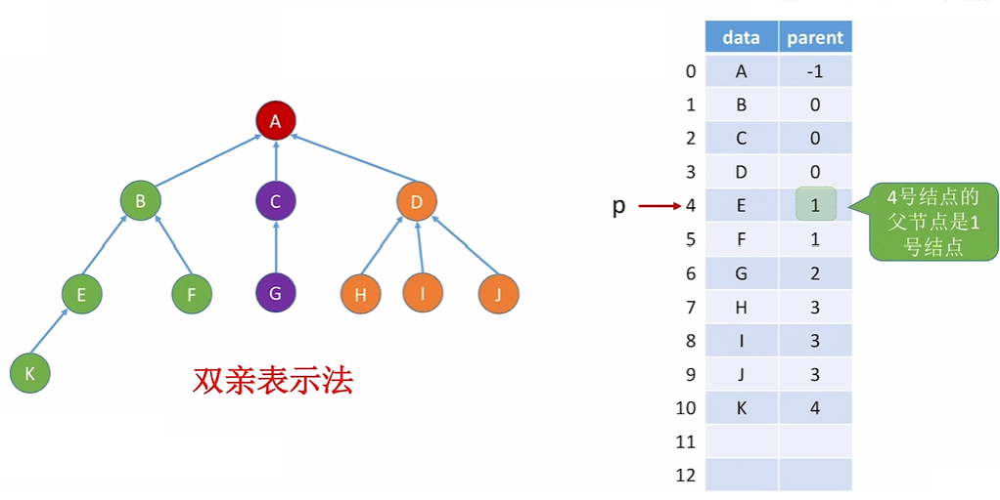
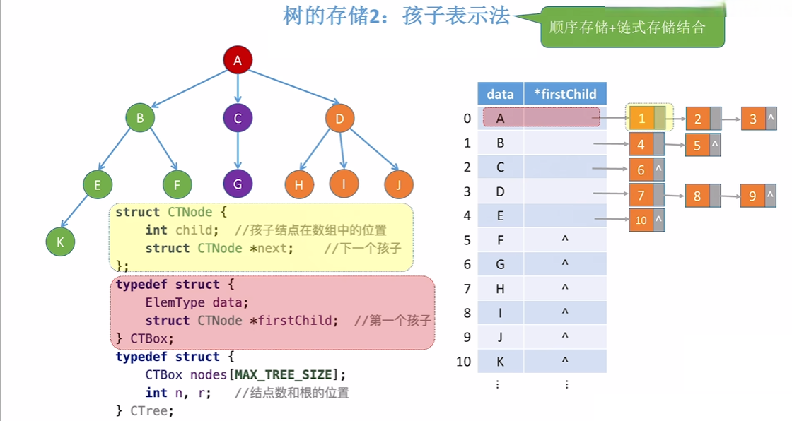
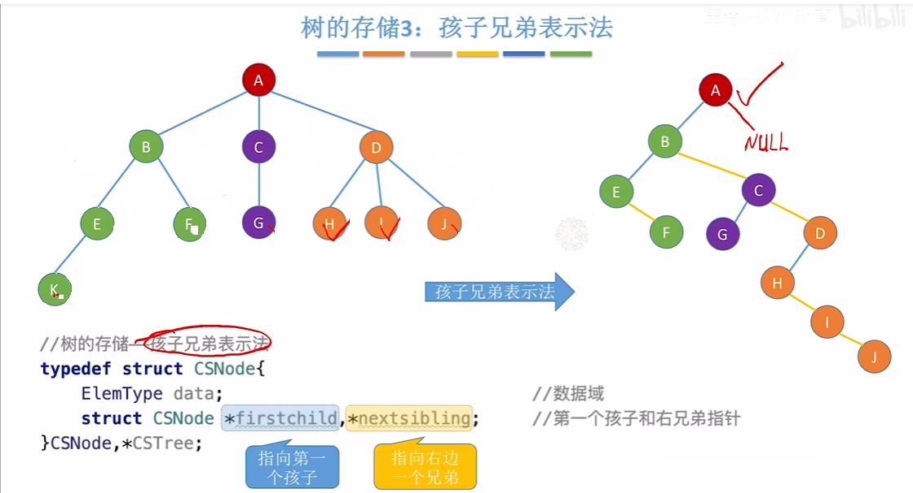
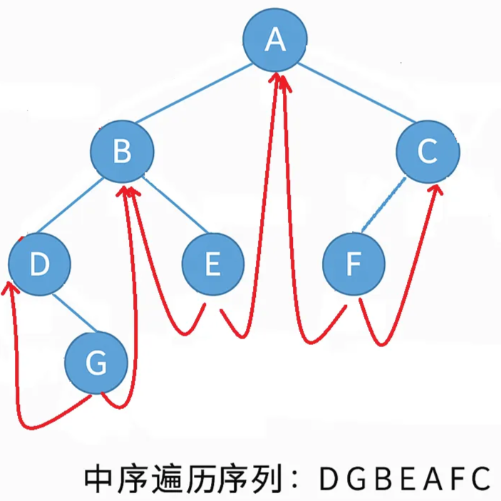
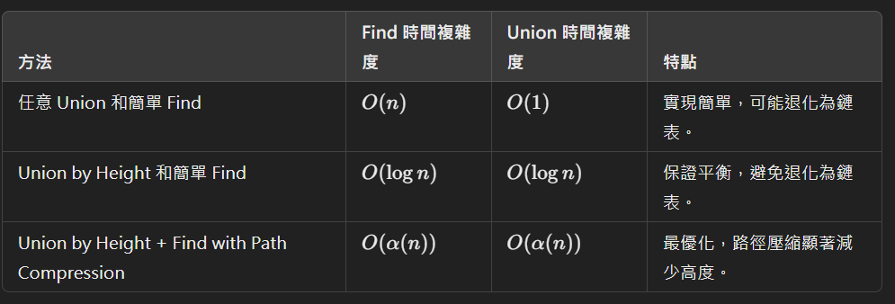

# 樹

上次編輯時間: 2025年10月1日 下午3:03
建立時間: 2025年7月24日 下午4:23

---

# 一、樹

## 樹的基本概念

**樹（Tree）是一種非線性資料結構**，以**節點（Node）組成，具有階層關係（層級關係）**。

### 📌 特性

-   有一個**根節點（Root）**，是整棵樹的起點。
-   每個節點可以有 0 個或多個**子節點（Children）**。
-   沒有循環（不構成回圈）。
-   最底部的節點稱為**葉節點（Leaf）**，沒有子節點。

### 🌿 樹的基本術語

-   **節點（Node）**：資料單位。
-   **邊（Edge）**：節點間的連線。
-   **高度（Height）**：節點到葉節點的最長距離。
-   **深度（Depth）**：節點到根節點的距離。
-   **度（Degree）**：一個節點的子節點數量。
-   **葉節點（Leaf）**：沒有子節點的節點。

---

## 3種存儲結構

**1. 父親表示法: 指向自己的父親**

**找父節點方便，找孩子不方便**


**2. 孩子表示法: 父親存自己的孩子**

**找孩子方便，找父節點不方便**


**3. 孩子兄弟表示法: 指向自己的孩子和兄弟**


---

## 常見的樹種類


| 類型 | 說明 |
| :--- | :--- |
| **普通樹** | 每個節點可有任意數目的子節點。 |
| **二元樹（Binary Tree）** | 每個節點最多有兩個子節點（左子、右子）。 |
| **滿二元樹** | 所有非葉節點都有左右子節點。 |
| **完全二元樹** | 除了最後一層，其餘層皆滿；最後一層節點靠左對齊。 |
| **平衡二元樹（如 AVL）** | 左右子樹高度差最多為1。 |
| **搜尋二元樹（BST）** | 左小右大，利於查找。 |
| [**堆積樹（Heap）**](排序.md) | 最大堆（父節點≥子節點）或最小堆（父節點≤子節點）。 |
| **B樹、B+樹** | 常用於資料庫索引，適合大量資料儲存與查詢。 |

---

# 二、Binary Tree 二元樹


> **定義：每個節點最多只能有兩個子節點，分別稱為左子節點（left child）與右子節點（right child）**。

## 🧩 常見類型的二元樹

| 類型 | 說明 |
| :--- | :--- |
| **滿二元樹 (Full Binary Tree)** | 所有節點不是葉節點就是有兩個子節點。 |
| **完全二元樹 (Complete Binary Tree)** | 除了最後一層之外都填滿，最後一層靠左對齊，最多只有一個度為1的點。 |
| **平衡二元樹 (Balanced Tree)** | 任意節點的左右子樹高度差不超過1。 |
| **二元搜尋樹 (BST)** | 對任一節點，左子樹 < 節點 < 右子樹。 |

---

## 💡 二元樹性質彙整筆記
這是一份將您的 Notion 筆記與考題精華、數學證明合併後的全方位二元樹性質筆記。我為您補充了更嚴謹的公式推導與考試常見的陷阱。

### 性質 1：第 $i$ 層的節點分布
- 最大節點數：第 $i$ 層最多有 $2^{i-1}$ 個節點。
- 形態計數：若一棵高度為 $n$ 的二元樹只有 $n$ 個節點（每層僅 1 個），其不同形態總數為 $2^{n-1}$。

### 性質 2：深度與總節點數的極值
- 最大容量（滿二元樹 Full Binary Tree）：深度為 $h$ 的二元樹最多有 $2^h - 1$ 個節點。
- 最小容量：深度為 $h$ 的二元樹最少有 $h$ 個節點（退化為鏈狀）。
- 等比級數證明：總節點數 $S_h = 2^0 + 2^1 + \dots + 2^{h-1} = \frac{1(1-2^h)}{1-2} = 2^h - 1$。

### 性質 3：節點數與高度的轉換
- 最小高度：對於有 $n$ 個節點的二元樹，其最小高度為 $\lceil \log_2(n+1) \rceil$ 或 $\lfloor \log_2 n \rfloor + 1$。
- 最大高度：最壞情況下高度為 $n$。

### 性質 4：完全二元樹（CBT）的索引規律
當使用**陣列（Array）**存儲，且根節點索引為 $1$ 時：
- 當前節點：索引為 $i$。
- 左子節點：$2i$（若 $2i > n$ 則無左孩子）。
- 右子節點：$2i + 1$（若 $2i+1 > n$ 則無右孩子）。
- 父節點：$\lfloor i/2 \rfloor$。
- 層級判斷：索引為 $p$ 與 $q$ 的節點在同一層的條件是 $\lfloor \log_2 p \rfloor = \lfloor \log_2 q \rfloor$。

### 性質 5：空指標（Null Link）定理
- 二叉鏈表：有 $n$ 個節點的二元樹，必有 $n+1$ 個空指標。
- 證明：總指標域為 $2n$，其中非空指標等於邊數 $n-1$，故空指標 $= 2n - (n-1) = n+1$。
- 三叉鏈表：增加指向雙親的指標後，空指標數變為 $n+2$。

### 性質 6：度數關係與葉節點計算
- 核心守恆公式：$n_0 = n_2 + 1$。
- 通用樹公式：總節點 $N = (\sum i \cdot N_i) + 1$。
- 奇偶性規律：若總節點數 $N$ 為偶數，度為 1 的節點數 $n_1$ 必為奇數。
- 完全二元樹特有：葉節點數 $n_0 = \lceil n/2 \rceil$。

### 💡 補充：多叉樹（$m$-ary Tree）通用計算技巧
如果您在筆記中遇到類似 $n_1 + 2n_2 + 3n_3 + 4n_4 = 122$ 的題目：
- 求總節點數 $N$：直接將「總度數」加 1，即 $122 + 1 = 123$。
- 求葉子節點 $n_0$：利用 $n_0 = N - (n_1 + n_2 + n_3 + n_4)$。
---

## 儲存結構
-   **順序儲存結構(Array-based)**
    由左至右依序存儲，適合**完全二元樹或滿二元樹**

    **完全二元樹**

    ![根節點放在 `a[1]`（或 `a[0]`，視語言而定）(確保index 一樣 )](assets/btsa.png)

    根節點放在 `a[1]`（或 `a[0]`，視語言而定）(確保index 一樣 )

    **非完全二元樹**

    

    若是非完全二元樹，存儲時將空節點設為`Empty` 確保可以保持順序結構。

-   **鏈結儲存結構（Linked Structure）**
    ```c
    typedef struct TreeNode {
        int data;
        struct TreeNode *left;
        struct TreeNode *right;
    } TreeNode
    ```
    ```
    總指標欄位數     -    已用指標數量     =    空指標欄位數
         2n         -        (n - 1)     =         n + 1
    ```
    

---

## 二元樹的遍歷（Traversal）
*目標：**依某種順序拜訪樹中每一個節點一次且僅一次。*
### 📚 一、深度優先遍歷（DFS：Depth-First Search）

**1️⃣ 前序遍歷（Preorder）：根 → 左 → 右**

訪問順序：D → L → R

```c
void preorder(TreeNode* root) {
    if (root == NULL) return;
    visit(root);
    preorder(root->left);
    preorder(root->right);
}
```


**2️⃣ 中序遍歷（Inorder）：左 → 根 → 右**

訪問順序：L → D → R

- 📌 對於 **Binary Search Tree（BST）**，**中序遍歷結果是遞增排序！**
```c
void inorder(TreeNode* root) {
    if (root == NULL) return;
    inorder(root->left);
    visit(root);
    inorder(root->right);
}
```


**3️⃣ 後序遍歷（Postorder）：左 → 右 → 根**

訪問順序：L → R → D

```c
void postorder(TreeNode* root) {
    if (root == NULL) return;
    postorder(root->left);
    postorder(root->right);
    visit(root);
}
```

#### 性質：分析最後被訪問的節點
-   **In-order（LDR，中序）**
    -   **最後節點**＝這棵（子）樹的**最右端結點**。
    -   因此：要不是**根 D**（當根**沒有右子樹**）就是**某個結點的右孩子 R**。
    -   若題目還強調「最後節點是**葉子**」，那它**必是右孩子**（單節點子樹除外）。
-   **Pre-order（DLR，先序）**
    -   **最後節點**一定是**葉子**（因為每個內部結點訪問後，必再訪子樹）。
    -   所以它必是某個父結點的**左孩子 L 或右孩子 R**；只有**單節點樹**時才同時是 **D**。
-   **Post-order（LRD，後序）**
    -   **最後節點**永遠是**根 D**（子樹也是如此）。

| 遍歷 | 第一個 | 最後一個 |
| :--- | :--- | :--- |
| 先序 DLR | 根 D | 右側「最後被走到的」葉（L 或 R；單節點例外為 D） |
| 中序 LDR | 最左端結點 | 最右端結點（根 D 或某個 R） |
| 後序 LRD | 最左端葉 | 根 D |

> 記：**中序(LDR)最後＝最右端節點**（無右子樹則為根，否則為右孩子）；**先序(DLR)最後＝某個葉**（單節點例外為根）；**後序(LRD)最後＝根節點**。

### 📚 二、廣度優先遍歷（BFS：Breadth-First Search）
🔄 **層序遍歷（Level-order）：逐層從左到右**
-   使用Queue實作
-   根節點先入列，每次出列後將其左右子節點加入隊列**(中序的變形)**

```c
void levelOrder(TreeNode* root) {
    if (root == NULL) return;
    Queue q;
    enqueue(&q, root);
    while (!isEmpty(q)) {
        TreeNode* curr = dequeue(&q);
        visit(curr);
        if (curr->left != NULL) enqueue(&q, curr->left);
        if (curr->right != NULL) enqueue(&q, curr->right);
    }
}
```

### 🧩 三、遍歷順序構建二元樹
-   一定需要中序判斷哪個是root
-   在藉由前/後 序判斷順序
**前序 + 中序 → 重建二元樹 :**
```
前序 Preorder：A B D E C F
中序 Inorder：D B E A C F
```
-   前序第一個：**A** → 是根節點
-   A 在中序被切為：
    ```
    D B E | A | C F
    ```
-   前序對應左子樹：`B D E`，右子樹：`C F`
-   重複此邏輯對左右子樹遞迴建
    ```
            A
           / \
          B   C
         / \   \
        D   E   F
    ```

---

## 樹的操作
### 🟦 一、基本統計類
**✅ 1. 節點總數（Count）**
```c
int Count(Node *T){
    if(T == NULL) return 0;
    else {
        int nl = Count(T->Lchild);
        int nr = Count(T->Rchild);
        return nl + nr + 1;  // 加上自己
    }
}
```

**✅ 2. 樹高（Depth / Height）**
```c
int Depth(Node *T){
    if(T == NULL) return 0;
    else {
        int hl = Depth(T->Lchild);
        int hr = Depth(T->Rchild);
        return max(hl, hr) + 1;  // 根節點深度視為1
    }
}
```

**✅ 3. 葉節點數（CountLeaf）**
```c
int CountLeaf(Node *T){
    if (T == NULL) return 0;
    else {
        int nl = CountLeaf(T->Lchild);
        int nr = CountLeaf(T->Rchild);
        if (nl + nr == 0) return 1;  // 自己是葉節點
        else return nl + nr;
    }
}
```

### 🟩 二、結構操作類（複製、比較、交換）
**✅ 4. 複製樹（Copy）**
```c
Node* Copy(Node *orig){
    Node *t = new Node();
    if (orig != NULL){
        t->data = orig->data;
        t->Lchild = Copy(orig->Lchild);
        t->Rchild = Copy(orig->Rchild);
    } else t = NULL;
    return t;
}
```

**✅ 5. 判斷兩棵樹是否相同（Equal）**
```c
bool Equal(Node* s, Node* t){
    if (s == NULL && t == NULL) return true;  // Case 1
    if (s != NULL && t != NULL) {             // Case 2
        if (s->data == t->data)
            return Equal(s->Lchild, t->Lchild) && Equal(s->Rchild, t->Rchild);
        else return false;
    }
    return false; // Case 3: 有一邊是 NULL
}
```

**✅ 6. 左右子樹互換（Swap）**
⬇️ **從下而上（先左右子再換 root）**
```c
void Swap(Node *T){
    if (T != NULL){
        Swap(T->Lchild);
        Swap(T->Rchild);
        Node *tmp = T->Lchild;
        T->Lchild = T->Rchild;
        T->Rchild = tmp;
    }
}
```

⬆️ **從上而下（先交換，再訪問 left, right）**
```c
void Swap(Node *T){
    if (T != NULL){
        Node *tmp = T->Lchild;
        T->Lchild = T->Rchild;
        T->Rchild = tmp;
        Swap(T->Lchild);
        Swap(T->Rchild);
    }
}
```

### 🟨 三、進階應用類（表達式與遞迴計算）

**✅ 7. 表達式樹（Expression Tree）特性**
-   **運算式中序：左→根→右（LDR）**
-   **規則：**
    -   葉節點：為操作數（operand）
    -   非葉節點：為運算子（operator）
    -   運算優先權高者位置靠下
📌 **範例：**
表達式：`((A+(B*C))-(D/E))`
對應二元樹：
```
        -
       /   \
      +     /
     / \   / \
    A   * D   E
       / \
      B   C
```

**✅ 8. 遞迴運算（Expression Tree Evaluate）**
```c
int Eval(Node *T){
    if (T == NULL) return 0;

    Eval(T->Lchild);
    Eval(T->Rchild);

    switch (T->data){
        case '+': T->Result = T->Lchild->Result + T->Rchild->Result; break;
        case '-': T->Result = T->Lchild->Result - T->Rchild->Result; break;
        case '*': T->Result = T->Lchild->Result * T->Rchild->Result; break;
        case '/': T->Result = T->Lchild->Result / T->Rchild->Result; break;
        default:  // 如果是數字節點
            T->Result = T->data;  // 假設 data 是 int 類型
    }
    return T->Result;
}
```

---

## 線索二元樹

👉 **線索二元樹的目標**：
> 把這些本來是 NULL 的指標，改拿來指向中序的前驅/後繼，提升遍歷效率。

### 結構
```c
typedef struct ThreadNode {
    int data;
    struct ThreadNode *lchild, *rchild;
    int ltag, rtag;  // 線索標記
} ThreadNode;
```


### 演算法
```
CreateInThread(T)          // 起點：啟動整體線索化流程
   └── InThread(T)         // 遞迴：中序遍歷 T
         ├── InThread(T->lchild)     // 先處理左子樹
         ├── Visit(T)                // 中序訪問當前節點，建立線索
         └── InThread(T->rchild)     // 再處理右子樹
```
```c
// ====== 中序線索化處理（主函式） ======
void CreateInThread(ThreadTree T) {
    pre = NULL;
    if (T != NULL) {
        InThread(T);
        if (pre != NULL && pre->rchild == NULL) {
            pre->rtag = 1;  // 最後一個節點補右線索
        }
    }
}

// ====== 遞迴線索化子程序 ======
void InThread(ThreadTree T) {
    if (T != NULL) {
        InThread(T->lchild);      // 遍歷左子樹
        Visit(T);                 // 處理當前節點
        InThread(T->rchild);      // 遍歷右子樹
    }
}

// ====== 線索建立函式（核心） ======
void Visit(ThreadTree q) {
    // 左子為空 → 設前驅
    if (q->lchild == NULL) {
        q->ltag = 1;
        q->lchild = pre;
    }

    // 前驅節點右子為空 → 設後繼
    if (pre != NULL && pre->rchild == NULL) {
        pre->rtag = 1;
        pre->rchild = q;
    }

    pre = q; // 更新前驅
}
```


### Morris Traversal

## Morris Traversal 演算法動畫模擬 

```dataviewjs
// 1. 將所有的 HTML/React/Tailwind 代碼封裝在一個字串中
const htmlCode = `
<!DOCTYPE html>
<html>
<head>
    <meta charset="UTF-8">
    <script src="https://unpkg.com/react@18/umd/react.production.min.js"></script>
    <script src="https://unpkg.com/react-dom@18/umd/react-dom.production.min.js"></script>
    <script src="https://unpkg.com/@babel/standalone/babel.min.js"></script>
    <script src="https://cdn.tailwindcss.com"></script>
    <style>
        body { margin: 0; background: transparent; font-family: sans-serif; overflow: hidden; }
        /* Custom Scrollbar for Logs */
        .scrollbar-thin::-webkit-scrollbar { width: 6px; }
        .scrollbar-thin::-webkit-scrollbar-track { background: #171717; }
        .scrollbar-thin::-webkit-scrollbar-thumb { background: #404040; border-radius: 3px; }
    </style>
</head>
<body class="bg-white">
    <div id="root" class="w-full h-full p-2"></div>
    <script type="text/babel">
        const { useState, useEffect, useMemo } = React;

        // Simple Icon Replacements (Lucide icons are not available in standalone babel)
        const Play = ({size}) => <span style={{fontSize: size || 16, display:'inline-block', lineHeight: 1}}>▶</span>;
        const Pause = ({size}) => <span style={{fontSize: size || 16, display:'inline-block', lineHeight: 1}}>⏸</span>;
        const SkipForward = ({size}) => <span style={{fontSize: size || 16, display:'inline-block', lineHeight: 1}}>⏭</span>;
        const RotateCcw = ({size}) => <span style={{fontSize: size || 16, display:'inline-block', lineHeight: 1}}>↺</span>;
        const Info = ({size}) => <span style={{fontSize: size || 16, display:'inline-block', lineHeight: 1, fontWeight:'bold'}}>i</span>;
        const CheckCircle2 = ({size}) => <span style={{fontSize: size || 16, display:'inline-block', lineHeight: 1}}>✓</span>;

        // 定義初始樹結構
        const INITIAL_TREE = {
          id: '1',
          val: 1,
          left: {
            id: '2',
            val: 2,
            left: { id: '4', val: 4, left: null, right: null },
            right: { id: '5', val: 5, left: null, right: null }
          },
          right: {
            id: '3',
            val: 3,
            left: null,
            right: { id: '6', val: 6, left: null, right: null }
          }
        };

        const App = () => {
          const [currentId, setCurrentId] = useState(null);
          const [predecessorId, setPredecessorId] = useState(null);
          const [threads, setThreads] = useState([]);
          const [traversalResult, setTraversalResult] = useState([]);
          const [logs, setLogs] = useState([]);
          const [isPlaying, setIsPlaying] = useState(false);
          const [stepIndex, setStepIndex] = useState(-1);

          // 預先計算演算法的所有步驟快照
          const steps = useMemo(() => {
            const s = [];
            const res = [];
            let curThreads = [];
            
            const findNodeById = (root, id) => {
              if (!root) return null;
              if (root.id === id) return root;
              return findNodeById(root.left, id) || findNodeById(root.right, id);
            };

            const getRight = (node, tList) => {
              const thread = tList.find(t => t.from === node.id);
              if (thread) return findNodeById(INITIAL_TREE, thread.to);
              return node.right;
            };

            let curr = INITIAL_TREE;
            while (curr !== null) {
              s.push({
                type: 'CHECK',
                curr: curr.id,
                pre: null,
                threads: [...curThreads],
                res: [...res],
                msg: \`當前節點是 \${curr.val}。檢查是否有左子樹。\`
              });

              if (curr.left === null) {
                res.push(curr.val);
                s.push({
                  type: 'VISIT',
                  curr: curr.id,
                  pre: null,
                  threads: [...curThreads],
                  res: [...res],
                  msg: \`\${curr.val} 沒有左子樹。訪問該節點，並移至右子樹。\`
                });
                curr = getRight(curr, curThreads);
              } else {
                let pre = curr.left;
                s.push({
                  type: 'FIND_PRE',
                  curr: curr.id,
                  pre: pre.id,
                  threads: [...curThreads],
                  res: [...res],
                  msg: \`尋找 \${curr.val} 的前驅節點（左子樹的最右節點）。\`
                });

                while (getRight(pre, curThreads) !== null && getRight(pre, curThreads).id !== curr.id) {
                  pre = getRight(pre, curThreads);
                }

                if (getRight(pre, curThreads) === null) {
                  curThreads.push({ from: pre.id, to: curr.id });
                  s.push({
                    type: 'ADD_THREAD',
                    curr: curr.id,
                    pre: pre.id,
                    threads: [...curThreads],
                    res: [...res],
                    msg: \`前驅節點 \${pre.val} 的右指針為空。建立線索指向 \${curr.val}，進入左子樹。\`
                  });
                  curr = curr.left;
                } else {
                  curThreads = curThreads.filter(t => !(t.from === pre.id && t.to === curr.id));
                  res.push(curr.val);
                  s.push({
                    type: 'REMOVE_THREAD',
                    curr: curr.id,
                    pre: pre.id,
                    threads: [...curThreads],
                    res: [...res],
                    msg: \`前驅節點 \${pre.val} 已有線索。斷開線索，訪問 \${curr.val}，並移至右子樹。\`
                  });
                  curr = getRight(curr, curThreads);
                }
              }
            }
            s.push({ type: 'DONE', curr: null, pre: null, threads: [], res: [...res], msg: "遍歷完成！" });
            return s;
          }, []);

          useEffect(() => {
            let timer;
            if (isPlaying && stepIndex < steps.length - 1) {
              timer = setTimeout(() => {
                handleNext();
              }, 1000);
            } else {
              setIsPlaying(false);
            }
            return () => clearTimeout(timer);
          }, [isPlaying, stepIndex]);

          const handleNext = () => {
            if (stepIndex < steps.length - 1) {
              const nextIdx = stepIndex + 1;
              const step = steps[nextIdx];
              setStepIndex(nextIdx);
              setCurrentId(step.curr);
              setPredecessorId(step.pre);
              setThreads(step.threads);
              setTraversalResult(step.res);
              setLogs(prev => [step.msg, ...prev].slice(0, 5));
            }
          };

          const handleReset = () => {
            setStepIndex(-1);
            setCurrentId(null);
            setPredecessorId(null);
            setThreads([]);
            setTraversalResult([]);
            setLogs([]);
            setIsPlaying(false);
          };

          const nodePositions = useMemo(() => {
            const pos = {};
            const calculate = (node, x, y, dx) => {
              if (!node) return;
              pos[node.id] = { x, y, val: node.val };
              calculate(node.left, x - dx, y + 60, dx / 1.7);
              calculate(node.right, x + dx, y + 60, dx / 1.7);
            };
            calculate(INITIAL_TREE, 200, 40, 100);
            return pos;
          }, []);

          return (
            <div className="flex flex-col h-full bg-neutral-50 p-6 font-sans text-neutral-800 rounded-xl border border-neutral-200 shadow-sm overflow-auto">
              <div className="flex items-center justify-between mb-6">
                <div>
                  <h1 className="text-xl font-bold text-neutral-900">Morris Traversal 視覺化</h1>
                  <p className="text-neutral-500 text-sm">空間複雜度 O(1) 的中序遍歷模擬</p>
                </div>
                <div className="flex space-x-2">
                  <button
                    onClick={() => setIsPlaying(!isPlaying)}
                    className={'flex items-center space-x-2 px-4 py-2 rounded-lg transition ' + (isPlaying ? 'bg-amber-500 text-white' : 'bg-blue-600 text-white hover:bg-blue-700')}
                  >
                    {isPlaying ? <Pause size={18} /> : <Play size={18} />}
                    <span>{isPlaying ? '暫停' : '自動播放'}</span>
                  </button>
                  <button
                    onClick={handleNext}
                    disabled={isPlaying || stepIndex >= steps.length - 1}
                    className="flex items-center space-x-2 px-4 py-2 bg-neutral-200 text-neutral-700 rounded-lg hover:bg-neutral-300 disabled:opacity-50"
                  >
                    <SkipForward size={18} />
                    <span>下一步</span>
                  </button>
                  <button
                    onClick={handleReset}
                    className="flex items-center space-x-2 px-4 py-2 border border-neutral-300 rounded-lg hover:bg-white transition"
                  >
                    <RotateCcw size={18} />
                  </button>
                </div>
              </div>

              <div className="grid grid-cols-1 lg:grid-cols-3 gap-6 flex-1">
                <div className="lg:col-span-2 bg-white rounded-xl border border-neutral-200 p-4 flex flex-col items-center justify-center relative overflow-hidden h-[300px]">
                  <svg width="400" height="300" viewBox="0 0 400 300" className="drop-shadow-sm">
                    {Object.entries(INITIAL_TREE).map(() => {
                      const drawLines = (node) => {
                        if (!node) return null;
                        const lines = [];
                        if (node.left) {
                          const p1 = nodePositions[node.id];
                          const p2 = nodePositions[node.left.id];
                          lines.push(<line key={'l-' + node.id} x1={p1.x} y1={p1.y} x2={p2.x} y2={p2.y} stroke="#e5e5e5" strokeWidth="2" />);
                        }
                        if (node.right) {
                          const p1 = nodePositions[node.id];
                          const p2 = nodePositions[node.right.id];
                          lines.push(<line key={'r-' + node.id} x1={p1.x} y1={p1.y} x2={p2.x} y2={p2.y} stroke="#e5e5e5" strokeWidth="2" />);
                        }
                        return [...lines, drawLines(node.left), drawLines(node.right)];
                      };
                      return drawLines(INITIAL_TREE);
                    })}

                    {threads.map((t, i) => {
                      const start = nodePositions[t.from];
                      const end = nodePositions[t.to];
                      const cx = Math.max(start.x, end.x) + 40;
                      const cy = (start.y + end.y) / 2;
                      return (
                        <path
                          key={'thread-' + i}
                          d={'M ' + start.x + ' ' + start.y + ' Q ' + cx + ' ' + cy + ' ' + end.x + ' ' + end.y}
                          fill="none"
                          stroke="#10b981"
                          strokeWidth="2"
                          strokeDasharray="4"
                          className="animate-pulse"
                        />
                      );
                    })}

                    {Object.values(nodePositions).map((pos) => {
                      const isCurr = currentId === Object.keys(nodePositions).find(key => nodePositions[key] === pos);
                      const isPre = predecessorId === Object.keys(nodePositions).find(key => nodePositions[key] === pos);
                      return (
                        <g key={pos.val}>
                          <circle
                            cx={pos.x}
                            cy={pos.y}
                            r="18"
                            className="transition-all duration-500"
                            fill={isCurr ? '#3b82f6' : isPre ? '#f59e0b' : '#fff'}
                            stroke={isCurr ? '#2563eb' : isPre ? '#d97706' : '#d4d4d4'}
                            strokeWidth="2"
                          />
                          <text
                            x={pos.x}
                            y={pos.y}
                            dy="5"
                            textAnchor="middle"
                            className={'text-xs font-bold transition-colors ' + (isCurr || isPre ? 'fill-white' : 'fill-neutral-600')}
                          >
                            {pos.val}
                          </text>
                        </g>
                      );
                    })}
                  </svg>
                  
                  <div className="absolute bottom-4 left-4 flex flex-col space-y-1">
                    <div className="flex items-center space-x-2 text-[10px] text-neutral-500">
                      <div className="w-3 h-3 bg-blue-500 rounded-full" /> <span>當前節點 (Current)</span>
                    </div>
                    <div className="flex items-center space-x-2 text-[10px] text-neutral-500">
                      <div className="w-3 h-3 bg-amber-500 rounded-full" /> <span>前驅節點 (Predecessor)</span>
                    </div>
                    <div className="flex items-center space-x-2 text-[10px] text-neutral-500">
                      <div className="w-3 h-1 bg-green-500 border-t border-dashed" /> <span>臨時線索 (Thread)</span>
                    </div>
                  </div>
                </div>

                <div className="flex flex-col space-y-4">
                  <div className="bg-neutral-900 rounded-xl p-4 shadow-lg min-h-[160px] max-h-[160px] overflow-y-auto scrollbar-thin">
                    <h3 className="text-neutral-400 text-xs font-mono mb-2 uppercase tracking-wider">執行日誌 (Logs)</h3>
                    <div className="space-y-2">
                      {logs.length > 0 ? (
                        logs.map((log, i) => (
                          <div key={i} className={'text-sm font-mono leading-tight ' + (i === 0 ? 'text-green-400' : 'text-neutral-500')}>
                            {i === 0 ? '> ' : '  '}{log}
                          </div>
                        ))
                      ) : (
                        <div className="text-neutral-600 italic text-sm font-mono">等待開始...</div>
                      )}
                    </div>
                  </div>

                  <div className="bg-white rounded-xl border border-neutral-200 p-4 flex-1">
                    <h3 className="flex items-center space-x-2 text-sm font-bold mb-4">
                      <CheckCircle2 size={16} />
                      <span>中序遍歷結果 (Result)</span>
                    </h3>
                    <div className="flex flex-wrap gap-2">
                      {traversalResult.length > 0 ? (
                        traversalResult.map((v, i) => (
                          <span key={i} className="px-3 py-1 bg-green-50 text-green-700 rounded-md font-mono font-bold">
                            {v}
                          </span>
                        ))
                      ) : (
                        <span className="text-neutral-300 italic text-xs">暫無輸出</span>
                      )}
                    </div>
                  </div>
                </div>
              </div>
              
              <div className="mt-6 flex items-start space-x-3 p-4 bg-blue-50 border border-blue-100 rounded-lg">
                <Info size={20} />
                <div className="text-xs text-blue-800 leading-relaxed">
                  <p className="font-bold mb-1">Morris Traversal 核心原理：</p>
                  當我們遍歷到左子樹的最右節點時，發現它的右指針為空。這就是「浪費」的空間。我們將它暫時指向當前節點，這樣遍歷完左子樹後，我們就能順著這個「線索」回到父節點，而不需要使用棧。
                </div>
              </div>
            </div>
          );

        };

        const root = ReactDOM.createRoot(document.getElementById('root'));
        root.render(<App />);
    </script>
</body>
</html>
`;

// Render using iframe directly in DataviewJS
dv.el("iframe", "", {
    attr: {
        srcdoc: htmlCode,
        style: "width: 100%; height: 600px; border: none; border-radius: 12px; background: white;"
    }
});
```


# 三、霍夫曼樹（Huffman Tree）— 最優二叉樹
## 一、定義
**霍夫曼樹**是帶**權重的最優二元樹**，又稱**最優二叉樹（Optimal Binary Tree）**。
> 它可以讓帶權路徑長度（WPL）最小，是一種常見於**資料壓縮（如字元編碼）**的結構。

## 二、基本概念
-   **節點的權重**：通常表示字元出現的頻率。
-   **WPL（加權路徑長度）**：
    $\text{WPL} = \sum_{i=1}^{n}（\text{葉節點權重} × \text{路徑長度}）$
-   **最小 WPL** ⇒ 最省空間的編碼樹！
## 三、構造步驟（霍夫曼演算法）
1.  將所有字元（節點）依**頻率（權重）**建立成一個森林（多棵單節點樹）
2.  從森林中選出**兩棵最小權重樹**
3.  合併成一棵新樹，其根節點權重為兩棵子樹權重之和
4.  重複步驟 2~3，直到只剩一棵樹（合併n-1次）
## 四、霍夫曼編碼特性
-   **前綴編碼**：無任一編碼是其他編碼的前綴，避免解碼歧義。
-   **路徑左邊編 0，右邊編 1**（或反之）
-   出現次數越高 → 編碼越短（節省空間）
## 五、舉例


---

# 四、並查集（Union-Find Set）介紹
## 一、用途與概念
> 並查集是一種用來處理集合合併與查詢的資料結構，特別適合解決：
> -   判斷元素是否在同一集合
> -   動態合併兩集合
📌 **常見應用**：
| 問題類型 | 應用說明 |
| :--- | :--- |
| 網路連通性 | 判斷兩點是否已連通 |
| 圖的環判定 | Kruskal 最小生成樹 |
| 群體劃分 | 判斷某些人是否屬於同一群 |
| 等價類問題 | 同一集合代表同一類別 |

## 🧩 二、三大基本操作
1️⃣ **`MakeSet(x)`**
為元素 `x` 建立一個新集合，初始時每個元素都是自己的代表（parent）。
2️⃣ **`Find(x)`**
查詢 `x` 所屬集合的代表元素（又稱為「根」），回傳節點下標。支援 **路徑壓縮（Path Compression）** 加速未來查詢。
3️⃣ **`Union(x, y)`**
合併 `x` 和 `y` 所屬集合。可使用 **按秩合併（Union by Rank / Size）** 減少樹高。

## 🧱 三、資料結構設計
```c
int parent[N];  // parent[i]：節點 i 的父節點
int rank[N];    // rank[i]：節點 i 所在集合的高度（或節點數）
```

## ✏️ 四、C語言簡易實作範例
```c
// 初始化 n 個集合
void MakeSet(int n) {
    for (int i = 0; i < n; i++) {
        parent[i] = i;
        rank[i] = 0;
    }
}

// 查詢代表元素（帶路徑壓縮）
int Find(int x) {
    if (parent[x] != x)
        parent[x] = Find(parent[x]);  // 壓縮路徑
    return parent[x];
}

// 合併兩集合（按秩合併）
void Union(int x, int y) {
    int fx = Find(x);
    int fy = Find(y);
    if (fx == fy) return;

    if (rank[fx] < rank[fy]) {
        parent[fx] = fy;
    } else {
        parent[fy] = fx;
        if (rank[fx] == rank[fy])
            rank[fx]++;
    }
}
```


## ⚡ 五、時間複雜度分析

-   優化後每次操作幾乎是**常數時間 O(α(n))**（α 為阿克曼函數的反函數，實際上非常小）。

## 📝 小結
| 操作 | 功能 | 加速技術 |
| :--- | :--- | :--- |
| MakeSet | 初始化集合 | - |
| Find | 查代表元素 | 路徑壓縮 |
| Union | 合併兩集合 | 按秩合併 |

---

# 觀念總結 &錯誤題回顧

1.  **樹的節點關係**
    -   有根樹：邊數 (E=N-1)，因此(節點總數=總度數+1) $(\sum \text{outdeg}(v)=N-1)$ 。
    -   $n_0=n_2+1（葉子=度為 2 的結點數+1）$。
2.  **完全二叉樹 quick facts（高度 (h)=層數）**
    -   所有葉結點只可能落在 **第 (h-1)** 或 **第 (h)** 層。
    -   前 (h-1) 層必為**滿二叉樹**。
3.  **善用索引（父子關係）**
    -   M叉樹中 Parent = ⌈index / M=⌉
4.  **m 叉鏈的空指標要會推導**
    以二叉為例:總共有2n個指標，[又每個節點都是由一條邊所連線(除了ROOT)](樹.md) →2n-(n-1)=n+1 個 空指標
5.  **順序存儲要會畫**
    ```
    idx|0|1|2|3|4|5|6|7|8|9|10|11|12
    val|a|b|C| |d|e|f| | |g|  |  | h

    						a
    					/   \
    				   b	 c
    			      / \   / \
    		         d   e f
                    / \ / \ / \
                       g       h
    ```
6.  **中序排列的順序 Swap(Lchlid,Rchlid) 後會得到反序**
    ```
          2                     2
         / \                   / \
        1   3      swap(1,3) 3    1
     			   \              /
    			    4            4
    inorder:1234   			   inorder:4321
    ```
7.  **森林的後根遍歷=中序遍歷**
8.  **孩子兄弟表示法中 **空右指標數**=m（非葉節點組+1）**
    - n 個非葉會有 n “組” 孩子 — n組孩子的最後一個(最右)結點 都有**空右**
    - 又 最後一個根結點 也有一個**右空**
    - **→** n+1


---

## 🌲 樹的數學性質：節點與度數關係
🏷️ 標籤: #數據結構 #樹 #考研筆記 #算法

📝 **核心定理：$m$ 叉樹的節點平衡**
在任意一棵度為 $m$ 的樹中，葉子節點數 $n_0$ 與其他度數節點的關係遵循以下推導。

**1. 基礎公式**
根據定義與幾何結構，我們可以列出兩個等式：
-   **等式 A（節點組成）**: 總節點數 $N$ 是所有不同度數節點的總和。
    $$N = n_0 + n_1 + n_2 + n_3 + \dots + n_m$$
-   **等式 B（邊的計數）**: 總節點數 $N$ 等於總邊數加 $1$（因為根節點上方沒有邊）。
    $$N = (\text{總度數}) + 1 = (1 \cdot n_1 + 2 \cdot n_2 + 3 \cdot n_3 + \dots + m \cdot n_m) + 1$$

**2. 通用公式推導**
將上述兩個等式聯立：
$$n_0 + n_1 + n_2 + \dots + n_m = (n_1 + 2n_2 + 3n_3 + \dots + m n_m) + 1$$
消去兩邊重複的 $n_1$ 並移項，得到 葉子節點 $n_0$ 的通用求法：

[!IMPORTANT] 通用結論
$$n_0 = 1 + n_2 + 2n_3 + 3n_4 + \dots + (m-1)n_m$$

🔍 **實例解析：你的筆記內容**
根據你的筆記截圖 `1000002223.jpg`，給出了一個具體等式：
-   **已知條件**： $n_1 + 2n_2 + 3n_3 + 4n_4 = 122$
-   **步驟 1：求總節點數 $N$**
    根據 等式 B，$N = (\text{總度數}) + 1$。
    代入數據：$N = 122 + 1 = 123$。
-   **步驟 2：求葉子節點 $n_0$**
    根據 等式 A：$N = n_0 + n_1 + n_2 + n_3 + n_4$。
    若題目給出了 $n_1, n_2, n_3, n_4$ 的具體值，即可求出 $n_0$。
    或者利用推導公式：$n_0 = 1 + n_2 + 2n_3 + 3n_4$。

💡 **快速對比表**
| 樹類型 | 核心關係式 | 備註 |
| :--- | :--- | :--- |
| **二叉樹** | $n_0 = n_2 + 1$ | 考頻最高 |
| **三叉樹** | $n_0 = 1 + n_2 + 2n_3$ | $n_1$ 永遠會被消掉 |
| **$m$ 叉樹** | $n_0 = 1 + \sum_{i=2}^{m} (i-1)n_i$ | 萬能公式 |

🚩 **易錯點提醒**
-   **$n_1$ 的陷阱**：在推導 $n_0$ 與其他度數關係時，$n_1$（度為 1 的節點）總是被消去的，它不影響葉子節點的數量，但會影響總節點數 $N$。
-   **完全二叉樹**：在完全二叉樹中，$n_1$ 只能是 $0$ 或 $1$，這常用於求節點數的最值問題（如第 16 題）。

**相關題目推薦：**
-   [[2024統考真題-16]]：考察完全二叉樹最大節點數計算。