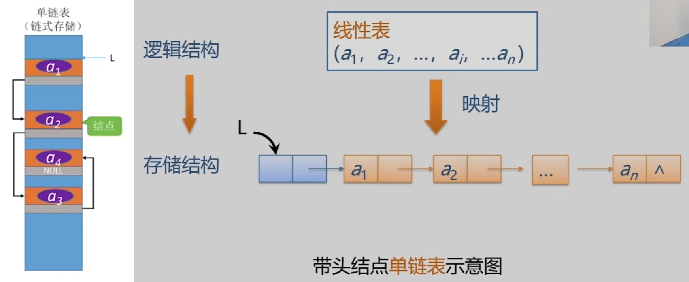
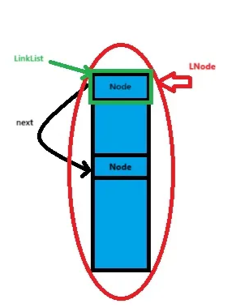
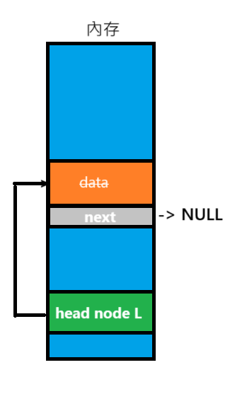
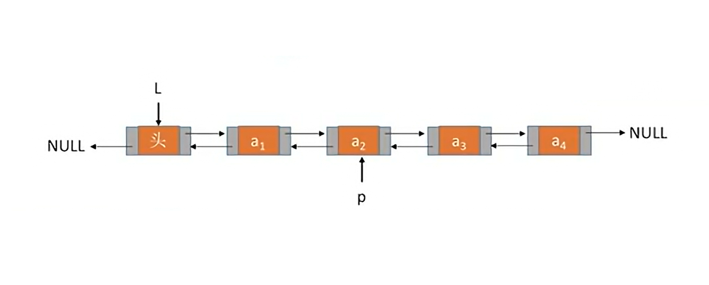
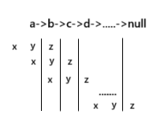

# 鏈式存儲

上次編輯時間: 2025年9月24日 下午11:26
建立時間: 2025年6月25日 下午5:10

# 一、 單鏈表

由一組任意的的存儲單元來存儲數據，且建立元素間的線性關聯



- **優點**:動態記憶體使用（無需預先知道大小）
- **缺點**:不可隨機存取

## 實作(**Implementation**)

**結構定義**

```csharp
typedef struct Node {
    int data;
    struct Node* next;
} Node,*LinkList;

```



<aside>
💡

**📚 延伸知識**

**數據類型的重命名**  

 **typedef<數據類型><別名>**

```csharp
struct LNode{
		ElemType data;
		struct LNode *next;
};
//struct LNode 結構取一個簡單別名叫 LNode
typedef struct LNode Node;
//「指向 Node 的指標」取名叫 LinkList，表示整條單鍊表的開頭（頭指標）
typedef struct LNode *LinkList; 
```

**等價**

```csharp
typedef struct Node {
    int data;
    struct Node *next;
} Node,*LinkList;
```


</aside>

---

### **一、初始化**

**不帶頭節點**

```csharp
bool InitList(LinkList &L){  //&引用可直接修改數據
		L=NULL;                  //空表，防止贓數據
		return true;
}
```

**帶頭節點**

```csharp
bool InitList(LinkList &L){  //&引用可直接修改數據
//「從記憶體中申請一塊空間給一個 LNode 結構用，並把回傳的位址轉成 LNode* 型別。」
		L=(LNode*)malloc(sizeof(LNode));
}
```



---

### **二、插入**

**後插操作**

`InsertNextNode(LNode *p ,ElemType e)`:在 p 節點後 插入e

```csharp
bool InsertNextNode(LNode *p ,ElemType e){
	if(p==null)
			return false;
	LNode *s=(LNode*)malloc(sizeof(LNode));
	//內存分配失敗
	if(s==null)
			return false;
	s->data=e;
	s->next=p->next;
	p->next=s;
	return true;
}
```

**按位置插入**

`ListInsert(&L,i,e)`:在L中第 i 位置插入e

**。步驟：** 

> 不帶頭節點若插入到首項需要額外寫一個邏輯
> 
1. **判斷插入位置是否合法**
2. **遍歷到目標位置**
3. **執行插入操作**

```csharp
bool ListInsert(LinkList &L, int i, ElemType e) {

    // 1.檢查位置是否合法
    if(i < 1)
        return false;
    //不帶頭節點的表頭插入    
	  if(i==1){
			  LNode *s=(LNode*)malloc(sizeof(LNode));
			  s->data=e;
			  s->next=L;
			  L=s;
			  return true;
	  }   
    // 2.宣告一個指標 p，用來遍歷鏈表
    LNode *p;
    int j = 0; // 不帶頭節點需要讓 j=1
    p = L;

    // 往後移動，尋找第 i-1 個節點（插入位置的前一個節點）
    while(p != NULL && j < i - 1){
        p = p->next;
        j++;	
    }

    // 如果 p 為 NULL，表示位置不合法（鏈表長度不足）
    if(p == NULL)
        return false;
   
    LNode *s = (LNode*)malloc(sizeof(LNode));
    s->data = e;
    s->next = p->next;
    p->next = s;
    return true;
}
```

**前插操作**

`InsertPriorNode(LNode *p ,ElemType e)`:在 p 節點前 插入e

> **p 前面未知 ，**透過「資料交換」的方式，實現 p 前插入的效果
> 
> 
> 
> 

```csharp
bool InsertPriorNode(LNode *p , ElemType e) {
    if(p == NULL)
        return false; 
    LNode *s = (LNode*)malloc(sizeof(LNode));
		// 若配置失敗，回傳 false
    if(s == NULL)
        return false; 

    s->data = p->data;
    p->data = e;
    s->next = p->next;
    p->next = s;
    return true;
}

```

---

### **三、刪除操作**

**後刪操作**

`DeleteNextNode(LNode *p, ElemType &e)`:刪除 *p* 節點 後 的節點

```c
c
複製編輯
bool DeleteNextNode(LNode *p, ElemType &e) {
    if (p == NULL || p->next == NULL)      // 無後繼
        return false;

    LNode *q = p->next;                    // q 為待刪節點
    e = q->data;                   // 回傳資料（選擇性）
    p->next = q->next;                     // 跨過 q
    free(q);                               // 釋放記憶體
    return true;
}

```

**按位置刪除**

```c
bool ListDelete(LinkList &L, int i, ElemType &e) {
    if (i < 1 || L == NULL)                // 位置非法或空表
        return false;

    // 刪除首節點
    if (i == 1) {
        LNode *q = L;
        if (e) *e = q->data;
        L = L->next;                       // 頭指向下一個
        free(q);
        return true;
    }

    // 走到第 i-1 個節點
    LNode *p = L;
    int j = 1;
    while (p != NULL && j < i - 1) {
        p = p->next;
        j++;
    }
    if (p == NULL || p->next == NULL)      // 超界
        return false;

    LNode *q = p->next;                    // 待刪節點
    e = q->data;
    p->next = q->next;
    free(q);
    return true;
}

```

**刪除本身**

> 思路與「前插」相反：**把後繼資料搬進 *p*，再刪掉後繼**。但需保證 *p* **不是尾節點**。
> 

```c
bool DeleteNode(LNode *p) {
    if (p == NULL || p->next == NULL)      // 空指標或尾節點無法刪
        return false;

    LNode *q = p->next;                    // 後繼
    p->data = q->data;                     // 複製資料到 p
    p->next = q->next;                     // 略過 q
    free(q);
    return true;
}

```

---

### **四、查找操作**

**按位查找**

`GetElem(LinkList L ,int i)`:返回第 i 個元素

```c
LNode *GetElem(LinkList L,int i ){
		if(i<0)
				return NULL;
		// 臨時指標用來操作用		
		LNode *p;
		int j=0;
		p=L;
		
		while(i<j && p!=NULL ){
				p=p.next;
				j++;
		}
		return p;

}
```

---

**按值查找**

`LocateElem(LinkList L, ElemType e)`:返回第一個出現值==e的節點

```c
LNode *LocateElem(LinkList L,ElemType e){
			//headNode 不存數據
			LNode *p=L->next;
			while(p!= NULL && p->data!=e){
						p=p.next;
			}
			return p;
}
```

---

# 二、 循環鏈表

## 循環單鏈表

**結構同單鏈表 尾節點的 `next` 指向頭節點（而不是 NULL），所以從任何節點出發，都可以一直 `next` 下去回到自己**

## 實作(**Implementation**)

**結構定義**

> 使用指針指向尾端(**tail**)，讓取出head 和tail 時為`O(1)`
> 

```c
typedef struct Node {
    ElemType data;
    struct Node *next;
} Node, *CLinkList;

typedef struct {
    CLinkList head;  // 指向頭節點（dummy head）
    CLinkList tail;  // 指向尾節點
} CList;

```


### **一、初始化**

```c
bool InitCList(CList *L) {
    L->head = (Node*)malloc(sizeof(Node));
    if (L->head == NULL) return false;

    L->head->next = L->head;  // 指向自己，形成循環
    L->tail = L->head;        // 初始時 tail = head
    return true;
}

```

### **二、插入**

**尾插法**

`InsertTail(ListWithTail *L, ElemType e)`:插入 e 在尾端

```c
bool InsertTail(CList *L, ElemType e) {
    Node *s = (Node*)malloc(sizeof(Node));
    if (s == NULL) return false;

    s->data = e;
    s->next = L->head;        // 新節點指向 head，保持循環
    L->tail->next = s;        // 原尾節點接上新節點
    L->tail = s;              // 更新尾指標
    return true;
}
```

### **三、刪除**

`DeleteTail(CLinkList &L)` :刪除尾端Node 

**💡思考**

1. **考慮空表和只有一項**
2. **只使用(tail) ptr**

```c
//current 為head_node  
bool DeleteTail(CList *L) {
    // 1. 處理 NULL 的串列指標或空串列
    if (L == NULL || L->tail == NULL) 
        return false; 
    Node *old_tail = L->tail; // 儲存目前的尾部節點，稍後釋放

    // 2. 處理串列中只有一個節點的情況
    if (old_tail->next == old_tail) { 
        L->tail = NULL; // 串列變為空
    } 
    else {
     
        Node *current = old_tail->next; 
		// 3. 找到新的尾部 (在 old_tail 之前的節點)
        while (current->next != old_tail) {
            current = current->next;
        }
        
        current->next = old_tail->next; 
        L->tail = current; 
    }

    // 4. 釋放原始尾部節點的記憶體
    free(old_tail);
    old_tail = NULL; // 防止日後髒數據

    return true;
}
```

# 三、雙鏈表



## 實作(**Implementation**)

**結構定義**

```csharp
typedef struct DNode{
		ElemType data;
		// 前驅後驅指標
		struct DNode *prior,*next;
}DNode,*DLinkList;

```

### **一、初始化**

```c
bool InitDLinkList(DLinkList &L){
		L=(DNode*)malloc(sizeof(DNode));
		//check malloc is work!
		if(L==NULL)
			return false;
		L->next=NULL;
		L->prior=NULL;
		return true;
}
```

---

### **二、插入操作**

 **前插操作**

`InsertPriorNode(DNode *p,DNode e)` :在node p 前插入 node e 

```c
bool InsertPriorNode(DNode *p, DNode *e) {
    if (p == NULL || e == NULL)
        return false;

    e->next = p;
    e->prior = p->prior;
		
    if (p->prior != NULL)
        p->prior->next = e;

    p->prior = e;
    return true;
}

```

 **後插操作**

`InsertNextNode(DNode *p,DNode e)`: 在node p 後插入 node e 

```c
bool InsertNextNode(DNode *p, DNode *e) {
    if (p == NULL || e == NULL)
        return false;

    e->next = p->next;
    e->prior = p;
		// If p has a next node, update that node's prior pointer to point to e
    if (p->next != NULL)
        p->next->prior = e;

    p->next = e;
    return true;
}

```

---

### **三、刪除操作**

**後刪操作**

`DeleteNextNode(DNode *p)` :刪除Node p 的後繼Node

錯誤代碼

```c
bool DeleteNextNode(DNode *p){
		if(p->next==NULL)
			return false;
		p->next->next->prior=p;
		p->next=p->next->next;
		free(p->next);

}
```

**✅正確**

```c
bool DeleteNextNode(DNode *p){
		if(p==NULL || p->next==NULL)
				return false ;
		DNode *q=p->next;
		//處理NULL形況
		if(q->next!=NULL)
				q->next->prior=p;
		p->next=q->next;
		free(q);
		return true ;
}
```

---

# 四、LinkedList應用

## 模擬 Stack（堆疊）

---

 **分析:**

- **Stack 有後進先出（LIFO）的特性**
- **Singly Linked List（單向鏈表）只能取出後繼節點**

---

**解決方案:**

- 使用**前插法（頭插法）**：讓新節點永遠插在最前面
- 使用 `top` 指標維持指向堆疊頂端節點

```c
typedef struct LNode {
    ElemType data;
    struct LNode *next;
} LNode;

typedef struct {
    LNode *top;  // 指向堆疊頂端
} Stack;

void InitStack(Stack *S) {
    S->top = NULL;
}

bool push(Stack *S, ElemType e) {
    LNode *s = (LNode*)malloc(sizeof(LNode));
    if (s == NULL) return false;
    s->data = e;
    s->next = S->top;
    S->top = s;
    return true;
}

bool pop(Stack *S, ElemType &e) {
    if (S->top == NULL) return false;
    LNode *p = S->top;
    e = p->data;          // 傳出值
    S->top = p->next;
    free(p);               // 釋放記憶體
    return true;
}

```

---

## 模擬 Queue（佇列）

---

**分析:**

- **Queue 有先進先出（FIFO, First-In First-Out）的特性**
- **Singly Linked List（單向鏈表）只能從前面移除、從尾部加入**

---

**解決方案:**

- 使用 **尾插法**：讓新節點永遠插在最後面（enqueue）
- 使用 **頭刪法**：從前端移除節點（dequeue）
- 使用 `front` 指向佇列前端節點，`rear` 指向尾端節點

---

```c
typedef int ElemType;
typedef struct QNode {
    ElemType data;
    struct QNode *next;
} QNode;

typedef struct {
    QNode *front;  // 指向第一個節點
    QNode *rear;   // 指向最後一個節點
} Queue;

void InitQueue(Queue *Q) {
    Q->front = Q->rear = NULL;
}

```

---

---

**➕ Enqueue（入隊）**

```c
bool Enqueue(Queue *Q, ElemType e) {
    QNode *s = (QNode*)malloc(sizeof(QNode));
    if (s == NULL) return false;

    s->data = e;
    s->next = NULL;
    if (Q->rear == NULL) {
        // 空佇列
        Q->front = Q->rear = s;
    } else {
        Q->rear->next = s;
        Q->rear = s;
    }
    return true;
}
```

---

**➖ Dequeue（出隊）**

```c
bool Dequeue(Queue *Q, ElemType *e) {
    if (Q->front == NULL) return false; // 空佇列

    QNode *p = Q->front;
    *e = p->data;

    Q->front = p->next;

    if (Q->front == NULL)
        Q->rear = NULL; // 若佇列已空，rear 也要清空

    free(p);
    return true;
}

```

---

### **Single 用XOR模擬Double**

---

**🧠 原理:**

雙向鏈結串列中，每個節點會儲存兩個指標：

- `prev`：指向前一個節點
- `next`：指向下一個節點

但在 XOR Linked List 中：

- 只保留一個指標欄位 `npx`，它儲存的是：
    
    ```c
    npx = prev XOR next
    ```
    

由於 XOR 的特性：

- `A XOR B XOR A = B`
- 因此可以在已知 `prev` 或 `next` 的情況下，還原另一個節點。

---

### 反向字串(翻轉鏈表)

---

**🧠 原理:**

使用三個指標：

- `x`：指向當前節點的「前一個」節點（初始為 `NULL`）
- `y`：指向當前節點（初始為 `head`）
- `z`：指向 `y` 的下一個節點，用來保留鏈結，避免斷鏈



```c
typedef struct Node {
    int data;
    struct Node* next;
} Node;

Node* reverseList(Node* head) {
    Node* x = NULL;     // 前一個節點
    Node* y = head;     // 當前節點
    Node* z = NULL;     // 下一個節點

    while (y != NULL) {
        z = y->next;    // 儲存下一個
        y->next = x;    // 翻轉指向
        x = y;          // x 往前移
        y = z;          // y 往前移
    }
    return x;  // 新的頭節點
}
```

# 五、錯誤題回顧

1. **常拿「順序表」比較時要記得**
    - **存儲方式**：順序表＝**連續記憶體**（array / 動態陣列），**不含指標欄位**。
    - **刪除/插入成本**：單鏈表和稅序表雖然都是 O(n)單順序表需考慮
        - 插入/刪除第 *i* 位 → 需整段搬移元素，最壞/平均 **O(n)**。
    - **查找**：按下標存取 **O(1)**（真·隨機存取）；搜尋特定值仍是 **O(n)**。
    - **快取友善**：連續區塊命中率高，順序走訪很快（考點：**局部性**）。
2. **隨機存取 vs. 順序存取（觀念題）**
    - **隨機存取（Random Access）**：可直接跳到第 *i* 個位置（如 array 下標），時間 **O(1)**。
    - **順序存取（Sequential Access）**：必須從當前位置一路走到目標（如單鏈表），時間 **O(n)**。
    - 補：array 既能隨機存取，也**適合順序走訪**（快取好）；鏈表只有順序走訪，且指標追逐（pointer chasing）**快取較差**。
3. **「順序存取包含 link 結構」**
4. **循環鏈表刪除尾節點（帶尾指標 tail）**
    - **單向循環鏈表（singly circular）**：`tail` 指向尾；`head = tail->next`。
        - 刪尾需要**找到尾的前驅**，只能從 `head` 起走一圈 → **O(n)**。
        - 別直接 `free(tail)` 就收工；要先**保住 head**，找到 **pred**，再改指標、最後釋放。
        - **邊界**：只有一個節點時（`tail->next == tail`），刪除後 `tail = NULL`。
    - **雙向循環鏈表（doubly circular）**：可用 `tail->prev` 直接得前驅，刪尾可 **O(1)**（別忘了雙向指標調整）。